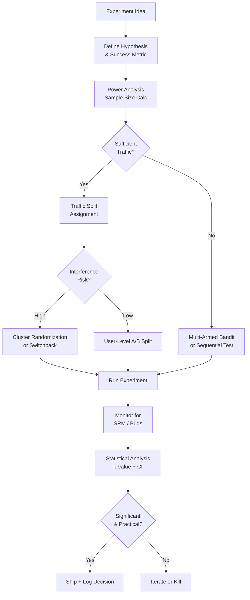

# A/B Testing & Experimentation Infrastructure for ML Systems



---

> This file covers the infrastructure side (traffic splitting, SRM detection, interference/switchback designs, rollout mechanics). For the underlying statistics (PSM, IPW, doubly robust estimators, diff-in-diff, RDD, IV), see [Canonical Stats Questions](../01-math-foundations/05-canonical-stats-questions.md) §3 and [Statistics & Probability Rapid-Fire](../01-math-foundations/_rapid-fire.md).

## Why Experimentation Infrastructure Matters

**The problem**: without controlled experiments, teams cannot distinguish causation from correlation. A new model that coincidentally launched during a holiday spike looks like a win. A feature that hurts a minority group gets shipped because aggregate metrics improved. Reliable decision-making requires proper experimental infrastructure.

**The core insight**: ML experimentation is harder than web A/B testing because (1) ML systems have longer feedback loops, (2) model predictions create interference between users, and (3) offline metrics often don't predict online results.

---

## Experiment Design

### Hypothesis and Metric Definition

**The mechanics**:

```python
# Experiment specification template
experiment_spec = {
    "name": "ranking_model_v2_vs_v1",
    "hypothesis": "New ranking model increases 7-day retention by reducing irrelevant recommendations",
    "primary_metric": "D7_retention_rate",           # business metric
    "guardrail_metrics": ["p99_latency_ms", "error_rate"],  # must not regress
    "secondary_metrics": ["CTR", "session_length", "revenue_per_user"],
    "minimum_detectable_effect": 0.005,  # 0.5% relative improvement
    "statistical_power": 0.80,
    "significance_level": 0.05,
    "max_duration_days": 14
}
```

### Power Analysis and Sample Size

**The problem**: most teams run experiments that are too small to detect real effects. A 1% improvement needs millions of users to reach significance; an experiment with 10K users can only detect >10% improvements.

**The mechanics**:

```python
from scipy import stats
import numpy as np

def required_sample_size(
    baseline_rate: float,
    minimum_detectable_effect: float,
    alpha: float = 0.05,
    power: float = 0.80
) -> int:
    """
    Compute required sample size per variant for a proportions test.
    """
    p1 = baseline_rate
    p2 = baseline_rate * (1 + minimum_detectable_effect)

    pooled_p = (p1 + p2) / 2
    z_alpha = stats.norm.ppf(1 - alpha / 2)  # two-tailed
    z_beta = stats.norm.ppf(power)

    n = (
        (z_alpha * np.sqrt(2 * pooled_p * (1 - pooled_p)) +
         z_beta * np.sqrt(p1*(1-p1) + p2*(1-p2))) ** 2
    ) / (p2 - p1) ** 2

    return int(np.ceil(n))

# Example: detect 1% lift on 20% CTR baseline
n = required_sample_size(
    baseline_rate=0.20,
    minimum_detectable_effect=0.01,  # 1% relative = 0.002 absolute
    alpha=0.05,
    power=0.80
)
print(f"Need {n:,} users per variant = {2*n:,} total")
# → ~390K per variant; 780K total for 14-day experiment

# Experiment duration estimate
daily_eligible_users = 500_000
duration_days = (2 * n) / daily_eligible_users
print(f"Duration: {duration_days:.1f} days")
```

---

## Traffic Assignment

### Deterministic User Splitting

**The core insight**: assignment must be deterministic (same user always in same variant), independent across experiments, and stable over time.

**The mechanics**:

```python
import hashlib

def assign_variant(
    user_id: str,
    experiment_id: str,
    traffic_split: dict  # {"control": 0.5, "treatment": 0.5}
) -> str:
    """
    Deterministic assignment: same user always gets same variant.
    Salted with experiment_id so user isn't always in control.
    """
    hash_input = f"{experiment_id}:{user_id}"
    hash_value = int(hashlib.md5(hash_input.encode()).hexdigest(), 16)
    bucket = (hash_value % 10000) / 10000.0  # [0, 1)

    cumulative = 0.0
    for variant, fraction in traffic_split.items():
        cumulative += fraction
        if bucket < cumulative:
            return variant
    return list(traffic_split.keys())[-1]

# Usage
variant = assign_variant(
    user_id="user_12345",
    experiment_id="ranking_v2_exp_001",
    traffic_split={"control": 0.5, "treatment": 0.5}
)
```

### Sample Ratio Mismatch (SRM) Detection

**The problem**: the assignment logic assigned 50/50, but the experiment dashboard shows 48/52. This is Sample Ratio Mismatch — a sign of a bug, not a real effect. Any analysis on SRM data is invalid.

**The mechanics**:

```python
from scipy.stats import chi2_contingency
import numpy as np

def detect_srm(
    observed_counts: dict,
    expected_ratios: dict,
    alpha: float = 0.01
) -> dict:
    """
    Chi-squared test: are observed counts consistent with expected split?
    """
    total = sum(observed_counts.values())
    expected_counts = {
        variant: ratio * total
        for variant, ratio in expected_ratios.items()
    }

    observed = list(observed_counts.values())
    expected = list(expected_counts.values())

    # Chi-squared goodness of fit
    chi2_stat = sum(
        (o - e)**2 / e
        for o, e in zip(observed, expected)
    )
    df = len(observed) - 1
    from scipy.stats import chi2
    p_value = 1 - chi2.cdf(chi2_stat, df)

    srm_detected = p_value < alpha

    return {
        "srm_detected": srm_detected,
        "p_value": p_value,
        "observed": observed_counts,
        "expected": expected_counts,
        "action": "STOP — diagnose assignment bug" if srm_detected else "Continue"
    }

# Example
result = detect_srm(
    observed_counts={"control": 48200, "treatment": 51800},
    expected_ratios={"control": 0.5, "treatment": 0.5}
)
# p_value ≈ 0.0001 → SRM detected, experiment results invalid
```

---

## Variance Reduction: CUPED

**The problem**: even with 100K users per variant, experiments take weeks because the metric has high variance. A user-level metric like "revenue per user" varies enormously (most users spend $0; some spend $500). High variance requires huge samples.

**The core insight**: CUPED (Controlled-experiment Using Pre-Experiment Data) uses a user's pre-experiment behaviour as a covariate to reduce variance by 30-70%, shrinking experiment duration by the same factor.

**The mechanics**:

```python
import numpy as np
from scipy import stats

def cuped_analysis(
    control_metric: np.ndarray,
    treatment_metric: np.ndarray,
    control_pre_exp: np.ndarray,  # same metric, pre-experiment period
    treatment_pre_exp: np.ndarray
) -> dict:
    """
    CUPED: Controlled experiment Using Pre-Experiment Data
    Y_cuped = Y - theta * (X - E[X])
    theta = Cov(Y, X) / Var(X)  -- optimal coefficient
    """
    # Estimate theta from pooled data
    all_Y = np.concatenate([control_metric, treatment_metric])
    all_X = np.concatenate([control_pre_exp, treatment_pre_exp])

    theta = np.cov(all_Y, all_X)[0, 1] / np.var(all_X)
    X_mean = np.mean(all_X)

    # Apply CUPED adjustment
    control_adj = control_metric - theta * (control_pre_exp - X_mean)
    treatment_adj = treatment_metric - theta * (treatment_pre_exp - X_mean)

    # Variance reduction achieved
    original_var = np.var(control_metric)
    adjusted_var = np.var(control_adj)
    var_reduction = 1 - (adjusted_var / original_var)

    # T-test on CUPED-adjusted values
    t_stat, p_value = stats.ttest_ind(treatment_adj, control_adj)
    effect_size = np.mean(treatment_adj) - np.mean(control_adj)

    return {
        "variance_reduction_pct": var_reduction * 100,
        "effect_size": effect_size,
        "p_value": p_value,
        "significant": p_value < 0.05
    }
```

---

## Interference: Network Effects

**The problem**: standard A/B assumes users are independent. In social networks, marketplaces, and ride-sharing, they're not. If user A is in treatment (gets better recommendations), they might interact with user B in control — contaminating the control group.

**Solutions**:

```
Method                | When to use            | Complexity
----------------------|------------------------|----------
Cluster randomization | Social networks        | High — cluster users by connection
Geographic/Market split| Marketplaces, delivery | Medium — randomize by city/market
Switchback testing    | Time-varying           | Medium — alternate control/treatment by time
Hold-out group        | Long-term effects      | Low — permanent holdout, no crossover
```

```python
# Switchback experiment: alternate periods (no user-level tracking needed)
import datetime

def get_variant_switchback(
    timestamp: datetime.datetime,
    experiment_id: str,
    period_minutes: int = 30
) -> str:
    """
    Switchback: every N minutes, flip between control and treatment.
    Good for marketplace/platform experiments where users interact.
    """
    period = int(timestamp.timestamp() // (period_minutes * 60))
    hash_val = int(hashlib.md5(f"{experiment_id}:{period}".encode()).hexdigest(), 16)
    return "treatment" if hash_val % 2 == 0 else "control"
```

---

## Multi-Armed Bandits: When A/B is Insufficient

**The problem**: a classic A/B test fixes traffic at 50/50 for the entire duration. If treatment is clearly better after 3 days, you've wasted 11 days sending half your traffic to a worse experience.

**The core insight**: bandits adaptively allocate more traffic to better-performing variants while still exploring. Thompson Sampling is Bayesian: maintain a Beta distribution per variant; sample from it; route to the highest sample.

**The mechanics**:

```python
import numpy as np
from scipy.stats import beta as beta_dist

class ThompsonSamplingBandit:
    def __init__(self, variants: list):
        self.variants = variants
        # Beta(alpha, beta): alpha = successes + 1, beta = failures + 1
        self.alpha = {v: 1 for v in variants}
        self.beta = {v: 1 for v in variants}

    def select_variant(self) -> str:
        """Sample from each variant's distribution; pick highest."""
        samples = {
            v: beta_dist.rvs(self.alpha[v], self.beta[v])
            for v in self.variants
        }
        return max(samples, key=samples.get)

    def update(self, variant: str, reward: int):
        """Update posterior: reward=1 for success, 0 for failure."""
        if reward:
            self.alpha[variant] += 1
        else:
            self.beta[variant] += 1

    def traffic_share(self) -> dict:
        """Estimated traffic allocation based on current posteriors."""
        means = {v: self.alpha[v] / (self.alpha[v] + self.beta[v])
                 for v in self.variants}
        total = sum(means.values())
        return {v: m / total for v, m in means.items()}

# Bandit vs A/B: when to use each
# A/B: primary metric has delayed feedback (D7 retention)
# Bandit: immediate reward signal (click, purchase), business cost of suboptimal traffic
```

---

## Interleaving: Faster Ranker Comparison

**The problem**: comparing two ranking models with A/B requires weeks because user-level metrics (CTR) have high variance. Interleaving mixes items from both models into a single ranked list and observes which model's items get more clicks — 100x faster signal.

**The mechanics**:

```python
def interleave_rankings(
    list_a: list,
    list_b: list,
    k: int = 20
) -> tuple[list, dict]:
    """
    Team-Draft Interleaving: randomly pick which team goes first per position.
    Track which model contributed each selected item.
    """
    selected = []
    attribution = {}  # item_id → model

    team_a = list(list_a)
    team_b = list(list_b)

    while len(selected) < k and (team_a or team_b):
        # Randomly pick which team selects next
        if not team_a:
            team_picks = 'B'
        elif not team_b:
            team_picks = 'A'
        else:
            team_picks = np.random.choice(['A', 'B'])

        if team_picks == 'A':
            for item in team_a:
                if item not in selected:
                    selected.append(item)
                    attribution[item] = 'A'
                    team_a.remove(item)
                    break
        else:
            for item in team_b:
                if item not in selected:
                    selected.append(item)
                    attribution[item] = 'B'
                    team_b.remove(item)
                    break

    return selected, attribution

def compute_interleaving_winner(clicks: list, attribution: dict) -> str:
    """Model with more clicks from its attributed items wins."""
    wins = {'A': 0, 'B': 0}
    for clicked_item in clicks:
        if clicked_item in attribution:
            wins[attribution[clicked_item]] += 1
    return max(wins, key=wins.get) if wins['A'] != wins['B'] else 'tie'
```

---

## Statistical Analysis and Decision

**The mechanics**:

```python
from scipy import stats
import numpy as np

def analyze_experiment(
    control: np.ndarray,
    treatment: np.ndarray,
    alpha: float = 0.05
) -> dict:
    t_stat, p_value = stats.ttest_ind(treatment, control)
    effect_size = np.mean(treatment) - np.mean(control)
    relative_lift = effect_size / np.mean(control)

    # 95% confidence interval
    se = np.sqrt(np.var(treatment)/len(treatment) + np.var(control)/len(control))
    ci_low = effect_size - 1.96 * se
    ci_high = effect_size + 1.96 * se

    return {
        "p_value": p_value,
        "significant": p_value < alpha,
        "effect_size_absolute": effect_size,
        "relative_lift_pct": relative_lift * 100,
        "confidence_interval_95": (ci_low, ci_high),
        "recommendation": "SHIP" if p_value < alpha and effect_size > 0 else "NO SHIP"
    }
```

**Common pitfalls**:

```
Pitfall                  | Description                          | Fix
-------------------------|--------------------------------------|--------------------------------
Peeking                  | Checking results before n is reached | Sequential testing / fixed horizon
Multiple comparisons     | Testing 10 metrics, 1 will be p<0.05 | Bonferroni correction
Novelty effect           | New UI always looks better initially | Run 2+ weeks; check new vs returning
Primacy effect           | Control users prefer familiar UX     | Same mitigation as novelty
SRM                      | Assignment bug                       | Always check before analyzing
Practical vs statistical | p<0.001 but effect is tiny           | Report effect size + CI
```

## Flashcards

**Why is Sample Ratio Mismatch (SRM) a "stop the experiment" signal rather than just a metric to note?** #flashcard
A significant deviation from the intended split (e.g. 48/52 instead of 50/50) means the assignment mechanism itself is broken — any treatment effect measured on top of a biased population is confounded and cannot be trusted, so the fix is to find and fix the assignment bug, not to analyze around it.

**How does CUPED reduce the sample size needed for an experiment, and what does it require?** #flashcard
It subtracts out the portion of outcome variance explained by a user's pre-experiment behavior (`Y - theta*(X - E[X])`), cutting variance by 30-70% for metrics correlated with historical behavior — it requires the same metric to be measurable before the experiment starts.

**Why does a standard user-level A/B test break down in a marketplace or social network setting?** #flashcard
Treatment and control users interact (a treated driver affects a control rider's wait time, a treated user's post appears in a control friend's feed), so the control group is contaminated by treatment effects — violates the independence assumption behind the statistics.

**Why do interleaving experiments reach significance so much faster than A/B tests for ranking models?** #flashcard
Interleaving compares two rankers within the same user session (which model's items get clicked), removing between-user variance entirely — that variance, not the ranking signal itself, is what makes user-level CTR comparisons slow to converge.

**When should you use a multi-armed bandit instead of a fixed-split A/B test?** #flashcard
When the reward signal is immediate (clicks, purchases) and there's real business cost to serving a worse variant during the test — the bandit shifts traffic toward the better arm as evidence accumulates instead of holding a fixed 50/50 split for the full duration.

**Why is "p < 0.001" not sufficient justification to ship a change?** #flashcard
A tiny effect size can reach very low p-values with a large enough sample; statistical significance only says the effect is real, not that it's large enough to matter — always report effect size and confidence interval alongside p-value to judge practical significance.
