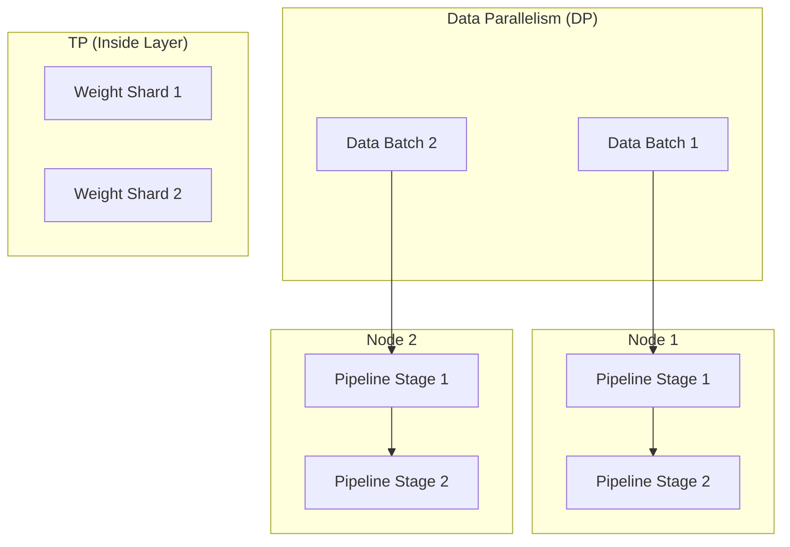

# AI Infrastructure & Scalability

This hub focuses on the hardware and software orchestration required to train and serve massive AI models at scale.

---

## 🔹 The 3D Parallelism Hierarchy



---

# Q1: LLM optimization techniques

## 1. 🔹 Direct Answer
Common LLM optimization buckets: **training** (mixed precision FP16/BF16, gradient checkpointing, distributed parallelism, Flash Attention), **inference** (KV-cache, continuous batching, quantization, speculative decoding, kernel fusion, smaller models / distillation), and **systems** (caching, routing, load balancing, autoscaling).

## 2. 🔹 Intuition
You either reduce **work per token** (math/model), **tokens** (prompt/output), or **idle time** (batching/scheduling).

## 3. 🔹 Deep Dive
Map technique to bottleneck: memory-bound vs compute-bound; latency-sensitive (TTFT) vs throughput-sensitive (offline jobs). Combine: e.g., INT4 weights + paged KV + continuous batching for high-QPS serving.

## 4. 🔹 Practical Perspective
Interviewers want trade-offs: quantization vs quality, batching vs tail latency, multi-tenant GPU sharing.

## 5. 🔹 Code Snippet
```text
optimize: profile -> (quant | distill | flash_attn) -> (kv_cache | paged_attn) -> (cont_batch | spec_decode) -> (cache | route)
```

## 6. 🔹 Interview Follow-ups
1. Q: First knob for latency?  
   A: Output length, model size, batching strategy, and TTFT path (prefill).

## 7. 🔹 Common Mistakes
Listing only training tricks when the question is serving-heavy.

## 8. 🔹 Comparison / Connections
Connects to every other Q in this file.

## 9. 🔹 One-line Revision
LLM optimization spans training efficiency, inference kernels, memory (KV), scheduling, and routing—always tied to measured bottlenecks.

## 10. 🔹 Difficulty Tag
🟡 Medium

---

# Q2: How do you select GPUs for LLM inference?

## 1. 🔹 Direct Answer
Match GPU **memory** (model weights + KV cache + activations for batch), **memory bandwidth** (important for large matmuls and long sequences), **FP8/FP16/BF16 Tensor Core throughput**, and **multi-GPU topology** (NVLink for tensor parallelism). For inference at scale, also consider **power, TCO, and availability** of optimized kernels (TensorRT-LLM, vLLM) per GPU generation.

## 2. 🔹 Intuition
If the model does not fit in VRAM, you must shard or quantize—pick hardware that fits your sharding + latency story.

## 3. 🔹 Deep Dive
Steps: estimate VRAM for weights (precision-dependent), add KV cache budget (batch × seq × layers × heads × dim), add headroom. Compare throughput $/token for candidate GPUs. For multi-GPU inference, prefer high interconnect NVLink for TP.

## 4. 🔹 Practical Perspective
Use profiling on a representative trace—not spec sheets alone.

## 5. 🔹 Code Snippet
```text
need_vram ≈ weights + kv_cache(batch, ctx_len) + activations_overhead
pick GPU where need_vram fits + kernels meet SLO
```

## 6. 🔹 Interview Follow-ups
1. Q: L40S vs H100?  
   A: Depends on model size, precision, batch, and $/throughput—benchmark.

## 7. 🔹 Common Mistakes
Buying only “most FLOPs” without KV memory pressure analysis.

## 8. 🔹 Comparison / Connections
Quantization, tensor parallelism, KV cache.

## 9. 🔹 One-line Revision
Select inference GPUs by VRAM fit for weights+KV at target batch/context, bandwidth, kernel support, and interconnect for TP—validated by profiling.

## 10. 🔹 Difficulty Tag
🟣 Hard

---

# Q3: What is model parallelism vs data parallelism in distributed training?

## 1. 🔹 Direct Answer
**Data parallelism (DP)** replicates the model on each device and splits **different batches** of data; gradients are averaged across replicas. **Model parallelism** splits **one model** across devices (tensor or pipeline parallelism) because a single GPU cannot hold the model or layer.

## 2. 🔹 Intuition
DP is “more workers on more data”; model parallelism is “one model is too big for one GPU.”

## 3. 🔹 Deep Dive
DP: all-reduce gradients, same weights everywhere. Model parallel: split parameters or layers; more communication along forward/backward. Often combined: DP across nodes, TP/PP inside a node or cluster.

## 4. 🔹 Practical Perspective
Large LLMs typically use **TP + PP + FSDP/ZeRO** hybrids, not pure DP alone.

## 5. 🔹 Code Snippet
```text
DP: shard data | sync grads
model parallel: shard params | more comms
```

## 6. 🔹 Interview Follow-ups
1. Q: When pure DP fails?  
   A: When per-device memory cannot store a single model replica.

## 7. 🔹 Common Mistakes
Using DP terminology for tensor parallelism.

## 8. 🔹 Comparison / Connections
FSDP, ZeRO, TP, PP.

## 9. 🔹 One-line Revision
Data parallelism splits batches; model parallelism splits the model across devices when memory or scale demands it.

## 10. 🔹 Difficulty Tag
🟡 Medium

---

# Q4: What is tensor parallelism, and how does it help serve large models?

## 1. 🔹 Direct Answer
**Tensor parallelism (TP)** splits individual weight matrices and ops across GPUs (column/row splits in linear layers, attention heads across devices). Each forward pass uses fast collective communication (e.g., all-reduce, all-gather) so each GPU holds a **shard** of the layer. It helps **serve** models that do not fit on one GPU and can improve per-request throughput by parallelizing matmuls—at the cost of communication overhead.

## 2. 🔹 Intuition
One matrix multiply is split across GPUs like a team carrying a heavy table.

## 3. 🔹 Deep Dive
Megatron-style: split QKV projection and MLP along hidden dimensions. Requires NVLink/low-latency links for good performance. Inference stacks (TensorRT-LLM, vLLM) expose TP degrees.

## 4. 🔹 Practical Perspective
TP helps when single-GPU VRAM is insufficient or when you need low-latency multi-GPU inference on one replica.

## 5. 🔹 Code Snippet
```text
TP_degree = num_gpus_sharding_layer
comm: all_reduce / all_gather per layer
```

## 6. 🔹 Interview Follow-ups
1. Q: TP vs PP?  
   A: TP splits layers’ tensors; PP splits layers along depth (microbatches).

## 7. 🔹 Common Mistakes
Assuming TP always speeds things up—**comm** can dominate at small batch sizes.

## 8. 🔹 Comparison / Connections
Pipeline parallelism, NCCL.

## 9. 🔹 One-line Revision
Tensor parallelism shards layer tensors across GPUs to fit and parallelize large models, trading communication for memory and compute distribution.

## 10. 🔹 Difficulty Tag
🟣 Hard

---

# Q5: What is pipeline parallelism?

## 1. 🔹 Direct Answer
**Pipeline parallelism (PP)** assigns **different layers** of the model to different devices in a pipeline. Microbatches flow through stages like an assembly line; with **GPipe**-style scheduling, you balance bubble time and memory.

## 2. 🔹 Intuition
GPU A does early layers, GPU B does later layers—activations pass between stages.

## 3. 🔹 Deep Dive
Reduces per-device memory (each holds fewer layers) but introduces pipeline **bubbles** (idle time) unless you use multiple microbatches. Often combined with TP within a stage.

## 4. 🔹 Practical Perspective
Common in very large model training; inference serving sometimes uses PP for multi-GPU single-node or multi-node pipelines.

## 5. 🔹 Code Snippet
```text
stage_i = layers[L_i : L_{i+1}]
forward: microbatch flows stage0 -> stage1 -> ...
```

## 6. 🔹 Interview Follow-ups
1. Q: Main downside?  
   A: Pipeline bubbles and latency unless well scheduled.

## 7. 🔹 Common Mistakes
Confusing PP with TP (different split axis).

## 8. 🔹 Comparison / Connections
3D parallelism (DP + TP + PP).

## 9. 🔹 One-line Revision
Pipeline parallelism splits the model depth across devices with microbatch scheduling to reduce per-device memory and enable very large models.

## 10. 🔹 Difficulty Tag
🟣 Hard

---

# Q6: How does continuous batching improve LLM inference throughput?

## 1. 🔹 Direct Answer
**Continuous batching** (dynamic batching) adds new requests to **ongoing** batches and removes finished sequences as soon as they complete, instead of waiting for a full static batch to drain. This **increases GPU utilization** by reducing idle time between variable-length generations.

## 2. 🔹 Intuition
Static batching wastes GPU cycles when one sequence finishes early while others continue.

## 3. 🔹 Deep Dive
Implemented in schedulers (e.g., vLLM, TGI, TensorRT-LLM) with iteration-level scheduling. Works well with **PagedAttention** for KV memory management.

## 4. 🔹 Practical Perspective
Major throughput win for chatty/high-QPS workloads; tail latency still needs careful SLOs.

## 5. 🔹 Code Snippet
```text
each decode step: schedule active sequences | free finished | admit new
```

## 6. 🔹 Interview Follow-ups
1. Q: Effect on latency?  
   A: Can improve average throughput; monitor p99 under contention.

## 7. 🔹 Common Mistakes
Thinking batching only helps training—it's critical for inference serving too.

## 8. 🔹 Comparison / Connections
vLLM, PagedAttention.

## 9. 🔹 One-line Revision
Continuous batching keeps GPUs busy by dynamically packing/unpacking sequences each decode step, boosting throughput.

## 10. 🔹 Difficulty Tag
🟡 Medium

---

# Q7: What is speculative decoding, and how does it speed up inference?

## 1. 🔹 Direct Answer
**Speculative decoding** uses a smaller **draft** model to propose multiple tokens ahead, then **verifies** them in parallel with the large target model (or uses a variant acceptance rule). Accepted tokens advance faster than strict autoregressive decoding; rejected tokens are corrected.

## 2. 🔹 Intuition
Guess several next tokens cheaply, then let the big model verify in bulk.

## 3. 🔹 Deep Dive
Reduces per-token steps when acceptance rate is high; draft model must be aligned. Variants: speculative sampling, Medusa-style multi-head heads.

## 4. 🔹 Practical Perspective
Best when latency-bound and draft model is cheap on same hardware.

## 5. 🔹 Code Snippet
```text
draft_tokens = draft_model.generate(k)
accept_or_reject = verify_with_target(draft_tokens)
```

## 6. 🔹 Interview Follow-ups
1. Q: When it fails?  
   A: Low acceptance rate, or draft/verify mismatch—can slow down.

## 7. 🔹 Common Mistakes
Assuming it always speeds up without measuring acceptance.

## 8. 🔹 Comparison / Connections
Distillation, KV cache.

## 9. 🔹 One-line Revision
Speculative decoding proposes tokens with a small model and verifies with the large model to speed autoregressive generation when acceptance is high.

## 10. 🔹 Difficulty Tag
🟣 Hard

---

# Q8: What is KV cache, and how do you manage memory for it?

## 1. 🔹 Direct Answer
During autoregressive decoding, the model caches **Key** and **Value** tensors per layer for **past** tokens so each new token only computes attention against new Q vs full cached KV—avoiding recomputation of past attention. KV cache memory grows **linearly** with batch size, sequence length, layers, heads, and hidden size.

## 2. 🔹 Intuition
Without KV cache, you’d re-read the whole prefix every step—prohibitively expensive.

## 3. 🔹 Deep Dive
Manage by: limiting `max_seq_len` and batch, **paged/block** allocation, **quantized KV**, **offloading** (rare), multi-GPU sharding, or **prefix caching** for repeated prefixes. Monitor peak KV per request.

## 4. 🔹 Practical Perspective
KV often dominates memory for long contexts; paged KV is standard in vLLM-class systems.

## 5. 🔹 Code Snippet
```text
KV_mem ∝ batch × seq_len × num_layers × (d_kv_heads × ...)
```

## 6. 🔹 Interview Follow-ups
1. Q: Quantize KV?  
   A: Yes—INT8/FP8 KV reduces memory at some quality risk.

## 7. 🔹 Common Mistakes
Accounting only for weights but not KV in serving capacity planning.

## 8. 🔹 Comparison / Connections
PagedAttention, FlashAttention.

## 9. 🔹 One-line Revision
KV cache stores per-layer K/V for past tokens to speed decoding; memory grows with batch × seq × model size—manage with paging, limits, and quantization.

## 10. 🔹 Difficulty Tag
🟡 Medium

---

# Q9: What are Paged Attention and vLLM?

## 1. 🔹 Direct Answer
**PagedAttention** stores KV cache in **non-contiguous** fixed-size blocks (like virtual memory pages), so variable-length sequences do not waste reserved contiguous GPU memory. **vLLM** is an open-source inference engine that implements PagedAttention plus continuous batching and an efficient scheduler for high throughput LLM serving.

## 2. 🔹 Intuition
Instead of allocating one giant “rectangle” of KV per sequence, allocate small blocks and map them flexibly.

## 3. 🔹 Deep Dive
Reduces fragmentation and increases batch capacity for concurrent users. vLLM integrates with GPU kernels, CUDA graphs (where applicable), and common model formats.

## 4. 🔹 Practical Perspective
Common choice for production OpenAI-compatible servers when self-hosting.

## 5. 🔹 Code Snippet
```text
KV blocks + block table per sequence -> less fragmentation -> higher throughput
```

## 6. 🔹 Interview Follow-ups
1. Q: Alternatives?  
   A: TGI, TensorRT-LLM, SGLang, etc.—each has different paging/scheduling.

## 7. 🔹 Common Mistakes
Thinking vLLM is “just a model”—it’s primarily a **serving runtime**.

## 8. 🔹 Comparison / Connections
Continuous batching, KV memory.

## 9. 🔹 One-line Revision
PagedAttention block-manages KV caches; vLLM is a high-throughput serving stack built around it plus continuous batching.

## 10. 🔹 Difficulty Tag
🟡 Medium

---

# Q10: How do you optimize inference for edge and mobile deployment?

## 1. 🔹 Direct Answer
Use **smaller models** (distillation, pruning), **quantization** (INT8/INT4), **efficient kernels** (CoreML, NNAPI, ONNX Runtime, TensorRT), **limit context length**, **batch=1** or tiny batch, and **on-device caching** of embeddings. Profile on target hardware; optimize for **battery and thermal** limits on mobile.

## 2. 🔹 Intuition
Edge = tight memory, no datacenter GPU—trade quality for size and latency.

## 3. 🔹 Deep Dive
Consider hybrid: on-device for small tasks, cloud for heavy. Use **structured outputs** sparingly. Secure model and keys.

## 4. 🔹 Practical Perspective
Apple/Google Neural Engine paths differ—benchmark per device class.

## 5. 🔹 Code Snippet
```text
edge_opt = quantize + distill + mobile_runtime + cap_ctx + measure_p95_on_device
```

## 6. 🔹 Interview Follow-ups
1. Q: Privacy benefit?  
   A: Local inference keeps data on device—often a driver for edge.

## 7. 🔹 Common Mistakes
Assuming desktop GPU benchmarks apply to phones.

## 8. 🔹 Comparison / Connections
Cloud vs on-device deployment.

## 9. 🔹 One-line Revision
Edge/mobile optimization is quantize + distill + small context + hardware-specific runtimes + on-device profiling.

## 10. 🔹 Difficulty Tag
🟣 Hard

---

# Q11: What is model quantization (INT8, INT4, FP16, BF16), and how does it affect quality?

## 1. 🔹 Direct Answer
Quantization reduces numeric precision of weights (and sometimes activations) to shrink memory and speed up inference. **FP16/BF16** usually minimal quality loss; **INT8** often small loss with calibration; **INT4** can hurt more on sensitive layers or outliers unless using mixed precision/QAT.

## 2. 🔹 Intuition
Fewer bits = smaller footprint and faster math, but coarser representation.

## 3. 🔹 Deep Dive
PTQ vs QAT; per-channel vs per-tensor scales; outliers handled via mixed precision or GPTQ/AWQ-style methods. Always evaluate **task-specific** metrics.

## 4. 🔹 Practical Perspective
Production often uses INT4/8 for weights with FP16/BF16 activations depending on stack.

## 5. 🔹 Code Snippet
```text
quality vs size: FP32 > BF16/FP16 > INT8 > INT4 (typically)
```

## 6. 🔹 Interview Follow-ups
1. Q: BF16 vs FP16?  
   A: BF16 wider exponent range—often more stable training; inference depends on GPU support.

## 7. 🔹 Common Mistakes
Claiming quantization has no quality impact without eval.

## 8. 🔹 Comparison / Connections
LLM optimization, inference cost.

## 9. 🔹 One-line Revision
Quantization trades precision for memory/speed; impact depends on bit-width, calibration, and mixed precision—validate on task metrics.

## 10. 🔹 Difficulty Tag
🟡 Medium

---

# Q12: How do you implement auto-scaling for AI workloads?

## 1. 🔹 Direct Answer
Define **metrics** (GPU utilization, queue depth, request latency p95, pending tokens, error rate) and **scaling policies** (CPU/GPU node pools, replicas of inference service). Use **HPA**-style scaling on custom metrics or **KEDA** for queue-based scaling. Scale **GPU pools** carefully—cold starts and image pulls matter.

## 2. 🔹 Intuition
Scale on **pressure** and **SLO**, not just CPU.

## 3. 🔹 Deep Dive
Include scale-down delays to avoid flapping; pre-warm pools for peak; use separate pools for interactive vs batch inference.

## 4. 🔹 Practical Perspective
LLM serving often scales replicas of stateless inference pods behind a load balancer.

## 5. 🔹 Code Snippet
```text
if p95_latency > SLO or queue_depth > T: scale_replicas += 1
```

## 6. 🔹 Interview Follow-ups
1. Q: GPU autoscaling pain?  
   A: Provisioning delays; use min replicas or reserved capacity.

## 7. 🔹 Common Mistakes
Scaling only on CPU when GPU is the bottleneck.

## 8. 🔹 Comparison / Connections
Load balancing, cold start.

## 9. 🔹 One-line Revision
Auto-scale AI workloads on GPU-aware metrics (util, queue, latency, custom token backlog) with hysteresis and warm pools.

## 10. 🔹 Difficulty Tag
🟡 Medium

---

# Q13: What is the role of load balancing in AI serving infrastructure?

## 1. 🔹 Direct Answer
Load balancers distribute **incoming requests** across replicas to avoid hotspots, support **health checks**, **session affinity** when needed (sticky for some stateful setups), and enable **gradual rollouts**. For LLMs, balancing must consider **request size** and **GPU load**, not just round-robin.

## 2. 🔹 Intuition
Evenly spread work so one GPU node isn’t swamped while others idle.

## 3. 🔹 Deep Dive
Advanced: **least pending requests**, **weighted** routing by model size, **geographic** routing. TLS termination at edge.

## 4. 🔹 Practical Perspective
Combine with circuit breakers and rate limiting at the gateway.

## 5. 🔹 Code Snippet
```text
LB: health_check + least_conn / weighted_round_robin
```

## 6. 🔹 Interview Follow-ups
1. Q: Sticky sessions?  
   A: Rare for stateless inference; more for streaming or long-lived sessions.

## 7. 🔹 Common Mistakes
Pure round-robin ignoring long prompts tying up one replica.

## 8. 🔹 Comparison / Connections
Model routing, autoscaling.

## 9. 🔹 One-line Revision
Load balancing spreads inference traffic across healthy replicas using GPU-aware or least-load strategies, not naive round-robin.

## 10. 🔹 Difficulty Tag
🟡 Medium

---

# Q14: How do you manage GPU memory for serving multiple models?

## 1. 🔹 Direct Answer
Strategies: **multi-tenant scheduling** (one model per GPU vs colocated models), **model swapping** (load/unload weights—slow), **smaller quantized weights**, **tensor parallel** sharding across GPUs, **separate pools** per model tier, and **orchestration** (only load hot models). Track **KV cache** separately per active request.

## 2. 🔹 Intuition
Weights are static; KV is dynamic—capacity planning must separate both.

## 3. 🔹 Deep Dive
Use **MIG** (A100) or **MPS** for partitioning where applicable; prefer **separate replicas** for predictable SLOs. Use **LRU** for model cache if swapping.

## 4. 🔹 Practical Perspective
Avoid thrashing: loading models from disk repeatedly kills latency.

## 5. 🔹 Code Snippet
```text
mem = sum_loaded_weights + active_kv_cache
policy: pin hot models | quantize | shard | replicate
```

## 6. 🔹 Interview Follow-ups
1. Q: One GPU many models?  
   A: Possible only if they fit; often better to route to dedicated replicas.

## 7. 🔹 Common Mistakes
Ignoring KV footprint when colocating models.

## 8. 🔹 Comparison / Connections
Model routing, autoscaling.

## 9. 🔹 One-line Revision
Manage multi-model serving by tracking weights+KV, using quantization/sharding, dedicated pools, and careful load/unload to avoid thrashing.

## 10. 🔹 Difficulty Tag
🟣 Hard

---

# Q15: What is model sharding, and when would you use it?

## 1. 🔹 Direct Answer
**Sharding** splits model parameters (and/or optimizer state) across devices or nodes. Use when **a single model exceeds one GPU’s memory** or when you need to parallelize training/inference across many devices. Forms include **tensor**, **pipeline**, and **FSDP/ZeRO** sharding of optimizer states.

## 2. 🔹 Intuition
Shard = “slice the elephant” so each piece fits on a worker.

## 3. 🔹 Deep Dive
Inference: TP/PP. Training: FSDP shards parameters + grads; ZeRO stages shard optimizer states. **More shards** → more communication.

## 4. 🔹 Practical Perspective
Choose shard topology based on network bandwidth and job size.

## 5. 🔹 Code Snippet
```text
shard: split params | all_gather / reduce_scatter
```

## 6. 🔹 Interview Follow-ups
1. Q: Shard vs replicate?  
   A: Replicate for throughput; shard for memory fit.

## 7. 🔹 Common Mistakes
Using “sharding” without specifying TP vs FSDP vs ZeRO.

## 8. 🔹 Comparison / Connections
FSDP, ZeRO, tensor parallelism.

## 9. 🔹 One-line Revision
Model sharding splits weights/states across devices for memory fit or scale; pick TP/PP/FSDP/ZeRO based on training vs inference and comms budget.

## 10. 🔹 Difficulty Tag
🟣 Hard

---

# Q16: How do you implement request queuing and priority scheduling for AI services?

## 1. 🔹 Direct Answer
Place a **queue** in front of inference workers (Redis, SQS, Kafka, or in-process priority queues). Define **priority classes** (interactive vs batch, paid vs free), **fairness** (token-bucket per tenant), **timeouts**, and **backpressure** (reject or degrade when overloaded). Schedule by **estimated tokens** or **latency SLO**, not just FIFO.

## 2. 🔹 Intuition
Long requests block others—FIFO starves short tasks; priority protects UX.

## 3. 🔹 Deep Dive
Use **weighted fair queueing**, **deadline scheduling**, or **shortest-job-first** approximations using predicted output length. Combine with autoscaling triggers.

## 4. 🔹 Practical Perspective
Expose **429** or **retry-after** with clear policy; avoid unbounded queues.

## 5. 🔹 Code Snippet
```text
enqueue(req, priority) -> worker_pool | drop_if_queue > max | SLA_escalation
```

## 6. 🔹 Interview Follow-ups
1. Q: Prevent starvation?  
   A: Aging or caps on low-priority drain.

## 7. 🔹 Common Mistakes
Unbounded queue causing OOM or latency explosion.

## 8. 🔹 Comparison / Connections
Rate limiting, autoscaling.

## 9. 🔹 One-line Revision
Implement priority queues with fairness, token-aware scheduling, timeouts, and backpressure—never unbounded FIFO for LLMs.

## 10. 🔹 Difficulty Tag
🟣 Hard

---

# Q17: What are the cost trade-offs between self-hosted and API-based AI inference?

## 1. 🔹 Direct Answer
**APIs**: low upfront cost, fast integration, strong SLAs from vendor, **variable** per-token pricing, less ops—but **vendor lock-in**, data governance limits, and less control over kernels. **Self-hosted**: control, privacy, **fixed** GPU capex/opex, **higher** engineering burden (scaling, drivers, kernels, on-call). TCO crosses over at sustained high volume and stable workload.

## 2. 🔹 Intuition
Rent vs buy: rent when uncertain volume; buy when predictable and large.

## 3. 🔹 Deep Dive
Model **utilization** matters: idle GPUs burn money. Factor **multi-region**, **finetuning**, and **egress** costs. Hybrid is common.

## 4. 🔹 Practical Perspective
Use financial model: $/1M tokens + people cost + risk.

## 5. 🔹 Code Snippet
```text
TCO_api = usage * price + integration
TCO_self = gpu + eng + infra + risk
```

## 6. 🔹 Interview Follow-ups
1. Q: When hybrid?  
   A: Sensitive data on-prem, general traffic on API.

## 7. 🔹 Common Mistakes
Ignoring engineer time in self-host TCO.

## 8. 🔹 Comparison / Connections
LLM gateway, FinOps.

## 9. 🔹 One-line Revision
APIs optimize for speed and low ops; self-host optimizes for control and unit economics at scale—compare TCO including utilization and staffing.

## 10. 🔹 Difficulty Tag
🟡 Medium

---

# Q18: How do you handle cold start latency for serverless AI deployments?

## 1. 🔹 Direct Answer
Reduce cold starts with **pre-warmed** containers, **min instances** > 0, **smaller images**, **cached model weights** on local disk/NVMe, **GPU snapshots** (where supported), **provisioned concurrency**, and **async** paths for non-interactive. For LLMs, cold start is often **model load**—keep hot replicas or use **lightweight routing** for first byte.

## 2. 🔹 Intuition
Serverless scales to zero but pays latency on wake—LLMs amplify that.

## 3. 🔹 Deep Dive
Measure **P50/P99 cold** separately. Use **gradual traffic shift** after deploy. Consider **compiled** models (TensorRT) for faster load.

## 4. 🔹 Practical Perspective
Strict interactive SLOs often conflict with scale-to-zero—use min instances.

## 5. 🔹 Code Snippet
```text
cold_start = image_pull + container_start + model_load_to_gpu
mitigate: min_replicas + warm_pool + weight_cache
```

## 6. 🔹 Interview Follow-ups
1. Q: Serverless for LLMs?  
   A: Possible only with aggressive warming; many teams use always-on GPU pools.

## 7. 🔹 Common Mistakes
Expecting cold-start-free UX on pure GPU serverless without tuning.

## 8. 🔹 Comparison / Connections
Autoscaling, caching.

## 9. 🔹 One-line Revision
Mitigate cold starts with min replicas, warm pools, fast image/cache, and model load optimization—pure scale-to-zero is hard for large LLMs.

## 10. 🔹 Difficulty Tag
🟣 Hard

---

# Q19: How do you implement model caching to reduce redundant computations?

## 1. 🔹 Direct Answer
Cache at multiple layers: **identical prompt** response cache (Redis), **prefix KV cache** reuse for shared system prompts, **embedding cache** for repeated queries, **compiled graph** artifacts, and **CDN** for static assets. Key by **hash of prompt + model version + decoding params + context snapshot**.

## 2. 🔹 Intuition
Repeated work (same prefix, same query) should not recompute from scratch.

## 3. 🔹 Deep Dive
**Prefix caching** (e.g., SGLang, vLLM features) stores KV blocks for common prefixes across requests. Invalidate on prompt/model/index change.

## 4. 🔹 Practical Perspective
Watch **staleness** and **privacy**—don’t cache PII in shared caches without controls.

## 5. 🔹 Code Snippet
```text
key = hash(model_ver, prompt_ver, normalized_input, decoder_params)
cache.get(key) or compute_and_set(key, ttl)
```

## 6. 🔹 Interview Follow-ups
1. Q: Semantic cache?  
   A: Embed query and match similar keys—different trade-offs.

## 7. 🔹 Common Mistakes
Cache key missing temperature/max_tokens—wrong hits.

## 8. 🔹 Comparison / Connections
Semantic caching, LLM gateway.

## 9. 🔹 One-line Revision
Cache responses, embeddings, and prefixes with versioned keys; prefix KV caching is especially powerful for shared system prompts.

## 10. 🔹 Difficulty Tag
🟡 Medium

---

# Q20: What is the difference between synchronous and asynchronous inference, and when do you use each?

## 1. 🔹 Direct Answer
**Synchronous**: client waits for the full response (or stream) in the same request thread—simple, good for **interactive** latency. **Asynchronous**: enqueue job, return **job id**, client polls or Webhooks—good for **long** jobs, batch, or when you need **queueing** and **backpressure**.

## 2. 🔹 Intuition
Sync = now; async = later when work is heavy or bursty.

## 3. 🔹 Deep Dive
Async enables **decoupling** clients from GPU workers, better **burst handling**, and **retries**. Streaming is still “sync” in HTTP but incremental.

## 4. 🔹 Practical Perspective
Use async for batch eval, summarization of huge docs, or when p99 sync would timeout.

## 5. 🔹 Code Snippet
```text
sync: POST /generate -> 200 + body
async: POST /jobs -> 202 + job_id -> GET /jobs/{id}
```

## 6. 🔹 Interview Follow-ups
1. Q: Streaming?  
   A: Still synchronous connection; tokens arrive incrementally.

## 7. 🔹 Common Mistakes
Using sync long jobs with short gateway timeouts.

## 8. 🔹 Comparison / Connections
Queues, priority scheduling.

## 9. 🔹 One-line Revision
Use sync for low-latency interactive calls; use async for long or bursty workloads and better queueing.

## 10. 🔹 Difficulty Tag
🟢 Easy

---

# Q21: What is FSDP (Fully Sharded Data Parallel), and how does it differ from DeepSpeed ZeRO?

## 1. 🔹 Direct Answer
**FSDP** (PyTorch) shards **model parameters, gradients, and optimizer states** across data-parallel ranks, reusing **all-gather** during forward and **reduce-scatter** during backward to save memory. **DeepSpeed ZeRO** is a family of optimizer-state sharding stages (ZeRO-1/2/3) with similar goals—**ZeRO-3** also shards parameters like FSDP. **Difference** is mainly **implementation ecosystem**: FSDP is native PyTorch; DeepSpeed adds extra features (offload, pipeline integrations, DeepSpeed configs) and is often used with DeepSpeed launcher.

## 2. 🔹 Intuition
Both split the “big blob” of weights/optimizer across GPUs so each GPU holds a slice.

## 3. 🔹 Deep Dive
ZeRO-1: shard optimizer states. ZeRO-2: + gradients. ZeRO-3: + parameters. FSDP overlaps communication and supports wrapping modules; compare with **communication cost** and **checkpointing**.

## 4. 🔹 Practical Perspective
Choose based on team stack: PyTorch 2.0+ FSDP vs DeepSpeed for large-scale training integrations.

## 5. 🔹 Code Snippet
```text
FSDP: shard params/grads/opt | gather shards per step
ZeRO: stage 1/2/3 increases sharding aggressiveness
```

## 6. 🔹 Interview Follow-ups
1. Q: CPU offload?  
   A: DeepSpeed ZeRO offload; FSDP has offload options too—slower but saves GPU RAM.

## 7. 🔹 Common Mistakes
Saying “FSDP is not ZeRO” without acknowledging ZeRO-3 similarity.

## 8. 🔹 Comparison / Connections
Data parallelism, model sharding.

## 9. 🔹 One-line Revision
FSDP and ZeRO both shard optimizer state and optionally parameters to reduce memory; ZeRO is staged, FSDP is PyTorch-native—DeepSpeed bundles ZeRO+extras.

## 10. 🔹 Difficulty Tag
🟣 Hard

---

# Q22: How do you monitor and profile LLM inference in production (TTFT, inter-token latency, GPU utilization)?

## 1. 🔹 Direct Answer
Instrument **end-to-end** spans: queue wait, prefill time, decode steps, **token latency** (time between tokens), **TTFT** (first token), **throughput** (tokens/s), **GPU utilization**, **memory** (weights + KV), **batch size**, and **error rates**. Use **profilers** (Nsight, PyTorch profiler), **GPU DCGM** metrics, and **tracing** (OpenTelemetry) per request id.

## 2. 🔹 Intuition
LLM latency is two-phase: **prefill** (compute-heavy) vs **decode** (memory-bandwidth-heavy).

## 3. 🔹 Deep Dive
Dashboards: p50/p95/p99 for TTFT and per-token latency; track **KV cache** pressure. **Compare** across model versions and batching configs.

## 4. 🔹 Practical Perspective
Alert on SLO breaches and saturation, not only mean latency.

## 5. 🔹 Code Snippet
```text
trace: request_in -> queue_ms -> prefill_ms -> decode_tokens[] -> total_ms
metrics: gpu_util, mem_used, batch_active, tokens_per_sec
```

## 6. 🔹 Interview Follow-ups
1. Q: What is “good” TTFT?  
   A: Product-dependent—define SLO from UX.

## 7. 🔹 Common Mistakes
Measuring only total time without separating queue vs compute.

## 8. 🔹 Comparison / Connections
Continuous evaluation, autoscaling triggers.

## 9. 🔹 One-line Revision
Profile prefill vs decode, TTFT, per-token latency, GPU util/memory, and queue time—with distributed tracing and GPU metrics.

## 10. 🔹 Difficulty Tag
🟣 Hard

---

# Q23: What is model routing at the infrastructure level, and how do you route requests based on complexity and cost?

## 1. 🔹 Direct Answer
**Model routing** is a gateway or policy layer that **selects** which model, endpoint, or pipeline variant handles each request—based on **intent**, **complexity**, **latency SLO**, **cost budget**, **tenant tier**, or **safety class**. Implement with **classifiers** (cheap model or rules), **token budgets**, **cascades** (small → large on failure), and **dynamic** routing to cheaper endpoints when confidence is high.

## 2. 🔹 Intuition
Not every query needs the largest model—route cheap paths to small/fast models.

## 3. 🔹 Deep Dive
Inputs: estimated tokens, user tier, task type, risk score. Outputs: **route decision** + logging for FinOps. Combine with **A/B** testing and guardrails.

## 4. 🔹 Practical Perspective
Use feature flags for routing policies; measure quality regression on slices.

## 5. 🔹 Code Snippet
```python
def route(req):
    if req.estimated_tokens < 200 and req.task_type == "simple":
        return "gpt-4o-mini"
    return "gpt-4o"
```

## 6. 🔹 Interview Follow-ups
1. Q: Cascade example?  
   A: Try small model; if low confidence or parse fail, escalate to large.

## 7. 🔹 Common Mistakes
Routing only by user role without workload complexity.

## 8. 🔹 Comparison / Connections
LLM gateway, FinOps, semantic routing.

## 9. 🔹 One-line Revision
Infrastructure-level model routing picks model/endpoint per request using complexity, cost, risk, and SLO signals—often via cascades and feature-flagged policies.

## 10. 🔹 Difficulty Tag
🟣 Hard

---
