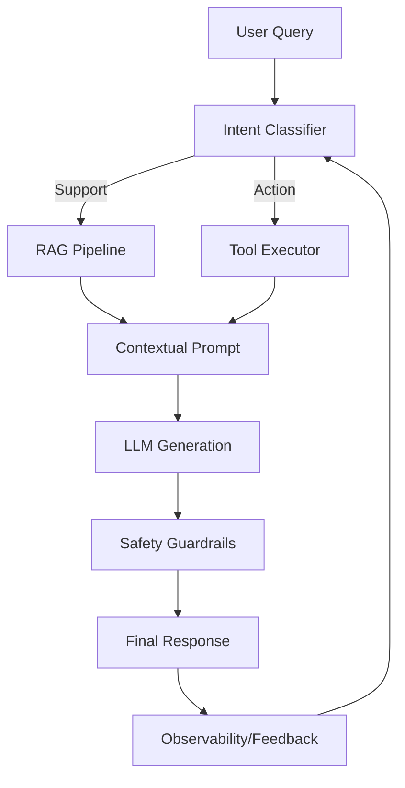

# AI System Design

This hub contains end-to-end architectural patterns for building robust, scalable, and safe AI applications.

---

## 🔹 Modern Core Architecture: Agentic RAG



---

# Q1: Design an AI-powered customer support chatbot.

## 1. 🔹 Direct Answer
Design a chatbot as a RAG+agent pipeline: classify intent, retrieve relevant policy/FAQ, generate a grounded response with safety/format guardrails, optionally call tools (refund status, order lookup), and log outcomes for evaluation and regression.

## 2. 🔹 Intuition
Support bots succeed when they answer from the right knowledge base and can take safe actions, not when they “guess” language fluently.

## 3. 🔹 Deep Dive
Key components:
- **Ingress**: message normalization, language detection, PII redaction.
- **Routing**: intent classifier (FAQ vs account vs escalation).
- **Retrieval** (RAG):
  - embedding retrieval over docs/policies
  - optional reranker
  - chunk boundaries aligned with policy sections
- **Generation**:
  - constrained structured output (e.g., `{"answer": "...", "action": "...", "citations":[...]}`)
  - citation-grounding: answer must be supported by retrieved evidence
- **Tool use (optional)**:
  - order lookup, refund eligibility checks
  - strict tool schemas + allowlist + least privilege
- **Safety guardrails**:
  - refuse disallowed content
  - prevent account-data exfiltration
- **Observability**:
  - log retrieved doc IDs, tool calls, refusal reasons, and user feedback

Minimal data flow:
`user_msg -> router -> retrieval -> (tool?) -> answer + citations -> safety -> output`

## 4. 🔹 Practical Perspective
- Use when: you have changing knowledge and want fast updates via doc ingestion.
- Trade-offs: RAG adds latency and retrieval failures; mitigate with reranking and abstention policies.

## 5. 🔹 Code Snippet
```python
intent = intent_classifier(user_text)
ctx, chunk_ids = retrieve_intent_docs(intent, user_text, top_k=8)
resp = llm.generate(
    prompt=f"Use only the provided policy excerpts.\n\n{ctx}\nAnswer:"
)
if not faithfulness_check(resp, ctx):
    resp = "I can't find that in our policy. Let me connect you to support."
log(request_id, chunk_ids=chunk_ids, intent=intent, output=resp)
```

## 6. 🔹 Interview Follow-ups
1. Q: When do you escalate to a human?
   A: Low retrieval confidence, unresolved user goal, or policy uncertainty; route with the transcript and evidence.
2. Q: How do you handle “I hate the answer” feedback?
   A: Add feedback items to eval sets and re-run prompt/policy/retrieval experiments with EDD.
3. Q: How do you reduce hallucinations?
   A: Require citations for factual claims and abstain when evidence doesn’t entail the answer.

## 7. 🔹 Common Mistakes
- Using raw doc retrieval without reranking/quality filters.
- Letting the model answer without evidence for factual assertions.

## 8. 🔹 Comparison / Connections
- Connects to RAG evaluation (faithfulness/relevance) and prompt injection defenses.

## 9. 🔹 One-line Revision
Customer support design is intent routing + evidence-based RAG + safe tool actions + logged evals.

## 10. 🔹 Difficulty Tag
🟡 Medium

---

# Q2: Design a document Q&A system for enterprise use.

## 1. 🔹 Direct Answer
Build a secure RAG system with ACL-aware retrieval, hybrid search (vector + keyword), reranking, grounded answer generation, and evaluation/monitoring for factuality, relevance, and latency.

## 2. 🔹 Intuition
Enterprise Q&A works when you only retrieve what a user is allowed to see and you force answers to cite retrieved content.

## 3. 🔹 Deep Dive
Architecture:
- **Ingestion**: PDF/HTML parsing, chunking with metadata (doc type, section, ACL tags).
- **Indexing**:
  - embeddings index (vector DB)
  - keyword index (BM25) for exact-match queries
  - store chunk-level access control metadata
- **Query-time**:
  - classify query intent (factual vs procedural vs definition)
  - rewrite/expand queries if beneficial (optional HyDE/query transformation)
  - hybrid retrieval + ACL filtering
  - rerank top candidates with cross-encoder
  - context packaging: label chunks, keep top-k minimal
- **Answering**:
  - generation prompt: “answer only from excerpts; cite sources; abstain if missing”
  - structured output with citations
- **Evaluation**:
  - golden Q&A sets with expected supporting spans
  - faithfulness checks + context precision/recall

Security:
- retrieval ACL enforced in backend, not in prompt.
- redact sensitive fields in retrieved text if required.

## 4. 🔹 Practical Perspective
- Use when: knowledge changes frequently and you can’t fine-tune every update.
- Trade-offs: complex permissions and parsing; mitigate with ingestion QA and chunk metadata validation.

## 5. 🔹 Code Snippet
```python
chunks = hybrid_retrieve(query, vector_top_k=20, bm25_top_k=20, acl=user_acl)
chunks = rerank_cross_encoder(query, chunks)[:5]
answer = llm.generate(prompt=f"Context:\n{format_chunks(chunks)}\nQuestion:{query}\nCite sources.")
assert output_is_grounded(answer, chunks)
```

## 6. 🔹 Interview Follow-ups
1. Q: What if documents conflict?
   A: Detect multiple supporting excerpts with different dates/versions; summarize differences and cite each.
2. Q: How do you keep access control correct?
   A: Store ACL at chunk level and enforce in retrieval query; add audit tests.
3. Q: How do you reduce hallucinations?
   A: Restrict generation to retrieved snippets and use abstention when entailment fails.

## 7. 🔹 Common Mistakes
- Chunking that loses section semantics (splits headings/tables from meaning).

## 8. 🔹 Comparison / Connections
- Connects to chunking strategies and end-to-end RAG evaluation.

## 9. 🔹 One-line Revision
Enterprise Q&A is ACL-aware ingestion + hybrid retrieval + reranked grounded generation + evals.

## 10. 🔹 Difficulty Tag
🟡 Medium

---

# Q3: Design a code generation and review system.

## 1. 🔹 Direct Answer
Design an IDE/PR assistant: generate code proposals using retrieval from codebase/docs, run static analysis/tests, and use an LLM “review agent” to suggest fixes with citations to relevant files and lint/test failures.

## 2. 🔹 Intuition
Strong code assistants generate, but quality comes from verification: tests, linters, and grounded context.

## 3. 🔹 Deep Dive
Pipeline:
- **Context builder**:
  - gather relevant files (retrieval over repo)
  - include API signatures, style guides, and recent change diffs
- **Candidate generation**:
  - produce patch/diff in a constrained format
- **Verification**:
  - run unit tests, type checks, linters, security scanners
  - collect failing logs as evidence
- **LLM review/repair**:
  - review agent uses:
    - repo snippets + failing logs
    - coding standards
  - outputs: summary + patch + risk assessment
- **Guardrails**:
  - block destructive operations
  - require human approval for risky changes
- **Observability**:
  - store prompt versions, retrieved files, and test outcomes

## 4. 🔹 Practical Perspective
- Use when: you can run automated tests and static checks.
- Trade-offs: verification cost; mitigate by incremental testing and caching build artifacts.

## 5. 🔹 Code Snippet
```python
patch = llm.generate("Propose a diff. Follow repo conventions.")
apply_patch(patch)
results = run_ci_tests()
if results.failed:
    patch2 = llm.generate(f"Fix based on failures:\n{results.log}")
    apply_patch(patch2)
```

## 6. 🔹 Interview Follow-ups
1. Q: How do you keep the assistant consistent with style?
   A: Provide formatter rules and examples, and validate with linters in the loop.
2. Q: What about security?
   A: Add SAST/secret scanning and refuse/repair for vulnerable patterns.
3. Q: How do you manage repo size?
   A: Use retrieval for relevant snippets and limit context by change scope.

## 7. 🔹 Common Mistakes
- Letting the model edit without running tests/linters.

## 8. 🔹 Comparison / Connections
- Connects to ReAct/tool use, evaluation-driven development, and output parsers.

## 9. 🔹 One-line Revision
Code assistants are generate→verify→repair loops with grounded repo context and CI evidence.

## 10. 🔹 Difficulty Tag
🟣 Hard

---

# Q4: Design a content moderation system using AI.

## 1. 🔹 Direct Answer
Design a multi-stage moderation pipeline: classify text/image/video for policy categories, apply thresholds with localization, sanitize/refuse outputs, and log outcomes for continuous red-teaming and calibration.

## 2. 🔹 Intuition
Moderation needs risk-aware decisions, not a single “unsafe/ok” classifier.

## 3. 🔹 Deep Dive
Pipeline:
- **Input**: user content and (for generative systems) model drafts.
- **Pre-filters**: detect PII/URLs, decode/normalize text, extract OCR for images.
- **Policy classifiers**:
  - violence/hate/sexual content
  - self-harm, harassment, extremist content
  - contextual categories per market/language
- **Decision rules**:
  - thresholding per category and risk level
  - escalation for borderline cases to human review
- **Output handling**:
  - refuse or transform content
  - prevent indirect injections (moderate retrieved snippets if used in generation)
- **Evaluation**:
  - human-labeled sets per region
  - measure false positives/negatives and appeal outcomes

## 4. 🔹 Practical Perspective
- Use when: user-generated content or public moderation is required.
- Trade-offs: cultural ambiguity increases false positives; mitigate with localization and review sampling.

## 5. 🔹 Code Snippet
```python
label, score = safety_classifier(text_or_extracted)
if label in disallowed and score > threshold:
    return {"action":"refuse","reason":"policy_violation"}
elif is_borderline(score):
    return {"action":"human_review"}
else:
    return {"action":"allow"}
```

## 6. 🔹 Interview Follow-ups
1. Q: How do you handle appeals?
   A: Capture review decisions, update calibration thresholds, and add new failure cases.
2. Q: Why multi-stage?
   A: Some categories need OCR/video segmentation or second-pass disambiguation.
3. Q: How do you avoid being bypassed?
   A: Test with obfuscations and indirect injections; validate extracted content too.

## 7. 🔹 Common Mistakes
- Only filtering user input, not generated output or retrieved content.

## 8. 🔹 Comparison / Connections
- Connects to responsible AI, red teaming, and guardrail evaluation.

## 9. 🔹 One-line Revision
Moderation is a risk-aware classifier+policy pipeline with threshold calibration and continuous audit/red-team loops.

## 10. 🔹 Difficulty Tag
🟣 Hard

---

# Q5: Design a real-time AI recommendation system.

## 1. 🔹 Direct Answer
Use a candidate generation + ranking architecture: retrieve candidates from fast indexes (CF/ANN), compute user/context features, rank with a model (possibly LLM-assisted embeddings), and update with streaming signals under strict latency budgets.

## 2. 🔹 Intuition
Recommendation is “find options fast” then “rank precisely,” not brute-force ranking all items.

## 3. 🔹 Deep Dive
Components:
- **Feature store**: user profile, context, recency signals.
- **Candidate generation**:
  - ANN over item embeddings
  - retrieval from collaborative filtering/graph neighbors
  - rule-based constraints (availability, eligibility)
- **Ranking model**:
  - supervised learning to optimize CTR/engagement proxies
  - calibration and diversity (avoid filter bubbles)
- **Real-time updates**:
  - stream events into online store
  - periodic retraining/offline evaluation
- **LLM integration (optional)**:
  - generate semantic tags/embeddings
  - summarize user preferences into stable features (with eval/guardrails)
- **Serving & latency**:
  - precompute item embeddings
  - caching user embeddings and feature computations

## 4. 🔹 Practical Perspective
- Use when: you need low-latency personalization (ads, e-commerce, feeds).
- Trade-offs: staleness vs freshness; streaming adds complexity.

## 5. 🔹 Code Snippet
```python
candidates = ann_index.search(user_embedding, top_k=200)
ranked = ranker.score(user_features, candidates)[:20]
return ranked
```

## 6. 🔹 Interview Follow-ups
1. Q: How do you ensure diversity?
   A: Apply re-ranking constraints and diversity penalties at ranking time.
2. Q: What about cold start?
   A: Use content-based embeddings and exploration policies until enough events accumulate.
3. Q: How do you handle feedback loops?
   A: Monitor bias drift and use exploration/counterfactual evaluation.

## 7. 🔹 Common Mistakes
- Ranking everything from scratch on each request.

## 8. 🔹 Comparison / Connections
- Connects to vector database indexing and evaluation-driven development for offline/online metrics.

## 9. 🔹 One-line Revision
Real-time recommendation is candidate retrieval (fast) + ranking (accurate) with streaming updates and latency budgets.

## 10. 🔹 Difficulty Tag
🟣 Hard

---

# Q6: Design a multi-modal search system (text, image, video).

## 1. 🔹 Direct Answer
Implement a unified embedding retrieval system: encode each modality into a shared vector space (or aligned spaces), run ANN search with metadata filters, optionally rerank with cross-modal models, and return grounded results with excerpts/captions.

## 2. 🔹 Intuition
Multi-modal search is “search by meaning,” not by matching raw tokens.

## 3. 🔹 Deep Dive
Steps:
- **Ingestion**: extract text (OCR/transcripts), frame sampling for video, captions/tags.
- **Embedding models**:
  - image encoder + text encoder trained for alignment (CLIP-like)
  - video encoder (sample frames) and/or audio encoder (speech-to-text)
- **Indexing**:
  - store embeddings per item (image/video) and metadata for filtering
  - choose ANN index (HNSW/IVF) tuned for latency/recall
- **Query**:
  - encode query modality into embeddings
  - optional query expansion
  - ANN retrieval + metadata/ACL filtering
  - rerank with a cross-modal re-ranker if needed
- **Output**:
  - present results with provenance (thumbnail, timestamp, OCR/caption)

## 4. 🔹 Practical Perspective
- Use: enterprise media libraries, e-commerce visual search.
- Trade-offs: OCR/transcript quality affects recall; mitigate with multimodal encoders and reranking.

## 5. 🔹 Code Snippet
```python
q_emb = text_encoder(query_text) if query_type=="text" else image_encoder(query_image)
hits = ann_index.search(q_emb, top_k=50, filters=metadata_filters)
reranked = reranker.cross_encode(query, hits)[:10]
return reranked
```

## 6. 🔹 Interview Follow-ups
1. Q: How do you handle mixed-modality queries?
   A: Combine embeddings (weighted fusion) or treat as separate constraints in reranking.
2. Q: How do you evaluate?
   A: Use labeled retrieval sets (mAP/Recall@k) per modality and cross-modal intent tests.
3. Q: How do you handle long video?
   A: Index segments (timestamps) rather than entire videos; retrieve then refine.

## 7. 🔹 Common Mistakes
- Relying on OCR only for images; misses semantic matches.

## 8. 🔹 Comparison / Connections
- Connects to vector databases, ANN indexing, and multimodal alignment (CLIP/VLMs).

## 9. 🔹 One-line Revision
Multi-modal search is aligned embeddings + ANN retrieval + optional cross-modal reranking with metadata provenance.

## 10. 🔹 Difficulty Tag
🟣 Hard

---

# Q7: Design an AI-powered email assistant.

## 1. 🔹 Direct Answer
Design an email assistant with three modes: triage (summaries, categorization), draft generation (grounded in context), and action routing (calendar/order/status) with strict permissions and PII/privacy controls.

## 2. 🔹 Intuition
Email assistants succeed by reducing user effort while never touching sensitive actions without authorization.

## 3. 🔹 Deep Dive
System pieces:
- **Integration**: Gmail/Exchange connectors with scopes.
- **Processing**:
  - detect language, summarize long threads
  - classify intent (reply needed, FYI, escalation, scheduling)
- **Retrieval**:
  - pull relevant context: prior emails, CRM notes, policy templates
- **Drafting**:
  - generate reply in user's tone with structured suggestions (subject + body + confidence)
  - optionally propose action steps (schedule, follow-up, request missing info)
- **Safety & privacy**:
  - PII redaction in logs
  - prevent writing unsafe content
  - “human-in-the-loop” for sending emails or triggering actions
- **Observability**:
  - capture user edits/accept/reject to improve eval sets

## 4. 🔹 Practical Perspective
- Use: enterprise productivity and triage.
- Trade-offs: integration complexity + privacy; mitigate with least-privilege scopes and audit logs.

## 5. 🔹 Code Snippet
```python
thread = fetch_email_thread(thread_id)
summary = llm.generate("Summarize thread; extract open questions.", thread)
draft = llm.generate("Write a reply draft. Keep it concise and polite.", summary)
return {"summary": summary, "draft": draft, "human_approval_required": True}
```

## 6. 🔹 Interview Follow-ups
1. Q: How do you prevent leaking private info?
   A: Restrict tool permissions, redact logs, and avoid echoing hidden system/policy text.
2. Q: How do you handle disagreement in long threads?
   A: Summarize with citations/quoted excerpts from emails and ask clarifying questions when ambiguous.
3. Q: How do you measure quality?
   A: User acceptance rate, edit distance, resolution rate, and safety/policy violation rate.

## 7. 🔹 Common Mistakes
- Aut-sending without confirmation and without verifying context.

## 8. 🔹 Comparison / Connections
- Connects to memory systems and responsible AI/PII handling.

## 9. 🔹 One-line Revision
Email assistants combine thread understanding, grounded drafting, and least-privilege action routing with human approval.

## 10. 🔹 Difficulty Tag
🟡 Medium

---

# Q8: Design a medical diagnosis assistant using AI.

## 1. 🔹 Direct Answer
Design it as a **medical triage and education** assistant with strict safety policies: symptom intake, differential suggestions framed as possibilities, red-flag detection, and urgent escalation; never provide definitive diagnoses or prescriptions.

## 2. 🔹 Intuition
In medicine, “helpful guessing” can cause real harm—so you constrain outputs and ensure escalation.

## 3. 🔹 Deep Dive
Safety-first design:
- **Policy constraints**:
  - allowed: education, general risk factors, questions to ask a clinician
  - disallowed: definitive diagnosis, dosage recommendations
- **Risk classifier**:
  - detect emergencies and prompt immediate contact/ER guidance
- **Retrieval grounding**:
  - use trusted medical sources for educational explanations
- **Interaction flow**:
  - ask clarifying questions before suggesting possibilities
  - present uncertainty and red-flag warnings
- **Compliance & logging**:
  - PII handling, audit trails, region-specific disclaimers
- **Evaluation**:
  - adversarial “diagnose me” tests, emergency scenario tests, and refusal correctness

## 4. 🔹 Practical Perspective
- Use: patient support, clinician prep, FAQ.
- Trade-offs: increased refusal/escalation; mitigate by giving high-quality education and triage guidance.

## 5. 🔹 Code Snippet
```python
if risk_classifier(symptoms).emergency_prob > 0.7:
    return crisis_escalation_instructions()
context = retrieve_medical_sources(symptoms)
return llm.generate("Provide possibilities + questions to discuss; no definitive diagnosis.", context)
```

## 6. 🔹 Interview Follow-ups
1. Q: What if the user requests a prescription?
   A: Refuse and provide “talk to a clinician” plus safety guidance.
2. Q: How do you prevent hallucinated medical claims?
   A: Require citations and abstain when evidence doesn’t support claims.
3. Q: How do you localize medical advice?
   A: Use region-appropriate guidance sources and templates.

## 7. 🔹 Common Mistakes
- Treating triage like generic QA; ignoring emergency escalation requirements.

## 8. 🔹 Comparison / Connections
- Connects to safety guardrails, hallucination mitigation, and responsible AI.

## 9. 🔹 One-line Revision
Medical diagnosis assistants must be triage/education systems with strict refusal, red-flag detection, and evidence grounding.

## 10. 🔹 Difficulty Tag
🟣 Hard

---

# Q9: Design a fraud detection system powered by LLMs.

## 1. 🔹 Direct Answer
Use LLMs as **explainable reasoning/risk scoring assistants** on top of a traditional fraud backbone: structured features + model scores, then LLM generates human-understandable explanations using evidence, without replacing primary fraud decisioning.

## 2. 🔹 Intuition
Fraud is latency-sensitive and high-stakes; the LLM should assist with investigation and explainability, not solely decide.

## 3. 🔹 Deep Dive
Architecture:
- **Real-time features**: transaction attributes, account history, device signals.
- **Primary detector**: fast rules or ML model outputs risk score.
- **LLM evidence summarizer**:
  - retrieve relevant events (similar fraud cases, account notes)
  - generate: explanation, suspected patterns, recommended investigation steps
- **Guardrails**:
  - require evidence snippets for each claim
  - prevent hallucinated accusations
- **Human workflow**:
  - queue high-risk events for analyst review
- **Evaluation**:
  - measure precision/recall of primary model
  - evaluate explanation faithfulness and analyst time saved

## 4. 🔹 Practical Perspective
- Use: operations support for investigators.
- Trade-offs: LLM adds latency—use it only for higher-risk cases or asynchronous review.

## 5. 🔹 Code Snippet
```python
risk = primary_fraud_model(txn_features)
if risk > 0.9:
    evidence = retrieve_similar_cases(txn)
    explanation = llm.generate("Explain risk using evidence only.", evidence)
    return {"risk": risk, "explanation": explanation}
return {"risk": risk}
```

## 6. 🔹 Interview Follow-ups
1. Q: Should LLM decide approve/decline?
   A: Prefer LLM as a justification layer; keep deterministic policy/control in the fraud system.
2. Q: How do you avoid biased explanations?
   A: Evaluate faithfulness and include calibration checks with analyst feedback.
3. Q: How do you handle new fraud patterns?
   A: Update evidence retrieval and retrain the primary detector; add red-team cases.

## 7. 🔹 Common Mistakes
- Using LLM alone for real-time decisions without structured evidence.

## 8. 🔹 Comparison / Connections
- Connects to grounded explanations and evaluation-driven development.

## 9. 🔹 One-line Revision
LLMs should provide evidence-grounded explanations on top of fast fraud scoring pipelines.

## 10. 🔹 Difficulty Tag
🟣 Hard

---

# Q10: Design an AI-powered data extraction pipeline from unstructured documents.

## 1. 🔹 Direct Answer
Design extraction as: parse documents -> segment into pages/sections -> extract fields with LLM using structured prompts -> validate against schema -> post-process/normalize -> store with provenance and confidence.

## 2. 🔹 Intuition
Reliable extraction is not just “read and summarize”; it’s schema-validated extraction with provenance and error handling.

## 3. 🔹 Deep Dive
Pipeline:
- **Ingestion**: PDF/HTML parsing, OCR when needed, table extraction.
- **Chunking**: page/section-aware chunking; keep field-relevant context together.
- **Extraction prompt**:
  - specify schema (types, required fields)
  - request citations/spans for each extracted field
- **Structured decoding**:
  - output JSON only; validate schema types and value ranges
- **Validation & repair**:
  - if parse fails or confidence low, retry with targeted “repair” prompt
  - optionally run specialized extractors (regex for IDs, NER for entities)
- **Provenance**:
  - store source doc/page/span IDs and extracted confidence
- **Evaluation**:
  - golden docs per template type; measure field accuracy and abstention rate

## 4. 🔹 Practical Perspective
- Use: invoices, contracts, forms, medical documents.
- Trade-offs: different templates require routing and template-specific extraction prompts.

## 5. 🔹 Code Snippet
```python
fields = llm.generate(prompt=f"Extract fields as JSON: {schema}\nText:\n{chunk}")
obj = json.loads(fields)
validate_schema(obj)
for f in schema.fields:
    assert evidence_contains(obj[f], chunk)  # provenance check
```

## 6. 🔹 Interview Follow-ups
1. Q: How do you handle multiple templates?
   A: Template classifier + template-specific schemas/prompts and chunking rules.
2. Q: When to use classical OCR/regex?
   A: For stable structured tokens (invoice numbers, dates) to improve precision.
3. Q: How do you reduce extraction errors?
   A: Enforce schema validation and evidence/provenance checks per field.

## 7. 🔹 Common Mistakes
- Summarizing documents instead of doing strict field extraction.

## 8. 🔹 Comparison / Connections
- Connects to output parsers, structured prompts, and evaluation-driven development.

## 9. 🔹 One-line Revision
Extraction pipelines are parse→chunk→schema-validated JSON extraction with provenance and repair loops.

## 10. 🔹 Difficulty Tag
🟣 Hard

---

# Q11: Design a personalized learning assistant.

## 1. 🔹 Direct Answer
Personalize learning by combining: curriculum modeling, learner-state tracking, retrieval of course materials, adaptive question generation, and feedback loops with strict content safety and learning efficacy evaluation.

## 2. 🔹 Intuition
Personalization means adapting to what the learner knows and needs next, not just generating more text.

## 3. 🔹 Deep Dive
Components:
- **Learner state**:
  - mastery levels, recent performance, misconceptions
- **Content store**:
  - lesson segments, examples, practice questions
- **Retrieval**:
  - fetch relevant materials and supporting explanations
- **Tutor policies**:
  - pick difficulty, pacing, and feedback style
  - encourage attempts and correct reasoning steps
- **Assessment loop**:
  - generate quiz questions; evaluate answers; update learner state
- **Safety**:
  - content moderation and safe pedagogy
- **Evaluation**:
  - measure learning gains, retention, and engagement; avoid optimizing only for “helpfulness text”

## 4. 🔹 Practical Perspective
- Use: education platforms, skill coaching.
- Trade-offs: learner-state quality impacts personalization; mitigate with calibrated assessments and telemetry.

## 5. 🔹 Code Snippet
```python
state = load_learner_state(user_id)
next_lesson = select_next(state, curriculum_graph)
context = retrieve_material(next_lesson, user_level=state.level)
question = llm.generate("Generate a practice question.", context)
grading = grade_answer(question, user_answer, rubric)
state.update(mastery=grading.mastery_delta)
```

## 6. 🔹 Interview Follow-ups
1. Q: How do you prevent “false confidence” explanations?
   A: Use rubric-based grading and evidence grounding for factual claims.
2. Q: How do you handle adversarial learners?
   A: Add abuse tests; enforce policy for cheating and disallowed content.
3. Q: How do you measure learning outcomes?
   A: Pre/post tests or longitudinal mastery improvement—not only chat satisfaction.

## 7. 🔹 Common Mistakes
- Personalization via vibe/heuristics without a measurable learner state.

## 8. 🔹 Comparison / Connections
- Connects to evaluation frameworks and memory systems.

## 9. 🔹 One-line Revision
Personalized learning assistants adapt content and assessment using learner state, retrieval, grading rubrics, and continuous evals.

## 10. 🔹 Difficulty Tag
🟡 Medium

---

# Q12: Design an AI system for automated code migration.

## 1. 🔹 Direct Answer
Design migration as: analyze codebase -> identify required changes -> generate patch candidates -> run tests/static checks -> iteratively repair -> produce PRs with traceable evidence and rollback.

## 2. 🔹 Intuition
Automated migrations are refactors: correctness comes from verification, not just syntax rewriting.

## 3. 🔹 Deep Dive
Pipeline:
- **Code analysis**: AST parsing, dependency graph, detect patterns needing migration.
- **Migration plan**:
  - determine API changes, deprecations, codemods
  - map old→new behavior and required configuration changes
- **Patch generation**:
  - limited-scope patches per file/module
- **Verification**:
  - run unit/integration tests
  - run linters/typecheck; for large repos run targeted tests first
- **Repair loop**:
  - feed failure logs back to LLM repair prompts
  - stop when coverage and tests pass or budget exceeded
- **PR output**:
  - summarize changes, list migration rules used
  - include rollback instructions
- **Safety**:
  - avoid destructive transformations; require human review for high-impact changes

## 4. 🔹 Practical Perspective
- Use: major library upgrades, framework migrations, codemod automation.
- Trade-offs: test flakiness and long CI; mitigate with staged verification and caching.

## 5. 🔹 Code Snippet
```python
plan = llm.generate("Create a migration plan. Output steps.")
patches = llm.generate("Generate codemods as diffs:", context=repo_snippets)
for p in patches:
    apply_patch(p)
    if not run_targeted_tests():
        p_fix = llm.generate(f"Fix based on failures:\n{log}")
        apply_patch(p_fix)
```

## 6. 🔹 Interview Follow-ups
1. Q: How do you control scope?
   A: Use AST-based detection for impacted files and limit patches to those.
2. Q: How do you keep migrations consistent?
   A: Enforce shared migration rules and use templates for diff formatting.
3. Q: How do you ensure reproducibility?
   A: Version migration prompts, migration rules, and test commands.

## 7. 🔹 Common Mistakes
- Doing one-shot migration without verification loops.

## 8. 🔹 Comparison / Connections
- Connects to code assistants with CI evidence and output parsers for diffs.

## 9. 🔹 One-line Revision
Code migration needs plan→diff generation→CI verification→repair loops with traceable evidence.

## 10. 🔹 Difficulty Tag
🟣 Hard

---

# Q13: Design an AI-powered legal document review system.

## 1. 🔹 Direct Answer
Design a legal review system as ACL-aware document processing + grounded extraction + rubric-based analysis + human-in-the-loop for high-risk findings, with strong audit trails and citation to document spans.

## 2. 🔹 Intuition
Legal review must be traceable: every claim needs support from the exact clause in the source document.

## 3. 🔹 Deep Dive
System design:
- **Ingestion**: OCR/PDF parsing, preserve page/paragraph boundaries, generate clause-level segments.
- **ACL/security**: per-user or per-case permissions enforced in retrieval.
- **Extraction**:
  - ask for structured outputs (e.g., risk type, parties, obligations, deadlines)
  - require evidence spans (page/line) for each extracted field
- **Analysis layer**:
  - rubric prompts (e.g., “materiality,” “jurisdiction,” “termination rights”)
  - compare clauses across versions with diff + citations
- **Decision policies**:
  - “suggestive” mode for low confidence; escalate to lawyers for high confidence risk.
- **Guardrails**:
  - refusal for legal advice beyond allowed scope (jurisdiction dependent)
  - prevent training data leakage and prompt injection through retrieved clauses
- **Evaluation & audit**:
  - golden legal questions with expected extracted fields and risk labels
  - log versions of prompts/models and retrieved evidence for reproducibility

## 4. 🔹 Practical Perspective
- Use: contract review, policy compliance checks, clause extraction.
- Trade-offs: ingestion quality and clause segmentation are critical; handle OCR errors early.

## 5. 🔹 Code Snippet
```python
chunks = retrieve_clauses(query, acl=user_acl, top_k=12)
out = llm.generate(
  prompt=f"Extract risks with citations (page/paragraph). Context:\n{format(chunks)}"
)
obj = parse_and_validate(out, schema=risk_schema)
assert citations_match(obj, chunks)
```

##  6. 🔹 Interview Follow-ups
1. Q: How do you compare versions?
   A: Use clause-level diffs; retrieve both versions and ask the model to cite changes.
2. Q: How do you handle ambiguous clauses?
   A: Require clarification; mark as “needs legal review” with evidence references.
3. Q: What’s your success metric?
   A: Extraction F1 + correct risk label rate + lawyer acceptance rate.

## 7. 🔹 Common Mistakes
- Generating ungrounded legal interpretations without clause citations.

## 8. 🔹 Comparison / Connections
- Connects to RAG grounding, structured outputs, and audit trails.

## 9. 🔹 One-line Revision
Legal doc review is clause-level ingestion + evidence-cited extraction + rubric analysis + human review with audits.

## 10. 🔹 Difficulty Tag
🟣 Hard

---

# Q14: Design a conversational AI system with memory across sessions.

## 1. 🔹 Direct Answer
Design memory using a hybrid of short-term context, long-term user profiles (structured facts), and retrieval-based memory (episodic summaries) with privacy controls and explicit memory governance.

## 2. 🔹 Intuition
Memory is selective: store stable preferences and retrieve relevant past facts instead of replaying the entire chat.

## 3. 🔹 Deep Dive
Memory layers:
- **Working memory**: last N turns + conversation summary.
- **Long-term memory (semantic)**:
  - user preferences, stable preferences, entities
  - stored as structured key-values with timestamps
- **Episodic memory (retrieval)**:
  - store past “events” as summaries + embeddings
  - retrieve relevant memories for new sessions
- **Memory writing policy**:
  - only write when confident (“preference confirmed”)
  - ask for confirmation when uncertain
- **Privacy and safety**:
  - allow user controls for memory deletion/export
  - prevent storing sensitive data unnecessarily
- **Conflict resolution**:
  - choose latest timestamp or run a “which is current” check
Example flow:
`new_session -> load profile -> retrieve relevant episodes -> generate with memory -> decide what to update`

## 4. 🔹 Practical Perspective
- Use: personalization over time (assistants, coaching).
- Trade-offs: memory conflicts and privacy risk; mitigate with versioned memory and user controls.

## 5. 🔹 Code Snippet
```python
profile = load_user_profile(user_id)
episodic = retrieve_episodic_memories(query, user_id, top_k=5)
messages = build_prompt(profile, episodic, current_conversation)
resp = llm.generate(messages)
if memory_update_allowed(resp):
    write_memory_fields(extract_memory_updates(resp), user_id)
```

## 6. 🔹 Interview Follow-ups
1. Q: How do you prevent “memory hallucinations”?
   A: Only write memories from structured confirmations and evidence; log confidence and require validation.
2. Q: How do you handle contradictions?
   A: Store both with timestamps and add a “resolve latest/current” step.
3. Q: How do you evaluate memory quality?
   A: User satisfaction + factuality of stored preferences + reduced repeated questions.

## 7. 🔹 Common Mistakes
- Storing all chat history as-is without summarization or governance.

## 8. 🔹 Comparison / Connections
- Connects to memory systems and RAG-based episodic recall.

## 9. 🔹 One-line Revision
Cross-session memory is structured profiles + retrieved episodic summaries with privacy, conflict resolution, and evidence-based updates.

## 10. 🔹 Difficulty Tag
🟣 Hard

---

# Q15: How do you design for latency vs quality trade-offs in AI systems?

## 1. 🔹 Direct Answer
Tune quality/latency by controlling (1) retrieval depth, (2) number of LLM calls, (3) decoding settings/response length, (4) reranking usage, and (5) fallback strategies with cheap models for early stages.

## 2. 🔹 Intuition
Latency is a product of how many tokens/calls you generate and how much you retrieve; quality depends on how much evidence you include and how you verify it.

## 3. 🔹 Deep Dive
Controls:
- **Stage budgets**: allocate time budget to retrieval, reranking, generation, and verification.
- **Adaptive computation**:
  - if retrieval confidence high: one-shot answer
  - if low: rerank or call a verifier
- **Model cascade**:
  - cheap model for routing/extraction
  - expensive model for final answers only when needed
- **Context trimming**:
  - reduce top-k
  - summarize evidence
- **Output limits**:
  - cap max tokens and require concise formats
- **Stop conditions**:
  - stop early when confidence threshold is met

Measurement:
- TTFT, p95 latency, token counts, failure rates by stage.

## 4. 🔹 Practical Perspective
- Use: interactive systems where p95 latency matters.
- Trade-offs: aggressive shortcuts increase hallucination and format failures; mitigate with verification on low-confidence cases.

## 5. 🔹 Code Snippet
```python
if retrieval_confidence >= 0.8:
    ans = llm_fast.generate(context)
else:
    reranked = rerank(context)
    ans = llm_slow.generate(reranked)
return ans
```

## 6. 🔹 Interview Follow-ups
1. Q: How do you pick the confidence threshold?
   A: Choose via eval calibration and optimize for quality under latency SLOs.
2. Q: What’s the first latency bottleneck?
   A: Often model generation length + retrieval time; measure with tracing.

## 7. 🔹 Common Mistakes
- Optimizing average latency while ignoring tail latency (p99).

## 8. 🔹 Comparison / Connections
- Connects to caching, rate limiting, and evaluation-driven iteration.

## 9. 🔹 One-line Revision
Latency-quality trade-offs come from adaptive retrieval, model cascades, constrained generation, and stage budget enforcement.

## 10. 🔹 Difficulty Tag
🟡 Medium

---

# Q16: How do you implement caching strategies for LLM applications?

## 1. 🔹 Direct Answer
Implement caching at multiple layers: embedding caching, retrieval result caching, prompt→response caching (semantic cache), and tool-result caching—keyed by normalized inputs and versioned policies.

## 2. 🔹 Intuition
Caching saves money/time when many requests repeat similar prompts or semantic intents.

## 3. 🔹 Deep Dive
Cache types:
- **Embedding cache**: store vectors for repeated texts/queries.
- **Retrieval cache**: store retrieved chunk IDs per query template + top-k settings.
- **LLM semantic cache**:
  - compute query embedding
  - if similar to a previous request within threshold, reuse cached response or a template fill
- **Tool cache**: cache deterministic tool results (e.g., “get order status”) with TTL.

Correctness:
- Version prompts/models/policies in cache keys (avoid stale behavior).
- Use TTL + invalidation when underlying docs change.
- Ensure caching respects per-user ACLs.

## 4. 🔹 Practical Perspective
- Use: production systems with repeated questions (FAQ, search).
- Trade-offs: semantic caching can propagate stale errors; always validate on low confidence hits.

## 5. 🔹 Code Snippet
```python
key = cache_key(user_acl, prompt_version, model_version, normalized_query)
if cache.exists(key):
    return cache.get(key)
resp = llm.generate(prompt)
cache.set(key, resp, ttl=3600)
return resp
```

## 6. 🔹 Interview Follow-ups
1. Q: Should you cache tool outputs?
   A: Yes if deterministic and policy-safe; use TTL and permission-aware keys.
2. Q: How do you handle document updates?
   A: Include document index snapshot/version in cache keys; invalidate on reindex.

## 7. 🔹 Common Mistakes
- Reusing cached answers across different permission contexts.

## 8. 🔹 Comparison / Connections
- Connects to rate limiting/cost management and evaluation for regressions due to caching.

## 9. 🔹 One-line Revision
LLM caching is multi-layer and versioned: embeddings, retrieval, semantic reuse, and tool-result caches with ACL-safe keys.

## 10. 🔹 Difficulty Tag
🟡 Medium

---

# Q17: How do you design rate limiting and cost management for AI APIs?

## 1. 🔹 Direct Answer
Design cost control with request budgets, concurrency limits, token caps, per-tenant quotas, adaptive sampling, and admission control. Enforce these at the API gateway and monitor spending.

## 2. 🔹 Intuition
LLM cost is proportional to tokens and number of calls; you limit both per tenant/request and degrade gracefully under load.

## 3. 🔹 Deep Dive
Gateway design:
- **Identity & tenancy**: per-user/team quotas.
- **Token budgeting**:
  - cap input/output tokens
  - use stop sequences and max generation length
- **Concurrency limits**: limit simultaneous long generations per model.
- **Admission control**:
  - queue short requests
  - reject or use fallback for heavy requests under load
- **Adaptive policies**:
  - if near quota, use smaller model/cached retrieval
- **Streaming**:
  - reduce TTFT and allow early termination (stop when user navigates away)
- **Monitoring**:
  - per-route cost breakdown
  - alerts when burn rate exceeds threshold

## 4. 🔹 Practical Perspective
- Use: any system with usage-based billing.
- Trade-offs: aggressive throttling degrades UX; mitigate by using cascaded models and clear “try again later” messaging.

## 5. 🔹 Code Snippet
```python
if tenant.tokens_today + estimate_tokens(prompt) > tenant.daily_budget:
    return fallback_response("Usage limit reached. Try a shorter query.")
acquire_concurrency_slot(model="gpt-large")
resp = llm.generate(prompt, max_tokens=tenant.max_output_tokens)
release_concurrency_slot()
```

## 6. 🔹 Interview Follow-ups
1. Q: How do you estimate tokens?
   A: Use prompt tokenizer estimates and typical output-length distributions from logs.
2. Q: How do you avoid retries exploding cost?
   A: Apply exponential backoff with max retry count; count retries against budget.

## 7. 🔹 Common Mistakes
- Rate limiting only by requests/sec while ignoring tokens.

## 8. 🔹 Comparison / Connections
- Connects to caching and graceful degradation design.

## 9. 🔹 One-line Revision
Cost management is token-aware admission control with quotas, concurrency limits, cascades, and monitoring.

## 10. 🔹 Difficulty Tag
🟡 Medium

---

# Q18: How do you handle failover and fallback strategies for AI systems?

## 1. 🔹 Direct Answer
Handle failover by designing redundancy (multiple model endpoints/regions), defining fallback policies (smaller model, cached answers, or “ask clarifying questions”), and ensuring stateful retries with strict budgets and observability.

## 2. 🔹 Intuition
When the model or dependencies fail, you must return something safe and bounded—not hang requests.

## 3. 🔹 Deep Dive
Failover layers:
- **Model provider failover**: multiple endpoints/regions; switch on timeouts/errors.
- **Pipeline component fallback**:
  - if retrieval fails: answer with “insufficient evidence” or switch to FAQ cache
  - if reranker fails: use simpler ranking
- **Model cascade**:
  - expensive model -> fallback to smaller model -> fallback to rule-based/templated response
- **Retries**:
  - retry only idempotent calls
  - cap retries and count them toward token budgets
- **User messaging**:
  - transparent but not alarming; e.g., “I’m having trouble right now—here’s what I can do.”
- **Tracing**:
  - record which fallback path was used to evaluate impact

## 4. 🔹 Practical Perspective
- Use: production assistants and any latency SLO.
- Trade-offs: fallbacks can lower quality; mitigate with evaluation and staged rollouts.

## 5. 🔹 Code Snippet
```python
try:
    return llm_primary.generate(prompt, timeout_ms=800)
except TimeoutError:
    return llm_fallback.generate(prompt, max_tokens=200)
except Exception:
    return cached_faq_answer(prompt) or "I can't answer right now."
```

## 6. 🔹 Interview Follow-ups
1. Q: What should the fallback guarantee?
   A: Safety and bounded response time; avoid exposing hidden data.
2. Q: Do you fall back to “no answer” always?
   A: Not always; templates and cached grounded answers can be better than refusal for simple cases.

## 7. 🔹 Common Mistakes
- Retrying indefinitely without budgets.

## 8. 🔹 Comparison / Connections
- Connects to high availability/fault tolerance and cost/rate limiting.

## 9. 🔹 One-line Revision
Failover uses redundancy plus bounded fallbacks (cascade/cache/templates) with tracing and budgeted retries.

## 10. 🔹 Difficulty Tag
🟣 Hard

---

# Q19: How do you design an AI system for high availability and fault tolerance?

## 1. 🔹 Direct Answer
Design for high availability with redundant stateless services, multi-AZ/multi-region deployment, health checks, circuit breakers, idempotent request handling, and graceful degradation paths for each dependency (LLM, retrieval, vector DB, tools).

## 2. 🔹 Intuition
Fault tolerance is “assume some components fail” and still serve correct/safe behavior within SLOs.

## 3. 🔹 Deep Dive
Core practices:
- **Stateless services**: scale horizontally; store session state externally.
- **Health checks + routing**: load balancer routes away from unhealthy instances.
- **Circuit breakers**: stop calling failing dependencies and switch to fallback.
- **Retry strategy**:
  - only for transient errors
  - exponential backoff + jitter
  - max retries and timeouts per call
- **Idempotency**:
  - ensure that repeated calls don’t double-charge or duplicate actions
- **Dependency redundancy**:
  - multiple LLM endpoints
  - replicated retrieval/vector services
- **Observability**:
  - tracing spans per stage
  - error budgets and SLO dashboards

## 4. 🔹 Practical Perspective
- Use: customer-facing, always-on AI systems.
- Trade-offs: redundancy increases cost; justify via uptime and risk reduction.

## 5. 🔹 Code Snippet
```python
if circuit_breaker.is_open("llm_provider"):
    return fallback_cached_or_templates(prompt)
resp = llm_provider.generate(prompt, timeout_ms=600)
```

##  6. 🔹 Interview Follow-ups
1. Q: How do you ensure correctness under partial failures?
   A: Design fallbacks that preserve safety and correctness guarantees (e.g., abstain when evidence is unavailable).
2. Q: What is an error budget?
   A: A controlled allowance for failures; once used up, you disable risky features.

## 7. 🔹 Common Mistakes
- Assuming failures are rare; then no fallbacks exist.

## 8. 🔹 Comparison / Connections
- Connects to failover strategy, rate limiting, and EDD monitoring.

## 9. 🔹 One-line Revision
High availability is redundant services + circuit breakers + idempotent retries + per-dependency fallbacks with tracing.

## 10. 🔹 Difficulty Tag
🟣 Hard

---

# Q20: How do you design an AI system that gracefully degrades when the model is unavailable?

## 1. 🔹 Direct Answer
Graceful degradation uses fallbacks: cached grounded answers, simpler heuristics, rule-based templates, retrieval-only responses, or “collect more info” flows, while guaranteeing safety and bounded latency.

## 2. 🔹 Intuition
If you can’t reason with the LLM, you still need a useful and safe alternative.

## 3. 🔹 Deep Dive
Degradation tiers:
- **Tier 0 (best)**: full RAG + generation.
- **Tier 1**: retrieval-only (return relevant excerpts and ask the user to choose).
- **Tier 2**: smaller/local model or distilled model if available.
- **Tier 3**: template-based responses for common intents (FAQ, account status).
- **Tier 4**: escalation to human support.
Rules:
- Never generate unsafe content from partial signals.
- Prefer safe abstention when required evidence is missing.
- Provide consistent UX: same schema even when using fallbacks.

## 4. 🔹 Practical Perspective
- Use: interactive apps with strict SLOs.
- Trade-off: reduced quality; mitigate by choosing best-available fallback tiers.

## 5. 🔹 Code Snippet
```python
if llm_unavailable():
    hits = retrieve(query, top_k=5)
    return {"answer":"I can't generate right now.", "excerpts": hits, "next":"Select one for details"}
```

## 6. 🔹 Interview Follow-ups
1. Q: Should you still do moderation?
   A: Yes; fallbacks must obey safety and privacy policies.
2. Q: How do you evaluate degradation quality?
   A: Run evals per tier and track user acceptance rates and escalation rates.

## 7. 🔹 Common Mistakes
- Returning raw error messages without safe alternative behavior.

## 8. 🔹 Comparison / Connections
- Connects to failover/fallback and caching strategies.

## 9. 🔹 One-line Revision
Graceful degradation selects the best safe tier (cached/retrieval/template/escalation) with bounded latency and consistent UX.

## 10. 🔹 Difficulty Tag
🟡 Medium

---

# Q21: What are the key considerations for multi-region deployment of AI systems?

## 1. 🔹 Direct Answer
Multi-region deployment requires latency-aware routing, data/kv consistency planning (especially for indexes and caches), regional compliance, robust failover across regions, and cost management for duplicated services.

## 2. 🔹 Intuition
Users experience different latencies; you must serve fast without breaking correctness and privacy.

## 3. 🔹 Deep Dive
Considerations:
- **Routing**: geo-DNS or load balancers; route to nearest healthy region.
- **Data residency**: comply with regional privacy/legal constraints (GDPR boundaries).
- **Index replication**:
  - vector DB replication strategy (async vs sync)
  - ensure ACL metadata consistency
- **Cache strategy**:
  - regional caches with versioned keys
  - invalidation policies on document updates
- **Model/provider constraints**:
  - availability of specific models in each region
- **Failover**:
  - cross-region fallback if one region fails
- **Observability**:
  - per-region metrics (latency p95/p99, safety rates, retrieval recall)

## 4. 🔹 Practical Perspective
- Use: global products and regulated markets.
- Trade-offs: replication adds cost; mitigate via snapshot-based updates and careful invalidation.

## 5. 🔹 Code Snippet
```python
region = choose_region(user_geo, health_status)
vector_index = get_region_index(region, snapshot_version=current_version)
resp = run_pipeline(region=region, index=vector_index)
```

## 6. 🔹 Interview Follow-ups
1. Q: How do you handle index updates?
   A: Use versioned snapshots; update indexes per region and route by snapshot version.
2. Q: Do you replicate logs?
   A: Replicate with privacy controls; ensure retention meets regulatory requirements.

## 7. 🔹 Common Mistakes
- Assuming “eventual consistency” is fine for access control; it often isn’t.

## 8. 🔹 Comparison / Connections
- Connects to high availability and audit trail reproducibility.

## 9. 🔹 One-line Revision
Multi-region AI needs latency-aware routing, replicated indexes/caches with versioning, regional compliance, and cross-region failover.

## 10. 🔹 Difficulty Tag
🟣 Hard

---

# Q22: Design an AI-powered search engine for an e-commerce platform.

## 1. 🔹 Direct Answer
Design search as hybrid retrieval: keyword (BM25) + semantic embeddings for query intent, plus learning-to-rank re-ranking with business constraints (inventory, margin) and personalization signals.

## 2. 🔹 Intuition
E-commerce queries often include exact product terms; you need both lexical and semantic matching.

## 3. 🔹 Deep Dive
Architecture:
- **Product understanding**:
  - generate item embeddings from text (title/description/specs) and optionally images
  - store structured attributes (brand, category, price range)
- **Query understanding**:
  - detect query type (brand/product vs category vs question)
  - query embedding generation
- **Retrieval**:
  - BM25 for exact matches
  - vector ANN for semantic matches
  - merge with weights and filters (availability)
- **Re-ranking**:
  - LTR model using features (CTR history, personalization, diversity, margin)
  - optional LLM-based query rewrite for long queries with eval gating
- **Safety/quality**:
  - prevent prompt injection from product descriptions affecting ranking content

##  4. 🔹 Practical Perspective
- Use: large catalogs and varied query patterns.
- Trade-offs: complex ranking; mitigate with offline evaluation and online A/B tests.

## 5. 🔹 Code Snippet
```python
lex = bm25.search(query, top_k=200)
sem = ann.search(emb(query), top_k=200, filters=inventory_ok)
cands = merge(lex, sem)
ranked = ltr.rerank(query, user_ctx, cands)[:24]
```

## 6. 🔹 Interview Follow-ups
1. Q: How do you prevent “semantic drift”?
   A: Constrain query rewrite and rerank with lexical signals and eval gating.
2. Q: How do you measure success?
   A: NDCG/Recall@k offline + click-through and conversion online.

## 7. 🔹 Common Mistakes
- Using only vector search; misses exact-match queries.

## 8. 🔹 Comparison / Connections
- Connects to vector DB indexing and hybrid search.

## 9. 🔹 One-line Revision
E-commerce search is hybrid lexical+semantic retrieval with reranking under business constraints and eval-driven iteration.

## 10. 🔹 Difficulty Tag
🟣 Hard

---

# Q23: Design an AI gateway/proxy for managing LLM access across an organization.

## 1. 🔹 Direct Answer
Build a gateway that authenticates users, enforces quotas, blocks unsafe requests, applies policy-based routing to models, logs structured traces, and provides safe shared caching/semantic routing.

## 2. 🔹 Intuition
You need a control plane in front of models; prompts aren’t a security boundary.

## 3. 🔹 Deep Dive
Gateway responsibilities:
- **AuthN/AuthZ**: tenant isolation and role-based tool/model permissions.
- **Policy enforcement**:
  - content policies and disallowed categories
  - prompt injection defenses (sanitize/validate inputs)
  - tool allowlisting
- **Quota management**:
  - per-user/team budgets and concurrency limits
  - token-aware rate limiting
- **Model routing**:
  - choose model based on task class and latency/cost SLO
  - cascade to cheaper models on low risk
- **Caching**:
  - embeddings/retrieval/semantic cache reuse
  - ACL-safe cache keys
- **Observability**:
  - request tracing, cost accounting, safety outcomes, and audit bundles

## 4. 🔹 Practical Perspective
- Use: any multi-team organization using shared LLM APIs.
- Trade-offs: gateway adds complexity; it prevents security and cost surprises.

## 5. 🔹 Code Snippet
```python
def gateway(request):
    user = authenticate(request.token)
    enforce_quota(user, request.tokens_estimate)
    sanitize = redact_pii(request.input)
    policy = load_policy_for(user.role)
    if not policy.allows(sanitize):
        return refusal()
    model = route_model(request.task, user)
    resp = model_client.generate(sanitize, max_tokens=request.max_tokens)
    log_audit_bundle(user, resp, policy_version=policy.version)
    return resp
```

## 6. 🔹 Interview Follow-ups
1. Q: Where do you enforce tool permissions?
   A: In the gateway and tool runtime—never only in prompt text.
2. Q: How do you handle per-tenant caches?
   A: Use ACL-scoped cache keys or separate namespaces.

## 7. 🔹 Common Mistakes
- Letting clients bypass gateway with direct model access.

## 8. 🔹 Comparison / Connections
- Connects to rate limiting, safety guardrails, and audit trails.

## 9. 🔹 One-line Revision
An AI gateway is a control plane: auth, quotas, policy enforcement, safe routing/caching, and full audit logging.

## 10. 🔹 Difficulty Tag
🟣 Hard

---

# Q24: How do you design a RAG system that handles conflicting information across sources?

## 1. 🔹 Direct Answer
Handle conflicts by retrieving evidence with source metadata (dates/versions), detecting contradictions via claim-evidence checks, and generating answers that summarize differences with citations and “which source to trust” rules.

## 2. 🔹 Intuition
Conflicts are not hallucinations—they’re disagreements between documents; you must surface and reason over them.

## 3. 🔹 Deep Dive
Design techniques:
- **Metadata-aware retrieval**:
  - store source authority, timestamps, document versions
  - retrieve top evidence per claim, not only top overall chunks
- **Conflict detection**:
  - entailment/contradiction classification against retrieved evidence
- **Answer composition**:
  - if consistent: answer with single best evidence
  - if conflicting: return:
    - competing claims
    - citations for each
    - resolution rule (recency, authority, “most recent policy”)
- **Rewriter/optimizer prompts**:
  - ask model to generate claims as atomic statements, then verify each
- **Evaluation**:
  - tests with contradictory policy versions and expected “resolution”

## 4. 🔹 Practical Perspective
- Use: policy/legal docs, knowledge bases with version drift.
- Trade-offs: more reasoning/verification cost; mitigate with conflict triggers only when uncertainty arises.

## 5. 🔹 Code Snippet
```python
chunks = retrieve_with_metadata(query, top_k=15)
claims = extract_atomic_claims(answer_draft)
for c in claims:
    entail = check_entailment(c, chunks)
    contr = check_contradiction(c, chunks)
if conflict_detected(contr, entail):
    answer = summarize_conflicts_with_citations(chunks, resolution_rule="latest_policy")
```

## 6. 🔹 Interview Follow-ups
1. Q: How do you define “authority”?
   A: Use manual/curated source rankings (e.g., legal > wiki) stored as metadata.
2. Q: What if sources are both recent?
   A: Present both with uncertainty and recommend human review.

## 7. 🔹 Common Mistakes
- Forcing a single answer when evidence supports multiple incompatible claims.

## 8. 🔹 Comparison / Connections
- Connects to faithfulness evaluation and claim-level verification.

## 9. 🔹 One-line Revision
Conflict-aware RAG is metadata-aware retrieval + contradiction checks + citation-based multi-view answers with resolution rules.

## 10. 🔹 Difficulty Tag
🟣 Hard

---

# Q25: How do you approach capacity planning for an AI system?

## 1. 🔹 Direct Answer
Capacity planning uses traffic forecasting plus per-request cost/compute models (tokens, retrieval cost, tool calls), then converts to required throughput/concurrency per stage and per model, with headroom for tail latency and failure retries.

## 2. 🔹 Intuition
You can’t size GPUs/servers from “requests per second” alone—LLMs scale mostly with tokens and calls.

## 3. 🔹 Deep Dive
Inputs:
- traffic forecast (RPS, peak multipliers)
- distribution of prompt lengths and expected output tokens
- retrieval depth top-k and reranking frequency
- tool call rate and average tool latency
- safety retries/repair loops probability

Compute planning:
- estimate tokens/request -> tokens/second
- map tokens/second to model throughput (depends on serving stack: tensor parallel, batching, KV cache)
- add concurrency limits and queueing model

Operational:
- reserve headroom for:
  - p95/p99 latency
  - provider outages and retries
  - index refresh and cache misses
- monitor and adjust with post-deploy measurements

## 4. 🔹 Practical Perspective
- Use: any serious production rollout.
- Trade-offs: inaccurate token distribution estimates mis-size capacity; mitigate with early canary + instrumentation.

## 5. 🔹 Code Snippet
```python
tokens_per_req = mean(input_tokens + output_tokens)
required_tps = peak_rps * tokens_per_req
capacity = model_throughput_tokens_per_second(model)
assert required_tps < 0.7 * capacity  # headroom
```

## 6. 🔹 Interview Follow-ups
1. Q: How do you handle long-tail outputs?
   A: Use output length caps + percentile-based sizing (p95 tokens).
2. Q: What about cold caches?
   A: Include cache-miss scenarios in planning.

## 7. 🔹 Common Mistakes
- Planning from average tokens instead of percentile tokens.

## 8. 🔹 Comparison / Connections
- Connects to rate limiting, caching, and LLM infrastructure serving.

## 9. 🔹 One-line Revision
Capacity planning converts traffic and token distributions into stage throughput with concurrency, queueing headroom, and tail-latency protection.

## 10. 🔹 Difficulty Tag
🟣 Hard

---

# Q26: Design a multi-tenant AI chatbot platform where each business gets a custom chatbot.

## 1. 🔹 Direct Answer
Design multi-tenancy with tenant-isolated data, ACL-aware retrieval, per-tenant prompt/policy templates, and isolated observability. Provide a configuration layer so each business can customize behavior safely.

## 2. 🔹 Intuition
Multi-tenant platforms fail when tenants can see each other’s data or when shared prompts leak business logic.

## 3. 🔹 Deep Dive
Key design choices:
- **Tenant isolation**:
  - separate namespaces in vector DB or ACL-per-chunk
  - separate tool permissions and model routing policies
- **Configuration**:
  - per-tenant system prompts/policies stored as versioned templates
  - domain knowledge sources mapped per tenant
- **Safe customization**:
  - prevent tenants from injecting system-level instructions
  - validate outputs schema and enforce refusal policies
- **Caching/compute**:
  - semantic cache with ACL-scoped keys
  - shared compute pools but strict data isolation
- **Observability & billing**:
  - per-tenant logs, evaluation metrics, cost tracking
Flow:
`tenant_cfg -> retrieval (tenant ACL) -> generation (tenant prompt) -> logging`

## 4. 🔹 Practical Perspective
- Use: SaaS chatbot platforms.
- Trade-offs: complexity in ACL enforcement; mitigate with chunk metadata + backend checks.

## 5. 🔹 Code Snippet
```python
ctx = retrieve(query, index="tenant_"+tenant_id, filters={"tenant_id":tenant_id})
messages = build_messages(system_template=tenant.system_prompt, user_input=user_text)
resp = llm.generate(messages, tools=tenant.tool_allowlist)
log(tenant_id, retrieved_ids=ctx.ids, output=resp)
```

## 6. 🔹 Interview Follow-ups
1. Q: How do you validate tenant custom prompts safely?
   A: Run a policy linter + red-team evals before enabling in production.
2. Q: Can tenants change tool permissions?
   A: Only via admin-controlled workflows with approvals.

## 7. 🔹 Common Mistakes
- Sharing a single index without ACL enforcement.

## 8. 🔹 Comparison / Connections
- Connects to AI gateway/proxy and audit trails.

## 9. 🔹 One-line Revision
Multi-tenant chatbots require tenant-isolated retrieval/tools, versioned safe templates, ACL-scoped caching, and per-tenant eval/observability.

## 10. 🔹 Difficulty Tag
🟣 Hard

---

# Q27: Design an AI meeting summarizer system for thousands of meetings daily.

## 1. 🔹 Direct Answer
Build a batch/stream pipeline: ingest recordings -> transcribe audio -> segment by topics -> summarize with structured outputs -> store artifacts -> run quality checks and retry/repair for failed segments.

## 2. 🔹 Intuition
At scale, reliability beats perfect summaries; you need segmentation and automated validation.

## 3. 🔹 Deep Dive
Pipeline:
- **Ingestion**: meeting audio uploads + metadata (attendees, agenda).
- **Transcription**:
  - streaming ASR or batch ASR
  - speaker diarization
- **Chunking/segmentation**:
  - split transcript into topic segments (time boundaries, embedding similarity)
- **Summarization**:
  - produce per-segment summaries
  - final synthesis with action items and decisions
  - structured JSON output: `{title, summary, decisions[], action_items[]}`
- **Verification**:
  - check JSON validity
  - validate that action items map to transcript evidence (optional)
- **Storage**: vector index for Q&A over meetings + audit logs.
- **Ops**:
  - queueing system (workers), idempotent processing, retries with budgets.

## 4. 🔹 Practical Perspective
- Use: enterprise meeting productivity tools.
- Trade-offs: transcription errors propagate; mitigate with diarization quality and confidence-based re-transcription.

## 5. 🔹 Code Snippet
```python
transcript = asr.transcribe(audio, diarize=True)
segments = segment_transcript(transcript, top_k=8)
summaries = [llm.generate("Summarize segment", s) for s in segments]
final = llm.generate("Synthesize structured summary + action items.", summaries)
json_obj = parse_json(final, schema=meeting_schema)
```

## 6. 🔹 Interview Follow-ups
1. Q: How do you reduce cost?
   A: Summarize segments with smaller models first, then use expensive model only for synthesis.
2. Q: How do you evaluate quality?
   A: Golden meetings + action item correctness via evidence spans/human review.

## 7. 🔹 Common Mistakes
- Summarizing a full transcript without segmentation (misses structure).

## 8. 🔹 Comparison / Connections
- Connects to long-context handling, output parsers, and EDD.

## 9. 🔹 One-line Revision
Meeting summarization at scale is ASR + segmentation + structured summaries + validation + queued retries.

## 10. 🔹 Difficulty Tag
🟣 Hard

---

# Q28: Design an AI notification system that prioritizes instead of broadcasting.

## 1. 🔹 Direct Answer
Implement an event-driven notification system that ranks notifications by urgency and relevance using a policy model (rules + learned ranker), then uses LLMs to generate concise notification text only for the top prioritized set.

## 2. 🔹 Intuition
Users ignore too many notifications; priority ranking turns signals into action.

## 3. 🔹 Deep Dive
Architecture:
- **Event stream**: user actions, system alerts, deadlines.
- **Scoring/ranking**:
  - urgency (time sensitivity) + impact + user preference relevance
  - suppress duplicates and low-value items
- **Policy constraints**:
  - channel rules (email vs push)
  - quiet hours and frequency caps
- **LLM text generation**:
  - generate short, structured notifications with summaries
  - grounded on event payload; no hidden advice
- **Feedback loop**:
  - measure opens/clicks/dismissals and update ranking policies

## 4. 🔹 Practical Perspective
- Use: productivity, alerting, monitoring.
- Trade-offs: LLM generation cost; mitigate by using templates for most notifications.

## 5. 🔹 Code Snippet
```python
events = ingest_events(user_id)
ranked = ranker.score(user_context, events)[:5]
messages = [llm.generate("Write short notification.", e) for e in ranked]
send(messages)
```

## 6. 🔹 Interview Follow-ups
1. Q: How do you prevent harassment/spam?
   A: Rate caps, suppression rules, and safety policies on generated text.
2. Q: How do you evaluate?
   A: Engagement plus reduction in annoyance (dismissal rate, opt-outs).

## 7. 🔹 Common Mistakes
- Broadcasting all notifications to all users.

## 8. 🔹 Comparison / Connections
- Connects to online evaluation and user feedback loops.

## 9. 🔹 One-line Revision
Notification systems prioritize via scoring/ranking and generate concise LLM text only for top-ranked events under caps.

## 10. 🔹 Difficulty Tag
🟡 Medium

---

# Q29: Design an AI-powered anomaly detection system for cloud infrastructure.

## 1. 🔹 Direct Answer
Design it as monitoring + time-series anomaly detection with LLM-based incident summarization: detect anomalies using statistical/ML models, correlate signals, and use an LLM to explain suspected causes with evidence from metrics/logs.

## 2. 🔹 Intuition
Anomaly detection needs fast detection; LLMs add interpretability and action suggestions.

## 3. 🔹 Deep Dive
Pipeline:
- **Signals**: metrics (CPU, latency), traces, logs, deploy events.
- **Detection**:
  - baseline anomaly detectors (seasonal models, isolation forest)
  - change-point detection after deployments
- **Correlation**:
  - cluster anomalies by service/component/time window
  - map to known incident patterns
- **LLM incident assistant**:
  - retrieve relevant logs/trace excerpts
  - generate: summary, suspected cause, and runbook steps
  - enforce grounded evidence-only claims
- **Actions**:
  - auto-create incident, notify on-call, optionally trigger mitigations
- **Evaluation**:
  - precision/recall of anomaly detection
  - faithfulness of explanations + mean time to resolution with human feedback

## 4. 🔹 Practical Perspective
- Use: SRE/observability systems.
- Trade-offs: high false positives; mitigate with threshold tuning and alert grouping.

## 5. 🔹 Code Snippet
```python
anoms = anomaly_detector.find(metrics, window="5m")
if anoms:
    evidence = retrieve_logs(anoms.window, service_id=anoms.service)
    summary = llm.generate("Summarize anomaly causes with evidence only.", evidence)
    create_incident(summary, anoms)
```

## 6. 🔹 Interview Follow-ups
1. Q: How do you avoid LLM hallucinations in incident reports?
   A: Force evidence citations and disallow claims not supported by retrieved logs/metrics.
2. Q: How do you handle alert fatigue?
   A: Use alert grouping and severity calibration with user feedback.

## 7. 🔹 Common Mistakes
- Using LLM to detect anomalies without reliable metrics models.

## 8. 🔹 Comparison / Connections
- Connects to evaluation-driven monitoring and audit trails for incidents.

## 9. 🔹 One-line Revision
Anomaly systems detect via time-series/ML and use LLMs for evidence-grounded incident explanation and next-step suggestions.

## 10. 🔹 Difficulty Tag
🟣 Hard

---

# Q30: Design an AI-powered document processing pipeline for financial institutions.

## 1. 🔹 Direct Answer
Design an enterprise pipeline with compliance: secure ingestion, schema-validated extraction with provenance, PII redaction, ACL-aware storage, and audit trails for each extracted field.

## 2. 🔹 Intuition
Finance processing is high compliance: every extracted value must be traceable and privacy-preserving.

## 3. 🔹 Deep Dive
Pipeline:
- **Ingestion**: encrypted upload, file-type parsing, OCR for scans.
- **PII and security**:
  - detect/redact PII before passing to LLM (or use private model boundary)
  - enforce encryption and access controls
- **Extraction**:
  - LLM extraction with strict JSON schema
  - evidence span/citation per field
- **Validation**:
  - type/range checks (amounts, dates)
  - cross-field consistency (totals, currency)
- **Provenance + audit**:
  - store source doc/page/region and prompt/template versions
- **Human review**:
  - low-confidence fields go to review queues
- **Evaluation**:
  - golden documents and field-level accuracy + abstention correctness

## 4. 🔹 Practical Perspective
- Use: KYC/AML, invoices, statements, claims processing.
- Trade-offs: OCR errors; handle with confidence thresholds and fallback extraction methods.

## 5. 🔹 Code Snippet
```python
doc = ingest_encrypted(file)
clean_doc = redact_pii(doc)
extracted = llm.extract_json(schema, clean_doc)
validate_amounts(extracted)
if extraction_confidence < thresh:
    send_to_human_review(extracted, provenance=clean_doc.provenance)
store_audit(extracted, schema_version, prompt_version)
```

## 6. 🔹 Interview Follow-ups
1. Q: How do you reduce PII exposure?
   A: Redact before LLM calls, or use private inference boundary; restrict logging.
2. Q: How do you ensure compliance documentation?
   A: Versioned audit bundles per doc with extraction evidence and approvals.

## 7. 🔹 Common Mistakes
- Not storing field-level provenance/audit for extracted values.

## 8. 🔹 Comparison / Connections
- Connects to output parsers, privacy/PII handling, and audit trails.

## 9. 🔹 One-line Revision
Financial doc pipelines are secure ingestion + PII controls + schema-validated extraction with provenance + audit trails + review queues.

## 10. 🔹 Difficulty Tag
🟣 Hard

---

# Q31: Design an AI dynamic pricing engine.

## 1. 🔹 Direct Answer
Design dynamic pricing as an optimization system that predicts demand/price elasticity, constrains prices by business rules, and validates decisions via offline backtesting and online experiments—LLMs can assist with policy interpretation/explanations but not replace optimization logic.

## 2. 🔹 Intuition
Dynamic pricing must respect constraints and be evaluated for revenue lift and fairness impacts.

## 3. 🔹 Deep Dive
Architecture:
- **Data**: historical sales, inventory, promotions, competitor signals, user segments.
- **Modeling**:
  - demand forecasting model
  - elasticity estimation
  - uplift model for promotions
- **Optimization**:
  - choose price maximizing expected profit subject to constraints:
    - min/max price floors
    - margin requirements
    - legal constraints
    - fairness constraints
- **Experimentation**:
  - offline backtests (simulate with historical outcomes)
  - online A/B or bandits with guardrails
- **LLM assistance (optional)**:
  - generate human-readable explanations of price changes using evidence
  - summarize policy constraints and experiment outcomes
- **Safety**:
  - prevent unfair targeting; monitor feedback loops (price personalization drift)

## 4. 🔹 Practical Perspective
- Use: retail, flights, subscriptions.
- Trade-offs: careful experimentation required; pricing changes can have unintended effects.

## 5. 🔹 Code Snippet
```python
pred_demand = demand_model(features, price_candidates)
expected_profit = (price_candidates - cost) * pred_demand
price = argmax_subject_to_constraints(expected_profit, constraints)
```

## 6. 🔹 Interview Follow-ups
1. Q: How do you prevent discriminatory pricing?
   A: Enforce fairness constraints, audit outcomes across segments, and use counterfactual tests.
2. Q: How do you handle inventory constraints?
   A: Include inventory availability and stockout probabilities in optimization.

## 7. 🔹 Common Mistakes
- Launching pricing policies without backtesting/guardrails.

## 8. 🔹 Comparison / Connections
- Connects to online evaluation and continuous fairness monitoring.

## 9. 🔹 One-line Revision
Dynamic pricing uses demand prediction + constrained optimization with offline backtesting and online experiments; LLMs can explain, not replace, the core optimization loop.

## 10. 🔹 Difficulty Tag
🟣 Hard

---

# Q32: Design an AI resume screening system that handles 100K applications per week.

## 1. 🔹 Direct Answer
Use a scalable pipeline: parse resumes -> extract structured skills/experience -> apply a fast matching/ranking model -> optional LLM-based explanation only for top candidates -> fairness audits and human review gates.

## 2. 🔹 Intuition
At 100K/week you need high-throughput extraction and cheap ranking; LLMs should be used selectively.

## 3. 🔹 Deep Dive
Pipeline:
- **Ingestion & parsing**: PDF parsing + OCR; detect formatting issues.
- **Extraction**:
  - rule/NER extraction for stable fields
  - structured schema output: skills, years, projects, education
- **Ranking**:
  - embedding-based similarity or supervised matching model
  - filters: eligibility, location requirements, must-have skills
- **LLM assistance (selective)**:
  - for top-N candidates: generate short justifications grounded in extracted fields
  - never decide solely based on free-text narratives
- **Fairness & compliance**:
  - evaluate subgroup metrics (including intersectional groups)
  - prevent proxy discrimination by removing/controlling features
  - audit outcomes and monitor drift
- **Human review**:
  - require manual review for borderline/high-risk cohorts

Throughput:
- batch processing workers
- caching embeddings and extracted fields
- use smaller models first; escalate only when needed.

## 4. 🔹 Practical Perspective
- Use: high-volume hiring.
- Trade-offs: parsing errors can harm ranking; mitigate with robust parsing and extraction validation.

## 5. 🔹 Code Snippet
```python
docs = load_weekly_resumes()
structured = [extract_resume_fields(d) for d in docs]  # schema-validated
cands = ranker.rank(structured, job_requirements)[:2000]
explanations = llm_summarize_justifications(cands[:200], grounded_fields=True)
```

## 6. 🔹 Interview Follow-ups
1. Q: How do you keep it fair?
   A: Remove/limit proxy features, calibrate thresholds, and run intersectional fairness tests.
2. Q: How do you explain decisions to candidates?
   A: Provide evidence-based reasons tied to extracted qualifications and job requirements (GDPR-compliant style).

## 7. 🔹 Common Mistakes
- Using LLM for full ranking textlessly (too expensive and hard to audit).

## 8. 🔹 Comparison / Connections
- Connects to output parsers, privacy, fairness evaluation, and evaluation-driven development.

## 9. 🔹 One-line Revision
High-throughput resume screening is parse→schema extraction→fast ranking→selective evidence-grounded LLM explanations with fairness audits.

## 10. 🔹 Difficulty Tag
🟣 Hard

---

# Q33: Design an AI voice assistant architecture.

## 1. 🔹 Direct Answer
Design as a real-time streaming pipeline: ASR (speech-to-text) -> turn management -> intent/slots -> LLM response -> TTS (text-to-speech), with barge-in, latency budgets, and safety guardrails.

## 2. 🔹 Intuition
Voice assistants must respond quickly and handle interruptions; the pipeline can’t wait for full transcripts.

## 3. 🔹 Deep Dive
Architecture:
- **Audio input**: mic stream, VAD (voice activity detection)
- **Streaming ASR**: partial hypotheses, timestamps, diarization (optional)
- **Turn manager**:
  - endpointing (when user finished)
  - handle barge-in (user interrupts assistant)
- **NLP/Policy**:
  - safety classifier on user intent
  - routing: device control vs FAQ vs tool calls
- **LLM reasoning/tool use**:
  - bounded tools with strict schemas
  - maintain conversation state + optional memory retrieval
- **TTS**: streaming synthesis with phoneme timing
Latency budget:
- TTFT: must be low (e.g., under a few hundred ms) for natural interaction.
- Keep context small and use caching for stable background prompts.

## 4. 🔹 Practical Perspective
- Use: smart speakers, phone assistants.
- Trade-offs: ASR errors require robust recovery and confirmation questions.

## 5. 🔹 Code Snippet
```python
while audio_streaming:
    partial_text = asr.update(audio_chunk)
    if turn_manager.endpointed(partial_text):
        resp = llm.generate(build_messages(partial_text), tools=tool_allowlist)
        tts_stream.speak(resp.text)
    if barge_in_detected():
        tts_stream.stop()
```

## 6. 🔹 Interview Follow-ups
1. Q: How do you handle ASR uncertainty?
   A: Ask confirmation for ambiguous intents; use confidence scores from ASR.
2. Q: How do you enforce safety?
   A: Classify intent and restrict tools; add runtime refusal policies.

## 7. 🔹 Common Mistakes
- Waiting for full transcription before responding; adds unacceptable lag.

## 8. 🔹 Comparison / Connections
- Connects to real-time transcription and graceful degradation/latency.

## 9. 🔹 One-line Revision
Voice assistants are streaming ASR→turn management→LLM/tool→streaming TTS with barge-in and latency budgets.

## 10. 🔹 Difficulty Tag
🟣 Hard

---

# Q34: Design a multi-agent workflow system where agents collaborate on complex tasks.

## 1. 🔹 Direct Answer
Design multi-agent workflows as an orchestrated set of specialized agents (planner, retriever, worker, verifier) with explicit handoffs, shared state, tool routing, and bounded loops for termination and cost.

## 2. 🔹 Intuition
Collaboration is structured decomposition: each agent does one job well, and an orchestrator ensures correctness.

## 3. 🔹 Deep Dive
Common patterns:
- **Manager/Worker**:
  - manager creates plan
  - workers execute steps
  - verifier checks and resolves inconsistencies
- **ReAct-style tool agents**:
  - tool-using agents with strict schemas and observation logging
- **Critic/Refiner**:
  - generate draft -> critique -> revise using evidence
Orchestration:
- shared memory/state store (facts, retrieved evidence, intermediate outputs)
- message passing with structured formats (JSON for each agent output)
- termination conditions:
  - max iterations
  - “verified” flags from verifier agent
- safety:
  - injection protection and tool permissions enforced in orchestrator/gateway
Evaluation:
  - regression suites on agent interaction steps (not only final answers)

## 4. 🔹 Practical Perspective
- Use: research assistants, complex document analysis, tool-using workflows.
- Trade-offs: orchestration adds latency; mitigate via parallel execution of independent steps.

## 5. 🔹 Code Snippet
```python
plan = planner_agent.run(task)
steps = plan["steps"]
results = []
for s in steps:
    res = worker_agent.run(s, tools=tool_allowlist)
    results.append(res)
final = verifier_agent.run(results, target_output_schema)
if final["verified"]:
    return final["answer"]
return worker_agent.revise(final["issues"])
```

## 6. 🔹 Interview Follow-ups
1. Q: How do you avoid infinite loops?
   A: Hard max-iterations + explicit verified/stop conditions.
2. Q: How do you ensure tool safety across agents?
   A: Centralize tool allowlists/validation in orchestrator.

## 7. 🔹 Common Mistakes
- Letting agents free-formly “rewrite system policies.”

## 8. 🔹 Comparison / Connections
- Connects to agent orchestration frameworks and evaluation of intermediate steps.

## 9. 🔹 One-line Revision
Multi-agent systems are orchestrated decomposition loops: plan→tool-execution workers→verifier→bounded termination with shared evidence/state.

## 10. 🔹 Difficulty Tag
🟣 Hard

---

# Q35: Design a real-time AI transcription system for concurrent audio streams.

## 1. 🔹 Direct Answer
Design transcription as a scalable streaming ASR service: per-stream sessions with VAD/endpointing, streaming decoding, diarization (optional), partial/final transcript updates, and backpressure controls for concurrency.

## 2. 🔹 Intuition
Concurrency requires isolation and queueing: each audio stream must have independent latency budgets.

## 3. 🔹 Deep Dive
System parts:
- **Ingestion**: websocket/RTMP ingestion, per-session buffering.
- **VAD & endpointing**: detect speech segments to reduce compute.
- **Streaming ASR**:
  - incremental decoding
  - partial hypotheses updates
  - final hypotheses emitted when segment ends
- **Diarization**: assign speaker labels using separate model or integrated pipeline.
- **Post-processing**:
  - punctuation restoration, timestamps
  - optional topic segmentation
- **Concurrency**:
  - GPU scheduling or autoscaling worker pools
  - backpressure to prevent overload (drop segments or reduce cadence)
- **Reliability**:
  - idempotent session processing
  - monitoring per stream (latency, WER proxies, dropped frames)

Latency:
- TTFT for partial text should be low for interactive use cases.

## 4. 🔹 Practical Perspective
- Use: meetings, live broadcasts, support calls.
- Trade-offs: diarization increases compute; make it optional.

## 5. 🔹 Code Snippet
```python
session = start_stream(audio_stream_id)
while audio_chunk := recv_chunk():
    if vad.speech_detected(audio_chunk):
        partial = asr.decode_stream(session, audio_chunk)
        emit_partial(audio_stream_id, partial.text)
if session.closed():
    final = asr.finalize(session)
    emit_final(audio_stream_id, final.text)
```

## 6. 🔹 Interview Follow-ups
1. Q: How do you measure quality in real time?
   A: Use WER proxies, sampled ground truth transcripts, and human review on a fraction of streams.
2. Q: How do you handle overload?
   A: Apply backpressure, degrade diarization, or reduce update frequency while preserving final transcripts.

## 7. 🔹 Common Mistakes
- Treating it as batch transcription only; concurrency needs streaming and session management.

## 8. 🔹 Comparison / Connections
- Connects to voice assistant architecture and fault tolerance.

## 9. 🔹 One-line Revision
Real-time concurrent transcription is streaming ASR per session with VAD/endpointing, diarization (optional), and backpressure-aware GPU scaling.

## 10. 🔹 Difficulty Tag
🟣 Hard

---

# Q36: Design an AI-powered live streaming content moderation system.

## 1. 🔹 Direct Answer
Design it as a streaming moderation pipeline: ingest stream segments (video/audio/transcript), run near-real-time content classifiers, apply safety/refusal actions (label, block, delay), and use human-in-the-loop escalation for uncertain cases with continuous monitoring and audits.

## 2. 🔹 Intuition
Live moderation needs fast detection and low latency; you can’t wait for full videos.

## 3. 🔹 Deep Dive
Pipeline:
- **Stream ingestion**: segment video/audio into short windows (e.g., 1–5 seconds).
- **Transcription** (if needed): streaming ASR for spoken moderation.
- **Multi-modal safety**:
  - visual: frame sampling + image classifier
  - audio: waveform/speaker moderation
  - text: classifier on transcript
- **Fusion**:
  - combine signals into policy decisions with confidence calibration
- **Action policy**:
  - allow: show content
  - label: add warnings
  - delay/block: pause stream segment
  - escalate to human review for borderline content
- **Anti-evasion**:
  - test with obfuscation, context injection in captions/overlays
  - moderate both extracted text and visual content
- **Evaluation & monitoring**:
  - online metrics: precision/recall proxy, human override rates
  - regression suites with adversarial live scenarios

## 4. 🔹 Practical Perspective
- Use: video platforms, live events, enterprise live streaming.
- Trade-offs: false positives cause unnecessary blocks; mitigate via calibrated thresholds and appeals/human review.

## 5. 🔹 Code Snippet
```python
for segment in stream_segments():
    transcript = asr.transcribe(segment.audio)
    frame_scores = vision_classifier(sample_frames(segment.video))
    text_scores = text_classifier(transcript)
    decision = policy_fusion(frame_scores, text_scores)
    act(decision, segment_id=segment.id)
```

## 6. 🔹 Interview Follow-ups
1. Q: How do you meet latency SLOs?
   A: Use short windows, lightweight models for first pass, and defer heavy analysis to second pass or human review.
2. Q: What do you do when the transcript is wrong?
   A: Use multi-modal signals and fallback to visual/audio moderation; avoid transcript-only decisions.

## 7. 🔹 Common Mistakes
- Running only text moderation on ASR transcript when visual/audio contain the actual policy content.

## 8. 🔹 Comparison / Connections
- Connects to multimodal red teaming and responsible AI frameworks.

## 9. 🔹 One-line Revision
Live moderation is streaming multi-modal classification with policy fusion, fast actions, and calibrated human escalation.

## 10. 🔹 Difficulty Tag
🟣 Hard


