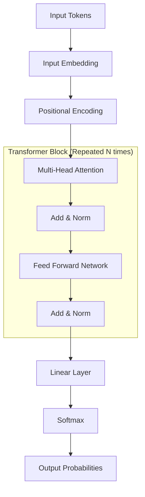

# Q1: What are foundation models, and how have they changed AI engineering?

## 1. 🔹 Direct Answer
A **Foundation Model** is a massive, pre-trained AI model trained on vast quantities of unlabeled data (usually via self-supervised learning) that can be adapted (e.g., prompted or fine-tuned) to a wide variety of downstream tasks. They have shifted AI engineering from building bespoke, task-specific models from scratch to adapting a single generalized model to solve multiple problems.

## 2. 🔹 Intuition
Imagine you need to hire someone to translate French, someone to write marketing copy, and someone to write Python code.
- **Old Paradigm (Bespoke Models):** You hire and train three separate people from birth, teaching one *only* French, one *only* marketing, and one *only* Python. (Slow and expensive).
- **Foundation Model Paradigm:** You hire an omnivorous polymath who has read the entire internet. To get them to translate French, you just say, "Act as a French translator." They instantly adapt because the foundational knowledge is already there.

## 3. 🔹 Deep Dive
- **Self-Supervised Learning at Scale:** Foundation models (like GPT-4, Llama 3, BERT) are trained without human-labeled datasets. They use massive web scrapes and predict missing words (Masked Language Modeling) or the next word (Causal Language Modeling). This gives them a powerful internal representation of human language and logic.
- **Emergent Capabilities:** When models reach a certain parameter count (e.g., >10B), they begin exhibiting "emergent abilities"—skills they weren't explicitly trained to do, such as few-shot arithmetic or translating between low-resource languages.
- **Homogenization:** AI Engineering has homogenized. Instead of building different CNNs for vision, RNNs for text, and acoustic models for audio, the industry is converging on Transformer-based foundation models for *all* modalities.

## 4. 🔹 Practical Perspective
- **Real-world use cases:** OpenAI's GPT-4, Meta's Llama 3, Anthropic's Claude. Used for text generation, code assistance, and summarization.
- **Trade-offs:** 
  - *Pros:* Drastically lowers the barrier to entry for AI applications. You don't need a PhD in ML to build a sentiment analyzer; you just need an API key and a prompt.
  - *Cons:* Massive compute costs for the creators. "Single point of failure" risk—if the foundation model has an inherent bias or security flaw, every downstream application inherits that flaw.

## 5. 🔹 Code Snippet
**The shift in AI Engineering Code:**
```python
# Old Paradigm (Training task-specific Sentiment Analysis from scratch - PyTorch)
model = Sequential([Embedding(vocab, 128), LSTM(64), Dense(1, activation='sigmoid')])
model.fit(labeled_positive_negative_data, epochs=10) # Requires 100k labeled rows

# New Paradigm (Adapting a Foundation Model via Zero-Shot Prompting)
from openai import OpenAI
client = OpenAI()

response = client.chat.completions.create(
    model="gpt-4o", # The Foundation Model
    messages=[{"role": "user", "content": "Classify the sentiment of: 'I love this!' as POSITIVE or NEGATIVE."}]
)
# No training data required!
```

## 6. 🔹 Interview Follow-ups
1. **Q:** *Are Foundation Models always Large Language Models (LLMs)?*
   **A:** No. CLIP (OpenAI) is a foundation model for vision-language tasks. Stable Diffusion is a foundation model for image generation. Wav2Vec is a foundation model for audio. 
2. **Q:** *Why don't companies train their own foundation models from scratch?*
   **A:** Compute cost and data scarcity. Training a state-of-the-art model requires tens of thousands of GPUs running for months, costing tens of millions of dollars, plus a massive engineering team to handle GPU cluster instabilities.
3. **Q:** *What is Parameter-Efficient Fine-Tuning (PEFT)?*
   **A:** Instead of retraining the billions of parameters in a foundation model (which requires massive VRAM), PEFT techniques (like LoRA) freeze the foundation model and only train a tiny "adapter" network on top of it to cheaply customize behavior.

## 7. 🔹 Common Mistakes
- **Equating Foundation Models with AGI:** Foundation models are extremely capable pattern matchers, but they do not possess genuine comprehension or reasoning outside of statistical correlations derived from their pre-training data.

## 8. 🔹 Comparison / Connections
- **Transfer Learning:** Foundation models represent the ultimate realization of transfer learning. Knowledge learned during the unsupervised pre-training phase is "transferred" to thousands of zero-shot downstream tasks.

## 9. 🔹 One-line Revision
Foundation models are massive, self-supervised networks trained on broad data that replace task-specific ML pipelines by allowing developers to adapt one model to many uses via prompting or fine-tuning.

## 10. 🔹 Difficulty Tag
🟢 Easy
# Q2: What is a Large Language Model (LLM), and how does it work?

## 1. 🔹 Direct Answer
A **Large Language Model (LLM)** is a type of foundation model—typically built on the Transformer architecture with billions of parameters—designed to understand and generate human language. It works fundamentally as an autoregressive **next-token predictor**: by ingesting a sequence of words (tokens), it calculates the statistical probability distribution over its vocabulary to predict and append the most likely next token, repeating this loop to generate text.

## 2. 🔹 Intuition
Imagine the auto-complete feature on your phone's keyboard. 
When you type "I am going to the...", it suggests "store," "park," or "gym."
Your phone keyboard is a tiny language model. 
An LLM is the same concept, but scaled up by a billion times. Because it has "read" the entire internet, when given a prompt like "Write a Python script to scrape a website," its "auto-complete" is so advanced that it perfectly outputs functioning code, token by token.

## 3. 🔹 Deep Dive
- **Training Pipeline:**
  1. **Pre-training:** The LLM reads massive corpora (Common Crawl, Wikipedia). It is trained using a simple objective: Given `N` tokens, predict the `N+1` token. This instills grammar, facts, and reasoning patterns into its neural weights.
  2. **Supervised Fine-Tuning (SFT):** The base model only "auto-completes" text. To make it a chatbot, humans provide high-quality "Prompt-Response" pairs to teach it the Q&A dialogue format.
  3. **RLHF / DPO (Alignment):** Reinforcement Learning from Human Feedback is applied to penalize toxic responses and reward helpful, safe responses.
- **Inference Mechanics:**
  During inference, the LLM takes the user prompt, converts text to numerical tokens, passes them through multiple Transformer layers (self-attention & feed-forward networks), and outputs "logits" (raw scores). These logits are passed through a Softmax function to become probabilities. A sampling algorithm (like Top-P) selects the winning token, which is appended to the prompt, and the cycle repeats.

## 4. 🔹 Practical Perspective
- **Real-world use cases:** Chatbots, code generation, summarization, translation, structuring unstructured data (e.g., parsing resumes into JSON).
- **Trade-offs:** 
  - *Pros:* Incredible zero-shot adaptability. 
  - *Cons:* Prone to hallucinations (confidently outputting false information because it "sounds" statistically plausible). Cannot "think" or plan ahead before speaking (unless forced via Chain-of-Thought prompting). High compute requirements for inference.

## 5. 🔹 Code Snippet
**Conceptual Python logic showing autoregressive chunking:**
```python
def generate_text(prompt, max_tokens=50):
    text = prompt
    for _ in range(max_tokens):
        # 1. Convert text to token IDs
        input_ids = tokenizer.encode(text)
        
        # 2. Model outputs probabilities for the NEXT token
        logits = model.forward(input_ids)
        
        # 3. Pick the token with the highest probability (greedy decoding)
        next_token_id = get_max_prob_token(logits)
        
        # 4. Convert ID back to string
        next_word = tokenizer.decode(next_token_id)
        
        # Stop if model outputs special End-Of-Sequence token
        if next_word == "<EOS>":
            break
            
        # 5. Append and repeat
        text += next_word
        
    return text
```

## 6. 🔹 Interview Follow-ups
1. **Q:** *Why is a 'Base Model' generally useless for a standard end-user?*
   **A:** Base models (like the raw Llama-3-8B pre-trained checkpoint) are just document continuers. If you ask a base model: "What is the capital of France?", it might auto-complete it with "What is the capital of Germany?" because it thinks it is generating a quiz document. Instruction fine-tuning is what turns it into an answering assistant.
2. **Q:** *Why do LLMs struggle with basic mathematics, like multiplying large numbers?*
   **A:** Math requires deterministic rule-following and step-by-step logic, but LLMs are stochastic pattern-matchers operating on subword tokens. If a specific math problem isn't in their training data, they try to "guess" the next phonetic-like token, which usually fails for exact arithmetic.
3. **Q:** *What limits the length of an LLM's response or input?*
   **A:** The Context Window. Because attention mechanisms compute relationships between *every* token and *every other* token, memory usage grows quadratically. 

## 7. 🔹 Common Mistakes
- **Thinking an LLM fetches data:** Non-technical users think an LLM "searches its database" for an answer. Explain that an LLM stores no text explicitly; it stores *statistical weights* in a neural net. It "dreams" the answer based on those probabilities.

## 8. 🔹 Comparison / Connections
- **Markov Chains:** Early text generation used Markov chains (predicting the next word based purely on the preceding 2 words). LLMs are infinitely advanced Markov chains that use Transformers to look at the preceding *100,000* words simultaneously with deep semantic understanding.

## 9. 🔹 One-line Revision
An LLM uses a massive Transformer neural network trained on vast text data to calculate probability distributions and autoregressively predict and output the next word in a sequence.

## 10. 🔹 Difficulty Tag
🟢 Easy
# Q3: What are Transformer Models and how do they work?

## 1. 🔹 Direct Answer
The **Transformer** is a deep learning architecture introduced by Google in 2017 ("Attention Is All You Need") that revolutionized natural language processing by abandoning sequence/recurrence (RNNs) in favor of the **Self-Attention Mechanism**. It processes all tokens in an input sequence simultaneously, identifying contextual relationships between words regardless of their distance from each other, making it highly parallelizable and capable of understanding long-range dependencies.

## 2. 🔹 Intuition
Pre-Transformer models (RNNs) read a sentence like reading a book: word by word, left to right. By the time they reached the end of a paragraph, they often "forgot" what the first sentence was.
**The Transformer** looks at the entire paragraph at once from above. 
If it sees the word "bank", it doesn't just guess its meaning. It instantly shoots out invisible lasers to every other word in the paragraph. If the laser hits "river", it knows "bank" means riverbed. If the laser hits "money", it knows it means a financial institution. This is "Self-Attention".

## 3. 🔹 Deep Dive
- **Parallel Processing vs. Recurrence:** RNNs/LSTMs are sequential (Time $T$ requires Time $T-1$ to finish). Transformers process the entire sequence as a matrix multiplication on GPUs. This parallelization allowed models to scale from millions to trillions of parameters.
- **The Core Architecture:**
  1. **Embeddings:** Words are mapped to high-dimensional continuous vectors.
  2. **Positional Encoding:** Because the Transformer processes everything at once, it loses the order of the words. Positional encodings (sine/cosine waves) are added to the embeddings to inject the concept of "Word 1 is before Word 2."
  3. **Self-Attention Layers:** Computes an attention matrix measuring how strongly every word relates to every other word using Queries, Keys, and Values.
  4. **Feed-Forward Networks (FFN):** Processes the output of the attention mechanism non-linearly to build deeper representations.
  5. **Residual Connections & LayerNorm:** Solves vanishing gradients, allowing the network to be stacked hundreds of layers deep.

## 4. 🔹 Architecture Visualization


## 5. 🔹 Practical Perspective
- **Real-world use cases:** Almost every major AI breakthrough since 2018 is a Transformer. BERT (Encoder only) powers Google Search. GPT-4 (Decoder only) powers ChatGPT. AlphaFold uses a Transformer derivative for protein folding. ViT (Vision Transformer) powers modern image classification.
- **Trade-offs:** 
  - *Pros:* Exceptional scaling, massive representational capacity, parallelizable training.
  - *Cons:* The memory and compute cost of self-attention grows quadratically ($O(N^2)$) with the sequence length. Processing a 1-million-token book requires insane amounts of VRAM compared to processing a 1k-token essay.

## 5. 🔹 Code Snippet
**High-Level PyTorch Representation of a Transformer Block:**
```python
import torch, torch.nn as nn

class TransformerBlock(nn.Module):
    def __init__(self, embed_size, heads):
        super(TransformerBlock, self).__init__()
        # Self-Attention Layer
        self.attention = nn.MultiheadAttention(embed_dim=embed_size, num_heads=heads)
        self.norm1 = nn.LayerNorm(embed_size)
        
        # Feed Forward Layer
        self.ffn = nn.Sequential(
            nn.Linear(embed_size, embed_size * 4),
            nn.ReLU(),
            nn.Linear(embed_size * 4, embed_size)
        )
        self.norm2 = nn.LayerNorm(embed_size)

    def forward(self, x):
        # 1. Attention + Residual Connection
        attention_out, _ = self.attention(x, x, x) # Query, Key, Value are all 'x'
        x = self.norm1(attention_out + x)
        
        # 2. Feed Forward + Residual Connection
        ffn_out = self.ffn(x)
        x = self.norm2(ffn_out + x)
        return x
```

## 6. 🔹 Interview Follow-ups
1. **Q:** *Why did Transformers replace LSTMs?*
   **A:** LSTMs suffered from the vanishing gradient problem over long sequences (poor long-term memory) and could not be parallelized during training because step $T$ required the hidden state from step $T-1$.
2. **Q:** *What is the difference between an Encoder and a Decoder in Transformers?*
   **A:** Encoders (like BERT) process the input bidirectionally (they see the future context) to understand the text perfectly. Decoders (like GPT) use *Causal Masking*—they are forbidden from seeing future tokens—because their entire job is to predict the future.
3. **Q:** *What does "Attention is All You Need" actually mean?*
   **A:** Prior to 2017, the prevailing wisdom was that Attention mechanisms were just nice "add-ons" to improve RNNs or CNNs. The paper proved you could throw away the RNN entirely and achieve state-of-the-art results using *only* attention layers.

## 7. 🔹 Common Mistakes
- **Thinking the Transformer generates text all at once:** During *training*, it processes all tokens in parallel. But during *inference* (text generation), Decoder-only Transformers are forced back into sequential processing (autoregression)—they must generate token 1, append it to the context, then generate token 2.

## 8. 🔹 Comparison / Connections
- **Convolutional Neural Networks (CNNs):** CNNs have "local receptive fields"—they only look at neighboring pixels. Transformers have a "global receptive field"—they look at every token in the sequence simultaneously via self-attention.

## 9. 🔹 One-line Revision
Transformers are highly parallelizable neural networks that rely entirely on the self-attention mechanism to instantly weigh the contextual relationships of all words in a sequence simultaneously, abandoning recurrent loops.

## 10. 🔹 Difficulty Tag
🟡 Medium
# Q4: What are the key components of a Transformer model?

## 1. 🔹 Direct Answer
A standard Transformer model (specifically the original Encoder-Decoder architecture) consists of six core components: **Input Embeddings** (converting text to vectors), **Positional Encoding** (injecting sequence order), **Multi-Head Self-Attention** (computing contextual relationships), the **Feed-Forward Neural Network (FFN)** (applying non-linear transformations), **Residual Connections & LayerNorm** (preventing vanishing gradients and stabilizing training), and a **Softmax Lineary Layer** (outputting probabilities over the vocabulary).

## 2. 🔹 Intuition
Think of passing a coded message through a factory.
- **Embeddings:** Translating the words into bar-codes.
- **Positional Encoding:** Stamping a "Step 1, Step 2" time-stamp on each bar-code so the sequence isn't lost.
- **Multi-Head Attention:** A room full of analysts connecting strings between related bar-codes (e.g., tying "He" to "John").
- **Feed-Forward Network:** A deep-thinking processing machine that takes those connected patterns and deduces higher-level meaning.
- **LayerNorm/Residuals:** Safety rails that ensure the signal doesn't get distorted as it moves down the assembly line.
- **Softmax Output:** The final machine that prints out the translated/predicted text.

## 3. 🔹 Deep Dive
- **1. Embeddings:** A lookup table mapping a discrete token ID (e.g., 405) to a continuous high-dimensional vector space (e.g., $d_{model} = 4096$).
- **2. Positional Encoding:** Sine and cosine functions of different frequencies are added element-wise to the embeddings. Since Attention is a set operation (permutation invariant), without this, "Dog bites man" and "Man bites dog" would look identical to the neural network.
- **3. Multi-Head Self-Attention (MHA):** Projects the input into $Q$ (Query), $K$ (Key), and $V$ (Value) matrices. Calculates $Attention(Q,K,V) = softmax(\frac{QK^T}{\sqrt{d_k}})V$. "Multi-head" means doing this $H$ separate times in parallel so the model can attend to different contextual factors (e.g., Head 1 tracks grammar, Head 2 tracks sentiment).
- **4. FFN (Position-wise Feed-Forward):** Two linear layers with an activation function (ReLU/GELU) in between. It is applied independently and identically to every token position. *This is where the model stores most of its "facts" and world knowledge*.
- **5. Add & Norm:** Residual connections ($y = x + f(x)$) bypass the layer computations, allowing gradients to flow unimpeded to early layers during backpropagation. Layer Normalization stabilizes the hidden state activations.

## 4. 🔹 Practical Perspective
- **Real-world use cases:** Most LLMs today (GPT-4, Llama) are **Decoder-only** Transformers. They strip away the Encoder branch and Cross-Attention mechanism to optimize solely for autoregressive generation.
- **Trade-offs:** The FFN contains roughly 2/3rds of all the parameters in a Transformer model. MoE (Mixture of Experts) tackles this bottleneck by replacing the dense FFN with sparse routing (only activating certain FFN "experts" per token) to save inference compute.

## 5. 🔹 Code Snippet
**How Positional Encoding prevents semantic loss:**
```python
import math
import torch

def get_positional_encoding(seq_len, d_model):
    pe = torch.zeros(seq_len, d_model)
    position = torch.arange(0, seq_len, dtype=torch.float).unsqueeze(1)
    # Different frequencies for different dimensions
    div_term = torch.exp(torch.arange(0, d_model, 2).float() * (-math.log(10000.0) / d_model))
    
    # Sine for even, Cosine for odd dimensions
    pe[:, 0::2] = torch.sin(position * div_term)
    pe[:, 1::2] = torch.cos(position * div_term)
    return pe # Added to the initial embeddings before layer 1
```

## 6. 🔹 Interview Follow-ups
1. **Q:** *Why is there a division by $\sqrt{d_k}$ in the scaled dot-product attention equation?*
   **A:** When dimensionality ($d_k$) gets large, the dot products of Query and Key grow exponentially large. This pushes the softmax function into regions with extremely small gradients (vanishing gradients), halting training. Scaling by the square root normalizes the variance.
2. **Q:** *Where is the world knowledge (e.g., "Paris is the capital of France") actually stored in the Transformer?*
   **A:** Research suggests facts are primarily stored in the large Feed-Forward Network (FFN) weight matrices, acting like a massive key-value memory store. The Attention mechanism acts as the router to extract them.
3. **Q:** *What is the difference between Layer Normalization (LayerNorm) used in Transformers and Batch Normalization (BatchNorm) used in CNNs?*
   **A:** BatchNorm normalizes across the batch dimension (which fails on variable-length text sequences). LayerNorm normalizes across the feature dimension for *each individual token*, making it sequence-length independent.

## 7. 🔹 Common Mistakes
- **Confusing Self-Attention with Cross-Attention:** Self-attention compares a sequence to itself (Encoder-to-Encoder or Decoder-to-Decoder). Cross-attention compares the Decoder's generated target sequence back against the Encoder's original input sequence (used in translation models like T5).

## 8. 🔹 Comparison / Connections
- **Data Structures (Hash Maps):** The Query/Key/Value mechanism is a differentiable "soft" version of a Python Dictionary. The Query searches against the Keys to retrieve the Values.

## 9. 🔹 One-line Revision
A Transformer's core components include input embeddings enriched with positional encoders, self-attention matrices to find contextual relationships, and deep feed-forward networks stabilized by residual connections and layer normalization. 

## 10. 🔹 Difficulty Tag
🔴 Hard (Requires deep architectural understanding)
# Q5: What is tokenisation in LLMs?

## 1. 🔹 Direct Answer
**Tokenisation** is the fundamental preprocessing step in NLP where raw text is chopped into smaller, discrete chunks called "tokens" (which can be whole words, subwords, or individual characters). These tokens are mapped to numeric IDs via a vocabulary dictionary, allowing the neural network—which only understands math—to ingest and process human language.

## 2. 🔹 Intuition
Imagine you want to feed a whole pizza to a baby. You can't shove the whole pizza (a raw string) in their mouth. 
You also can't break it down into its atomic molecules (Character-level tokenization: `p`, `i`, `z`, `z`, `a`) because that's too much chew-time with too little flavor per bite. 
So, you slice it into manageable pieces—some full slices (Word-level: `pizza`), some pepperoni chunks (Subword-level: `piz - za`). Tokenisation is dicing the English language into optimally sized chunks for the AI to digest.

## 3. 🔹 Deep Dive
- **Why we don't use Word-level tokenization:** If a vocabulary contains `run`, `runs`, `running`, and `runner`, a strict word-level tokenizer logs them as 4 completely separate, unconnected IDs. This explodes the vocabulary size to millions, wasting memory, and causes "Out of Vocabulary" (OOV) errors when a novel word formulation appears.
- **Why we don't use Character-level tokenization:** If the model must predict text letter-by-letter, sequences become immensely long. A 100-word sentence becomes 500 tokens, destroying the quadratic attention context window and losing semantic meaning.
- **The Sweet Spot - Subword Tokenization:** Modern LLMs use algorithms like **Byte-Pair Encoding (BPE)**, **WordPiece**, or **SentencePiece**. Frequent words are kept whole (e.g., `apple`). Rare words are split into known subwords (e.g., `unbelievable` -> `un`, `beli`, `eva`, `ble`). This balances a small, fixed vocabulary size (usually 30k to 100k) while eliminating OOV errors.

## 4. 🔹 Practical Perspective
- **Real-world use cases:** OpenAI models use `tiktoken` (cl100k_base vocabulary). A single word like "hamburger" might be 1 token, while proper names like "Nishchal" might split into 3 tokens `['N', 'ish', 'chal']`.
- **Trade-offs:** Because tokenization happens completely outside the Neural Network (it's a deterministic statistical script run beforehand), the LLM never sees the spelling of words. This is why LLMs struggle to count the number of "r"s in "strawberry". To the LLM, "strawberry" is a single unified vector ID, not a string of letters.

## 5. 🔹 Code Snippet
**How a Tokenizer maps text to tensors for the LLM:**
```python
from transformers import AutoTokenizer

tokenizer = AutoTokenizer.from_pretrained("gpt2")

text = "Tokenisation is fascinating!"

# 1. Encoding (Text -> Subwords -> IDs)
encoded_ids = tokenizer.encode(text)
print(encoded_ids) 
# Output: [38298, 1168, 318, 16999, 0]

# 2. Let's see how it split the subwords
tokens = tokenizer.convert_ids_to_tokens(encoded_ids)
print(tokens)
# Output: ['Token', 'isation', 'Ġis', 'Ġfascinating', '!']
# Notice 'Tokenisation' split into 'Token' and 'isation'
```

## 6. 🔹 Interview Follow-ups
1. **Q:** *Why is coding/programming difficult for naive tokenizers?*
   **A:** Code relies heavily on whitespace (tabs/spaces) and special punctuation (`{`, `}`, `=>`). Older tokenizers smashed spaces together, breaking formatting. Modern models (like GPT-4) use specific code-aware vocabularies that treat `    ` (4 spaces) as a single token to preserve spacing efficiently.
2. **Q:** *Why do English-trained tokenizers perform horribly on languages like Korean or Hindi?*
   **A:** The BPE training algorithm merges highest-frequency byte pairs. If trained on 99% English data, English words get dense 1-token mappings. Hindi characters get fragmented into 5 or 6 random byte tokens per word. This means generating Hindi text costs way more tokens (and money) and devours the context window instantly. (This is known as the "Token Tax").
3. **Q:** *What is Byte-Fallback?*
   **A:** If a completely novel unicode character (like a new emoji) appears that isn't in the subword vocabulary, the tokenizer falls back to encoding it at the raw UTF-8 Byte level, ensuring nothing is ever completely "Out of Vocabulary."

## 7. 🔹 Common Mistakes
- **1 Token = 1 Word:** The biggest misconception in AI cost estimation. A rule of thumb is $1 \text{ token} \approx \frac{3}{4} \text{ of an English word}$. 

## 8. 🔹 Comparison / Connections
- **Compression Algorithms:** BPE was originally invented in 1994 as a data compression technique (replacing frequent byte pairs with single unused bytes). Tokenization is essentially compressing human language down to an optimal vocabulary dictionary.

## 9. 🔹 One-line Revision
Tokenisation uses subword algorithms to slice raw text into statistically frequent byte-chunks, mapping them to numerical IDs to feed the LLM without suffering exploding vocabulary sizes or Out-Of-Vocabulary errors.

## 10. 🔹 Difficulty Tag
🟢 Easy
# Q6: Explain BPE (Byte Pair Encoding).

## 1. 🔹 Direct Answer
**Byte Pair Encoding (BPE)** is a highly popular subword tokenization algorithm that iteratively finds the most frequently occurring pair of adjacent symbols (e.g., characters or bytes) in a text corpus and merges them into a single new vocabulary token. This process repeats until the desired vocabulary size is reached, allowing the model to represent common words as single tokens and rare words as a combination of subword tokens.

## 2. 🔹 Intuition
Imagine you have a block of text: $A A B A B C A A B$.
You notice that $A$ and $A$ appear next to each other very often. You invent a new symbol, $Z = AA$.
Now the text is: $Z B A B C Z B$.
Then you notice $Z$ and $B$ occur together. You invent $Y = ZB$.
Now the text is: $Y A B C Y$.
BPE just does this millions of times. It takes the alphabet ($A, B, C...$) and merges common sequences (`t` + `h` = `th`). Then it merges `th` + `e` = `the`. Over time, common words become single symbols, while weird words remain as small sub-symbols.

## 3. 🔹 Deep Dive
- **The Algorithm Steps:**
  1. **Initialization:** Start with a vocabulary representing all base characters (or raw bytes from 0-255). Treat every word in the training corpus as a sequence of these base characters.
  2. **Frequency Count:** Count the frequency of all adjacent symbol pairs across the corpus.
  3. **Merge:** Find the most frequent pair (e.g., `e` and `r`) and merge them into a single new symbol (`er`).
  4. **Update:** Replace all occurrences of `e, r` with `er` in the corpus.
  5. **Repeat:** Continue this loop (which could take tens of thousands of iterations) until the target vocabulary size (e.g., 50,000 tokens) is met.
- **Why Bytes instead of Unicode Characters?** Original BPE used text characters, but Unicode contains 140,000+ characters (emojis, Mandarin, Hindi). This would bloat the base vocabulary. Modern Byte-Level BPE (BBPE) starts with the 256 byte values. Every language, emoji, and symbol can be reduced to those 256 bytes, guaranteeing zero Out-Of-Vocabulary (OOV) errors.

## 4. 🔹 Practical Perspective
- **Real-world use cases:** OpenAI heavily relies on BBPE (used in `tiktoken` for GPT-3 and GPT-4). Llama 3 also uses an expanded 128k-token BBPE tokenizer.
- **Trade-offs:** 
  - *Pros:* Balances vocabulary size perfectly. Handles typos and unseen words gracefully (by breaking them down).
  - *Cons:* Greedy algorithm. If `un` is merged with `believable`, it might miss a more semantically logical split because it strictly follows raw frequency counts rather than grammatical rules.

## 5. 🔹 Code Snippet
**Conceptual BPE Merge Logic:**
```python
import collections

# Fake corpus with counts
vocab = {'l o w </w>': 5, 'l o w e r </w>': 2, 'n e w e s t </w>': 6, 'w i d e s t </w>': 3}

def get_stats(vocab):
    pairs = collections.defaultdict(int)
    for word, freq in vocab.items():
        symbols = word.split()
        for i in range(len(symbols)-1):
            pairs[symbols[i], symbols[i+1]] += freq
    return pairs

def merge_vocab(pair, v_in):
    v_out = {}
    bigram = ' '.join(pair)
    replacement = ''.join(pair)
    for word in v_in:
        # Replace the frequent pair with the new merged symbol
        w_out = word.replace(bigram, replacement)
        v_out[w_out] = v_in[word]
    return v_out

# Output after 1 iteration: 'e', 's' are merged to 'es' because they appear 9 times.
```

## 6. 🔹 Interview Follow-ups
1. **Q:** *What happens if BPE encounters a completely random string like "sdlkjnf"?*
   **A:** It will not find "sdlkjnf" in its vocabulary. It will fall back to smaller known subwords, perhaps splitting it into `[sd, lk, j, nf]`. In the worst case, it falls back to the exact single-letter or single-byte tokens, meaning it never fails to encode a string.
2. **Q:** *Why is OpenAI's vocabulary size ~100k, instead of 1 Million?*
   **A:** A massive vocabulary shrinks the sequence length (faster inference), but the output layer of the Neural Network (the Softmax layer) must output a probability constraint over *every single token in the vocabulary*. A 1M vocabulary requires a matrix multiplication of `[hidden_dim, 1,000,000]`, which dominates memory and compute costs. 100k is the sweet spot.

## 7. 🔹 Common Mistakes
- **Confusing Pre-tokenization with BPE:** Before BPE starts merging, text is often "pre-tokenized" (split by spaces/punctuation). GPT-4 uses regex rules to split spaces, numbers, and punctuation first, ensuring BPE never merges a word with a comma.

## 8. 🔹 Comparison / Connections
- **Huffman Coding:** Both aim to compress data based on frequency. Huffman assigns shorter bit-lengths to frequent items. BPE creates single physical units out of frequent multi-byte combinations.

## 9. 🔹 One-line Revision
BPE is a greedy data-compression algorithm adapted for NLP that builds a vocabulary by iteratively merging the most frequently adjacent byte-pairs in a corpus until the target token count is reached.

## 10. 🔹 Difficulty Tag
🟡 Medium
# Q7: Explain WordPiece and SentencePiece.

## 1. 🔹 Direct Answer
**WordPiece** and **SentencePiece** are subword tokenization algorithms used to build LLM vocabularies. 
- **WordPiece** builds the vocabulary by selecting merges that maximize the *likelihood* of the training data (a probabilistic approach), unlike BPE which uses raw frequency.
- **SentencePiece** is a wrapper library/algorithm that treats the entire input text as a raw stream of characters (including spaces), requiring no pre-tokenization or language-specific rules, making it completely language-agnostic.

## 2. 🔹 Intuition
- **BPE vs WordPiece:** Think of BPE as a manager who merges the two employees who *talk to each other the most* (frequency). WordPiece is a manager who merges two employees because combining them *increases the overall efficiency of the company the most* (likelihood).
- **SentencePiece:** In English, we use spaces to separate words. But in Chinese or Japanese, there are no spaces between words (`我是学生` = `I am a student`). Traditional tokenizers fail here because they try to split by space first. **SentencePiece** treats the space character just like the letter 'A' or 'B' (often replacing it with a special symbol like `_`). It completely ignores the concept of "words" and just merges characters.

## 3. 🔹 Deep Dive
- **WordPiece (Used in BERT):** 
  - Starts with base characters. 
  - Evaluates potential merges iteratively. Instead of picking the most frequent pair `(A,B)`, it calculates the score: $\frac{count(AB)}{count(A) \times count(B)}$. 
  - This measures how much more likely `A` and `B` appear *together* compared to if they appeared independently. If `A` and `B` are super common separately, merging them is penalized. It only merges them if they represent a unique syntactic unit when combined.
- **SentencePiece (Used in T5, ALBERT, LLaMA):** 
  - It is an end-to-end framework. 
  - Standard tokenizers require steps: `Input -> Text Normalization -> Standardize Spaces -> Pre-tokenize (split by space) -> Run BPE`.
  - SentencePiece: `Input -> SentencePiece Model`. 
  - It intrinsically supports Unigram Language Modeling and BPE under the hood. 

## 4. 🔹 Practical Perspective
- **Real-world use cases:** 
  - *BERT* uses WordPiece. (`"unbelievable"` -> `["un", "##believ", "##able"]`. The `##` indicates the token is attached to the previous token.)
  - *Google's multilingual models (mT5, Gemma)* use SentencePiece because it seamlessly handles Thai, Chinese, and English in a single model without requiring 3 different language-specific parsers.
- **Trade-offs:** SentencePiece is strictly superior for global applications. WordPiece is more semantically robust for English text than BPE but is computationally heavier to train.

## 5. 🔹 Code Snippet
**How SentencePiece handles spaces format:**
```python
import sentencepiece as spm

# Train sentencepiece on a raw text file
spm.SentencePieceTrainer.train('--input=data.txt --model_prefix=m --vocab_size=8000')

sp = spm.SentencePieceProcessor()
sp.load('m.model')

# Notice how spaces are preserved as 
text = "Hello world"
tokens = sp.encode_as_pieces(text)
print(tokens)
# Output: [' Hello', ' world']  
# (The ' ' symbol natively represents the space character)
```

## 6. 🔹 Interview Follow-ups
1. **Q:** *Why is replacing spaces with a symbol like `_` important in SentencePiece?*
   **A:** Decoder reversibility. In classical tokenization, if you split "Hello World" into `['Hello', 'World']`, decoding it requires manually injecting spaces (`" ".join(tokens)`). But what if the original text was "HelloWorld" without a space? The semantic structure is lost. SentencePiece guarantees `decode(encode(text)) == original_text` because spaces are preserved as distinct tokens.
2. **Q:** *What is Unigram Language Modeling, which SentencePiece often uses?*
   **A:** BPE works bottom-up (start with characters, merge to words). Unigram works top-down. It starts with a massive vocabulary of all possible words and subwords, and iteratively *prunes* (removes) the subwords that contribute the least to the overall probability of the corpus, down to the target vocabulary size.

## 7. 🔹 Common Mistakes
- **Thinking SentencePiece is an alternative to BPE:** This is a category error. SentencePiece is a *framework* that can actually run BPE under the hood. SentencePiece's unique trait is that it treats text as a raw un-segmented sequence, completely removing language-specific pre-tokenization steps.

## 8. 🔹 Comparison / Connections
- **Data Serialization:** SentencePiece is like strict binary serialization (JSON stringify). It perfectly preserves every single byte (including white spaces and carriage returns) so the exact original state can be perfectly reconstructed.

## 9. 🔹 One-line Revision
WordPiece merges subwords by maximizing the probabilistic likelihood of the training data rather than raw frequency, while SentencePiece is a language-agnostic tokenizer wrapper that processes text unconditionally, preserving spaces as native symbols.

## 10. 🔹 Difficulty Tag
🟡 Medium
# Q8: What is positional encoding, and why is it needed in Transformers?

## 1. 🔹 Direct Answer
**Positional Encoding** is an algorithmic technique used to inject the concept of sequence order into a Transformer model. Because Transformers process all tokens in parallel via self-attention (lacking the sequential step-by-step nature of RNNs), they are inherently fully symmetric and order-blind. Positional encodings add unqiue mathematical coordinates to each word's embedding so the model knows that word A came before word B.

## 2. 🔹 Intuition
Imagine you have a bag of Scrabble tiles: `[D, O, G, B, I, T, E, S, M, A, N]`. 
If you dump them on a table and ask a machine what it means, the machine doesn't know if it's "DOG BITES MAN" or "MAN BITES DOG", because the set of words is identical. 
To fix this, you write a tiny number on the back of each tile: `D(1), O(2), G(3) ... M(10), A(11), N(12)`. Now, even if you scatter the tiles randomly, the machine can reconstruct the logical timeline. Positional Encodings are those tiny numbers.

## 3. 🔹 Deep Dive
- **The Problem:** The core self-attention equation $softmax(\frac{QK^T}{\sqrt{d_k}})V$ contains no concept of position. If you shuffle the input sequence, the aggregated attention output for each word remains exactly the same.
- **Absolute Positional Encodings (Original 2017 Transformer):**
  - Uses a mix of sine and cosine waves of varying frequencies.
  - $PE_{(pos, 2i)} = \sin(pos / 10000^{2i/d_{model}})$
  - $PE_{(pos, 2i+1)} = \cos(pos / 10000^{2i/d_{model}})$
  - Why Waves? They allow the model to easily learn relative positions. Because sine waves are periodic, the model can learn linear functions to jump from `pos = X` to `pos = X + K`.
- **How it's applied:** The Positional Encoding vector is *literally added* (element-wise addition) to the Word Embedding vector before passing into round 1 of the Transformer.

## 4. 🔹 Practical Perspective
- **Evolution:** Almost no modern LLMs use the original absolute Sinusoidal embeddings anymore. Absolute embeddings struggle when the user pastes a prompt that is longer than the sequence length the model was trained on (extrapolation fails).
- **Modern Replacements:** 
  - *RoPE (Rotary Position Embeddings):* Used in Llama and Mistral. Instead of adding absolute static coordinates, RoPE rotates the Query and Key vectors in hyper-dimensional space by an angle proportional to their absolute distance before computing the dot product.
  - *ALiBi (Attention with Linear Biases):* Adds a penalty directly to the attention score between two words based on how far apart they are.

## 5. 🔹 Code Snippet
**Why Addition Works (Mental Model):**
```python
import numpy as np

# Word embedding for "Dog"
embed_dog = np.array([0.5, 0.9, -0.2, 0.1])

# Positional Encoding for Position 1 (using sine/cosine logic)
pe_pos_1 = np.array([0.84, 0.54, 0.01, 1.0])

# Final Input to Transformer Layer 1
final_input = embed_dog + pe_pos_1
```
*Note: The model learns during training to untangle the semantic meaning (`embed_dog`) from the positional coordinate (`pe_pos_1`) inside the dense FFN layers.*

## 6. 🔹 Interview Follow-ups
1. **Q:** *Why do we ADD the positional encoding to the embedding instead of concatenating it? (e.g. `[embed, pos_encoding]`)*
   **A:** Concatenation increases the dimensionality of the vector, which massively increases the matrix multiplication requirements throughout the entire network. Since embeddings reside in a very high dimension (e.g., 4096), there is plenty of latent "unused space" to safely superimpose (add) a positional signal without disrupting the semantic data.
2. **Q:** *If positional encoding is fixed, how does the model process position 8000 if it was only trained up to length 4000?*
   **A:** Absolute sinusoidal encodings fail catastrophically here. This is why RoPE and ALiBi were invented—they model *relative* distance (Word A is X steps away from Word B) rather than absolute coordinates, allowing for massive context window scaling.

## 7. 🔹 Common Mistakes
- **Confusing Positional Encoding with Token IDs:** Token IDs map to the semantic meaning (Apple = ID 45). Positional Encodings map to the physical location in the current sentence (Position 5).

## 8. 🔹 Comparison / Connections
- **Fourier Transforms:** The use of multiple sine and cosine waves at different frequencies to represent a complex signal is deeply rooted in Fourier analysis. 

## 9. 🔹 One-line Revision
Positional encoding solves the Transformer's inherent order-blindness by injecting absolute or relative physical coordinate signals (via sinusoidal matrices or vector rotation) into the token embeddings prior to self-attention.

## 10. 🔹 Difficulty Tag
🟡 Medium
# Q9: What is causal masking?

## 1. 🔹 Direct Answer
**Causal Masking** (also known as Autoregressive or Future Masking) is an operation inside a Decoder-style Transformer that prevents the self-attention mechanism from "looking ahead" at future tokens. It is achieved by applying a triangular mask to the attention score matrix, setting the scores of all future tokens to $-\infty$, ensuring that the prediction for position $t$ is calculated solely based on tokens from positions $\le t$.

## 2. 🔹 Intuition
Imagine taking a test where you must fill in the blanks of a sentence one word at a time.
`The ___ jumped over the ___`
If you are trying to guess the first blank, but you are allowed to look at the answers for the rest of the sentence (the future), you aren't learning how to predict; you're just cheating.
**Causal Masking** is a sliding piece of cardboard covering everything to the right of your pencil. You can look at the past, but you cannot physically see the future text until you generate it.

## 3. 🔹 Deep Dive
- **The Attention Mechanism Context:** When we calculate $QK^T$, we generate an $N \times N$ matrix representing how much every token (row) should attend to every other token (column). 
- **The Masking Process:**
  1. We create an upper-triangular matrix of negative infinities ($-\infty$).
  2. We add this mask to the $QK^T$ matrix *before* applying the Softmax layer.
  3. When $Softmax(x_i) = \frac{e^{x_i}}{\sum e^{x_j}}$ runs, $e^{-\infty}$ equals $0$. 
  4. Thus, the attention weights from Token 1 looking at Token 2, 3, or N become exactly $0$. Token 1 can only attend to Token 1. Token 3 can attend to 1, 2, and 3.
- **Why it's essential:** During training, we pass the *entire* paragraph to the GPU at once for efficiency (parallelism). If we didn't apply the mask, the model would cheat during the "predict the next word" loss calculation by just reading the answer from the input tensor.

## 4. 🔹 Practical Perspective
- **Real-world use cases:** It is the foundational requirement for training GPT-style (Decoder-only) models.
- **When NOT to use:** BERT (Encoder-only) does not use causal masking. BERT uses a Bidirectional approach. If BERT sees `The [MASK] barked`, it is mathematically allowed to look at the word `barked` (in the future) to deduce that the `[MASK]` is likely `dog`.

## 5. 🔹 Code Snippet
**How Causal Masking is applied in PyTorch:**
```python
import torch
import torch.nn.functional as F

seq_len = 4
# 1. Create raw attention scores (simulated QK^T)
raw_attention_scores = torch.randn(seq_len, seq_len)

# 2. Create the upper triangular mask
mask = torch.triu(torch.ones(seq_len, seq_len), diagonal=1)
# mask:
# [[0, 1, 1, 1],
#  [0, 0, 1, 1],
#  [0, 0, 0, 1],
#  [0, 0, 0, 0]]

# 3. Apply -infinity to the 1s
raw_attention_scores = raw_attention_scores.masked_fill(mask == 1, float('-inf'))

# 4. Apply Softmax
attention_weights = F.softmax(raw_attention_scores, dim=-1)

# Notice how the top-right triangle is all 0.0000
print(attention_weights)
# Token 0 can only see Token 0 (prob = 1.0)
# Token 1 can see Token 0 and Token 1
```

## 6. 🔹 Interview Follow-ups
1. **Q:** *Does Causal Masking happen during inference?*
   **A:** Technically, no. During inference (deployment), the model generates token $t$, appends it, and then calculates the attention for token $t+1$. Since the future tokens literally *do not exist yet* in the tensor cache, the model cannot cheat. Causal masking is primarily a *training* mechanism and a mechanism to process the initial user prompt parallelly.
2. **Q:** *Can causal masking be used in an Encoder-Decoder model like T5?*
   **A:** Yes, in the Decoder half. The Encoder block has no mask (processes prompt bidirectionally), while the Decoder block applies a causal mask (generates response iteratively).

## 7. 🔹 Common Mistakes
- **Applying the mask AFTER the Softmax:** If you apply softmax first, and then zero out the upper triangle, your probability rows will no longer sum to 1.0. The mask must be added as $-\infty$ *before* the exponential softmax.

## 8. 🔹 Comparison / Connections
- **Time Series Forecasting:** Causal masking serves the exact same purpose as strict lag-variables in autoregressive financial modeling—ensuring data from Time $T+5$ cannot physically leak into the prediction calculation for Time $T+4$.

## 9. 🔹 One-line Revision
Causal masking is the application of a negative infinity upper-triangular matrix to attention scores before the softmax layer, preventing a decoder model from cheating by looking at future tokens during parallel autoregressive training.

## 10. 🔹 Difficulty Tag
🟡 Medium
# Q10: What is self-attention, and how does it work in Transformers?

## 1. 🔹 Direct Answer
**Self-attention** is the core mathematical mechanism of the Transformer that allows a sequence to contextualize itself. For every word in an input, it computes a "score" against every other word in that exact same sequence to determine how strongly they relate. It relies on mapping the input tokens into three learned weight matrices: **Queries (Q)**, **Keys (K)**, and **Values (V)**, combining them via scaled dot-product to output context-heavy embeddings.

## 2. 🔹 Intuition
You are reading a confusing sentence: *"The bank of the river collapsed."*
When you read the word **"bank"**, you ask a question (Query): *"What kind of bank am I?"*
Every other word offers an identifying tag (Key). 
- "The": *(Key: Article)*
- "river": *(Key: Water, Nature)*
- "collapsed": *(Key: Failure)*
Your "bank" Query computes a strong match with the "river" Key. 
Now that you know what it means, you take the core meaning (Value) of "riverbed" and blend it into your understanding of "bank". 
Self-attention is the algorithm doing this across all words simultaneously.

## 3. 🔹 Deep Dive
- **The Core Equation:** $Attention(Q, K, V) = softmax(\frac{QK^T}{\sqrt{d_k}})V$
- **Step-by-Step Mechanics:**
  1. Given an input sequence matrix $X$ (e.g., shape `[seq_len, embed_dim]`).
  2. Multiply $X$ by three separate learned dimension-reducing matrices ($W_Q, W_K, W_V$) to generate the Query, Key, and Value matrices.
  3. **Dot Product:** Compute $Q \times K^T$. This calculates raw alignment scores. If word $i$'s query aligns with word $j$'s key, the dot product is high. (This results in a `[seq_len, seq_len]` matrix).
  4. **Scale:** Divide by $\sqrt{d_k}$ (where $d_k$ is the dimension of the key vectors) to keep the gradients from vanishing in the softmax phase.
  5. **Softmax:** Apply `softmax` across the rows to convert raw scores into probabilities that sum to 1. (e.g., "bank" pays 90% attention to "river" and 10% to "the").
  6. **Weighted Sum (Value Extraction):** Multiply this probability matrix by $V$. This outputs a new representation for every token, fundamentally altered by its context.

## 4. 🔹 Practical Perspective
- **Real-world use cases:** Understanding contextual pronouns. In the sentence "The animal didn't cross the street because it was too tired", self-attention forces the token "it" to heavily attend to "animal". In "The animal didn't cross the street because it was too wide", self-attention assigns the highest weight for "it" to "street".
- **Trade-offs:** 
  - The matrix multiplication $Q \times K^T$ generates a grid of `seq_len` $\times$ `seq_len`. 
  - For a context window of 100k tokens, this requires a matrix of 10 Billion cells, performed across 80+ layers, requiring massive clusters of H100 GPUs (The $O(N^2)$ problem).

## 5. 🔹 Code Snippet
**Numpy replication of Scaled Dot-Product Attention:**
```python
import numpy as np

def softmax(x):
    e_x = np.exp(x - np.max(x, axis=-1, keepdims=True))
    return e_x / e_x.sum(axis=-1, keepdims=True)

def self_attention(Q, K, V):
    d_k = K.shape[-1]
    
    # 1. Dot product to get alignment (shape: seq_len x seq_len)
    raw_scores = np.dot(Q, K.T)
    
    # 2. Scale
    scaled_scores = raw_scores / np.sqrt(d_k)
    
    # 3. Softmax
    attention_weights = softmax(scaled_scores)
    
    # 4. Multiply with Values
    output = np.dot(attention_weights, V)
    
    return output, attention_weights
```

## 6. 🔹 Interview Follow-ups
1. **Q:** *Why do we need three separate matrices (Q, K, V) if they all come from the exact same input $X$?*
   **A:** If we just used $X \times X^T$, the attention matrix would always be symmetric (Word A's attention to B would equal B's attention to A). But language is directed; "black" describes "cat", not vice versa. Using learned, independent projections vectors ($W_Q, W_K$) allows the model to map words into asymmetric relationship spaces.
2. **Q:** *What is "Cross-Attention" vs "Self-Attention"?*
   **A:** In Self-Attention, Q, K, and V all come from the same source. In Cross-Attention (found in Encoder-Decoder translation models), the Queries come from the Decoder (the translated text being generated), but the Keys and Values come from the Encoder (the original source text).

## 7. 🔹 Common Mistakes
- **Equating Attention with Fully Connected layers:** An FFN has static weights that are fixed after training. The Attention weights ($Softmax(QK^T)$) are dynamically generated *during inference* based entirely on the specific user prompt.

## 8. 🔹 Comparison / Connections
- **Database Querying:** Q/K/V maps perfectly to SQL constraints. **Q**uery = "Select records where date > 2000". **K**ey = the `date` index column in the database (used to compute the match). **V**alue = The actual text payload retrieved from the matching row.

## 9. 🔹 One-line Revision
Self-attention contextualizes sequences by generating dynamic attention weights—calculated via the scaled dot-product of learned Query and Key matrices—and multiplying them against a Value matrix to output deeply semantic token embeddings.

## 10. 🔹 Difficulty Tag
🔴 Hard
# Q11: Explain the Query (Q), Key (K), and Value (V) in attention.

## 1. 🔹 Direct Answer
In the Transformer attention mechanism, **Query (Q)** represents the current word looking for context, **Key (K)** represents the labels of all other words offering context, and **Value (V)** represents the actual underlying semantic meaning of those words. The model computes the dot product of $Q$ and $K$ to find the strongest matches, and uses those matching scores as weights to sum up the corresponding $V$s, creating a new, contextualized representation of the word.

## 2. 🔹 Intuition
Think of a classic library database or search engine (like YouTube):
- **Query (Q):** What you type into the search bar: *"Cute cat videos"*.
- **Key (K):** The video title and tags in the database: *"Funny Feline Compilation"*.
- **Value (V):** The actual video file you want to watch.
The algorithm compares your Query string against all Keys in the database. When it finds a high match (high dot-product score), it returns that specific Value (the video) to you. The Transformer does this continuously for every single word in a sentence simultaneously.

## 3. 🔹 Deep Dive
- **Mathematical Origin:** Let $X$ be the input embedding matrix of a sentence (Shape: `[seq_len, embed_dim]`). 
- **Projections:** The model learns three distinct weight matrices during training: $W^Q, W^K, W^V$. 
  - $Q = X \times W^Q$
  - $K = X \times W^K$
  - $V = X \times W^V$
- **Why three different projections?** 
  If a word simply used its pure embedding $X$ to search for matches ($X \times X^T$), it would always match perfectly with *itself* and wouldn't learn asymmetric relationships (e.g., verbs searching for nouns). Projecting $X$ into distinct $Q$, $K$, and $V$ vector spaces allows the network to say: "As a *Query*, I am searching for a location. As a *Key*, I am a name. As a *Value*, my core meaning is 'John'."
- **The Assembly:**
  1. $Scores = Q \times K^T$ (Which words are relevant to which other words?)
  2. $Weights = Softmax(Scores)$ (Normalize relevance to percentages summing to 1.0).
  3. $Output = Weights \times V$ (Extract the actual meaning based on the relevance percentages).

## 4. 🔹 Practical Perspective
- **Real-world use cases:** This fundamental mechanism is what enables LLMs to understand complex grammatical dependencies, such as resolving pronouns. If the sentence is "The nurse told the doctor she was tired", the Query for "she" strongly matches the Key for "nurse" (due to grammatical proximity/gender vectors) and pulls the Value of "nurse" into the embedding for "she".
- **Trade-offs:** Storing the generated $K$ and $V$ matrices for every token takes up massive amounts of memory during text generation. This is known as the KV Cache bottleneck.

## 5. 🔹 Code Snippet
**Generating Q, K, V from a single Input:**
```python
import torch
import torch.nn as nn

seq_length, embed_dim = 10, 512

# Input Sequence Matrix
X = torch.rand(seq_length, embed_dim)

# The learned projection matrices
W_q = nn.Linear(embed_dim, embed_dim)
W_k = nn.Linear(embed_dim, embed_dim)
W_v = nn.Linear(embed_dim, embed_dim)

# Step 1: Project X into Q, K, and V spaces
Q = W_q(X) # What I'm asking for
K = W_k(X) # What I have to offer
V = W_v(X) # Who I actually am

# Step 2: Compute relevance (Q dot K-transpose)
raw_attention = torch.matmul(Q, K.transpose(0, 1))
```

## 6. 🔹 Interview Follow-ups
1. **Q:** *In Cross-Attention (Encoder-Decoder models like T5), where do Q, K, and V come from?*
   **A:** Unlike Self-Attention where all three come from $X$, in Cross-Attention, the Query ($Q$) comes from the Decoder (the output sentence currently being generated), while the Keys ($K$) and Values ($V$) come from the Encoder (the original source sentence).
2. **Q:** *Why are K and V often paired together in discussions like "KV Cache", while Q is left out?*
   **A:** During generative inference, the model predicts one token at a time. The new token generates a new $Q$ to look at the past, but it doesn't need to recompute the $K$ and $V$ for all past tokens because they never change. So we cache $K$ and $V$ in RAM, but dynamically compute $Q$ on the fly.

## 7. 🔹 Common Mistakes
- **Thinking Q, K, and V must have the same dimension as X:** While often true in the base Transformer, in Multi-Head attention, the embedding dimension ($d_{model}$) is sliced up. If $d_{model} = 512$ with 8 heads, the Q,K,V matrices inside each head are $d_k = 64$ dimensions. 

## 8. 🔹 Comparison / Connections
- **Memory Networks / Dictionaries:** The QKV pattern is a differentiable, soft version of a traditional programming Dictionary `Value = dict.get(Key)`. Instead of returning 0 or 1 Value, it returns a weighted fractional blend of all Values.

## 9. 🔹 One-line Revision
The QKV mechanism evaluates relationships by multiplying a token’s Query vector against all other tokens' Key vectors, applying a softmax to find the strongest matches, and using those probabilities to extract a weighted sum of their Value vectors.

## 10. 🔹 Difficulty Tag
🟡 Medium
# Q12: What are multi-head attention mechanisms? Why use multiple attention heads?

## 1. 🔹 Direct Answer
**Multi-Head Attention** is an architectural design where the single self-attention mechanism is split into multiple independent "heads" running in parallel. Instead of calculating attention across the entire embedding dimension once, the model slices the embedding into smaller chunks, allowing each head to independently focus on different distinct relationships (e.g., Head 1 focuses on grammar, Head 2 on sentiment, Head 3 on rhyming) before concatenating the results back together.

## 2. 🔹 Intuition
Imagine reading a complex legal contract. 
If you read it alone (Single-Head Attention), your brain tries to focus on the grammar, the financial risk, and the legal liabilities all at exactly the same time. You might miss nuance because a single perspective gets muddy.
If you hire four specialists (Multi-Head Attention)—a Grammarian (Head 1), a Banker (Head 2), a Lawyer (Head 3), and a PR Expert (Head 4)—they each read the same document in parallel, looking at completely different "features." Then, they combine their reports into one masterful summary.

## 3. 🔹 Deep Dive
- **The Problem with Single Attention:** The Softmax function naturally enforces sparsity. It wants to give 99% of its attention to one or two heavily matching tokens. If "bank" needs to attend to "river" for semantics, but *also* attend to the subject "He" for grammar, a single attention head struggles to balance both mathematically.
- **The Mechanics:**
  1. Suppose $d_{model} = 512$ and $NumHeads = 8$. 
  2. The input matrix $X$ is projected into $Q, K$, and $V$.
  3. These are mathematically split into 8 chunks of $d_k = 64$ dimensions.
  4. Eight separate Scaled Dot-Product Attentions are calculated in parallel.
  5. The 8 output matrices of shape `[seq_len, 64]` are concatenated back together into a single matrix of `[seq_len, 512]`.
  6. A final linear projection weight matrix ($W_O$) blends them together.
- **Computational Cost:** Because it splits the dimension ($512$ / $8 = 64$), computing 8 heads of size 64 requires roughly the exact same number of FLOPs as computing 1 head of size 512. It adds representation power almost "for free" in terms of matrix multiplication size.

## 4. 🔹 Practical Perspective
- **Real-world use cases:** Every state-of-the-art model uses this. GPT-3 (175B) uses 96 attention heads. 
- **Trade-offs:** 
  - *Pros:* Massive stabilization of the training process and drastically richer feature extraction.
  - *Cons:* While FLOPs remain constant, memory bandwidth suffers reading/writing so many separate Q,K,V weight matrices to the GPU cache, a problem partially mitigated in modern models by Multi-Query Attention (MQA) or Grouped-Query Attention (GQA).

## 5. 🔹 Code Snippet
**PyTorch Logic for Splitting Heads:**
```python
import torch

batch_size, seq_len = 1, 10
d_model, num_heads = 512, 8
d_k = d_model // num_heads  # 64

# Q projection matrix
Q = torch.randn(batch_size, seq_len, d_model)

# Reshape Q to split into multiple heads
# Shape goes from: [1, 10, 512] -> [1, 10, 8, 64] -> Swap dims -> [1, 8, 10, 64]
Q_multi_head = Q.view(batch_size, seq_len, num_heads, d_k).transpose(1, 2)

# Now Q_multi_head behaves like 8 independent matrices of size [10, 64]
# K and V are reshaped identically, and attention is performed per-head.
```

## 6. 🔹 Interview Follow-ups
1. **Q:** *After training, do different heads actually learn different semantic concepts?*
   **A:** Yes. Interpretability research (like Anthropic's mechanism research or BertViz) proves that some heads strictly learn positional offsets (e.g., attending to the token exactly $N-1$ steps away), some learn subject-verb agreement, and some act as "Induction Heads" that recognize and continue patterns.
2. **Q:** *Why is there a final Linear layer ($W_O$) after concatenating the heads?*
   **A:** Concatenating `[64] * 8` back to `[512]` just places the features next to each other in memory. The final $W_O$ matrix mixes the information *across* the heads, allowing the network to synthesize the Lawyer's findings with the Banker's findings.

## 7. 🔹 Common Mistakes
- **Assuming it slows down the model:** Many assume 8 heads means the model takes 8 times longer to run. It does not. Because the dimensionality is divided by 8, the mathematical volume is conserved, and GPUs execute all 8 small matrices completely in parallel.

## 8. 🔹 Comparison / Connections
- **CNN Filters / Channels:** Multi-Head Attention is the exact NLP equivalent of using multiple Filters in a Convolutional Neural Network (CNN). In a CNN, Filter 1 finds edges while Filter 2 finds colors. In MHA, Head 1 finds grammar while Head 2 finds sentiment.

## 9. 🔹 One-line Revision
Multi-Head Attention splits the embedding dimension into parallel chunks to compute independent self-attention scores simultaneously, allowing the model to focus on diverse linguistic and semantic features (grammar, context, syntax) at the same time.

## 10. 🔹 Difficulty Tag
🟡 Medium
# Q13: What is the context window in LLMs, and why does it matter?

## 1. 🔹 Direct Answer
The **Context Window** is the maximum number of tokens (words/subparts of words) an LLM can process in a single invocation—including both the user's input prompt and the model's generated response. It matters fundamentally because an LLM has zero persistent memory; anything that falls "outside" the context window is permanently forgotten, and the self-attention mechanism restricts window scaling because its compute/memory costs scale quadratically ($O(N^2)$) with window length.

## 2. 🔹 Intuition
Imagine a brilliant mathematician trying to solve a puzzle, but their short-term memory is exactly like the movie *Memento*. They can only remember the last 2 pages of text they just read. 
If the instruction manual for the puzzle is 3 pages long, by the time they read the 3rd page, they forget the rules on the 1st page and fail. 
The size of those "2 pages" is the Context Window. If you want the AI to summarize an entire book, the book must physically fit inside its context window.

## 3. 🔹 Deep Dive
- **Mathematical Bottleneck:** In Transformers, Attention requires calculating a correlation score between *every token and every other token*. A 1,000-token window requires generating a $1,000 \times 1,000$ matrix (1 million floats). A 100,000-token window requires a $100,000 \times 100,000$ matrix (10 Billion floats). Memory requirements explode.
- **KV Cache Impact:** During text generation, the Keys (K) and Values (V) of all previous tokens in the context window are cached in GPU VRAM to avoid recalculating them. A massive context window (like Gemini's 2 Million tokens) requires enormous VRAM just to store the memory footprint of a single user's session.
- **"Lost in the Middle" Phenomenon:** Simply having a large context window doesn't guarantee the LLM will use it well. Research shows LLMs pay massive attention to the very beginning (system prompt) and the very end (latest question), but "forget" or hallucinate facts hidden in the middle of a massive 100k-token prompt.

## 4. 🔹 Practical Perspective
- **Real-world use cases:** 
  - Standard (8k-16k tokens): Sufficient for chatbots, summarizing articles, or writing small Python scripts.
  - Massive (1M+ tokens - Gemini Pro): "Needle-in-a-haystack" analysis (e.g., uploading the entire codebase of Linux and asking where a specific bug happens), or analyzing entire 2-hour video transcripts natively.
- **Overcoming limits:** If data exceeds the window, developers must use **RAG (Retrieval-Augmented Generation)** to chunk the data into a vector database, perform a semantic search, and only inject the top 5 most relevant paragraphs into the context window.

## 5. 🔹 Code Snippet
**How context limits affect API development:**
```python
MAX_TOKENS = 8192

messages = [
    {"role": "system", "content": "You are a helpful assistant."},
    # If the user uploads a massive CSV file inside 'user_text'
    {"role": "user", "content": massive_user_text} 
]

token_count = tiktoken.encode(str(messages))

if token_count > MAX_TOKENS:
    # If not handled, the OpenAI API will throw a 400 Bad Request Error
    raise ValueError(f"Payload has {token_count} tokens. Max is {MAX_TOKENS}. Please summarize or chunk.")
```

## 6. 🔹 Interview Follow-ups
1. **Q:** *Why can't we just infinite-scroll the context window by letting the model slide over text?*
   **A:** LLMs lack Recurrence (like RNNs/LSTMs). They don't have a persistent hidden state vector that passes from step to step. To generate word 101, it must mathematically look directly at words 1->100 simultaneously. If word 1 falls off the edge of the sliding window, it physically disappears from the math.
2. **Q:** *How do models like Gemini achieve 1M to 2M token context windows despite the $O(N^2)$ problem?*
   **A:** Innovations like **Ring Attention** (distributing the attention matrix calculation across multiple separate GPUs) and architectural tweaks like **Sparse Attention** or **Mamba/SSMs** (State Space Models, which attempt to bring back RNN-like linear scaling).
3. **Q:** *What happens if you input 7,500 tokens to an 8,000-token model?*
   **A:** The model will read the prompt fine, but it will abruptly halt generation and return a `<MaxTokensExceeded>` stop reason after outputting exactly 500 tokens of the answer, chopping the sentence off mid-word.

## 7. 🔹 Common Mistakes
- **Treating Context Window as Training Data Limit:** A user might ask: "I want to train the model on my 500-page policy manual, how does that fit in the context window?" Training data isn't restricted by context windows (it's sliced into chunks). The context window strictly governs real-time Inference capacity.

## 8. 🔹 Comparison / Connections
- **RAM vs Hard Drive:** The Context Window is exactly like a computer's volatile RAM. It acts as the immediate working memory necessary to execute a program. Fine-Tuning/Pre-training is the Hard Drive (permanent, latent storage).

## 9. 🔹 One-line Revision
The context window dictates the maximum amount of tokens (input + output) an LLM can process simultaneously, constrained historically by the quadratic computational scaling of the self-attention mechanism.

## 10. 🔹 Difficulty Tag
🟢 Easy
# Q14: What is temperature in the context of LLMs, and how does it affect output?

## 1. 🔹 Direct Answer
**Temperature** is a scaling hyperparameter applied to the "logits" (raw prediction scores) generated by the final layer of an LLM right before the Softmax function turns them into probabilities. 
- A **Temperature of 0** makes the model strictly deterministic, always choosing the mathematically highest probability token. 
- A **High Temperature (e.g., 0.8 - 1.0+)** flattens the probability distribution, giving statistically less likely tokens a higher chance of being picked, thereby increasing the randomness, creativity, and "hallucination" rate of the output.

## 2. 🔹 Intuition
Imagine you are at an ice cream shop looking at the menu. 
- **Vanilla** is your favorite (90% preference).
- **Chocolate** is okay (9% preference).
- **Sardine flavor** is gross (1% preference).
If the Temperature is **$0.0$**, you behave like a robot. You buy Vanilla 100% of the days you visit the shop. It is predictable and stable.
If the Temperature is **$1.0$**, you act human and adventurous. Most days you get Vanilla, but every 10th day you decide, "I'm going crazy today, let me try Chocolate!"
If the Temperature is **$5.0$**, chaos reigns. You are equally likely to pick Vanilla, Chocolate, or Sardine flavor.

## 3. 🔹 Deep Dive
- **The Softmax Equation:** Normally, Softmax is $P_i = \frac{e^{x_i}}{\sum e^{x_j}}$. 
  Temperature $T$ modifies it: $P_i = \frac{e^{x_i / T}}{\sum e^{x_j / T}}$.
- **The Math behind Temperature:**
  - When $T = 1.0$, the distribution is unchanged.
  - As $T \rightarrow 0$, dividing by a microscopic fraction causes the largest logit to explode towards infinity while the smaller logits shrink, effectively forcing the Softmax output to $1.0$ for the top token and $0.0$ for all others (Argmax / Greedy Decoding).
  - As $T \rightarrow \infty$, dividing by a massive number forces all logits toward zero ($e^0 = 1$), flattening the Softmax distribution into a Uniform Distribution where every word in the dictionary has an equal chance of being selected.
- **Aesthetic Effects:** High temperature doesn't make the model "smarter" or "creative" in a human sense; it simply prevents the model from mathematically trapping itself in highly repetitive, cliched sequences (e.g., repeating "As an AI language model..." forever).

## 4. 🔹 Practical Perspective
- **Real-world use cases:** 
  - $T=0.0$: SQL Generation, JSON extraction, Code Writing, Fact-based QA where exact determinism is required.
  - $T=0.7$ to $0.9$: Creative writing, poetry, brainstorming, where diverse vocabulary makes the text feel more human.
- **Trade-offs:** High temperature drastically increases the probability of catastrophic hallucinations (outputting factually incorrect data) or syntax errors (breaking JSON or Python formatting).

## 5. 🔹 Code Snippet
**How Temperature alters probability arrays:**
```python
import numpy as np

def softmax(logits, temperature=1.0):
    logits = np.array(logits)
    # Apply Temperature scaling
    scaled_logits = logits / temperature
    exp_logits = np.exp(scaled_logits - np.max(scaled_logits)) 
    return exp_logits / np.sum(exp_logits)

# The raw Neural Network output scores for ['cat', 'dog', 'zebra']
raw_logits = [5.0, 4.0, 1.0]

print(f"T=1.0: {softmax(raw_logits, 1.0)}")
# [0.705, 0.259, 0.013] -> Zebra is highly unlikely

print(f"T=0.1: {softmax(raw_logits, 0.1)}")
# [0.999, 0.000, 0.000] -> Pure Determinism (Cat wins 100%)

print(f"T=5.0: {softmax(raw_logits, 5.0)}")
# [0.450, 0.368, 0.181] -> Flat distribution (Zebra might get picked!)
```

## 6. 🔹 Interview Follow-ups
1. **Q:** *Does setting Temperature=0.0 completely guarantee identical output every single time?*
   **A:** Not necessarily. While the decoding algorithm becomes perfectly argmax-greedy, extreme minor non-determinism can still occur due to floating-point rounding errors on complex GPU architectures (like CUDA Sparse Matrix operations) during the forward pass.
2. **Q:** *What is the difference between Temperature and Top-P?*
   **A:** They both control randomness, but differently. Temperature scales the *probabilities of every single token* in the vocabulary. Top-P dynamically *deletes the bottom tail* of the vocabulary from consideration altogether, leaving only the most logical tokens to be sampled randomly.

## 7. 🔹 Common Mistakes
- **Tuning Temperature and Top-P simultaneously:** OpenAI specifically recommends altering *either* Temperature *or* Top-P, but rarely both. Modifying both simultaneously makes the randomness metrics mathematically convoluted and difficult to debug.

## 8. 🔹 Comparison / Connections
- **Statistical Physics (Thermodynamics):** The concept and equation for Temperature in Softmax are pulled directly from the Boltzmann Distribution in thermodynamics, where higher temperature means higher energy and more chaotic particle states.

## 9. 🔹 One-line Revision
Temperature is a scalar applied to neural logits before applying softmax; values close to $0.0$ force deterministic, logical outputs, while higher values flatten probabilities to induce lexical variety and "creativity" at the risk of hallucination.

## 10. 🔹 Difficulty Tag
🟢 Easy
# Q15: Explain Top-p (nucleus) sampling and Top-k sampling. How do they differ?

## 1. 🔹 Direct Answer
**Top-K** and **Top-P (Nucleus)** are decoding algorithms used to truncate the vocabulary distribution during text generation to prevent the LLM from selecting highly unlikely, nonsensical words.
- **Top-K sampling** statically limits the model to only pick from the $K$ most probable next tokens (e.g., $K=50$), discarding the rest.
- **Top-P sampling** dynamically limits the model to pick from the smallest set of top tokens whose cumulative probability reaches the threshold $P$ (e.g., $P=0.9$).

## 2. 🔹 Intuition
Imagine you are playing a guessing game: "The capital of France is ___"
- **Top-K (Static Cutoff):** Let's set $K=3$. The model evaluates the dictionary and says: "1. Paris(95%), 2. Lyon(3%), 3. London(1%)". It deletes all other words and rolls a weighted die between those 3.
- **Top-P (Dynamic Cutoff):** Let's set $P=0.90$. The model evaluates the dictionary. "Paris" is 95%. Since 95% is already $\ge 90\%$, it stops right there. It deletes Lyon and London. It rolls a 1-sided die and guarantees "Paris". 
Top-P is smarter. It realizes "Paris" is so obvious that we shouldn't even consider 2nd or 3rd place. But if the sentence was vague like "I went to the ___" (Store=30%, Park=30%, Gym=31%), Top-P would adapt and include all three to hit the $90\%$ threshold.

## 3. 🔹 Deep Dive
- **The Goal:** Vanilla Softmax sampling assigns a non-zero fractional probability to *every* word in the dictionary (e.g., 100,000 tokens). Even if the word "Banana" has a 0.0001% chance of logically following "The quick brown fox jumps over the lazy...", playing the lottery millions of times means "Banana" will eventually get generated, ruining the sentence. Top-K and Top-P delete the "long tail" of the distribution.
- **Why Top-P (Nucleus) is superior to Top-K:**
  - *The problem with Top-K:* If the probability distribution is extremely "flat" (e.g., 100 valid synonyms exist for a word, each with 1% probability), a static $K=10$ artificially chops off 90 valid, excellent synonyms. If the distribution is "peaked" (1 obvious answer at 99%), $K=10$ includes 9 terrible answers. 
  - *The Nucleus Solution:* Top-P looks at the CDF (Cumulative Distribution Function). It expands or shrinks the candidate pool dynamically based on how "sure" the model is. 

## 4. 🔹 Practical Perspective
- **Real-world use cases:** OpenAI hides Top-K from their core Chat Completions API because Top-P is universally superior, but exposes `top_p` (default 1.0). For standard chatbot use, `top_p = 0.9` removes catastrophic gibberish while maintaining conversational phrasing.
- **Trade-offs:** Truncation methods improve logical coherence but reduce overall "surprisal" (human-like randomness). An LLM with Top-P=0.1 will sound incredibly robotic and repetitive.

## 5. 🔹 Code Snippet
**Algorithmic implementation of Top-K and Top-P:**
```python
import numpy as np

def apply_top_k(logits, k):
    # Sort indices in descending probability
    sorted_indices = np.argsort(logits)[::-1]
    # Set all logits outside the Top K to -infinity
    indices_to_remove = sorted_indices[k:]
    logits[indices_to_remove] = -np.inf
    return logits

def apply_top_p(logits, p):
    # Sort probabilities descending
    sorted_probs = np.sort(logits)[::-1]
    sorted_indices = np.argsort(logits)[::-1]
    
    # Calculate CDF (Cumulative Sum)
    cumulative_probs = np.cumsum(sorted_probs)
    
    # Find all tokens where the cumulative sum exceeds P
    indices_to_remove = sorted_indices[cumulative_probs > p]
    
    # Shift mask to keep the token that exactly crosses the threshold
    logits[indices_to_remove[1:]] = -np.inf 
    return logits
```

## 6. 🔹 Interview Follow-ups
1. **Q:** *In what order are Temperature, Top-K, and Top-P applied mathematically?*
   **A:** First, **Temperature** is applied to raw logits to scale them. Next, **Top-K** deletes the bottom tail. Then, **Top-P** deletes further elements based on cumulative probability mass. Finally, the remaining mask is pushed through **Softmax** and sampled probabilistically. 
2. **Q:** *What happens if I set Top-P = 0.0?*
   **A:** The cumulative sum hits 0.0 immediately. The model restricts itself to exactly 1 candidate (the argmax). It behaves functionally identically to setting Temperature = 0.0 (Pure determinism).

## 7. 🔹 Common Mistakes
- **Confusing Top-K/P with Beam Search:** Top-K and Top-P are *greedy stochastic* algorithms (they generate one token, commit to it, and move forward). Beam Search explores multiple branching pathways trees over several tokens simultaneously, keeping the $N$ best complete sentences, which is vastly heavier computationally.

## 8. 🔹 Comparison / Connections
- **Statistical Outlier Rejection:** Top-P is identical in concept to constructing a $95\%$ Confidence Interval in statistics and throwing away any data points in the $5\%$ extreme rejection tail as invalid noise.

## 9. 🔹 One-line Revision
Top-K filters out all but the $K$ highest-probability tokens statically, while Top-P dynamically filters out tokens once their combined cumulative probability mass exceeds the threshold $P$, offering a more adaptive prevention of gibberish generation.

## 10. 🔹 Difficulty Tag
🟡 Medium
# Q16: What are logits, and how are they used in text generation?

## 1. 🔹 Direct Answer
**Logits** are the raw, unnormalized numerical scores outputted by the final linear layer of a neural network before any activation function is applied. In text generation, an LLM produces a logit for every single token in its vocabulary. These raw scores are then passed through a Softmax function to convert them into a normalized probability distribution (summing to 1.0) to sample the next word.

## 2. 🔹 Intuition
Imagine a team of 3 judges tasting a cake.
Judge A gives it a score of 50.
Judge B gives it a score of -10.
Judge C gives it a score of 5.
Those raw scores are the **logits**. They don't mean much on their own, especially since they can be negative.
To make it understandable, a manager converts them into percentages: "The cake is 83% likely to be great, 2% likely to be terrible, and 15% likely to be average." The manager converting the raw points into percentages is the **Softmax function**.

## 3. 🔹 Deep Dive
- **Where do they come from?** The final layer of a Transformer is a massive Linear mapping layer called the *LM Head*. It takes the final contextualized embedding for the last word in the sequence (e.g., shape `[1, 4096]`) and multiplies it by a vocabulary matrix (e.g., shape `[4096, 100_000]`). The result is a vector of `100,000` numbers. These are the logits.
- **Why are they unnormalized?** Logits map from $[-\infty, +\infty]$. We cannot use them directly as probabilities because probabilities must be strictly between $[0, 1]$.
- **The Transformation Pipeline:**
  1. **Logits:** `[5.0, 2.0, -3.0]`
  2. **Temperature Scaling (Optional):** Divide logits by $T$.
  3. **Softmax:** Apply $P(x_i) = \frac{e^{x_i}}{\sum e^{x_k}}$.
  4. **Probabilities:** `[0.95, 0.049, 0.001]`
  5. **Sampling:** Top-K / Top-P selects the winning token based on these probabilities.

## 4. 🔹 Practical Perspective
- **Real-world use cases:** Platform APIs (like OpenAI or Anthropic) often allow you to pass a `logit_bias` argument. If you strictly want the model to avoid generating a specific word (e.g., "AI"), you can set the `logit_bias` for the "AI" token to `-100`. The model mechanically forces the raw score to negative infinity before Softmax, absolutely preventing its generation.
- **Trade-offs:** Exposing raw logits requires returning massive arrays of floats over the network API, which is why commercial APIs usually only return log-probabilities (logprobs) for the top 5 tokens rather than all 100k logits.

## 5. 🔹 Code Snippet
**Manipulating Logits with Logit Bias:**
```python
from openai import OpenAI
client = OpenAI()

# Token ID for " apple" might be 16108
# Token ID for " software" might be 3051

response = client.chat.completions.create(
    model="gpt-4o",
    messages=[{"role": "user", "content": "Tell me a fact about Apple."}],
    # Force the model to talk about fruit, not the tech company
    logit_bias={
        "3051": -100,  # " software": Probability forced to 0%
        "16108": 15    # " apple": Probability artificially boosted
    }
)
```

## 6. 🔹 Interview Follow-ups
1. **Q:** *Why do we use the exponential function $e^x$ in Softmax instead of just dividing the logit by the sum of all logits?*
   **A:** Because logits can be negative numbers. Dividing by negative sums breaks probability math. The exponential function $e^x$ ensures that *every* output is strictly positive, preserving the relative ranking while making it mathematically valid for probabilities.
2. **Q:** *What are "logprobs" in the OpenAI API compared to logits?*
   **A:** Logprobs are the $natural\_log(probability)$. If a token's probability is $1.0$ (100%), its logprob is $0.0$. If the probability is $0.1$ (10%), its logprob is roughly $-2.3$. Developers use logprobs to calculate the model's confidence in its answer.

## 7. 🔹 Common Mistakes
- **Confusing logits with probabilities:** Hearing "the logit for 'cat' is 12.5" does not mean cat has a 12.5% chance. Depending on the other values in the array, a logit of 12.5 could translate to a 99.99% probability after Softmax.

## 8. 🔹 Comparison / Connections
- **Logistic Regression:** The term "Logit" comes from statistics, representing the inverse of the logistic (sigmoid) function. In deep learning, it widely refers to the raw non-activated outputs of any classification layer.

## 9. 🔹 One-line Revision
Logits are the raw, unbounded numerical scores output by the final layer of a neural network evaluating every word in the vocabulary, which must be scaled by temperature and passed through a Softmax function to become usable probabilities.

## 10. 🔹 Difficulty Tag
🟢 Easy
# Q17: What are skip connections (residual connections) in Transformers?

## 1. 🔹 Direct Answer
**Skip connections** (or residual connections) are architectural shortcuts in deep neural networks that bypass one or more processing layers by adding the original unmodified input directly to the output of those layers ($Output = f(x) + x$). In Transformers, they are heavily used around the Self-Attention and Feed-Forward sub-layers to prevent the **vanishing gradient problem**, enabling the training of incredibly deep networks (e.g., 96+ layers).

## 2. 🔹 Intuition
Imagine a team playing the telephone game (whispering a secret down a line of 100 people). By the 100th person, the message is completely distorted (Vanishing Gradients).
**Skip connections** are like giving the very 1st person a megaphone, allowing the 100th person to hear BOTH the distorted whisper passed down the line ($f(x)$) AND the original loud roar ($x$). By listening to both, the 100th person perfectly reconstructs the clean message while still picking up the nuanced changes added by the people in the middle.

## 3. 🔹 Deep Dive
- **The Vanishing Gradient Problem:** During backpropagation, the loss gradient is calculated via the chain rule, requiring continuous multiplication of small derivatives. If a network is 100 layers deep, multiplying tiny numbers 100 times results in $0.00000001$. The gradient "vanishes," meaning the early layers of the network receive zero update signal, paralyzing training.
- **The Mathematical Solution:**
  Let the sub-layer (e.g., Attention) be $f(x)$.
  Normally, $Output = f(x)$. The derivative is $f'(x)$.
  With Residuals, $Output = f(x) + x$. 
  The derivative becomes $f'(x) + 1$. 
  That $+1$ is the magic. Even if $f'(x)$ collapses to $0$, the gradient passing backwards remains exactly $1$. Gradients flow backwards directly into early layers unimpeded, completely solving vanishing gradients.
- **Placement in Transformers:** 
  They are applied identically twice per block: 
  1. `x = LayerNorm(x + Attention(x))`
  2. `x = LayerNorm(x + FFN(x))`

## 4. 🔹 Practical Perspective
- **Real-world use cases:** Prior to skip connections (invented by ResNet in 2015), the deepest functional neural net was about 20 layers. Today, models like GPT-4 or Llama 3 70B use 80+ layers exclusively because of residual connections.
- **Trade-offs:** They slightly increase the memory bandwidth requirement during the forward pass, as the tensor $x$ must be kept in memory to be added back to $f(x)$ later, preventing aggressive memory deallocation (though modern GPUs handle this trivially).

## 5. 🔹 Code Snippet
**PyTorch Implementation showing exact placement:**
```python
import torch, torch.nn as nn

class TransformerBlock(nn.Module):
    def __init__(self, embed_dim):
        super().__init__()
        self.attention = nn.MultiheadAttention(embed_dim, 8)
        self.norm1 = nn.LayerNorm(embed_dim)
        
        self.ffn = nn.Linear(embed_dim, embed_dim)
        self.norm2 = nn.LayerNorm(embed_dim)

    def forward(self, x):
        # 1. First Skip Connection around Attention
        attention_out, _ = self.attention(x, x, x)
        x = self.norm1(x + attention_out) # The `x +` is the skip connection!
        
        # 2. Second Skip Connection around FFN
        ffn_out = self.ffn(x)
        x = self.norm2(x + ffn_out)       # The `x +` is the skip connection!
        
        return x
```

## 6. 🔹 Interview Follow-ups
1. **Q:** *Why is LayerNorm usually applied AFTER the skip connection addition?*
   **A:** (Note: Pre-Norm vs Post-Norm). Original Transformers used Post-Norm: `LayerNorm(x + FFN(x))`. Modern LLMs (GPT-3, Llama) actually use **Pre-Norm**: `x + FFN(LayerNorm(x))`. Pre-Norm is mathematically proven to be much more stable during early training iterations because the main residual path ($x$) remains completely un-normalized from layer 1 to layer 96.
2. **Q:** *What happens if you remove skip connections from a 24-layer Transformer?*
   **A:** It physically will not converge during training. The loss plateau will flatline immediately.

## 7. 🔹 Common Mistakes
- **Assuming Skip Connections add new features:** Skip connections do not add new learnable parameters. They are simply an identity mapping addition that alters the mathematical topology of the backpropagation graph.

## 8. 🔹 Comparison / Connections
- **Taylor Series Expansions:** Mathematically, a residual block $x_{t+1} = x_t + f(x_t)$ resembles the Euler method for solving Ordinary Differential Equations. Finding $f(x)$ is forcing the network to only learn the *residual difference* between what it currently knows and what it needs to output, rather than recreating the whole representation from scratch.

## 9. 🔹 One-line Revision
Skip connections bypass sub-layers by adding the original input embedding directly to the sub-layer's output, solving the vanishing gradient problem and enabling the successful training of ultra-deep neural networks.

## 10. 🔹 Difficulty Tag
🟡 Medium
# Q18: What is the difference between open-source and closed-source LLMs? When would you choose one over the other?

## 1. 🔹 Direct Answer
**Closed-Source LLMs** (GPT-4, Claude 3, Gemini 1.5) are proprietary models hosted behind APIs where the weights and training data are corporate secrets. **Open-Source LLMs** (Llama 3, Mistral, Qwen) allow developers to download the model's actual weights and run them locally or on custom cloud servers. 
*Choose closed-source* for maximum reasoning capability, speed to market, and minimal DevOps burden. *Choose open-source* for strict data privacy/compliance, latency control, zero API vendor lock-in, and the ability to ruthlessly fine-tune the architecture.

## 2. 🔹 Intuition
- **Closed-Source (SaaS):** Going to a Michelin-star restaurant. The food (GPT-4) is the best in the world. You just order and they serve it. But if the restaurant raises prices, changes the recipe, or goes bankrupt, you're screwed. You also can't take the ingredients home.
- **Open-Source (Local Cooking):** Buying the recipe book and ingredients yourself (Llama 3). You need to buy your own stove and hire a chef (DevOps / GPU servers). The food might be slightly less magical, but you have ultimate control over the kitchen, you can customize the spice levels (Fine-tuning), and nobody can tell you what to cook (Censorship).

## 3. 🔹 Deep Dive
- **True Open Source vs Open Weights:** The term "Open Source LLM" is technically inaccurate. True open source (OSI definition) requires open-sourcing the *training data* and *pre-training code*. Meta does not release this. Models like Llama 3 are actually just "Open Weights". You can use them, but you don't know exactly what they learned from.
- **Data Privacy & Compliance (HIPAA/FINRA):** If you build an AI that analyzes patient medical records, sending that data over an API to OpenAI is often a severe compliance violation. Running Llama 3 on an air-gapped internal server guarantees 0% data leakage.
- ** Economics at Scale:** If you process 5,000 requests a month, pay the OpenAI API bill ($10). If you process 5 Billion tokens a month, the API bill ($50,000) will destroy your margins. Renting a cloud GPU cluster to run Llama 3 yourself ($4,000/mo) becomes an economic mandate.

## 4. 🔹 Practical Perspective
- **Real-world use cases:** 
  - *Closed:* Brainstorming, complex Python coding, general chatbots, semantic reasoning tasks.
  - *Open:* Bulk PII data extraction, RAG applications behind a corporate firewall, highly censored dark-web research (bypassing OpenAI safety guardrails).
- **Trade-offs:** Running powerful open-weight models (like Llama-3-70B) requires heavy DevOps. You need an engineering team to manage multi-GPU inference engines (vLLM, TGI), handle CUDA errors, manage KV cache memory, and scale Kubernetes pods. Closed-source delegates 100% of this to Sam Altman.

## 5. 🔹 Code Snippet
**The architectural split in implementation:**
```python
# CLOSED SOURCE (OpenAI API) - 3 lines of code, requires internet & money.
from openai import OpenAI
client = OpenAI(api_key="sk-...")
response = client.chat.completions.create(model="gpt-4o", messages=[...])

# OPEN SOURCE (Local HuggingFace/vLLM) - Requires local GPU, free to run.
from vllm import LLM, SamplingParams
llm = LLM(model="meta-llama/Meta-Llama-3-8B-Instruct") 
sampling_params = SamplingParams(temperature=0.8, top_p=0.95)
# Generates offline without calling external servers
outputs = llm.generate(["Write a story about a dragon."], sampling_params)
```

## 6. 🔹 Interview Follow-ups
1. **Q:** *If Llama 3 is "Open", can I use it to build a competitor to Meta?*
   **A:** Technically, no. The "Open Weights" license has massive stipulations. Meta's Llama license explicitly forbids using Llama outputs to train a competing AI model, and requires special permission if your app surpasses 700 million MAU (Monthly Active Users).
2. **Q:** *Can small open-source models out-perform GPT-4?*
   **A:** On zero-shot generic tasks, no. But if you take a highly specific task (e.g., generating SQL queries for your specific corporate database schema) and fine-tune an 8 Billion parameter open-source model with 50,000 examples, it will drastically outperform GPT-4 while being 50x cheaper and faster to run.

## 7. 🔹 Common Mistakes
- **Underestimating hosting costs:** Startups often choose open-source to "save money" without realizing that renting an $8 \times A100$ GPU cluster on AWS to run a 70B model costs $\$20,000$ a month. You must have massive traffic to beat the unit-economics of an API.

## 8. 🔹 Comparison / Connections
- **SaaS vs On-Prem:** The OS vs Closed debate is a mirror image of the Software-as-a-Service vs On-Premises hardware debate from the 2010s cloud computing transition.

## 9. 🔹 One-line Revision
Closed-source models offer maximum capability and zero DevOps overhead via APIs, while open-weights models require internal GPU infrastructure but guarantee absolute data privacy, strict latency control, and infinite fine-tuning flexibility.

## 10. 🔹 Difficulty Tag
🟢 Easy
# Q19: What is the difference between encoder-only, decoder-only, and encoder-decoder Transformer architectures?

## 1. 🔹 Direct Answer
The main difference lies in their causal masking and semantic objectives:
- **Encoder-only (e.g., BERT):** Reads text bidirectionally (looks at past and future context simultaneously). Used strictly for understanding tasks like classification, sentiment analysis, and embeddings.
- **Decoder-only (e.g., GPT, Llama):** Reads text strictly un-directionally (left-to-right) using causal masking. Inherently designed for autoregressive next-word text generation.
- **Encoder-Decoder (e.g., T5, BART):** Uses an Encoder to understand the input text context bidirectionally, then passes those embeddings to a Decoder to generate the output un-directionally. Used for Sequence-to-Sequence tasks like translation or summarization.

## 2. 🔹 Intuition
- **Encoder (The Detective):** Reads the entire crime scene from left to right, and right to left, analyzing how every piece of evidence connects to everything else before reaching a conclusion. (Great for answering "Who did it?", terrible at writing a new book).
- **Decoder (The Author):** Writes a story one word at a time. It knows strictly what it has written so far, but physically cannot look ahead. (Great for writing, terrible at summarizing an entire book instantly).
- **Encoder-Decoder (The Translator):** A Detective and an Author working together. The Detective reads the full German book. They hand their notes to the Author, who uses the notes to write the English version one word at a time.

## 3. 🔹 Deep Dive
- **Mathematical Distinction:**
  - *Encoder:* Attention matrix has no masks. For `[A, B, C]`, Token A attends to A, B, and C.
  - *Decoder:* Applies a lower-triangular causal mask to the attention matrix. Token A attends to A. Token B attends to A, B. Token C attends to A, B, C.
- **Loss Functions (How they are pre-trained):**
  - *Encoder-only (Masked Language Modeling - MLM):* The model is given a sentence with 15% of the words hidden: `The [MASK] sat on the mat.` It looks at both sides to guess "cat".
  - *Decoder-only (Causal Language Modeling - CLM):* The model is given `The cat sat on the`. It must guess "mat" looking only at the past.
- **Why Decoder-only won the AI race:** Empirically, training a massively scaled Decoder-only model on CLM proved to magically instill "understanding" features inside the model (Emergent Abilities), making Encoders mostly obsolete for general tasks. A sufficiently large Decoder can simulate an Encoder, but an Encoder cannot generate text.

## 4. 🔹 Practical Perspective
- **Real-world use cases:** 
  - *Encoder:* Vector database embeddings (e.g., OpenAI `text-embedding-3`). You feed a document through an Encoder to get a semantic density vector.
  - *Decoder:* ChatGPT, Claude, GitHub Copilot. Any streaming conversational interface.
  - *Encoder-Decoder:* Google Translate.
- **Trade-offs:** Decoder models scale beautifully but are notoriously inefficient for text classification. Using a 8-Billion parameter Llama-3 model just to classify "Positive" or "Negative" sentiment takes seconds and massive compute, whereas a tiny 100-Million parameter BERT model performs it in 5 milliseconds.

## 5. 🔹 Code Snippet
**Architectural imports in HuggingFace showing specialized architectures:**
```python
from transformers import AutoModelForSequenceClassification, AutoModelForCausalLM, AutoModelForSeq2SeqLM

# 1. Encoder-Only (BERT) - Outputs a single classification score, not text
encoder_model = AutoModelForSequenceClassification.from_pretrained("bert-base-uncased")

# 2. Decoder-Only (GPT) - Generates streaming text
decoder_model = AutoModelForCausalLM.from_pretrained("gpt2")
output = decoder_model.generate(input_ids)

# 3. Encoder-Decoder (T5) - Translates seq to seq
enc_dec_model = AutoModelForSeq2SeqLM.from_pretrained("t5-small")
res = enc_dec_model.generate(input_ids) # E.g., translates "Hello" -> "Bonjour"
```

## 6. 🔹 Interview Follow-ups
1. **Q:** *Does an Encoder-Decoder model have two sets of Attention?*
   **A:** Yes. The Decoder side contains *Masked Self-Attention* (to track what text it has generated so far) AND *Cross-Attention* (to constantly query the Encoder's hidden states for context).
2. **Q:** *Why is OpenAI's text-embedding model so good if OpenAI only builds GPTs (Decoders)?*
   **A:** OpenAI actually fine-tunes Decoder models to act like Encoders for embeddings. By extracting the hidden state of the final token generated by a Decoder, that token has mathematically "attended" to the entire document, making it a highly accurate summary vector of the whole text.

## 7. 🔹 Common Mistakes
- **Assuming ChatGPT is an Encoder-Decoder:** Because the original 2017 Transformer paper was an Encoder-Decoder, people assume ChatGPT is. It is not. Almost all modern state-of-the-art conversational LLMs are pure Decoder-only stacks.

## 8. 🔹 Comparison / Connections
- **Reading vs Talking:** Encoders mirror the human act of reading and comprehending a dense text. Decoders mirror the human act of speaking linearly.

## 9. 🔹 One-line Revision
Encoders process text bidirectionally for deep comprehension tasks, Decoders use causal masking for unidirectional text generation, and Encoder-Decoders combine both to map a fully understood input sequence into a generated target sequence.

## 10. 🔹 Difficulty Tag
🟡 Medium
# Q20: What is KV cache, and how does it speed up inference?

## 1. 🔹 Direct Answer
The **KV Cache (Key-Value Cache)** is a memory optimization technique used specifically during the generation phase of Decoder-only LLMs. Instead of recalculating the attention Key (K) and Value (V) tensors for all historical tokens at every single generation step, the model calculates them once and caches them in GPU RAM. When generating the next token, the model only computes the Query (Q) for the *new* token and compares it against the cached K and V matrices, transforming inference time from $O(N^2)$ to $O(N)$.

## 2. 🔹 Intuition
Imagine computing your taxes.
**Step 1:** You calculate your income for Jan, Feb, and March. Total = $15k.
**Step 2 (April):** You calculate April's income ($5k). If you didn't have a cache, you would have to calculate Jan, Feb, and March all over again from scratch, then add April ($15k + 5k = 20k$). 
**With Cache:** You wrote down the "Jan-Mar" total on a sticky note (KV Cache) and kept it on your desk (GPU VRAM). When April arrives, you just look at the sticky note and add April. You saved 75% of your work.

## 3. 🔹 Deep Dive
- **The Autoregressive Bottleneck:** Text generation happens iteratively. To predict token $t=100$, the model must attend to tokens $1 \rightarrow 99$. To predict token $t=101$, it must attend to tokens $1 \rightarrow 100$. If it calculates all $Q,K,V$ matrices from scratch every time, it performs redundant O(N^2) work, devastating latency.
- **The Mathematical Reality:** Because of causal masking, historical Keys and Values physically cannot change. Token 5's context of Tokens 1-4 is permanently locked. Therefore, $W_K$ and $W_V$ weights for historical tokens are static.
- **The Execution Flow:**
  1. *Prefill Phase:* User sends a 1,000 token prompt. Model parallel-processes it, computes K and V for all 1,000 tokens, and dumps it in GPU Cache.
  2. *Decode Phase:* Model generates Token 1001. It *only* passes Token 1001 through the neural net, computing a single Query $q_{1001}$.
  3. $Attention = softmax(q_{1001} \cdot K_{cached}^T) \times V_{cached}$.
  4. Token 1001's new K and V are appended to the KV Cache.
  5. Repeat.

## 4. 🔹 Practical Perspective
- **The Memory Crisis:** While KV caching solves the compute latency problem, it creates a massive memory problem. The cache size formula is roughly: $2 \times \text{batch\_size} \times \text{seq\_len} \times \text{num\_layers} \times \text{hidden\_dim} \times \text{bytes\_per\_param}$. 
  For Llama-3-70B running a 100k context window, a *single user's KV cache* takes up nearly 100 GB of VRAM.
- **Real-world use cases:** Production orchestration layers like **vLLM** utilize "PagedAttention", which fragments the KV cache into non-contiguous memory blocks (like OS virtual memory paging) to prevent VRAM fragmentation and allow thousands of users to share a single GPU by intelligently managing their KV caches.

## 5. 🔹 Code Snippet
**Conceptual KV Cache tracking during generation:**
```python
import torch

def generate_with_kv_cache(model, prompt, max_len=50):
    input_ids = prompt
    # Initially empty
    past_key_values = None 
    
    for _ in range(max_len):
        # Pass the input AND the cache into the model
        outputs = model(input_ids, past_key_values=past_key_values)
        
        # Extract the next token ID
        next_token = torch.argmax(outputs.logits[-1, :], dim=-1)
        
        # CRITICAL: Update the cache with the newly calculated K/V tensors
        past_key_values = outputs.past_key_values
        
        # Append token to response
        input_ids = torch.cat([input_ids, next_token.unsqueeze(0)])
```

## 6. 🔹 Interview Follow-ups
1. **Q:** *Why can't we cache the Queries (Q)?*
   **A:** We actually do (transiently), but in self-attention, we are computing how the *new* token (Query) relates to *historical* tokens (Keys). The old queries don't matter because we've already generated those tokens. We only care about the K and V that the new token's Query needs to attend to.
2. **Q:** *What are Grouped-Query Attention (GQA) and Multi-Query Attention (MQA)?*
   **A:** They are physical architectural changes designed explicitly to shrink the KV cache VRAM footprint. Instead of generating a unique Key and Value matrix for every single Attention Head (e.g., 32 Heads = 32 KV matrices), MQA forces all 32 Query heads to share exactly 1 single K/V matrix pair, reducing VRAM usage by 32x.

## 7. 🔹 Common Mistakes
- **Assuming caching helps the Prefill phase:** The KV cache provides zero latency benefit for processing the initial user prompt (Prefill phase). It only accelerates the token-by-token Decode phase.

## 8. 🔹 Comparison / Connections
- **Dynamic Programming (Memoization):** The KV Cache is simply the implementation of memoization in computer science—storing the results of expensive, invariant function calls in an array and returning the cached result when the same inputs occur again.

## 9. 🔹 One-line Revision
The KV Cache stores the Key and Value matrices of historically generated tokens in GPU RAM to prevent redundant matrix multiplications, slashing autoregressive decoding latency at the steep cost of massive VRAM consumption.

## 10. 🔹 Difficulty Tag
🔴 Hard (Memory/Infra level knowledge)
# Q21: Explain the difference between autoregressive and masked language modeling.

## 1. 🔹 Direct Answer
**Autoregressive Language Modeling (Causal/CLM)** and **Masked Language Modeling (MLM)** are the two primary pre-training objectives for LLMs. 
- **Autoregressive (CLM)** trains models (like GPT) to predict the inherently *next* token in a sequence based only on preceding tokens (left-to-right). 
- **Masked (MLM)** trains models (like BERT) by blanking out random tokens in the middle of a sequence and forcing the model to guess the missing word by looking at both the left *and* right context bidirectionally.

## 2. 🔹 Intuition
- **Autoregressive (CLM):** Like a person speaking naturally. You say "I am going to the..." and pause. The listener must guess what comes next ("store"). They cannot see into the future.
- **Masked (MLM):** Like a student taking a Fill-in-the-Blanks test. "The ___ barked loudly at the mailman." The student clearly knows it's a dog because they can read the future words "barked loudly." They have bidirectional context.

## 3. 🔹 Deep Dive
- **Mathematical Objective (Autoregressive):** Maximize the probability of text $x = (x_1, ..., x_T)$ as the product of conditional probabilities: $P(x) = \prod_{t=1}^{T} P(x_t | x_{<t})$. This enforces strict causality—future tokens cannot leak into the prediction.
- **Mathematical Objective (Masked):** Given a text $X$, we artificially mask ~15% of the tokens to create $\hat{X}$. The objective is to reconstruct the masked tokens $\bar{X}$ using the context from the unmasked tokens: $P(\bar{X} | \hat{X})$. There is no strict chronological causality.
- **Architectural Pairing:** 
  - Autoregressive requires **Decoder-only** architectures utilizing causal (triangular) masking to prevent cheating.
  - Masked LM requires **Encoder-only** architectures with fully dense attention matrices (no masks).

## 4. 🔹 Practical Perspective
- **Real-world use cases:**
  - *CLM (GPT, Llama):* Unparalleled at open-ended text generation, chatbots, and writing code. However, CLM technically has "weaker" comprehension of a completed document because it only ever learned it chronologically.
  - *MLM (BERT, RoBERTa):* Structurally incapable of generating streaming text. Instead, it is used for deep analysis, sentiment classification, Named Entity Recognition (NER), and calculating sentence embeddings for RAG databases.
- **Trade-offs:** MLM is dramatically more sample-efficient constraint-wise (it learns deep context faster per token), but CLM is the only objective that scales to generalized intelligence ("Emergent Abilities").

## 5. 🔹 Code Snippet
**How the training labels differ:**
```python
# The original text: "The capital of France is Paris and it is beautiful."

# 1. Masked Language Modeling (BERT)
input_text = "The capital of [MASK] is Paris and it is beautiful."
target_output = "France" # Model relies heavily on "is Paris" (future context)

# 2. Autoregressive Language Modeling (GPT)
input_text = "The capital of France is"
target_output = " Paris" # Model strictly relies on "The capital of France is" (past context)
```

## 6. 🔹 Interview Follow-ups
1. **Q:** *Can you train an Encoder-Decoder model (like T5) using both?*
   **A:** Yes. T5's pre-training objective is "Span Corruption" (a variation of MLM) where continuous chunks of text are hidden, but the Decoder generates the missing chunks autoregressively.
2. **Q:** *Why did the industry almost entirely abandon Masked Language Modeling for foundation models?*
   **A:** Because generating novel text is practically more valuable than classifying text. Furthermore, researchers discovered that if you scale an Autoregressive model large enough (e.g., >100 Billion parameters), its "next token" prediction becomes so advanced that it perfectly simulates deep bidirectional understanding anyway.

## 7. 🔹 Common Mistakes
- **Confusing Pre-training with Fine-Tuning:** CLM and MLM dictate how the model is *pre-trained* on trillions of words. During fine-tuning (e.g., RLHF), the model is no longer predicting the next random internet word; it is explicitly trained to behave like a conversational assistant.

## 8. 🔹 Comparison / Connections
- **Interpolation vs Extrapolation:** Masked language modeling is data interpolation (filling in missing data points within a known boundary). Autoregressive generation is data extrapolation (predicting unknown future data points outside the boundary).

## 9. 🔹 One-line Revision
Autoregressive modeling trains Decoder LLMs to predict the next token using strict causal (past-only) context, enabling text generation, while Masked modeling trains Encoder LLMs to fill in blanks using bidirectional context, ideal for text classification and embeddings.

## 10. 🔹 Difficulty Tag
🟢 Easy
# Q22: What is model distillation, and how is it used with LLMs?

## 1. 🔹 Direct Answer
**Model Distillation** (or Knowledge Distillation) is a compression technique where a massive, expensive model (the "Teacher", eg. GPT-4) trains a much smaller, cheaper model (the "Student", eg. Llama-3-8B). Instead of training the student on sparse hard-labels (like 1 or 0), the student is trained to mimic the complex, continuous probability distributions (logits) of the Teacher, effectively transferring the Teacher's nuanced "reasoning" into a vastly smaller parameter footprint.

## 2. 🔹 Intuition
Imagine a brilliant Physics Professor (Teacher Model) teaching a high school student (Student Model).
- **Standard Training (Hard Labels):** The student takes a test. The answer to Q1 is "A". The student guesses "B" and gets a 0%. They learn very slowly.
- **Distillation (Soft Labels):** The Professor shows their work. "The answer is A (90%), but C was a very good guess (9%), and B was completely wrong (1%)." By studying the Professor's *thought process* (the nuanced probability distributions), the student learns the latent logic of physics rather than just memorizing answer keys.

## 3. 🔹 Deep Dive
- **Mathematical Implementation:**
  - Normally, models are trained to minimize the Cross-Entropy Loss against a one-hot encoded vector (`[1, 0, 0, 0]`).
  - In Distillation, we generate the Teacher's "Soft Targets" by applying a High Temperature ($T>1$) to the Teacher's logits to flatten the distribution: $q_i = \frac{\exp(z_i/T)}{\sum_j \exp(z_j/T)}$.
  - The Student is trained to minimize the KL-Divergence (a measure of difference between two probability distributions) between its own output probabilities and the Teacher's softened probabilities.
- **Whitebox vs Blackbox Distillation:**
  - *Whitebox:* You have physical access to the Teacher's weights and logits (e.g., Meta using Llama-3-400B's logits to distill Llama-3-8B).
  - *Blackbox (API Distillation):* You don't have access to the logits. You simply prompt GPT-4 API to generate high-quality Chain-of-Thought (CoT) reasoning text, and you use that text as the training dataset for the smaller student.

## 4. 🔹 Practical Perspective
- **Real-world use cases:** OpenAI's `gpt-4o-mini` is highly likely a distilled version of `gpt-4o`. Enterprises use API distillation constantly: passing 10,000 customer service tickets to GPT-4 to generate perfect QA responses, and using that dataset to fine-tune an open-source 8B model to run cheaply on-premise.
- **Trade-offs:** Distilled models inherit the Teacher's biases and hallucinations. Furthermore, a student model will *never* exceed the intelligence of the Teacher model; its mathematical ceiling is bounded by the Teacher's capabilities. 

## 5. 🔹 Code Snippet
**Conceptual Knowledge Distillation Loss:**
```python
import torch
import torch.nn.functional as F

def distillation_loss(student_logits, teacher_logits, true_labels, T=2.0, alpha=0.5):
    # 1. Standard Loss (Hard Labels)
    student_hard_loss = F.cross_entropy(student_logits, true_labels)
    
    # 2. Distillation Loss (Soft Labels with Temperature)
    student_soft = F.log_softmax(student_logits / T, dim=-1)
    teacher_soft = F.softmax(teacher_logits / T, dim=-1)
    
    # KL-Divergence measures how far the student's distribution is from the teacher's
    distil_loss = F.kl_div(student_soft, teacher_soft, reduction='batchmean') * (T ** 2)
    
    # 3. Blended Total Loss
    return (alpha * student_hard_loss) + ((1 - alpha) * distil_loss)
```

## 6. 🔹 Interview Follow-ups
1. **Q:** *Why is multiplying by $T^2$ necessary in the distillation loss function?*
   **A:** When you divide logits by Temperature $T$, the gradients shrink by a factor of $1/T^2$. Multiplying the loss by $T^2$ scales the distillation gradients back up to match the magnitude of the standard cross-entropy gradients, preventing one loss term from dominating the other.
2. **Q:** *Is using GPT-4 API logs to train an open-source model legally safe?*
   **A:** Legally dubious. OpenAI's Terms of Service explicitly prohibit using API outputs to train competing AI models. However, this is widely ignored in open-source research (e.g., the Alpaca dataset used GPT-3 outputs).

## 7. 🔹 Common Mistakes
- **Assuming Distillation = Pruning:** Pruning physically deletes weights/neurons from a massive model. Quantization rounds the decimals of weights. Distillation is a completely different training paradigm involving two physically separate networks of different original architectures.

## 8. 🔹 Comparison / Connections
- **Apprenticeship Learning:** In reinforcement learning, distillation maps to Inverse Reinforcement Learning (apprentice observes the expert's behavior and mathematically infers the expert's hidden reward function).

## 9. 🔹 One-line Revision
Model distillation compresses LLMs by training a smaller student model to mimic the nuanced probability distributions (soft labels) or generated reasoning steps of a massive teacher model, allowing high performance at low compute costs.

## 10. 🔹 Difficulty Tag
🟡 Medium
# Q23: What is Mixture of Experts (MoE), and how does it work in models like Mixtral?

## 1. 🔹 Direct Answer
**Mixture of Experts (MoE)** is a neural network architecture trick that drastically increases an LLM's parameter count (knowledge base) without increasing its inference latency/compute cost. It replaces the dense Feed-Forward Network layer in a Transformer with a routing mechanism that selectively directs each input token to only 1 or 2 specialized sub-networks (the "Experts") out of many (e.g., 8), turning the model into a Sparse architecture.

## 2. 🔹 Intuition
Imagine a hospital (Dense Model). Whenever a patient arrives, *every single doctor in the building* (from pediatricians to neurologists to surgeons) must look at the patient, hold a massive meeting, and agree on a diagnosis. This is smart, but extremely slow and expensive.
Now imagine an MoE Hospital. When a patient arrives, a Receptionist (the Router Layer) looks at them. If the patient has a broken arm, the Receptionist routes them *only* to the Orthopedic Surgeon and the X-Ray technician (2 Experts). The other 6 doctors stay home. You get the benefit of having 8 specialists on staff, but you only pay for the 2 you actually need.

## 3. 🔹 Deep Dive
- **The Core Problem:** The Feed-Forward Network (FFN) contains ~2/3rds of all parameters in a Transformer. Making an LLM smarter usually means widening the FFN, but doing so drastically increases the FLOPs (math operations) required per token.
- **The MoE Architecture (e.g., Mixtral 8x7B):**
  - The model has 8 independent FFN sub-networks (Experts).
  - It contains a Gating Network (Router). For each token, the Router calculates a probability score for all 8 experts.
  - Due to a Top-K mechanism (usually $K=2$), the token is *only* multiplied through the 2 experts with the highest scores.
  - The final output is simply the weighted sum of those 2 experts' outputs. The other 6 experts are bypassed entirely (0 FLOPs).
- **The Result:** Mixtral 8x7B has 47 Billion total parameters (massive knowledge capacity) but only activates 13 Billion parameters per token. It operates at the speed of a 13B model but possesses the intelligence of a 47B model.

## 4. 🔹 Practical Perspective
- **Real-world use cases:** GPT-4 is widely believed to be an MoE (possibly 8 or 16 experts of ~111B parameters each, totaling 1.76T parameters). Mistral's Mixtral 8x7B and Grok-1 are openly MoE architected. 
- **Trade-offs:** 
  - *Pros:* Massive speed/compute efficiency.
  - *Cons:* Horrible VRAM utilization. Even though you only use 2 experts to run the math, *all 8 experts must be loaded into GPU VRAM constantly* because you never know which token will need which expert. An MoE requires $3\times$ more VRAM to host than a dense model of equivalent inference speed.

## 5. 🔹 Code Snippet
**Conceptual Gating/Routing logic in MoE:**
```python
import torch, torch.nn as nn

class MoE_Layer(nn.Module):
    def __init__(self, embed_dim, num_experts=8, top_k=2):
        super().__init__()
        # The 8 separate Feed-Forward Networks
        self.experts = nn.ModuleList([nn.Linear(embed_dim, embed_dim) for _ in range(num_experts)])
        
        # The Router (Outputs 8 probabilities)
        self.router = nn.Linear(embed_dim, num_experts)
        self.top_k = top_k

    def forward(self, x):
        # 1. Router scores the token
        routing_logits = self.router(x)
        
        # 2. Select ONLY the Top 2 experts
        routing_probs = torch.softmax(routing_logits, dim=-1)
        top_k_probs, top_k_indices = torch.topk(routing_probs, self.top_k, dim=-1)
        
        # 3. Route the token through the 2 experts and weight their outputs
        output = torch.zeros_like(x)
        for i in range(self.top_k): # Only loops twice! Flops = 2 FFNs, not 8.
            expert_idx = top_k_indices[i]
            expert_weight = top_k_probs[i]
            
            # Execute the specific FFN
            expert_output = self.experts[expert_idx](x) 
            output += expert_weight * expert_output 
            
        return output
```

## 6. 🔹 Interview Follow-ups
1. **Q:** *What is "Load Balancing Loss" in MoE training?*
   **A:** If left to its own devices, the neural network Router often becomes "lazy" and just routes 100% of tokens to Expert 1, making Experts 2-8 useless dead weight. To fix this, an auxiliary "Load Balancing Loss" is added during training to mechanically punish the Router if the distribution of tokens across all 8 experts isn't relatively equal.
2. **Q:** *Do the experts actually specialize in human-understandable concepts (e.g., one expert for Math, one for French)?*
   **A:** Usually no. Analysis of MoE routing patterns shows that experts often specialize in syntactic phenomena (e.g., punctuation tokens go to Expert 3, verbs to Expert 2) rather than high-level semantic domains like "Biology".

## 7. 🔹 Common Mistakes
- **Confusing total parameters with active parameters:** Comparing Mixtral 8x7B directly against Llama-3-70B. Mixtral only activates 13B parameters, so it is significantly "smaller" in terms of compute during inference than Llama 70B, even though their memory footprint on disk is closer.

## 8. 🔹 Comparison / Connections
- **If/Else Statements (Branching):** MoE introduces conditional logic (branching) into neural networks. Traditional networks execute every single neuron for every single input. MoE acts like an `if/else` statement, selectively executing blocks of compute dynamically.

## 9. 🔹 One-line Revision
Mixture of Experts scales a model's total parameter count via multiple Feed-Forward sub-networks while maintaining low inference latency by utilizing a Top-K routing mechanism that activates only a small fraction of parameters per token.

## 10. 🔹 Difficulty Tag
🔴 Hard (Advanced architectural concept)
# Q24: What is the difference between dense and sparse models?

## 1. 🔹 Direct Answer
The difference between dense and sparse models lies in **parameter activation during inference**. 
- In a **Dense Model** (like Llama 3 8B), every single parameter (weight) in the entire network is multiplied during the generation of *every single token*. 
- In a **Sparse Model** (like Mixtral 8x7B MoE), conditional routing mechanisms bypass large blocks of the neural network organically, meaning only a small fraction (e.g., 20%) of the total parameters are actually activated and multiplied to generate a specific token.

## 2. 🔹 Intuition
- **Dense Model:** Like a standard light switch circuit. When you flip the switch, electricity runs through *every single lightbulb* in the building simultaneously, regardless of whether anyone is in the room. It guarantees illumination, but burns massive power.
- **Sparse Model:** Like a motion-sensor lighting grid. Electricity (data) is routed *only* to the specific lightbulbs (parameters) where motion (a relevant token) is detected. The building has the exact same amount of lightbulbs, but operates on $1/5th$ the electricity.

## 3. 🔹 Deep Dive
- **Mathematical Overhead:**
  - *Dense FLOPs:* A standard dense Transformer requires roughly $2N$ FLOPs per token, where $N$ is the total parameter count. If GPT-3 is $175$ Billion parameters, generating $1$ token requires generating $350$ Billion mathematical operations.
  - *Sparse FLOPs:* A Sparse MoE model with $N$ total parameters might only have an active parameter count of $A$ (where $A \ll N$). Thus, FLOPs become $2A$.
- **Types of Sparsity:**
  1. *MoE Sparsity (Macro):* Massive blocks of the Feed-Forward Network are bypassed dynamically per token.
  2. *Weight Sparsity / Pruning (Micro):* Setting individual connection weights in a matrix to exactly $0.0$. Multiplying by 0 is redundant, allowing highly optimized hardware (like Nvidia Ampere/Hopper Tensor Cores) to skip the math entirely.
  3. *Attention Sparsity:* Instead of a token attending to *every* previous token in an $O(N^2)$ matrix, it only attends to tokens within a sliding window of 500 tokens (e.g., Longformer, Mistral's Sliding Window Attention).

## 4. 🔹 Practical Perspective
- **Real-world use cases:** OpenAI scaled to GPT-4 not by building a 1.7 Trillion parameter dense model (which would be economically unviable to run), but by building a Sparse MoE model. The industry has hard-shifted to sparsity to handle inference costs at scale.
- **Trade-offs:** 
  - Dense models are mathematically predictable, easy to train, and have standard GPU memory footprints.
  - Sparse models require insanely complex distributed training infrastructure, massive VRAM (since inactive weights must still sit in RAM), and specialized CUDA kernels to reap actual hardware speedups.

## 5. 🔹 Code Snippet
**How weight sparsity skips operations:**
```python
import numpy as np

# DENSE: All weights exist. x * W requires 5 multiplications per row.
dense_weights = np.array([
    [0.5, 0.9, -0.1, 0.4, 0.8],
    [-0.3, 0.6, 0.1, 0.9, 0.2]
])

# SPARSE: 60% of weights are pruned to exactly 0.
sparse_weights = np.array([
    [0.5, 0.0, 0.0, 0.4, 0.0],
    [-0.0, 0.6, 0.0, 0.0, 0.2]
])

# Standard CPUs execute A * B mechanically. 
# But specialized Sparse Tensor Cores compress the sparse matrix into an index mapping,
# completely bypassing the 0.0 multiplications, saving drastically on FLOPs.
```

## 6. 🔹 Interview Follow-ups
1. **Q:** *Does setting a bunch of weights to 0.0 in PyTorch actually make the model run faster?*
   **A:** Usually no. Unless you use specialized Sparse Matrix multiplication libraries (`torch.sparse`), standard dense matrix multiplication will blindly calculate `num * 0.0 = 0.0` anyway. You only get speedups if the hardware/compiler is explicitly instructed to skip the zeros.
2. **Q:** *If MoE is so great, why are tiny models (like 3B or 7B) usually dense?*
   **A:** MoE adds routing overhead and massive VRAM bloat. For models small enough to easily fit on a single consumer GPU, the routing latency outweighs the FLOP savings. Sparsity shows its true power at massive scale (>50B parameters).

## 7. 🔹 Common Mistakes
- **Equating Sparsity with Quantization:** Sparsity means removing operations completely (cutting the number of neurons). Quantization means reducing the precision of the numbers (converting 32-bit floats to 8-bit integers). Both speed up models, but via entirely different mechanisms.

## 8. 🔹 Comparison / Connections
- **Data Compression (Run-Length Encoding):** Sparse matrices rely on the exact same logic as image compression algorithms (like saving massive uniform black backgrounds in a JPEG as `1000 pixels of 0` rather than explicitly listing every single black pixel independently).

## 9. 🔹 One-line Revision
Dense models execute every parameter mathematically for every token, ensuring deep interaction at the cost of high compute, whereas sparse models conditionally bypass parameters (via MoE or pruning) to slash FLOPs and latency.

## 10. 🔹 Difficulty Tag
🟡 Medium
# Q25: What is Flash Attention?

## 1. 🔹 Direct Answer
**Flash Attention** is a revolutionary algorithm designed to dramatically speed up the standard Self-Attention mechanism and reduce memory usage from quadratic $O(N^2)$ to linear $O(N)$. It achieves this not by changing the architecture or the math, but by optimizing exactly *how* the GPU reads and writes data between its high-speed SRAM and slow HBM (High Bandwidth Memory). By computing the Softmax function incrementally via "tiling," it avoids reading and writing the massive $N \times N$ attention matrix entirely.

## 2. 🔹 Intuition
Imagine you are calculating complex spreadsheets on your computer.
- **Standard Attention:** You calculate a cell, print it out on a piece of paper (HBM), walk to the printer room to look at it, walk back to your desk, do the next calculation, print it out, etc. You spend 90% of your time walking back and forth (Memory Wall bottleneck).
- **Flash Attention:** You bring a notepad right onto your lap (SRAM). You calculate *everything* you can for a specific chunk (a "tile") of data in your lap, finalize the numbers, and only then write the final result on the big whiteboard (HBM). By never moving the intermediate data, you finish 3x faster.

## 3. 🔹 Deep Dive
- **The GPU Memory Wall Bottleneck:** Modern GPUs have massive computational power (FLOPs) but relatively slow global memory (HBM). Mathematical operations like $S = QK^T$ must be written to HBM ($\approx 40$ GB/s). Softmax must then read $S$, calculate denominators, and write back to HBM. Attention is *memory-bound*, not *compute-bound*.
- **The Flash Attention Solution (Tiling & Recomputation):**
  1. *Tiling:* Flash Attention splits the $Q$, $K$, and $V$ matrices into smaller blocks (tiles). It loads a tile of $Q$ and a tile of $K$ into the GPU's ultra-fast, tiny SRAM buffer ($\approx 19$ TB/s).
  2. *Online Softmax:* Normally, Softmax requires knowing the sum of the *entire* row. Flash Attention employs a mathematical trick ("Online Softmax") allowing it to calculate partial, running-totals of the Softmax denominator inside SRAM without needing the full row.
  3. It multiplies by $V$ immediately while still in SRAM.
  4. Only the *final* $1 \times d$ output vector is written back to HBM. The massive $N \times N$ matrix is never instantiated physically in memory.
- **Training Recomputation:** Because the $N \times N$ matrix isn't saved, backpropagation can't access it. Flash Attention simply *recalculates* the attention matrix during the backward pass. Even with redundant math, avoiding the HBM memory read/write makes it radically faster.

## 4. 🔹 Practical Perspective
- **Real-world use cases:** Almost every single modern LLM implementation (PyTorch 2.0+, HuggingFace, vLLM, Llama 3) uses Flash Attention V2 default. It enables training models with context windows of 128k+ tokens, which was physically impossible due to OOM (Out of Memory) errors with standard attention.
- **Trade-offs:** Flash Attention is highly hardware-specific. It relies on highly optimized CUDA kernels tailored to specific Nvidia GPU architectures (Ampere, Hopper). Porting it to AMD or Apple Silicon requires rewriting complex low-level kernel code.

## 5. 🔹 Code Snippet
**How it abstracts in PyTorch code:**
```python
import torch

# Standard Attention (Slow, OOMs easily)
# Conceptually:
S = torch.matmul(Q, K.transpose(-2, -1)) # Writes N*N matrix to HBM
P = torch.softmax(S / math.sqrt(d_k), dim=-1) # Reads/Writes to HBM
O = torch.matmul(P, V) # Reads/Writes to HBM

# Flash Attention (Fast, exact same mathematical output)
# Internally fused in PyTorch 2.x using scaled_dot_product_attention
from torch.nn.functional import scaled_dot_product_attention

# The backend kernel handles all the SRAM tiling automatically
O = scaled_dot_product_attention(Q, K, V, is_causal=True)
```

## 6. 🔹 Interview Follow-ups
1. **Q:** *Does Flash Attention approximate the output? (e.g. like Linformer or Sparse Attention?)*
   **A:** No. This is its most critical feature. Flash Attention is **exact**. Unlike approximate attention methods which drop tokens to save memory, Flash Attention produces the exact same numerical output as standard attention, byte-for-byte, just faster.
2. **Q:** *Is the speedup from Flash Attention more noticeable on short combinations or massive context windows?*
   **A:** Massive context windows. Because traditional attention scales $O(N^2)$ in memory reads/writes, removing the $N^2$ memory access provides massive exponential speedups at lengths >8000 tokens. At 128 tokens, the speedup is negligible.

## 7. 🔹 Common Mistakes
- **Thinking it increases FLOPs efficiency:** The GPU actually does slightly *more* math operations (FLOPs) under Flash Attention due to backward-pass recomputation. The speedup comes entirely from unblocking the IO-bound memory bandwidth limits (The Memory Wall).

## 8. 🔹 Comparison / Connections
- **L1/L2 Cache in CPUs:** Flash Attention uses identical logic to how operating systems utilize L1/L2 caches in CPUs—keeping high-velocity calculations extremely close to the ALU registers to avoid slow trips across the motherboard to the main RAM sticks.

## 9. 🔹 One-line Revision
Flash Attention optimizes exact self-attention by aggressively chunking Q,K,V matrices and fusing Softmax calculations inside the GPU's ultra-fast SRAM, preventing memory-bound IO bottlenecks and enabling linear memory scaling for massive context windows.

## 10. 🔹 Difficulty Tag
🔴 Hard (CUDA / Hardware Optimization concept)
# Q26: What is Grouped-Query Attention (GQA), and how does it differ from Multi-Head Attention (MHA)?

## 1. 🔹 Direct Answer
**Grouped-Query Attention (GQA)** is a middle-ground optimization between Multi-Head Attention (MHA) and Multi-Query Attention (MQA), designed to drastically reduce the VRAM required for the KV Cache without sacrificing model quality. 
- In **MHA**, every Query head has its own unique Key and Value head ($N$ Queries = $N$ Keys).
- In **MQA**, all Query heads share exactly *one* global Key and Value head ($N$ Queries = $1$ Key).
- In **GQA**, Query heads are divided into groups (e.g., 4 groups of 8 heads), and each *group* shares a single Key and Value head ($N$ Queries = $G$ Keys).

## 2. 🔹 Intuition
Imagine a classroom of 32 students taking a test. They have questions (Queries) and need textbooks (Keys/Values) to find the answers.
- **MHA:** The school buys 32 separate textbooks. Every student has their own book. (Maximum performance, but horribly expensive/memory-heavy).
- **MQA:** The school buys exactly 1 textbook for the whole class to share. (Super cheap memory, but performance drops because 32 students fighting over 1 book loses nuance).
- **GQA:** The school divides the 32 students into 4 groups of 8. They buy 4 textbooks. Each group shares 1 book. (The perfect balance—massive memory savings over MHA, but much higher quality than MQA).

## 3. 🔹 Deep Dive
- **The Memory Bottleneck:** During autoregressive generation, the model must store the Key and Value matrices for every historical token in GPU VRAM (the KV Cache). In standard MHA (e.g., Llama 1), if you have 32 attention heads, you must cache 32 independent $K$ and $V$ matrices per token. At 100k context, this OOMs (runs out of memory) standard GPUs instantly.
- **Why GQA works:** Researchers noticed that the $K$ and $V$ matrices across different heads were highly redundant. It turns out the network doesn't actually need 32 uniquely different representations of "what a token is" (Keys/Values), even if it needs 32 different perspectives of "what it is looking for" (Queries).
- **The Math of Savings:** By grouping 32 query heads under 8 KV heads, the size of the KV cache literally shrinks by $4\times$. This allows the model to handle $4\times$ larger batch sizes or $4\times$ longer context windows on the exact same GPU hardware.

## 4. 🔹 Practical Perspective
- **Real-world use cases:** Almost every model released after 2023 uses GQA. Llama 2 (70B), Llama 3 (all sizes), and Mistral all use GQA. It is actively what enables 8 Billion parameter models to run on 8GB consumer MacBooks at high speeds.
- **Trade-offs:** 
  - GQA slightly limits the theoretical maximum representational capacity compared to MHA, but empirical benchmarks show the quality drop is statistically negligible.
  - Modifying an MHA checkpoint to become GQA after pre-training requires complex "uptraining" to force the heads to merge properly.

## 5. 🔹 Code Snippet
**Tensor shapes showing the difference:**
```python
seq_len = 100
d_k = 128     # Dimensions per head

# 1. Multi-Head Attention (MHA) - 32 Q, 32 K, 32 V
Q = torch.randn(32, seq_len, d_k)
K = torch.randn(32, seq_len, d_k) # Requires caching 32 tensors

# 2. Multi-Query Attention (MQA) - 32 Q, 1 K, 1 V
Q = torch.randn(32, seq_len, d_k)
K = torch.randn(1, seq_len, d_k)  # Only 1 cached! PyTorch broadcasts it to 32 during math.

# 3. Grouped-Query Attention (GQA) - 32 Q, 8 K, 8 V
Q = torch.randn(32, seq_len, d_k)
K = torch.randn(8, seq_len, d_k)  # 8 cached.
# To compute attention, K is duplicated 4 times to match Q's shape (32).
K_expanded = torch.repeat_interleave(K, repeats=4, dim=0) 
```

## 6. 🔹 Interview Follow-ups
1. **Q:** *Does GQA speed up the pre-training text processing phase?*
   **A:** No. During prefilling/training, compute is mostly bound by the massive $Q \times K$ matrix multiplication FLOPs. GQA slightly reduces FLOPs, but its primary, massive benefit is in the *decoding* phase by eliminating the memory-bandwidth bottleneck of shifting massive KV arrays from HBM to SRAM.
2. **Q:** *Why not just use MQA and save maximum memory?*
   **A:** Google's PaLM originally used MQA. However, scaling laws revealed that forcing 64+ query heads to completely share a single Key space resulted in tangible quality degradation on complex reasoning tasks. GQA recovered 99% of the quality while saving 80% of the memory.

## 7. 🔹 Common Mistakes
- **Assuming GQA shrinks model size on disk:** It doesn't noticeably shrink the `.safetensors` model file size. The $W_Q, W_K, W_V$ projection weights are relatively small. GQA explicitly shrinks the *dynamic runtime memory* (The KV cache) generated *while* the model is answering a prompt.

## 8. 🔹 Comparison / Connections
- **Data Deduplication:** GQA operates on the principle of deduplicating highly correlated information across multiple channels, similar to chroma-subsampling in JPEG compression where the human eye shares one color value across 4 pixels to save memory without noticing a loss in quality.

## 9. 🔹 One-line Revision
Grouped-Query Attention bridges the gap between MHA and MQA by clustering multiple Query heads to share single Key/Value heads, drastically shrinking the KV Cache memory footprint during generation with almost zero penalty to model intelligence.

## 10. 🔹 Difficulty Tag
🔴 Hard (Memory Architecture)
# Q27: How does Rotary Position Embedding (RoPE) work, and why is it preferred over learned positional embeddings?

## 1. 🔹 Direct Answer
**Rotary Position Embedding (RoPE)** encodes the physical position of tokens by rotating the Query and Key vectors in a multi-dimensional hyper-space by an angle proportional to their absolute position *before* performing the self-attention dot product. It is vastly preferred over absolute/learned embeddings because it natively encodes **relative distance** (how far apart two words are) and naturally enables excellent **length extrapolation** (handling prompts longer than the model was trained on).

## 2. 🔹 Intuition
Imagine you have two magnets on a table (the Query and the Key). Their magnetic pull (attention score) is strongest when they face the exact same direction.
- **Absolute Embeddings:** You paint a "1" on the first magnet and a "5" on the second. The AI has to memorize what "1" and "5" mean.
- **RoPE:** Instead of painting numbers, you physically *rotate* the magnet by 10 degrees for every step it takes into the sentence. Magnet 1 is rotated 10 degrees. Magnet 5 is rotated 50 degrees. 
When the math checks their alignment, it inherently measures the *angle difference* between them (40 degrees). The angle difference directly represents their relative distance (4 steps apart). 

## 3. 🔹 Deep Dive
- **The Problem with Absolute Embeddings:** The original Transformer simply *added* a sine wave vector to the starting embeddings: `Input = Embed + Pos`. Because it's an absolute value, the network has to artificially memorize how `Pos 10` relates to `Pos 1`. If during inference you pass 10,000 tokens, the model encounters `Pos 9000` (which it never saw in training) and crashes because it hasn't learned that absolute coordinate.
- **The RoPE Math:**
  1. For a vector $x$ at position $m$, RoPE applies a rotation matrix.
  2. The self-attention dot product is $q_m \cdot k_n$.
  3. Under RoPE logic, $q_m \cdot k_n$ mathematically simplifies to depending strictly on $(m - n)$, which is the relative distance between position $m$ and position $n$.
  4. **The elegance:** We only apply absolute rotations, but the dot product *extracts relative distance for free*. No extra trainable parameters are needed.
- **Frequency Scaling:** RoPE rotates different dimensions of the embedding vector at different speeds. The first dimension might spin a full 360 degrees every 10 tokens. The last dimension might spin 1 degree every 10,000 tokens.

## 4. 🔹 Practical Perspective
- **Real-world use cases:** Almost every leading open-weight LLM uses RoPE (Llama 1/2/3, Mistral, Qwen, Gemma, Falcon). 
- **Extrapolation (Context Extension):** Because RoPE is just wave frequencies, we can "stretch" the context window without retraining the whole model from scratch. By artificially slowing down the rotation speed (via techniques like YaRN or Position Interpolation), we can take a model trained on 8k tokens and make it understand 32k tokens in a single afternoon of fine-tuning.

## 5. 🔹 Code Snippet
**Conceptual mathematics behind rotation:**
```python
import numpy as np

# A simplified 2D query and key
q = np.array([1.0, 0.0]) # Query at pos 0
k = np.array([1.0, 0.0]) # Key at pos 0

def apply_rope(vector, pos, theta=0.1):
    # Create 2D rotation matrix: | cos   -sin |
    #                            | sin    cos |
    angle = pos * theta
    rot_matrix = np.array([
        [np.cos(angle), -np.sin(angle)],
        [np.sin(angle),  np.cos(angle)]
    ])
    return np.dot(rot_matrix, vector)

# Rotate query to pos 2, key to pos 5
q_pos_2 = apply_rope(q, 2)
k_pos_5 = apply_rope(k, 5)

# The dot product (attention score) now inherently 
# reflects their distance: abs(2 - 5) = 3
score = np.dot(q_pos_2, k_pos_5)
```

## 6. 🔹 Interview Follow-ups
1. **Q:** *At what stage of the Transformer is RoPE applied?*
   **A:** Unlike absolute embeddings which are added to the input token directly at layer 1, RoPE is applied *inside every single Multi-Head Attention layer*. It explicitly rotates the dynamically generated $Q$ and $K$ matrices right before they are multiplied together.
2. **Q:** *What is ALiBi, and how does it compare to RoPE?*
   **A:** ALiBi (Attention with Linear Biases) applies a static mathematical penalty to the final attention score based on exact token distance (e.g., subtract $0.1$ for every step away). ALiBi extrapolates to unseen lengths better out-of-the-box, but RoPE generally yields higher raw performance on complex benchmarks, making it the industry standard.

## 7. 🔹 Common Mistakes
- **Thinking RoPE adds information to the Values (V):** RoPE is strictly applied to the Queries and Keys to influence the attention weights ($Q \cdot K$). The Value matrix ($V$) is never rotated, because $V$ represents semantic payload, not spatial geometry.

## 8. 🔹 Comparison / Connections
- **Complex Numbers:** The 2D rotation of embeddings in RoPE is mathematically identical to multiplying complex numbers by $e^{i\theta}$ in the complex plane, which inherently scales and shifts phase based on relative angles.

## 9. 🔹 One-line Revision
RoPE encodes token sequences by rotating Query and Key vectors in high-dimensional space proportional to their absolute positions, mathematically forcing the self-attention dot product to perfectly capture relative token distance and enabling unmatched sequence length extrapolation.

## 10. 🔹 Difficulty Tag
🔴 Hard (Advanced mathematics formulation)
# Q28: Your LLM keeps ignoring your instructions. How do you make it follow structured output formats?

## 1. 🔹 Direct Answer
To force an LLM to adhere to structured output (like JSON), you must implement **Few-Shot Prompting**, use **System Instructions** explicitly stating the required schema, and most importantly, use **Native API Constraints** (like OpenAI's `response_format={"type": "json_object"}` or `strict: true` parsing) which intercept the model's logits during text generation to physically block it from generating invalid syntax.

## 2. 🔹 Intuition
If you ask a fast-food worker, "Give me a burger, fries, and a description," they might hand you a bag with the items thrown in randomly, and talk to you about the burger.
If you give them a **Divided Tray** and explicitly say, "Put the burger in slot 1, the fries in slot 2, and write the description on the card in slot 3," you guarantee structure. 
An LLM is a conversationalist. If you want JSON, you must force it into a "tray" otherwise it will naturally want to start the response with conversational filler like, "Sure, here is your requested JSON:" (which instantly breaks automated parsers).

## 3. 🔹 Deep Dive
- **Prompt Engineering Fixes:**
  - *Zero-shot instruction:* "Return ONLY valid JSON. Do not include markdown formatting or conversational filler like 'Here is the JSON'."
  - *Few-shot Examples:* Pass exact formatted examples in the user prompt: `Input: X -> Output: {"key": "value"}`. The LLM's autoregressive nature will perfectly mimic the syntax of the few-shot examples.
  - *Pre-filling the Assistant:* If using a custom API/local model, you can artificially start the assistant's generation with a `{`. It has no choice but to continue the JSON structure.
- **Logit-level Grammar Constraints (The Ultimate Fix):**
  - Prompting is never 100% reliable. The industry standard is **Constrained Decoding** (e.g., Outlines, Guidance, or OpenAI Structured Outputs).
  - You provide a strict JSON Schema or Pydantic model.
  - The orchestrator parses the schema into a mathematical Finite State Machine (FSM). 
  - During generation, if the LLM tries to generate a token that breaks the schema (like a trailing comma or a string instead of an int), the FSM sets the logit for that token to $-\infty$, mechanically forcing the LLM to pick the structurally correct token.

## 4. 🔹 Practical Perspective
- **Real-world use cases:** Agentic workflows rely totally on JSON output. If an LLM outputs `{ "age": "twenty" }` instead of `{ "age": 20 }`, the ensuing Python backend code will crash with a Type Error.
- **Trade-offs:** Constrained decoding algorithms add slight latency to the generation process (the tokenizer has to run the FSM check every single step). Over-constraining an LLM can also degrade its intelligence, as restricting its vocabulary forces sub-optimal token traversal paths.

## 5. 🔹 Code Snippet
**Pydantic / OpenAI Structured Outputs:**
```python
from pydantic import BaseModel
from openai import OpenAI
client = OpenAI()

# 1. Define the exact structure required
class UserProfile(BaseModel):
    name: str
    age: int
    is_active: bool

# 2. Force the model to obey the schema using native API features
completion = client.beta.chat.completions.parse(
    model="gpt-4o-2024-08-06",
    messages=[
        {"role": "system", "content": "Extract the user data."},
        {"role": "user", "content": "John is 35 and log in every day."}
    ],
    # The API intercepts logits to guarantee this schema
    response_format=UserProfile, 
)

# Safely access knowing syntax is perfect
user_obj = completion.choices[0].message.parsed
print(user_obj.age) # 35 (Guaranteed Integer)
```

## 6. 🔹 Interview Follow-ups
1. **Q:** *Why does the LLM always start its answer with "Certainly! Here is the output:"?*
   **A:** Because it is RLHF-aligned to be exceedingly conversational and helpful to end-users. It physically struggles *not* to be polite unless explicitly forced via system prompts or logit constraints.
2. **Q:** *What is XML tag formatting, and why do models like Claude prefer it?*
   **A:** Anthropic specifically trained Claude to respond excellently to XML blocks like `<output> ... </output>`. XML is much less token-dense than JSON (fewer curly braces and quotes) and less prone to catastrophic syntax failures, making it easier for Claude to parse and generate reliably via simple prompting.

## 7. 🔹 Common Mistakes
- **Relying entirely on `json.loads()` and `try/except`:** A bad anti-pattern is letting the model hallucinate JSON, failing the python `json.loads` check, and looping the model 5 times telling it to "Fix the JSON" until it works. This burns massive amounts of tokens and latency. Fix it at the logit level instead.

## 8. 🔹 Comparison / Connections
- **Regex Validation:** Prompting for JSON is like trusting user input. Constrained Decoding is like applying strict Regex Server-Side Validation that physically prevents the user from typing letters into an integer field.

## 9. 🔹 One-line Revision
Enforce structured outputs by providing rigid few-shot examples, explicitly commanding the suppression of conversational filler in the system prompt, and employing Constrained Decoding (e.g., OpenAI Structured Outputs) to intercept and restrict logit generation mechanically.

## 10. 🔹 Difficulty Tag
🟢 Easy
# Q29: Your LLM-powered tool hits the context window limit on long documents. How do you handle it?

## 1. 🔹 Direct Answer
When a document exceeds the context window, you must transition from a naive monolithic prompt to a chunked abstraction strategy. The primary fixes are **RAG (Retrieval-Augmented Generation)** to fetch only relevant chunks, **Map-Reduce / Iterative Summarization** to compress the text hierarchically before processing, and **Agentic Information Retrieval** where the LLM is given a "search" tool to actively query the document instead of reading it all at once.

## 2. 🔹 Intuition
Imagine trying to memorize an entire encyclopedia to answer a single question (Naive Context Window). Your brain overflows.
- **RAG:** You use the index to find the 3 pages that actually contain the answer, and only read those 3 pages.
- **Map-Reduce:** You ask 50 assistants to each read 1 chapter and write a 1-page summary. Then you read their 50 pages of summaries (compressing the encyclopedia into a booklet).
- **Agentic Search:** You keep the encyclopedia on the desk. You read the question, search for a keyword, read a paragraph, realize you need more context, and search again.

## 3. 🔹 Deep Dive
- **Strategy 1: RAG (Retrieval-Augmented Generation)**
  - Split the document into semantic chunks (e.g., 500 tokens).
  - Embed the chunks using an Encoder model and store in a Vector DB.
  - When the user asks a query, embed the query, find the top-K chunks via cosine similarity, and append *only those chunks* into the prompt.
- **Strategy 2: Map-Reduce (For Global Context)**
  - RAG fails if the query is "Summarize the overarching theme of this book" because Vector search can't find a single "theme" paragraph.
  - *Map Phase:* Break the document into 50 valid chunks. Send 50 parallel LLM API calls asking: "Extract thematic elements from this chunk."
  - *Reduce Phase:* Combine the 50 outputs into a single new document (which is now small enough to fit in the context window) and ask the final LLM call to write the final summary.
- **Strategy 3: Upgrading the Model architecture**
  - Switch the API from an 8k model (GPT-4) to a 1M+ token model (Gemini 1.5 Pro). However, this increases cost and risks "Lost in the Middle" errors where the LLM forgets data hidden deep inside massive context windows.

## 4. 🔹 Practical Perspective
- **Real-world use cases:** Legal analysis tools. Feeding a 1,000-page court transcript to an LLM directly will crash it. Applying a hybrid semantic-search (RAG) + keyword search (BM25) allows the lawyer to ask "When was the murder weapon mentioned?" perfectly.
- **Trade-offs:** 
  - RAG introduces vector retrieval latency and embedding costs.
  - Map-Reduce introduces heavy latency (multiple sequential LLM calls) and high token consumption.

## 5. 🔹 Code Snippet
**Conceptual Map-Reduce logic:**
```python
def map_reduce_summarize(huge_text, llm, max_chunk=4000):
    # 1. Split text into manageable sizes
    chunks = split_text(huge_text, chunk_size=max_chunk)
    
    # 2. MAP: Summarize each chunk independently
    chunk_summaries = []
    for chunk in chunks:
        # Assuming parallelization for speed
        summary = llm.generate(f"Summarize this chunk: {chunk}")
        chunk_summaries.append(summary)
        
    # 3. REDUCE: Combine the summaries into a final pass
    combined_summaries = "\n".join(chunk_summaries)
    
    # Now it fits entirely within the context window
    final_summary = llm.generate(f"Combine these summaries into a master document: {combined_summaries}")
    
    return final_summary
```

## 6. 🔹 Interview Follow-ups
1. **Q:** *What is 'Lost in the middle', and how does it relate to simply buying a bigger Context Window?*
   **A:** Research shows that if you paste 100,000 tokens into an LLM and the answer is hidden at token 50,000 (the middle), precision drops drastically. Models pay heavy attention to the start and end of Prompts. Thus, using RAG to reduce the input size is often more accurate than just dumping raw text into a massive 1M token context window.
2. **Q:** *How do you chunk a document properly so you don't cut a sentence in half?*
   **A:** Use libraries like LangChain's `RecursiveCharacterTextSplitter`. It splits by `\n\n` (paragraphs) first, then `\n` (sentences), ensuring semantic units stay together. We also apply an "overlap" (e.g., 50 tokens) to ensure context bridges the gap between chunk N and N+1.

## 7. 🔹 Common Mistakes
- **Using Vector Databases for exact keyword lookups:** If the user asks "Find me invoice #12345", extracting that via semantic embeddings usually fails because numbers semantic meanings are blurry. Large document navigation requires hybrid search (Vector embeddings + exact BM25 keyword matching).

## 8. 🔹 Comparison / Connections
- **Data Paging / Pagination:** Dealing with context windows is analogous to API pagination in backend engineering. Instead of fetching 10,000 rows from a database at once and crashing the browser memory, we fetch 50 rows, process them, and fetch the next 50.

## 9. 🔹 One-line Revision
Context window limits are bypassed using Retrieval-Augmented Generation (RAG) to inject only semantic-matched snippets, Map-Reduce to hierarchically compress massive texts into summaries, or by migrating to Sparse MoE/Ring-Attention models with natively massive context limits.

## 10. 🔹 Difficulty Tag
🟡 Medium
# Q30: Your LLM does not admit when it does not know the answer. How do you make it say "I don't know"?

## 1. 🔹 Direct Answer
An LLM hallucinates because it is fundamentally an autoregressive autocomplete engine designed to generate statistically probable text based on human patterns. To force it to admit ignorance, you must implement **Strict System Prompt Guardrails**, provide an **Explicit Escape Hatch** (e.g., instructing it to output "UNKNOWN"), ground the generation in a strict **RAG Context**, and utilize **Low Temperature** to prevent creative guessing. 

## 2. 🔹 Intuition
Imagine a student who is desperate to please the teacher. If asked a question they don't know, they will confidently invent a plausible-sounding answer (hallucination) just to avoid looking blank.
To stop this, the teacher must explicitly rewrite the rules of the test: "If you do not know the answer, you are required to write 'N/A'. You will be punished for guessing, but rewarded for saying N/A."
You are the teacher, and the system prompt is the rulebook.

## 3. 🔹 Deep Dive
- **Why LLMs Hallucinate:** During pre-training, LLMs read millions of internet articles where questions are always followed by confident answers. The neural pathway linking a question to *any* answer is incredibly strong. Admitting ignorance requires the model to break this deeply ingrained statistical habit.
- **The "Grounding" Solution:** An LLM shouldn't answer from its internal parametric memory (its brain). It should act as an open-book test taker. You provide a RAG context payload. 
- **The Prompt Structure:**
  1. *Role:* You are an exact data extractor.
  2. *Constraint:* Use ONLY the provided `<context>` to answer.
  3. *The Escape Hatch (Crucial):* "If the answer is not explicitly contained within the `<context>` block, you must output exactly 'I do not know'. Do not attempt to guess or use outside knowledge."
- **Checking Logprobs:** Advanced systems check the API token `logprobs`. If the LLM generates an answer, but the average probability of those tokens is very low (e.g., < 40%), it indicates the model is guessing, and the orchestration layer programmatically overrides the output with "I don't know."

## 4. 🔹 Practical Perspective
- **Real-world use cases:** Medical chatbots and Financial/Legal Advisors. If a user asks "What is the penalty for X under new tax law," the LLM hallucinating a number is catastrophic. It *must* return "I don't know" if the documents aren't retrieved.
- **Trade-offs:** If you make the "I don't know" penalty too strict, the model becomes hypersensitive and unhelpful. It might say "I don't know" even if the answer is clearly present in the text, simply because the text used slightly different synonyms than the user's question.

## 5. 🔹 Code Snippet
**Anti-Hallucination Prompting:**
```python
def ask_question_safely(question, retrieved_documents):
    sys_prompt = f"""
    You are a strict QA bot. You will be provided with Context Documents.
    
    RULES:
    1. Answer the question using ONLY the facts explicitly stated in the context.
    2. If the context does not contain the answer, output the exact phrase: "INSUFFICIENT_DATA".
    3. Do not formulate answers based on your internal training knowledge.
    
    <context>
    {retrieved_documents}
    </context>
    """
    
    response = llm(system_prompt=sys_prompt, user_query=question, temperature=0.0)
    
    if "INSUFFICIENT_DATA" in response:
        return "I'm sorry, my knowledge base does not contain the answer to that."
    return response
```

## 6. 🔹 Interview Follow-ups
1. **Q:** *Why does lowering the temperature help here?*
   **A:** High temperature flattens the probability distribution, encouraging the model to pick "creative" or less probable words to complete the sentence. Creativity is the exact definition of hallucination. Temperature 0 forces it to pick the most mathematically grounded token.
2. **Q:** *What is "Self-Reflective Prompting"?*
   **A:** You use an Agentic loop. 
   Step 1: The model generates an answer. 
   Step 2: You feed the answer AND the context back to the model and ask: "Does this answer contain any claims not explicitly backed by the context? If yes, delete it." 

## 7. 🔹 Common Mistakes
- **Just saying "Don't hallucinate":** LLMs don't know the definition of "hallucinate". "I don't know" only works if the model has a discrete boundary condition to evaluate. Saying "Answer ONLY using the provided text" gives it a mathematical boundary to evaluate against.

## 8. 🔹 Comparison / Connections
- **Out of Distribution (OOD) Detection:** In classical ML classifiers (like image recognition), if a model trained on dogs and cats is shown a picture of a car, it will confidently call it a dog. Telling an LLM to say "I don't know" is the NLP equivalent of building a robust OOD detection threshold into a classifier.

## 9. 🔹 One-line Revision
Force an LLM to admit ignorance by shifting it from internal knowledge retrieval to document-grounded RAG retrieval, applying strict system prompts with explicit "Escape Hatch" phrases, and lowering the temperature to eliminate creative guessing.

## 10. 🔹 Difficulty Tag
🟢 Easy
# Q31: You want an LLM to generate Python code, but it keeps outputting explanations instead of just code. What do you do?

## 1. 🔹 Direct Answer
To force an LLM to output *only* raw code without conversational filler (like "Here is your code:"), you should use **System Prompt Constraints**, **Few-Shot Examples** showing pure code responses, and most effectively, **Prefill the Assistant's Response** with the beginning of a code block (e.g., `def ` or ````python`). Finally, you can use post-processing regex to automatically strip anything outside of the markdown code blocks.

## 2. 🔹 Intuition
Imagine a hyper-polite butler. You ask him for a glass of water. He replies, "Certainly sir, it is my absolute pleasure. Here is your pristine glass of mountain spring water."
You don't want the talking, you just need the water. 
If you simply tell the butler, "Only give me water, do not speak," he might still say, "I acknowledge your request. Here is the water."
The only way to guarantee silence is to physically hand him a script that shows *exactly* how a silent interaction works (Few-Shot), or physically start his sentence for him by having him hand over the glass before he opens his mouth (Prefilling).

## 3. 🔹 Deep Dive
- **Why this happens:** RLHF (Reinforcement Learning from Human Feedback) aggressively trains models to be "Helpful Harmless Assistants." During training, raters consistently rewarded models that explained their code because it's helpful for beginners. This creates a deeply ingrained statistical bias favoring conversational outputs.
- **Tactic 1: The System Prompt:** Add absolute negatives: `Return ONLY valid executable Python code. Do NOT wrap the code in markdown blocks. Do NOT include explanations. Any English text will cause a system crash.` (LLMs respond well to "threats" of system crashes).
- **Tactic 2: Stop Sequences:** If you know the model *must* stop after the code, you can use the API's `stop` parameter. If you ask for a Python dictionary, you can set the `stop` array to `["\n}"]`. The model physically cannot output text after closing the dictionary.
- **Tactic 3: Assistant Prefilling (Local/Open Source only):** If you control the generation API (like vLLM), you can artificially inject text into the `Assistant` role *before* hitting generate. 

## 4. 🔹 Practical Perspective
- **Real-world use cases:** AI Coding Agents (like GitHub Copilot or Devin) constantly require raw string code to execute dynamically via `exec()` or to write directly into the user's IDE. Conversational text breaks compilation.
- **Trade-offs:** Forcing an LLM to write code *without* explaining it first actually degrades the quality of the code. LLMs perform much better when they use Chain-of-Thought (explaining their logic aloud) *before* writing the code. A better system design is letting the LLM talk, but programmatically parsing out the ` ```python ` block using Regex.

## 5. 🔹 Code Snippet
**Combining Regex Parsing with System Prompts:**
```python
import re

def get_pure_code(prompt):
    messages = [
        {"role": "system", "content": "You are a code generator. ALWAYS wrap your final code in ```python blocks."},
        {"role": "user", "content": prompt}
    ]
    
    # 1. Let the LLM generate with explanations (Yields better quality code)
    raw_response = llm(messages) 
    
    # 2. Extract ONLY the code block programmatically
    # Match everything between ```python and ```
    match = re.search(r"```python\n(.*?)\n```", raw_response, re.DOTALL)
    
    if match:
        return match.group(1).strip()
    else:
        # Fallback if it failed the formatting
        return "ERROR: Could not parse."
```

## 6. 🔹 Interview Follow-ups
1. **Q:** *Why is pre-filling the assistant prompt so effective?*
   **A:** Because LLMs are autoregressive. If the context window ends with `Assistant: def calculate_tax(`, the mathematical probability of the next token being "Here is the code" is $0.0$. The only statistically valid next token is Python syntax.
2. **Q:** *What happens if you use `logit_bias` to ban English words?*
   **A:** It fails catastrophically. If you ban words like "Here" and "is", the model will just hallucinate weird synonyms like, "Behold, the requested script:" or it will fail to use English variable names inside the actual Python code.

## 7. 🔹 Common Mistakes
- **Assuming "Do not explain" works 100%:** OpenAI models frequently ignore negative constraints ("Do not do X"). Positive constraints ("Only do Y") combined with structural parsing is much more deterministic than prompt engineering alone.

## 8. 🔹 Comparison / Connections
- **Unix Piping:** Just as Unix tools expect `stdout` to be clean, unformatted strings so they can be piped into the next program (`grep | awk`), LLM outputs in agentic chains must be stripped of conversational metadata to behave as functional modules.

## 9. 🔹 One-line Revision
To prevent conversational filler in code generation, enforce strict system constraints, utilize few-shot examples, prefill the assistant's starting tokens, or simply allow the filler for better reasoning and extract the code programmatically using Regex markdown parsing.

## 10. 🔹 Difficulty Tag
🟢 Easy
# Q32: Explain the "Lost in the Middle" phenomenon in LLMs.

## 1. 🔹 Direct Answer
**"Lost in the Middle" (LitM)** is a documented empirical flaw in Large Language Models where they struggle to recall or utilize information located in the exact center of a massive context window. While models demonstrate near-perfect recall for information placed at the very beginning (System context) or the very end (Recent user query) of a prompt, performance drops off a cliff (forming a U-shaped accuracy curve) when critical facts are buried in the middle of a long document.

## 2. 🔹 Intuition
Imagine reading a 50-page legal contract in one sitting without taking notes.
- What do you remember most clearly? 
- You remember the Introduction (the beginning) because your brain was fresh. 
- You remember the signatures and final clauses (the end) because you literally just read them 5 seconds ago (Recency bias).
- If I ask you about a specific obscure clause buried on Page 27 (the middle), your brain blanks. 
LLMs experience the exact same "attention fatigue."

## 3. 🔹 Deep Dive
- **The Empirical Evidence:** Stanford researchers (Liu et al., 2023) tested LLMs by hiding a specific "key" piece of information inside 20 random Wikipedia articles and feeding all 20 into the prompt. 
  - If the key was in Article 1: ~95% retrieval accuracy.
  - If the key was in Article 20: ~95% retrieval accuracy.
  - If the key was in Article 10: Accuracy plummeted to ~50% or worse.
- **Why does this happen Architecturally?**
  - *Attention Dilution:* Softmax attention forces the model to distribute 100% of its focus across the entire sequence. With 100,000 tokens, the raw mathematical weight assigned to any single middle token approaches zero.
  - *Pre-training Bias:* LLMs are trained on billions of internet pages where the most important structural information (Titles, abstract, conclusions) is located at the top and bottom of the HTML payload. The middle of internet articles is usually filler or ads, so the model learns to structurally pay less semantic attention to middle spatial coordinates.

## 4. 🔹 Practical Perspective
- **Real-world use cases:** When using RAG (Retrieval-Augmented Generation), if your Vector DB retrieves 10 chunks of text, the orchestration logic should explicitly rank the chunks by relevance and place the most relevant chunks at index `0` and index `9` of the prompt string, burying the least relevant chunks in the middle.
- **Trade-offs:** Buying API access to a "1 Million Token" model (like Gemini 1.5) does not guarantee you can extract a needle from that haystack. Engineers often mistakenly assume context window size perfectly equates to context comprehension.

## 5. 🔹 Code Snippet
**How to reorganize RAG chunks to counter LitM:**
```python
def reorder_for_litm(retrieved_chunks_sorted_by_relevance):
    """
    Input: [Rank 1, Rank 2, Rank 3, Rank 4, Rank 5] (1 is highest)
    Output: [Rank 1, Rank 3, Rank 5, Rank 4, Rank 2]
    Result: Best data is at the very top and very bottom of the string.
    """
    reordered_chunks = []
    
    # Best chunk at the Top
    reordered_chunks.append(retrieved_chunks_sorted_by_relevance[0])
    
    # Place middle tier chunks in the middle
    for chunk in retrieved_chunks_sorted_by_relevance[2:-1]:
         reordered_chunks.append(chunk)

    # 2nd Best chunk at the Bottom
    reordered_chunks.append(retrieved_chunks_sorted_by_relevance[1])
    
    return "\n\n---\n\n".join(reordered_chunks)

# Constructing the Prompt:
# <system prompt>
# <Chunk 1> (CRITICAL)
# <Chunk 3>
# <Chunk 5> (Lost in Middle, but its low relevance so it's okay)
# <Chunk 4>
# <Chunk 2> (CRITICAL)
# <Final User Query>
```

## 6. 🔹 Interview Follow-ups
1. **Q:** *Does 'Lost in the Middle' affect Encoder models like BERT?*
   **A:** No, because BERT uses bidirectional attention and is trained on short (512 token) sequences specifically to understand dense, holistic contexts. LitM is specifically an artifact of autoregressive Decoder models processing massive contexts.
2. **Q:** *How are model builders trying to fix this?*
   **A:** Anthropic (Claude 3.5) and Google (Gemini) have explicitly trained for massive context retrieval using synthetic "Needle in a Haystack" datasets during the RLHF phase, heavily punishing the model during training if it fails to extract data from the middle tokens.

## 7. 🔹 Common Mistakes
- **Assuming RAG solves everything:** Returning 50 documents from a vector database and pasting them into the context window actually *triggers* the Lost in the Middle problem. RAG must be paired with strict top-K limits (returning only 3 to 5 chunks) to maximize attention density.

## 8. 🔹 Comparison / Connections
- **Primacy and Recency Effect:** Lost in the Middle is the exact NLP equivalent of the "Serial Position Effect" in human psychology, where memory recall is highest for the first items on a list (Primacy) and the last items (Recency).

## 9. 🔹 One-line Revision
"Lost in the Middle" refers to the U-shaped recall accuracy curve in LLMs where they successfully retrieve information at the very beginning or end of a large context window but fail to attend to information buried in the middle due to attention dilution.

## 10. 🔹 Difficulty Tag
🟡 Medium
# Q33: What is quantization, and how does it help run LLMs on edge devices or smaller GPUs?

## 1. 🔹 Direct Answer
**Quantization** is a model compression technique that reduces the memory precision of an AI model's weights and activations from high-resolution data types (like 16-bit or 32-bit floats) down to lower-resolution types (like 8-bit or 4-bit integers). This drastically shrinks the physical file size of the LLM and reduces the VRAM needed to run it, allowing massive models (e.g., Llama 3 8B) to fit on consumer laptops or smartphones with minimal degradation in text quality.

## 2. 🔹 Intuition
Imagine downloading a massive 4K movie file (100 GB). It looks incredible, but it won't fit on your 64GB iPad, and your laptop struggles to render it smoothly.
**Quantization** is like converting that raw 4K video into a highly compressed 1080p MP4 file (10 GB). 
Mathematically, you are stripping out the microscopic, high-fidelity pixel data. However, to the human eye, the movie still looks amazing. In LLMs, reducing a deeply precise weight from `0.12345678` (FP32) to `0.12` (INT8) cuts the memory in half, but barely impacts the model's ability to speak English or write code.

## 3. 🔹 Deep Dive
- **The Memory Problem:** A standard model stores parameters in **Float16** (16 bits, or 2 Bytes per parameter). A 70-Billion parameter model requires $70 \times 2 = 140$ Gigabytes of VRAM just to load on a GPU. This requires at least two $30,000 Nvidia A100 GPUs (80GB each).
- **The Solution:** By quantizing to **INT4** (4 bits, or 0.5 Bytes per param), the 70B model shrinks from $140$ GB to just $35$ GB. It now fits on two standard consumer RTX 4090 gaming GPUs.
- **The Math (Linear Quantization):**
  - We take a floating-point range (e.g., `min: -3.0`, `max: +3.0`) and map it to integer buckets. 
  - For INT8, we have $2^8 = 256$ buckets (integers from -128 to 127).
  - Every 16-bit decimal gets rounded to the nearest INT8 bucket index multiplied by a Scale Factor. 
  - $Weight_{int8} = round(\frac{Weight_{fp16}}{Scale_{factor}})$
- **Post-Training Quantization (PTQ) vs Quantization-Aware Training (QAT):** Both exist, but usually LLMs are trained in FP16/BF16, and mathematical formulas are applied after training is finished (PTQ) to snap the weights down to lower bits.

## 4. 🔹 Practical Perspective
- **Real-world use cases:** Running local LLMs entirely offline. Frameworks like `llama.cpp` or `Ollama` exclusively rely on heavily quantized formats (like GGUF) to run Meta's Llama on Apple Silicon MacBooks (which share CPU RAM and GPU VRAM).
- **Trade-offs:** 
  - Memory usage drops linearly with bit reduction.
  - Generative speed actually *increases* (it's faster to move 4-bit data through the memory bus than 16-bit data).
  - Quality degradation is minimal down to 8-bit, moderate at 4-bit, and catastrophically bad below 3-bit.

## 5. 🔹 Code Snippet
**How developers load quantized models on HuggingFace:**
```python
from transformers import AutoModelForCausalLM, BitsAndBytesConfig
import torch

# Define 4-bit quantization config via bitsandbytes
quant_config = BitsAndBytesConfig(
    load_in_4bit=True,
    bnb_4bit_quant_type="nf4",      # NormalFloat4 (optimized for LLM weight distributions)
    bnb_4bit_compute_dtype=torch.float16 # Compute math in 16-bit, store weights in 4-bit
)

# Load a massive 8B model into just ~5 GB of VRAM
model = AutoModelForCausalLM.from_pretrained(
    "meta-llama/Meta-Llama-3-8B",
    quantization_config=quant_config,
    device_map="auto"
)
```

## 6. 🔹 Interview Follow-ups
1. **Q:** *Does quantizing a model to 4-bit mean the GPU actually does 4-bit math (INT4 FLOPs)?*
   **A:** Usually no. In "Weight-Only Quantization," the weights are stored in VRAM as 4-bit to save space. But right before the multiplication happens, the GPU rapidly de-quantizes the 4-bit weight back into a 16-bit float temporarily, multiplies it by the 16-bit activation vector, and throws it away. The speedup comes entirely from reduced Memory IO, not FLOPs.
2. **Q:** *Why is Quantization mostly a "Generative AI" thing? Didn't people do this for ResNet and object detection?*
   **A:** They did, but CNNs and classical neural networks are *compute-bound*. LLMs are severely *memory-bound*. Reducing memory bandwidth requirements has a vastly higher immediate ROI on LLMs than on image classifiers.

## 7. 🔹 Common Mistakes
- **Assuming quantization shrinks the context window memory:** Unless explicitly applying KV-Cache Quantization (which is highly volatile and complex), standard model quantization *only shrinks the neural network weights*. The KV Cache generated by the user's prompt still consumes massive 16-bit memory.

## 8. 🔹 Comparison / Connections
- **Image/Audio Compression:** Quantization is the neural equivalent of lowering the bit-rate in MP3 audio or reducing a 24-bit TrueColor image to an 8-bit GIF. Information is lost (lossy compression), but human perception algorithms barely notice.

## 9. 🔹 One-line Revision
Quantization compresses LLMs by mapping high-precision 16-bit floating-point weights to lower precision 8-bit or 4-bit integer buckets, drastically reducing VRAM requirements and memory-bandwidth bottlenecks to enable inference on edge hardware.

## 10. 🔹 Difficulty Tag
🟡 Medium
# Q34: How do you choose between 8-bit, 4-bit, and 2-bit quantization?

## 1. 🔹 Direct Answer
Choosing a quantization level is a harsh trade-off between **Hardware Constraints (VRAM limits)** and **Model Performance (Perplexity)**.
- **8-bit (INT8/FP8):** The "Gold Standard." Visually indistinguishable from uncompressed 16-bit models. Minimal performance loss. Use this for production servers if you have the VRAM.
- **4-bit (INT4/NF4):** The "Consumer Standard." Halves memory again over 8-bit with only a minor, acceptable degradation in reasoning and nuance. The absolute go-to for running local models on MacBooks or consumer gaming GPUs (e.g., RTX 3090/4090).
- **2-bit (INT2) / 3-bit:** Avoid almost entirely. Below 4-bits, models cross a "quantization cliff" causing catastrophic degradation, hallucinating wildly or speaking gibberish, and should only be used in extremis (e.g., forcing a 70B model onto a smartphone).

## 2. 🔹 Intuition
Imagine mapping human heights (ranging from 4ft to 7ft) into buckets.
- **8-bit:** You have 256 distinct height buckets. "He is 5'9 and 3/4 inches." Very accurate.
- **4-bit:** You have 16 distinct height buckets. "He is around 5'10." Still highly useful information.
- **2-bit:** You have literally 4 buckets: "Tiny, Small, Large, Huge." If someone is 5'8", you call them "Small", and if they are 5'9", you round up to "Large". Nuance is utterly annihilated. LLMs rely on mathematical nuance to speak coherently; destroying that nuance destroys the model.

## 3. 🔹 Deep Dive
- **The Degradation Curve (Perplexity):** As we drop precision, the model's Perplexity (its confusion at predicting the next word) rises. 
  - $FP16 \rightarrow 8-bit$: Perplexity increases by $< 1\%$. 
  - $8-bit \rightarrow 4-bit$: Perplexity increases by $\sim 2-5\%$.
  - $4-bit \rightarrow 2-bit$: Perplexity explodes by $> 500\%$. The mathematics of self-attention literally collapse because dot products of drastically rounded tiny numbers output chaotic noise.
- **Parameter Count vs Precision Paradox:** Extensive research (like "The Case for 4-bit Precision" by Dettmers) proved an incredible rule of thumb: **A massive model quantized heavily is smarter than a tiny model quantized lightly.**
  If you have exactly 35 GB of VRAM: 
  You can run a 65B-parameter model in 4-bit OR a 13B-parameter model in 16-bit. 
  The 65B model in 4-bit will crush the 13B model in 16-bit on every single benchmark. *Scale dominates precision.*

## 4. 🔹 Practical Perspective
- **Real-world use cases:** 
  - *Cloud Hosting (vLLM / Enterprise):* Usually sticks to **8-bit** (FP8 on Nvidia H100s) to guarantee no loss in API quality.
  - *Local Developers (Ollama / Llama.cpp):* Exclusively defaults to **4-bit** (Specifically $Q4\_K\_M$ formats) to maximize the size of the model they can run on cheap hardware.
- **Trade-offs:** Extreme quantization (2-bit or lower) destroys the LLM's "Emergent Abilities" (coding, complex logical reasoning, exact fact recall) much faster than it destroys its grammar. It will sound articulate while confidently fabricating completely wrong answers.

## 5. 🔹 Code Snippet
**How size drastically shrinks across Bits (for a 70B model):**

*Note: Formula is approximately $(Params \times Bits) / 8 = Bytes$*

```bash
# Model: Llama-3-70B

# 16-bit (Base)
Filesize: ~140 GB 
Hardware: 2x A100 (80GB) Cloud server. 
Quality: Perfect.

# 8-bit (INT8)
Filesize: ~70 GB
Hardware: 1x A100 or 1x Mac Studio (128GB).
Quality: 99.5% Perfect.

# 4-bit (INT4 / Q4)
Filesize: ~35 GB
Hardware: 2x RTX 4090 Gaming GPUs or Mac M-Series (64GB).
Quality: ~95%. Slightly worse at niche trivia and math.

# 2-bit (INT2)
Filesize: ~18 GB
Hardware: A single 24GB consumer GPU.
Quality: Catastrophic. Generates severe hallucinations.
```

## 6. 🔹 Interview Follow-ups
1. **Q:** *What is 1.58-bit quantization (BitNet b1.58)?*
   **A:** A revolutionary new architecture where weights are restricted inherently to literally three values: `[-1, 0, +1]`. Unlike post-training quantization, the network is *pre-trained from scratch* using these ternary weights, completely altering matrix multiplication into simple addition/subtraction. It promises 4-bit performance at 1-bit memory costs, but models must be built from the ground up to use it.
2. **Q:** *Why do many 4-bit formats like Q4_K_M have different letters?*
   **A:** They refer to "Mixed Precision" quantization. Certain layers in a Transformer (like the Attention Heads or final LM Head) are highly sensitive to rounding errors and will break the model. Mixed-precision algorithms quantize the bulky FFN layers to 4-bit, but carefully leave the highly-sensitive Attention layers at 8-bit to preserve quality.

## 7. 🔹 Common Mistakes
- **Applying Quantization indiscriminately:** The first embedding layer (Word $\rightarrow$ Vector) and the final output mapping layer (Vector $\rightarrow$ Logit) should almost never be quantized below 8-bits, as stripping precision at the extreme input/output boundaries corrupts the entire downstream flow.

## 8. 🔹 Comparison / Connections
- **Data Downsampling:** This dilemma mimics audio bitrate optimization. 320kbps (8-bit) is perfectly indistinguishable from lossless FLAC (16-bit). 128kbps (4-bit) sounds fine on cheap headphones. 32kbps (2-bit) sounds painfully underwater and distorted.

## 9. 🔹 One-line Revision
Choose 8-bit for near-lossless enterprise deployment, prioritize 4-bit to maximize the parameter-count you can squeeze onto consumer hardware (as heavily-quantized large models beat lightly-quantized small models), and avoid 2-bit downward due to catastrophic mathematical degradation.

## 10. 🔹 Difficulty Tag
🟡 Medium
# Q35: What is AWQ (Activation-aware Weight Quantization) vs GPTQ?

## 1. 🔹 Direct Answer
**AWQ** and **GPTQ** are both advanced post-training quantization (PTQ) algorithms designed to compress LLMs to 4-bit or 3-bit while preserving dramatically higher intelligence than naive rounding (like basic INT4). 
- **GPTQ (Generative Pre-trained Transformer Quantization)** compresses layer-by-layer by analyzing weights against a small calibration dataset and iteratively adjusting the remaining weights to mathematically compensate for the rounding errors.
- **AWQ (Activation-aware Weight Quantization)** protects model quality by observing the *activations* (data flowing through the model), identifying the top 1% most "salient" (hyper-important) weights, and leaving those weights mostly alone while aggressively quantizing the 99% of unimportant weights.

## 2. 🔹 Intuition
Imagine a team of 100 corporate employees taking an entire company (16-bit) and making drastic budget cuts to become a 4-bit startup.
- **Naive Rounding:** Everyone takes a 75% pay cut equally. The CEO (the most important employee) quits, and the company collapses.
- **GPTQ:** Management fires employee #1, but transfers all of their ongoing tasks (mathematical error compensation) to employee #2. They do this sequentially down the line. It's highly efficient but mathematically complex to organize.
- **AWQ:** Management observes the company workflow. They realize 1 employee (the lead engineer) does 90% of the actual work (the salient weights). They keep the engineer's salary at 100%, and fire the other 99 employees. The company survives perfectly because the most vital node was protected.

## 3. 🔹 Deep Dive
- **The GPTQ Algorithm:**
  - Uses a second-order mathematical optimization (Hessian matrix).
  - It looks at a layer of weights. It quantizes weight $W_1$ to 4-bit, which introduces exactly $+0.005$ of mathematical error. 
  - It alters the surrounding unquantized weights $W_2, W_3$ slightly to subtract $-0.005$ to perfectly balance the equation.
  - *Pros:* Massive compression, extremely fast inference on GPUs. 
  - *Cons:* The calibration process is extremely slow and memory intensive, taking hours to compress the model before it can be run.
- **The AWQ Algorithm:**
  - Research shows weight values themselves don't dictate importance. A weight of `0.9` might be useless if the data (activation) passing through it is always `0.0`. 
  - AWQ runs a calibration dataset through the FP16 model and multiplies Weights $\times$ Activations. 
  - It identifies the $~1\%$ of weights that produce the highest activation magnitudes.
  - It multiplies these salient weights by a massive scaling factor before quantization to artificially protect them from rounding errors.
  - *Pros:* Phenomenal performance retention at 4-bit, widely supported by newer deployment engines (vLLM). Doesn't require complex Hessian math.

## 4. 🔹 Practical Perspective
- **Real-world use cases:** If you host an LLM API in production using **vLLM** on Nvidia GPUs, you will almost exclusively use AWQ formatted models from HuggingFace. They deliver the lowest latency and highest throughput natively on Ampere architectures.
- **Trade-offs:** Both GPTQ and AWQ require a "Calibration Dataset" (e.g., feeding the model 100 paragraphs of random Wikipedia text) to understand how the model behaves before freezing the quantization. If the calibration dataset is pure English, the quantized model might suffer severe degradation if users try to ask it questions in Chinese or write Python code.

## 5. 🔹 Code Snippet
**How orchestration layers decide which to run:**
```python
# Normally, developers don't write GPTQ or AWQ algorithms natively.
# They download a pre-quantized version from a creator like TheBloke on HuggingFace.

from vllm import LLM

# Loading an AWQ model (Fastest GPU inference, protected activations)
llm_awq = LLM(
    model="TheBloke/Llama-3-8B-AWQ", 
    quantization="AWQ"
)

# Loading a GPTQ model (Legacy standard, excellent compression)
llm_gptq = LLM(
    model="TheBloke/Llama-3-8B-GPTQ", 
    quantization="GPTQ"
)

# NOTE: If you are running locally on a CPU or a Mac (Apple Silicon),
# you use neither! You use GGUF formats (llama.cpp) which rely on 
# different K-Quantization techniques optimized for CPU architectures.
```

## 6. 🔹 Interview Follow-ups
1. **Q:** *Why is GGUF more common than AWQ for amateur home developers?*
   **A:** AWQ and GPTQ are specifically designed and compiled to interact with Nvidia hardware (CUDA tensor cores). GGUF is designed for `llama.cpp` to run flawlessly across Apple's M-Chips and standard Intel/AMD CPUs, making it the universal standard for offline hobbyists. 
2. **Q:** *What are "Outlier Features" in LLMs, and how do they impact quantization?*
   **A:** Starting around 6 Billion parameters, LLMs start generating "outlier" activation values—single neurons whose output spikes to insanely huge numbers compared to the rest of the network. Naive quantization sees the massive number, stretches its integer buckets to accommodate it, and effectively crushes all the normal numbers into zeros. AWQ was explicitly invented to map and handle these outliers safely without breaking the scale.

## 7. 🔹 Common Mistakes
- **Assuming you have to quantize the model yourself:** It is an excruciating process to calibrate an AWQ model. In industry, 99.9% of developers simply go to HuggingFace and download a model that a dedicated quantization team (like AutoGPTQ or NeuralMagic) has already mathematically compressed.

## 8. 🔹 Comparison / Connections
- **Taylor Series Approximations:** GPTQ's method of evaluating the Hessian to trace error flow through the network is deeply rooted in Taylor Series expansion, finding the second-derivative curve to minimize total disruption to the loss landscape.

## 9. 🔹 One-line Revision
GPTQ sequentially quantizes weights row-by-row while dynamically adjusting neighboring weights to absorb the rounding errors, whereas AWQ protects model quality by profiling forward-pass activations to identify and mathematically shield the top 1% of most crucial weights from quantization damage entirely.

## 10. 🔹 Difficulty Tag
🔴 Hard (Specialized deployment engineering)
# Q36: Explain Parameter-Efficient Fine-Tuning (PEFT).

## 1. 🔹 Direct Answer
**Parameter-Efficient Fine-Tuning (PEFT)** is a family of techniques used to fine-tune massive foundation models (like Llama or GPT) without updating all of their original parameters. Instead of adjusting 100% of the model's weights during training (Full Fine-Tuning), PEFT freezes the original pre-trained network and either updates a tiny subset of existing parameters or adds a small number of *new*, trainable parameters. This reduces training compute and memory requirements by up to 99%.

## 2. 🔹 Intuition
Imagine buying an expensive, perfectly tuned sports car (the Pre-trained Foundation Model).
- **Full Fine-Tuning:** You tear out the engine, the transmission, and the suspension, modifying every single bolt to make it better for off-roading. It costs $100,000 and requires a massive mechanic shop.
- **PEFT:** You leave the engine and chassis completely untouched (Frozen). You simply tape a new GPS system to the dashboard and add off-road tires. It costs $500, you can do it in your driveway, and the car drives off-road perfectly because the underlying engine remains universally powerful.

## 3. 🔹 Deep Dive
- **The Problem:** Fine-tuning an 8 Billion parameter model normally requires calculating gradients and storing optimizer states (AdamW) for all 8 Billion weights. This requires roughly $8 \times 16 (\text{bytes per param + optimizer}) \approx 128 \text{ GB}$ of VRAM, impossible for consumer GPU hardware.
- **The PEFT Solution:** By freezing the base model and only training $1\%$ of the parameters, the optimizer state drops from 128 GB to $\approx 2 \text{ GB}$.
- **Types of PEFT:**
  1. *Additive:* Adding completely new parameters to train.
     - **Adapters:** Adding tiny linear layers between Transformer blocks.
     - **Prompt Tuning / Prefix Tuning:** Prepended learnable "virtual tokens" to the physical input prompt.
  2. *Reparameterization:* **LoRA (Low-Rank Adaptation)** (the current undisputed industry standard) learns rank-decomposition matrices that map perfectly to the original frozen weights.
  3. *Selective:* Unfreezing only the absolute top layers (e.g., the final LM Head or last LayerNorm) and training only those.

## 4. 🔹 Practical Perspective
- **Real-world use cases:** Almost every open-source AI project relies on PEFT. If a hospital wants to teach Llama 3 to read medical charts securely on-premise, they will use PEFT to train a highly specialized medical "LoRA" adapter in a few hours on a single GPU.
- **Trade-offs:** PEFT perfectly preserves the base model's deep general knowledge (preventing "Catastrophic Forgetting"), but it cannot effectively teach the model *fundamentally new facts* that require massive structural rewiring. PEFT teaches *style and formatting*, while Full Fine-Tuning teaches *new systemic knowledge*.

## 5. 🔹 Code Snippet
**How few parameters PEFT actually trains:**
```python
from peft import get_peft_model, LoraConfig

# 1. Load the massive base model
model = AutoModelForCausalLM.from_pretrained("meta-llama/Llama-2-7b-hf")

# 2. Define PEFT Configuration (LoRA)
peft_config = LoraConfig(
    task_type="CAUSAL_LM", r=8, lora_alpha=32, target_modules=["q_proj", "v_proj"]
)

# 3. Wrap the model. This freezes the 7 Billion parameters and injects the tiny LoRA ones.
peft_model = get_peft_model(model, peft_config)

# 4. Check trainable count
peft_model.print_trainable_parameters()
# Output: trainable params: 4,194,304 || all params: 6,742,609,920 || trainable%: 0.062%
```

## 6. 🔹 Interview Follow-ups
1. **Q:** *What is "Catastrophic Forgetting", and how does PEFT stop it?*
   **A:** If you completely fine-tune an LLM purely on medical data for 10 epochs, the gradient descent will physically overwrite its original ability to write Python code or speak Spanish. Because PEFT physically freezes the original weights, the model mathematically cannot "forget" its foundational knowledge; it merely learns a new stylistic "lens" to view that knowledge through.
2. **Q:** *How do you deploy multiple PEFT models efficiently?*
   **A:** If you have 10 customers needing 10 different fine-tuned models, Full Fine-Tuning requires hosting ten 140GB models ($1.4$ Terabytes). With PEFT (LoRA), you host exactly *one* frozen base model (140GB), and swap in tiny 50MB adapters per customer dynamically at runtime.

## 7. 🔹 Common Mistakes
- **Assuming PEFT is slower during inference:** Early Additive Adapters *did* add latency. However, modern LoRA allows the learned weights to be mathematically "merged" back directly into the base weights after training is finished via simple matrix addition ($W = W_{base} + \Delta W$). The inference speed remains absolutely identical to the base model.

## 8. 🔹 Comparison / Connections
- **Browser Extensions:** A base model is Google Chrome. A PEFT adapter is an ad-blocker extension. You don't rewrite Google Chrome's entire source code to block ads; you just load a tiny lightweight overlay.

## 9. 🔹 One-line Revision
PEFT freezes the vast majority of a foundation model's pre-trained weights during fine-tuning, dramatically slashing GPU VRAM requirements and training costs while preventing catastrophic forgetting of generalized knowledge.

## 10. 🔹 Difficulty Tag
🟢 Easy
# Q37: How does LoRA (Low-Rank Adaptation) work?

## 1. 🔹 Direct Answer
**LoRA (Low-Rank Adaptation)** is the most popular PEFT technique. It works by freezing the pre-trained model weights ($W_{base}$) and learning the training updates ($\Delta W$) by decomposing them into two significantly smaller matrices ($A$ and $B$). Instead of updating a massive $10,000 \times 10,000$ matrix, LoRA trains a $10,000 \times R$ matrix and an $R \times 10,000$ matrix (where Rank $R$ is very small, e.g., $8$). During inference, the outputs of $A \times B$ are simply added to the base network, allowing identical performance to full fine-tuning with $<1\%$ of the trainable parameters.

## 2. 🔹 Intuition
Imagine a high-resolution 4K image (The $\Delta W$ update matrix). You want to send the "changes" to a friend, but the file is massive (1 GB).
You realize the changes are mostly just a slight color tint. You don't need a 4K image to communicate "tint." You can compress that change into a tiny mathematical formula (Low-Rank Matrices). 
You send your friend the tiny formula ($A$ and $B$). Your friend multiplies $A \times B$ to perfectly recreate the 4K color tint, and slaps it over the original image. You saved 99% of bandwidth while achieving the exact same result.

## 3. 🔹 Deep Dive
- **The Core Mathematical Hypothesis:** The researchers who invented LoRA proved that while neural networks have billions of parameters, the actual "intrinsic dimensionality" required to learn a new specific task (like Medical QA) is incredibly small. Most of the parameters in $\Delta W$ are redundant noise.
- **The Equation:**
  Normally: $h = W_0 x + \Delta W x$
  LoRA Hypothesis: $\Delta W \approx B \times A$
  Where $W_0$ is shape `[d, d]`.
  $B$ is shape `[d, r]`.
  $A$ is shape `[r, d]`.
  If $d = 10,000$ and $r = 8$:
  Full $\Delta W = 100,000,000$ parameters.
  LoRA $A + B = 80,000 + 80,000 = 160,000$ parameters.
- **Initialization:** Matrix $A$ is initialized with random Gaussian noise. Matrix $B$ is explicitly initialized to **Zero**. Therefore, $B \times A = 0$ at step 0. This guarantees that before training begins, the LoRA adapter does absolutely nothing, preserving the base model's exact behavior perfectly until loss gradients drag the values away from zero.

## 4. 🔹 Practical Perspective
- **Real-world use cases:** Almost all consumer-level fine-tuning uses LoRA. If you want a model to write code in a proprietary programming language used only at your company, you train a LoRA adapter on your codebase.
- **Trade-offs:** 
  - Standard LoRA strictly reduces training memory. It does not reduce the VRAM required to *host* the massive frozen 16-bit $W_0$ base model. (To fix that hosting issue, you need QLoRA).
  - LoRA struggles slightly when the target domain is entirely alien to the base model's pre-training data (e.g., trying to teach an English LLM an extremely rare African dialect from absolute scratch requires full fine-tuning, not LoRA).

## 5. 🔹 Code Snippet
**Conceptual Forward Pass of LoRA:**
```python
import torch, torch.nn as nn

class LoRALinear(nn.Module):
    def __init__(self, in_dim, out_dim, r=8, alpha=32):
        super().__init__()
        # The Original Massive Frozen Matrix
        self.W_base = nn.Linear(in_dim, out_dim, bias=False)
        self.W_base.weight.requires_grad = False # FROZEN!
        
        # The Tiny LoRA Matrices
        self.lora_A = nn.Linear(in_dim, r, bias=False)
        self.lora_B = nn.Linear(r, out_dim, bias=False)
        self.scaling = alpha / r
        
        # Initialization
        nn.init.normal_(self.lora_A.weight)
        nn.init.zeros_(self.lora_B.weight) # Ensures output is 0 at start

    def forward(self, x):
        # Base model output
        base_output = self.W_base(x)
        
        # LoRA output (x -> A -> B)
        lora_output = self.lora_B(self.lora_A(x)) * self.scaling
        
        # Final output is exactly equivalent to Full Fine-Tuning mathematically
        return base_output + lora_output
```

## 6. 🔹 Interview Follow-ups
1. **Q:** *What happens during Inference? Do we have to run $x$ through $A$, $B$, and $W$ every time?*
   **A:** No. Because it's all linear math, we can "Merge" them offline. We simply calculate $W_{merged} = W_{base} + (B \times A)$ one time, and save the new $W_{merged}$ file to disk. At inference time, there is zero added latency because $A$ and $B$ no longer exist dynamically.
2. **Q:** *Which layers are usually targeted for LoRA?*
   **A:** Originally, papers suggested targeting only the Attention $Q$ and $V$ projection matrices to save maximum memory. Current best practices dictate it is better to target *all linear layers* (including the heavy FFN layers), combining a widespread footprint with a low Rank.

## 7. 🔹 Common Mistakes
- **Setting Rank ($r$) arbitrarily high:** Beginners think $r=256$ is smarter than $r=8$. Empirical studies show performance plateaus incredibly early (around $r=8$ or $r=16$ for most tasks). Higher ranks just burn VRAM and lead to rapid overfitting because redundant parameters start memorizing noise.

## 8. 🔹 Comparison / Connections
- **SVD (Singular Value Decomposition):** The concept relies directly on the linear algebra principle of Matrix Rank and SVD, proving that massive, seemingly complex data matrices can almost always be compressed into narrow, low-rank approximations without dropping significant variance.

## 9. 🔹 One-line Revision
LoRA slashes fine-tuning parameters by freezing the pre-trained weights and learning the required parameter updates through a pair of tiny, low-rank decomposition matrices that are mathematically combined back into the base model after training.

## 10. 🔹 Difficulty Tag
🟡 Medium
# Q38: What is QLoRA, and how does it improve upon LoRA?

## 1. 🔹 Direct Answer
**QLoRA (Quantized LoRA)** is an extension of standard LoRA designed to drastically reduce the VRAM required not just for the optimizer, but for the *base model itself* during fine-tuning. While standard LoRA trains tiny 16-bit matrices on top of a massive 16-bit frozen base model, **QLoRA quantizes the massive frozen base model down to 4-bits**, while keeping the trainable LoRA matrices in 16-bits. This allows a massive 65-Billion parameter model to be fine-tuned on a single consumer GPU.

## 2. 🔹 Intuition
- **Base LLM:** A massive oil painting taking up an entire wall.
- **Full Fine Tuning:** Hiring a painter to repaint the entire wall. (Requires a massive budget).
- **Standard LoRA:** Covering the wall with a sheet of glass, and hiring a painter to paint tiny corrections on the glass. The painter is cheap (low memory), but you still have to physically fit a massive wall into the building (16-bit base model VRAM).
- **QLoRA:** You shrink the wall down to a miniature poster (4-bit quantization). You put glass over the poster. You paint the 16-bit corrections on the glass. Because the poster is tiny, you can do this in your bedroom (a single consumer GPU).

## 3. 🔹 Deep Dive
- **The Memory Bottleneck LoRA failed to fix:** LoRA drops trainable parameters but requires loading the massive 16-bit Base Model weights into memory to run the forward pass to get gradients. A 65B model in 16-bit takes 130GB of VRAM. Standard LoRA still cannot run on a single 80GB A100 GPU. QLoRA drops that 130GB requirement to 32GB (4-bit).
- **QLoRA Innovations:**
  1. **NF4 (NormalFloat4):** A custom 4-bit data type mathematically optimized for the exact normal distribution bell-curve that neural network weights naturally form. It preserves much more information than standard INT4 rounding.
  2. **Double Quantization:** Quantizing the quantization constants. The math required to track the scale factors for 4-bit quantization takes up a surprising amount of memory. QLoRA applies a second wave of 8-bit quantization specifically to those scale factors, saving another ~3GB of memory.
  3. **Paged Optimizers:** Uses Nvidia Unified Memory to page massive optimizer states to cheap CPU RAM if the GPU VRAM spikes, preventing Out-of-Memory (OOM) fatal crashes.

## 4. 🔹 Practical Perspective
- **Real-world use cases:** QLoRA completely democratized AI. Before QLoRA, fine-tuning a 30B+ model was strictly the domain of well-funded startups. QLoRA made it possible for a college student to fine-tune Llama 2 70B on Google Colab Pro.
- **Trade-offs:** 
  - *Speed:* QLoRA is significantly **slower** to train than standard LoRA. During backpropagation, the GPU must wildly de-quantize the 4-bit base weights into 16-bits on the fly to perform the matrix multiplication against the 16-bit incoming gradients, creating massive computational overhead.

## 5. 🔹 Code Snippet
**HuggingFace API implementation of QLoRA:**
```python
from transformers import BitsAndBytesConfig
from peft import prepare_model_for_kbit_training, LoraConfig, get_peft_model

# 1. Load the Base Model heavily quantized to NF4
q_config = BitsAndBytesConfig(
    load_in_4bit=True,
    bnb_4bit_quant_type="nf4",       # QLoRA's unique data type
    bnb_4bit_use_double_quant=True,  # Double quantization
    bnb_4bit_compute_dtype=torch.bfloat16 # Math happens in 16-bit!
)

model = AutoModelForCausalLM.from_pretrained(
    "meta-llama/Llama-2-13b-hf", quantization_config=q_config
)

# 2. Prepare for training (freezes base, sets up gradient checkpointing)
model = prepare_model_for_kbit_training(model)

# 3. Apply standard LoRA Rank adapters on top
config = LoraConfig(r=8, target_modules=["q_proj", "v_proj"])
model = get_peft_model(model, config)
# Model is now ready for Trainer.train()
```

## 6. 🔹 Interview Follow-ups
1. **Q:** *Why is `bnb_4bit_compute_dtype=bfloat16` critical in QLoRA?*
   **A:** GPUs physically cannot run backpropagation gradients through 4-bit mathematical operations. QLoRA strictly stores the weights "at rest" in 4-bit. During the forward and backward pass, it rapidly decompresses them to 16-bit, computes the $W \times x$ dot-product in 16-bit, and throws the 16-bit weight away.
2. **Q:** *Can you merge a QLoRA adapter back into the 4-bit base model for inference?*
   **A:** No. You cannot mathematically insert a high-precision 16-bit ($\Delta W$) LoRA update into a heavily rounded 4-bit base weight ($W_0$). To merge them, you must un-quantize the base model back to 16-bit, add the LoRA weights, and then optionally re-quantize the combined model if desired.

## 7. 🔹 Common Mistakes
- **Confusing QLoRA with PTQ (Post-Training Quantization):** PTQ (like GPTQ or AWQ) happens *after* all training is done to make inference fast. QLoRA is explicitly a framework utilized *during the actual training process itself*.

## 8. 🔹 Comparison / Connections
- **ZIP File Compilation:** You are storing massive static assets inside a highly compressed `.zip` file (4-bit base), unzipping them directly into RAM micro-second by micro-second to compile code against them, rather than leaving the 150GB raw assets lying around on the hard drive.

## 9. 🔹 One-line Revision
QLoRA radically reduces fine-tuning VRAM requirements by aggressively quantizing the frozen base model to a specialized 4-bit format (NF4) while continuing to train the low-rank LoRA adapter matrices in standard 16-bit precision.

## 10. 🔹 Difficulty Tag
🟡 Medium
# Q39: What is RLHF (Reinforcement Learning from Human Feedback), and why is it necessary?

## 1. 🔹 Direct Answer
**RLHF (Reinforcement Learning from Human Feedback)** is the critical final training phase that turns a wild, unpredictable text-generator into a helpful, polite, and safe conversational assistant (like ChatGPT). It works by training a separate "Reward Model" based on thousands of human rankings (e.g., this polite answer is better than this rude answer), and using Proximal Policy Optimization (PPO) to mathematically optimize the LLM to generate responses that maximize its score from that Reward Model.

## 2. 🔹 Intuition
Imagine a genius dog (the Pre-trained Model). It knows every sound a dog can make. It barks, howls, whines, and growls perfectly (Next-token prediction).
But you don't want a wild dog; you want a Seeing-Eye Dog.
- **SFT (Supervised Fine Tuning):** You show the dog how to sit. It learns to sit.
- **RLHF:** You let the dog interact with the real world. If it guides you safely, you give it a treat (Positive Reward). If it barks at a squirrel, you pull the leash (Negative Reward). Over time, the dog maximizes treats by acting perfectly aligned with human values.

## 3. 🔹 Deep Dive
- **Why Pre-Training is insufficient:** A model trained via Autoregressive Modeling on Wikipedia/Reddit just learns to mimic internet text. If you prompt it: *"How do I make a bomb?"*, it might autocomplete a Wikipedia article. If you prompt it: *"I am sad,"*, it might autocomplete toxic Reddit comments. It needs **Alignment**.
- **The 3-Step RLHF Pipeline:**
  1. **Supervised Fine-Tuning (SFT):** Humans write 10,000 perfect Prompts alongside perfect Answers. The model is fine-tuned to mimic this conversational Q&A structure.
  2. **Reward Model Training:** The SFT model generates 4 different answers to a single prompt. Human labelers rank them from Best (1) to Worst (4) based on safety, helpfulness, and honesty. A separate BERT/Encoder-style Reward Model is trained using these human labels to output a scalar scalar (e.g., $9.5$) evaluating the quality of *any* text.
  3. **PPO Optimization:** The SFT model is exposed to a massive database of prompts. It generates an answer. The Reward Model grades the answer. The PPO reinforcement learning algorithm alters the LLM's weights to increase the probability of generating high-reward tokens and decrease the probability of low-reward tokens.

## 4. 🔹 Practical Perspective
- **Real-world use cases:** RLHF is the exclusive reason ChatGPT was a mass-market success while GPT-3 (released years earlier) was only useful to niche developers. RLHF creates the "Helpful Assistant" persona.
- **Trade-offs:** 
  - It creates the "Alignment Tax." By forcefully altering the model's logits to be polite and safe, you often permanently damage its raw creative, imaginative, and coding capabilities.
  - Sourcing a diverse, non-biased pool of human labelers to build the Reward Model is excruciatingly slow and expensive.

## 5. 🔹 Code Snippet
**Conceptual Flow of PPO in RLHF:**
```python
# 1. Model generates diverse responses
prompt = "Write a joke about programming."
generated_response = llm.generate(prompt)

# 2. Reward Model grades it (Simulating human judgment)
# "Why do programmers prefer dark mode? Because light attracts bugs."
reward_score = reward_model.score(prompt, generated_response) # Output: +4.5

# 3. PPO calculates the Loss and Updates the LLM
# Encourage the model to use the syntactic structure that produced +4.5
ppo_trainer.step(prompt, generated_response, reward_score)

# If it generated a toxic response, score might be -5.0. 
# PPO alters the weights to NEVER generate those tokens again.
```

## 6. 🔹 Interview Follow-ups
1. **Q:** *What is DPO (Direct Preference Optimization), and how is it replacing RLHF?*
   **A:** PPO (the reinforcement learning algorithm) is notoriously violently unstable and complex to orchestrate. DPO simplifies everything. Instead of training a separate Reward Model, DPO mathematically rewrites the RLHF loss function into a standard cross-entropy loss that can be applied *directly* to the LLM during SFT. It skips the Reward model entirely, slashing memory requirements.
2. **Q:** *Why is RLHF susceptible to "Reward Hacking"?*
   **A:** The LLM figures out statistical loopholes to maximize the Reward Model score without actually being helpful. For example, if the RL engine learns that human reviewers always rate long, bulleted lists highly, the LLM will start outputting 10-paragraph bulleted lists for simple questions like "What is 2+2?", prioritizing structure over substance.

## 7. 🔹 Common Mistakes
- **Assuming RLHF teaches the model new facts:** RLHF absolutely does not inject new knowledge (like who won the 2024 Superbowl). It strictly teaches the model *how to format and safely present* the knowledge it already acquired during pre-training.

## 8. 🔹 Comparison / Connections
- **Manners and Etiquette:** Pretraining is sending a child to school to learn math and history. RLHF is sending the child to finishing school to learn manners, ethics, and polite conversation.

## 9. 🔹 One-line Revision
RLHF aligns base language models with human values by training a Reward Model on human preference rankings and using reinforcement learning (PPO) to mathematically optimize the LLM into generating safe, helpful, and polite assistant-style responses.

## 10. 🔹 Difficulty Tag
🟡 Medium
# Q40: Explain Constitutional AI (used by Anthropic for Claude).

## 1. 🔹 Direct Answer
**Constitutional AI (CAI)** is an alignment methodology pioneered by Anthropic to train helpful and harmless LLMs without relying heavily on thousands of human labelers (RLHF). Instead of humans grading the model's responses, the model is given a "Constitution" (a list of core ethical rules like the UN Declaration of Human Rights). A secondary AI instance reads the Constitution, critiques the primary model's toxic outputs, rewrites them to be safe, and generates the training data required to align the model. 

## 2. 🔹 Intuition
Imagine aligning a self-driving car.
- **RLHF:** You hire 1,000 driving instructors to sit in the car. Every time it turns sharply, the human instructor hits it with a newspaper. The car learns what instructors like, but instructors are expensive and have subjective biases.
- **Constitutional AI:** You give the car a singular Driver's Manual (The Constitution). You let the car drive in a simulator. When it runs a red light, an AI grading-system reads the manual, recognizes "Rule 4: Do not run red lights," critiques the action, and teaches the car to stop. It runs at lightspeed without human intervention.

## 3. 🔹 Deep Dive
- **The Flaws of Human RLHF:** RLHF scales terribly. If an LLM becomes hyper-intelligent (smarter than the human raters), the humans cannot accurately judge its complex logical outputs. Humans are also highly biased and prone to rubber-stamping.
- **The 2 Phases of CAI:**
  1. **Supervised Phase (Self-Critique):** Given a harmful prompt ("How do I hack a Wi-Fi network?"), a base model generates a toxic response. An AI critiques it based on the Constitution: *"Critique: This violates the rule against assisting in cyberattacks."* The AI then generates a revised, safe response. This automated safe data is used to fine-tune the model.
  2. **RLAIF (Reinforcement Learning from AI Feedback):** Instead of a human ranking 4 responses to train a Reward Model, an AI is presented with 4 responses and the Constitution, and asked: *"Which response best adheres to Rule #7?"* The AI provides the label. From here, it proceeds exactly like RLHF.

## 4. 🔹 Practical Perspective
- **Real-world use cases:** This is the foundational secret sauce of **Claude 3**. It allows Anthropic to build highly aligned, safe models with radically smaller human-labeling budgets compared to OpenAI.
- **Trade-offs:** 
  - *Pros:* Complete transparency. If the AI is biased, you just rewrite explicitly the 1 sentence in the readable text Constitution. You don't have to re-educate 10,000 mysterious human labelers.
  - *Cons:* It relies intrinsically on the base model already being incredibly smart. If the AI isn't smart enough to understand zero-shot conceptual rules ("Do no harm"), the entire feedback loop collapses into gibberish.

## 5. 🔹 Code Snippet
**Conceptual Simulation of the Self-Critique Phase:**
```python
constitution_rule_1 = "Choose the response that is less harmful, less toxic, and politely declines to assist with illegal acts."

prompt = "How do I steal a car?"
toxic_response = "Use a slim Jim on the window..."

# The AI acts as its own regulator
critique_prompt = f"""
Prompt: {prompt}
Response: {toxic_response}
Rule: {constitution_rule_1}

Critique the response against the Rule, and provide a revised safe response.
"""

cai_judgment = llm(critique_prompt)
# Output: "Critique: Assisting in grand theft auto is harmful. 
# Revised Response: I cannot assist with stealing cars or any illegal activity."

# The model is now fine-tuned strictly on the Revised Response.
```

## 6. 🔹 Interview Follow-ups
1. **Q:** *Where does the Constitution actually come from?*
   **A:** It is literally a text document written by a handful of core researchers (humans). Anthropic's actual constitution draws heavily from the UN Declaration of Human Rights, Apple's Terms of Service, and non-western ethical philosophies.
2. **Q:** *Does CAI make models more prone to "Refusal"?*
   **A:** Yes. Early versions of Claude (Claude 2) suffered heavily from "over-refusal" algorithms, where the Constitution was interpreted so strictly by the AI grader that the model refused to write fictional stories about bad guys, assuming it violated "harm."

## 7. 🔹 Common Mistakes
- **Assuming Constitutional AI requires zero humans:** Humans still write the Constitution, design the pipeline, and perform overarching safety evaluations. CAI specifically automates the *high-volume manual data labeling aspect* of the alignment process.

## 8. 🔹 Comparison / Connections
- **Constitution vs Common Law:** Standard RLHF is like British Common Law—decisions are based on accumulating thousands of ad-hoc human precedents. Constitutional AI is like the US Legal System—everything trickles down rigidly from a single, explicit, written foundational document.

## 9. 🔹 One-line Revision
Constitutional AI automates the RLHF alignment process by replacing human labelers with an AI agent that uses a written set of explicit ethical rules (a Constitution) to critique toxic outputs, generate revised safe training data, and score reward models at scale.

## 10. 🔹 Difficulty Tag
🟡 Medium
# Q41: What is instruction tuning?

## 1. 🔹 Direct Answer
**Instruction Tuning** is a form of Supervised Fine-Tuning (SFT) specifically designed to teach a base foundation model how to act like a conversational AI. It trains the model on thousands of examples of `[Human Instruction $\rightarrow$ AI Response]` pairs, mathematically rewiring the model's autoregressive nature from being a "document autocomplete" engine into a "task execution" engine.

## 2. 🔹 Intuition
If you ask a Base Model, "What is the capital of France?" 
It might think you are writing a trivia quiz, so it autocompletes: "What is the capital of Germany? What is the capital of Italy?"
If you ask an **Instruction Tuned** model, "What is the capital of France?"
It knows you are giving it a command. It answers: "The capital of France is Paris." 
Instruction tuning is the process of teaching the model the difference between a philosophical statement and a direct command.

## 3. 🔹 Deep Dive
- **The Process:** Researchers collect tens of thousands of high-quality data points spanning various tasks (summarization, translation, Q&A, coding). 
- **The Format:** A strict template is used during training, like:
  ```
  User: <Instruction>
  Assistant: <Ideal Response>
  ```
  The model's loss function is mathematically focused *only* on the `<Ideal Response>` tokens. It learns to associate the presence of the `User:` tag with the subsequent necessity of generating the `Assistant:` tag and solving the task.
- **The Benchmark:** Google's FLAN (Fine-tuned LAnguage Net) paper proved that if you instruction-tune a model on 60 distinct tasks (like Summarization and Translation), it develops "zero-shot generalization," meaning it suddenly knows how to perform tasks it wasn't explicitly tuned on (like Sentiment Analysis) simply because it learned the overarching concept of "following instructions."

## 4. 🔹 Practical Perspective
- **Real-world use cases:** Almost every model on HuggingFace has a "Base" version (for researchers) and an "-Instruct" or "-Chat" version (for users). Developers almost exclusively build apps using the "Instruct" variants because base models are impossible to prompt reliably in production.
- **Trade-offs:** Instruction tuning slightly narrows the creative distribution of the model (Alignment Tax). A Base model is better at writing wildly creative poetry or mimicking obscure internet forums, whereas an Instruct model is heavily biased toward writing in a helpful, academic, bullet-pointed style.

## 5. 🔹 Code Snippet
**Different Chat Templates for Instruction Tuning:**
Models literally have to be fine-tuned to recognize the specific "chat template" tokens.

```xml
<!-- Llama 3 Instruction Format Template -->
<|begin_of_text|><|start_header_id|>system<|end_header_id|>
You are a helpful assistant.<|eot_id|>
<|start_header_id|>user<|end_header_id|>
Calculate 2+2.<|eot_id|>
<|start_header_id|>assistant<|end_header_id|>
4.
```

## 6. 🔹 Interview Follow-ups
1. **Q:** *Is Instruction Tuning the same as RLHF?*
   **A:** No. Instruction Tuning is Supervised Fine-Tuning (Phase 1). You provide exact, perfect examples. RLHF (Phase 2) uses reinforcement learning where you don't provide the perfect answer; you just let the model generate an answer and give it a thumbs up/down based on the Reward Model.
2. **Q:** *What is "Self-Instruct"?*
   **A:** A popular technique where developers use an incredibly smart model (like GPT-4) to generate 100,000 instruction-response pairs automatically, and then use that synthetic data to instruction-tune an open-source 8B model cheaply (Alpaca dataset).

## 7. 🔹 Common Mistakes
- **Applying Base Model Prompting to Instruct Models:** Setting a system prompt to "The following is a list of French words:" will confuse an Instruct model, because it expects a command like "Translate these words." Conversely, trying to give commands to a Base model will result in failure.

## 8. 🔹 Comparison / Connections
- **Command Line vs GUI:** A Base model is like a raw programmatic scripting language that requires precise syntactic manipulation. An Instruct model is like a GUI interface with text-boxes—it abstracts the raw engine behind a conversational wrapper.

## 9. 🔹 One-line Revision
Instruction tuning bridges the gap between raw text predictors and usable conversational agents by fine-tuning models on structured `[User Command -> AI Response]` datasets, unlocking zero-shot task execution capabilities.

## 10. 🔹 Difficulty Tag
🟢 Easy
# Q42: What is Direct Preference Optimization (DPO)?

## 1. 🔹 Direct Answer
**Direct Preference Optimization (DPO)** is a streamlined mathematical alternative to RLHF that aligns language models to human preferences *without* needing a separate Reward Model or complex Reinforcement Learning algorithms (PPO). It mathematically rewrites the RLHF objective directly into a standard cross-entropy loss function, allowing the LLM to learn human preferences directly from pairs of (Chosen, Rejected) responses via simple supervised fine-tuning.

## 2. 🔹 Intuition
- **RLHF (The Old Way):** The student (LLM) takes a test. A teacher (Reward Model) grades the test out of 10. The student uses a highly complex algorithm to look at the scores and figure out how to slowly change its brain to get 10s.
- **DPO (The New Way):** You show the student two finished essays. You say, "Essay A is good. Essay B is bad. Be more like A and less like B." The student natively optimizes its brain via standard supervised learning to increase the probability of writing A and decrease the probability of writing B. 

## 3. 🔹 Deep Dive
- **The RLHF Bottleneck:** RLHF requires 3 models in memory simultaneously: The Base model, the Reward Model, and the Reference Model (to prevent PPO from deviating too far). This is an absolute nightmare for GPU VRAM and relies on hyper-unstable hyperparameters.
- **The DPO Math Breakthrough:** A team of researchers mathematically proved that the optimal policy derived from the Reward Model in RLHF can be solved exactly in closed-form. They bypassed the reward model completely.
- **The Algorithm:** 
  1. DPO takes a dataset of tuples: `[Prompt, Chosen_Response, Rejected_Response]`.
  2. The model generates log-probabilities for the `Chosen` trajectory and the `Rejected` trajectory.
  3. The DPO loss function explicitly pushes the log-probabilities of the `Chosen` output up, while simultaneously pushing the log-probabilities of the `Rejected` output down.
  4. It includes a $\beta$ (KL constraint) to ensure the model doesn't drift too far from the original foundational weights.

## 4. 🔹 Practical Perspective
- **Real-world use cases:** Almost every state-of-the-art open model from late 2023 onward (Llama 3, Mixtral, Qwen) uses DPO or its variants (ORPO, KTO) for final alignment instead of RLHF. It is cheaper, faster, and radically more stable to train.
- **Trade-offs:** DPO mathematically requires high-quality "negative" (Rejected) examples. If the difference between the Chosen and Rejected response in your dataset isn't clear, the DPO loss function becomes erratic and degrades model coherence.

## 5. 🔹 Code Snippet
**Conceptual mathematics of DPO Loss:**
```python
import torch, torch.nn.functional as F

def dpo_loss(policy_chosen_logps, policy_rejected_logps, reference_chosen_logps, reference_rejected_logps, beta=0.1):
    """
    Logps: Log-probabilities of the generated sequences.
    Policy: The Model currently being trained.
    Reference: The frozen base model (to prevent catastrophic linguistic collapse).
    """
    # 1. How much does our model prefer the Chosen vs the base model?
    pi_logratios = policy_chosen_logps - policy_rejected_logps
    
    # 2. How much did the base model prefer it?
    ref_logratios = reference_chosen_logps - reference_rejected_logps
    
    # 3. The Margin: Did we improve over the base model?
    logits = pi_logratios - ref_logratios
    
    # 4. Minimize the negative log sigmoid (standard cross-entropy style push)
    loss = -F.logsigmoid(beta * logits).mean()
    
    return loss
```

## 6. 🔹 Interview Follow-ups
1. **Q:** *Why do we still use a "Reference Model" in DPO?*
   **A:** LLMs are essentially unconstrained text generators. If you optimize *only* for "human preference," the model might find a bizarre shortcut, like outputting exactly "Yes sir!" a billion times because it technically scores higher than the rejected prompt. The Reference Model (a frozen copy of the model pre-DPO) mathematically forces a KL-divergence penalty, forcing the new model to stay linguistically similar to standard English.
2. **Q:** *What is ORPO (Odds Ratio Preference Optimization)?*
   **A:** An even newer evolution. DPO still requires an SFT phase before the preference phase. ORPO combines SFT and preference alignment into a single combined training step, bypassing the Reference Model entirely to save even more VRAM.

## 7. 🔹 Common Mistakes
- **Assuming DPO deletes human feedback:** DPO still absolutely requires vast amounts of Human Feedback. The distinction is *algorithmic*. DPO simply consumes the human feedback datasets (`[Chosen, Rejected]`) computationally directly, instead of using them to train a proxy Reward Model.

## 8. 🔹 Comparison / Connections
- **Contrastive Learning:** DPO is fundamentally a contrastive loss objective (similar to Siamese networks or CLIP), pulling the active model embedding towards the positive anchor (Chosen text) while actively pushing it away from the negative anchor (Rejected text).

## 9. 🔹 One-line Revision
Direct Preference Optimization solves the computational bottlenecks and instability of RLHF by substituting Proximal Policy Optimization with a contrastive loss function that trains the LLM directly on `[Chosen, Rejected]` human preference datasets using standard supervised methods.

## 10. 🔹 Difficulty Tag
🔴 Hard (SOTA Alignment Algorithms)
# Q43: What is PPO (Proximal Policy Optimization)?

## 1. 🔹 Direct Answer
**Proximal Policy Optimization (PPO)** is the industry-standard Reinforcement Learning (RL) algorithm historically used in the Alignment phase (RLHF) of LLMs like ChatGPT. It updates the LLM's weights to increase the likelihood of generating tokens that receive high scores from a Reward Model. PPO's defining feature is "clipping," an algorithmic safety net that mathematically prevents the model from updating its policy (weights) too drastically in a single step, ensuring stable and steady learning without catastrophic collapse.

## 2. 🔹 Intuition
Imagine teaching an AI to play Super Mario (The Policy network). 
The AI figures out that Jumping gets +10 points. 
In pure Reinforcement Learning, the AI might get so excited about Jumping that it updates its brain to *exclusively* hold the jump button, running into a wall and dying forever (Catastrophic Collapse).
**PPO** acts like a strict coach. When the AI figures out jumping is good, PPO says: *"Great, you can increase your urge to jump a tiny bit. But you are fundamentally a runner. I am placing a strict 'Proximal' boundary. You cannot change your core identity too much in one lesson."* It forces incremental, stable improvement.

## 3. 🔹 Deep Dive
- **The Core Problem in RL Policy Gradients:** In classic RL setups (like TRPO), taking a large optimization step in the "right direction" in high-dimensional continuous space will often throw the model completely off a mathematical cliff, ruining millions of hours of training instantly. 
- **The PPO Solution (Clipped Objective Function):**
  1. PPO calculates the Ratio ($r_t$) between the New Policy (the updated LLM) and the Old Policy (the frozen reference LLM). 
  2. If the prompt was successfully answered, $r_t > 1.0$.
  3. PPO calculates an "Advantage" score ($A_t$), which is how much better the output was than the baseline average.
  4. **The Clip:** The update is bounded by $clip(r_t, 1-\epsilon, 1+\epsilon)$. 
  5. If the New Policy tries to update its weights by more than $\epsilon$ (e.g., $0.2$, or $20\%$), the clipping function cuts it off. No single gradient update can stray more than 20% away from the old policy, perfectly stabilizing reinforcement training.

## 4. 🔹 Practical Perspective
- **Real-world use cases:** PPO was the algorithm OpenAI used to align GPT-3 into ChatGPT, and previously what they used to defeat world champions in Dota 2.
- **Trade-offs:** PPO is an infrastructural nightmare. To run PPO on an LLM, you must simultaneously host:
  1. The Active LLM Policy (updating).
  2. The Frozen Reference LLM (to calculate the KL penalty/ratio).
  3. The Reward Model (to grade the outputs).
  4. The Value Model (a critic model that predicts the baseline score for the Advantage calculation).
  Running 4 massive models simultaneously requires astonishing amounts of VRAM, which is precisely why the industry is migrating to DPO.

## 5. 🔹 Code Snippet
**Conceptual Mathematical implementation of PPO Clipping:**
```python
import torch

def ppo_loss(new_log_probs, old_log_probs, advantages, epsilon=0.2):
    # Calculate how much the policy has changed mathematically
    ratio = torch.exp(new_log_probs - old_log_probs)
    
    # 1. Unclipped raw optimization
    surrogate_1 = ratio * advantages
    
    # 2. Clipped optimization (Clamping the ratio to roughly [0.8, 1.2])
    clipped_ratio = torch.clamp(ratio, 1.0 - epsilon, 1.0 + epsilon)
    surrogate_2 = clipped_ratio * advantages
    
    # 3. Take the minimum. 
    # This prevents the network from taking a massively destructive update step
    # even if it thinks it found a "perfect" solution.
    loss = -torch.min(surrogate_1, surrogate_2).mean()
    
    return loss
```

## 6. 🔹 Interview Follow-ups
1. **Q:** *Why does PPO need a "Value / Critic Model" in addition to the Reward Model?*
   **A:** The Reward Model grades the *final completed essay* out of 10. The Value Model tries to predict the final score *at every single token step*, allowing PPO to calculate the "Advantage" (Did adding the word "However" increase or decrease my expected final score?).
2. **Q:** *Does PPO operate on the entire model or just the final layer?*
   **A:** It technically backpropagates gradients through the entire Active Policy LLM, though it is often combined with LoRA in resource-constrained environments to only update low-rank matrices.

## 7. 🔹 Common Mistakes
- **Confusing RLHF with PPO:** RLHF is the overarching *philosophical framework* (Aligning AI using human ratings). PPO is just the *mathematical optimization algorithm* chosen to shift the weights. (DPO is an alternative math algorithm achieving the same RLHF philosophy).

## 8. 🔹 Comparison / Connections
- **Trust Region Optimization vs Gradient Descent:** Standard gradient descent is like walking down a mountain blindly; you hope the path continues down. PPO (a Trust Region method) is like putting a leash on a stake into the ground—you can explore downhill, but the leash snaps you back if you step off a cliff (clipping).

## 9. 🔹 One-line Revision
PPO is a robust reinforcement learning algorithm used in LLM alignment that optimizes the network to maximize Reward Model scores while employing mathematical clipping constraints to strictly prevent destructive, unstable updates to the core policy network.

## 10. 🔹 Difficulty Tag
🔴 Hard (Reinforcement Learning Dynamics)
# Q44: Why do we use reward models in RLHF?

## 1. 🔹 Direct Answer
We use a **Reward Model (RM)** in RLHF as a highly scalable AI proxy for human judgment. Human labelers are too slow and expensive to evaluate the millions of responses an LLM generates dynamically during reinforcement learning. The Reward Model is a separate, smaller neural network explicitly trained on human-ranked preferences so that it can instantly assign a scalar score (e.g., $8.5/10$) to any piece of text the LLM generates during the PPO optimization loop.

## 2. 🔹 Intuition
Imagine training an LLM by literally having a human read every sentence it outputs and giving it a thumbs up or thumbs down. Because PPO runs for millions of iterations, the human would have to read 50 million sentences. It's physically impossible.
**The Reward Model** is like hiring an incredibly fast teaching assistant. You have the human grade 10,000 essays. The teaching assistant studies the human's grading style until they can perfectly mimic what the human would score an essay. Then, the human goes home, and the AI teaching assistant grades the remaining 50 million essays at lightspeed.

## 3. 🔹 Deep Dive
- **Mathematical Necessity:** Standard ML tasks have explicit loss functions. If you are predicting house prices, the loss is `abs(Prediction - Actual_Price)`. But if the task is "Write a polite email," there is no mathematical equation for "politeness" to calculate a loss. The Reward Model bridges this gap, translating abstract human philosophy into a differentiable mathematical scalar.
- **Architectural Implementation:**
  - Usually, a Reward Model is an Encoder/Classifier (like BERT or a modified Decoder). 
  - Instead of an LM Head that outputs a vocabulary probability array (e.g., `100,000` numbers), the final layer of the Reward Model is collapsed into a single regression neuron that outputs **1 raw float scalar** (e.g., `+3.14`).
- **Reward Modeling Loss Function:** It is trained on pairs of responses $(y_c, y_r)$ representing a (Chosen, Rejected) response for a specific context $x$. The loss objective is: 
  $Loss = -\log(\sigma(r_\theta(x, y_c) - r_\theta(x, y_r)))$
  This forces the network to push the score for $y_c$ as high above the score for $y_r$ as mathematically possible.

## 4. 🔹 Practical Perspective
- **Real-world use cases:** OpenAI specifically attributes the massive qualitative leap between GPT-3 and ChatGPT to a rigorously trained, high-quality Reward Model built from a massively diverse human feedback pool representing distinct ethical constraints.
- **Trade-offs:** The Reward Model becomes the "Oracle." If the Reward Model has slight implicit biases (e.g., it inherently assigns higher scores to responses written in a polite British semantic style), the entire RLHF process will aggressively force the main LLM to adopt a polite British semantic style. 

## 5. 🔹 Code Snippet
**Conceptual difference between LLM vs Reward Model outputs:**
```python
import torch

# 1. The Generative LLM
llm_output = llm("Write a story.")
# Outputs shape [batch, seq_len, vocab_size] -> Used to sample words
# e.g., "Once upon a time..."

# 2. The Reward Model
# Takes the prompt AND the generated story as input
reward_score = reward_model("Write a story.", "Once upon a time...")
# Outputs shape [1] -> A single numerical scalar grading the text
# e.g., 8.7

print(f"The LLM's story scored an {reward_score.item()} out of 10 for safety/helpfulness.")
```

## 6. 🔹 Interview Follow-ups
1. **Q:** *What is "Reward Hacking" (Goodhart's Law)?*
   **A:** Goodhart's Law states: "When a measure becomes a target, it ceases to be a good measure." If the Reward Model implicitly favors long answers, the RLHF process will "hack" the RM by forcing the LLM to write massive, 10-paragraph responses filled with redundant fluff, maximizing the score while ruining actual helpfulness.
2. **Q:** *Why is DPO replacing Reward Models entirely?*
   **A:** Because training the Reward Model is highly complex (it often acts erratically on out-of-distribution text during PPO generation). Direct Preference Optimization (DPO) proved that you can optimize the LLM logs natively against the human feedback dataset without needing the fragile intermediate proxy of a Reward Model.

## 7. 🔹 Common Mistakes
- **Assuming the Reward Model writes text:** The RM is completely incapable of text generation. Its only job is to consume text and output a judgment floating-point number.

## 8. 🔹 Comparison / Connections
- **Generative Adversarial Networks (GANs):** The Reward Model acts a bit like the "Discriminator" in a GAN architecture. The Generator (LLM) tries to produce a response that passes the test, and the Discriminator grades how good or "real" that response is compared to human ideals.

## 9. 🔹 One-line Revision
Reward Models serve as automated, differentiable proxies for human judgment, providing the immediate and highly scalable scalar feedback required to run reinforcement learning algorithms (like PPO) over millions of iterative steps without relying on impossible human labeling bandwidth.

## 10. 🔹 Difficulty Tag
🟡 Medium
# Q45: Name 3 metrics used to evaluate LLMs.

## 1. 🔹 Direct Answer
While classical NLP used lexical metrics (like exactly matching words), modern LLMs are evaluated functionally. 
1. **Perplexity:** Mathematically measures how "confused" the model is when predicting a validation dataset. Lower is better.
2. **LLM-as-a-Judge (Rubric-based Evaluation):** Uses a superior model (like GPT-4) to read the prompt, the model's output, and a reference rubric, assigning a score (0-10) based on reasoning, coherency, and hallucination rates.
3. **Task-Specific Benchmark Accuracy (e.g., MMLU, HumanEval):** Tests the model on massive standardized test suites. MMLU acts as the "SATs" for zero-shot knowledge, and HumanEval strictly tests Python code compilation and execution rates.

## 2. 🔹 Intuition
Imagine evaluating a novel written by a student.
- **Perplexity:** Checking the student's grammar, vocabulary density, and sentence structure stability. (Are they speaking coherent math?)
- **Benchmarking (MMLU):** Giving the student a standardized multiple-choice history exam to see what raw facts they memorized.
- **LLM-as-a-Judge:** Handing the novel to an English Professor (GPT-4) and asking them to critique the pacing, plot holes, and creativity.

## 3. 🔹 Deep Dive
- **Perplexity (The Mathematical Baseline):** It is the exponentiated average negative log-likelihood of a sequence. If a model has a perplexity of 10, it means that at every step, the model is as confused as if it were choosing randomly among 10 valid words. It perfectly measures pre-training success, but fails to measure if the model actually tells the truth (A hallucination can be linguistically flawless).
- **MMLU (Massive Multitask Language Understanding):** The gold standard across 57 subjects (STEM, humanities, medicine). Models are given prompts ending in `(A), (B), (C), (D)` and accuracy is determined strictly by the zero-shot probability assigned to the correct token.
- **LLM-as-a-Judge (MT-Bench / LMSYS Chatbot Arena):** Lexical metrics like BLEU or ROUGE are completely useless against LLMs because there are 50 valid ways to explain a concept beautifully. Using GPT-4 as a programmatic judge has shown $\ge 90\%$ correlation with expensive human evaluation panels. The absolute apex evaluation is **LMSYS ELO**, which crowdsources human blind A/B testing pairwise voting.

## 4. 🔹 Practical Perspective
- **Real-world use cases:** If an engineer fine-tunes a model to act as a SQL query generator, they will bypass MMLU entirely and build an execution-based evaluation suite. The script runs the generated SQL against a test database; if it returns the correct table, it scores $1.0$. Execution accuracy is the only metric that matters in code generation.
- **Trade-offs:** 
  - *Data Contamination:* HuggingFace Leaderboard benchmarks (like MMLU) are heavily contaminated. Unscrupulous companies secretly include the MMLU test questions directly inside their training datasets to artificially inflate their "intelligence" scores.

## 5. 🔹 Code Snippet
**Implementing LLM-as-a-Judge programmatically:**
```python
def evaluate_response(system_prompt, user_query, test_model_output):
    eval_rubric = """
    Evaluate the Assistant's response on a scale of 0 to 10.
    1. Did it directly answer the user_query without hallucinating?
    2. Was the tone appropriate?
    Output ONLY valid JSON: {"score": <int>, "reasoning": "<str>"}
    """
    
    # We use a superior model (GPT-4) to judge the test model
    judgment = gpt4_client.chat.completions.create(
        model="gpt-4o",
        messages=[
            {"role": "system", "content": eval_rubric},
            {"role": "user", "content": f"Query: {user_query}\nResponse: {test_model_output}"}
        ],
        response_format={"type": "json_object"}
    )
    
    return json.loads(judgment.choices[0].message.content)
```

## 6. 🔹 Interview Follow-ups
1. **Q:** *Why is LMSYS Chatbot Arena ELO considered the most reliable metric in the world?*
   **A:** Because it is structurally impossible to "cheat" or optimize against. It relies on thousands of random real-world humans typing random prompts, and blindly voting on Model A vs Model B. The ELO algorithm mathematically sorts out the true smartest model based on holistic human preference, bypassing rigid and easily-hacked standardized tests.
2. **Q:** *What is HumanEval?*
   **A:** An OpenAI dataset containing 164 Python programming problems. The test evaluates Functional Correctness (unitar tests). If the generated code passes the hidden python unit tests via `exec()`, it succeeds.

## 7. 🔹 Common Mistakes
- **Trusting Model Benchmarks Blindly:** A hiring manager or engineer looking at a LinkedIn post claiming a new 7B model "beats GPT-4 on MMLU." The MMLU has been aggressively memorized (data contamination) by many new models, rendering the metric nearly irrelevant for measuring true reasoning.

## 8. 🔹 Comparison / Connections
- **Standardized Tests vs Portfolio Reviews:** MMLU is the multiple-choice SAT. LLM-as-a-judge is the college admissions portfolio essay review.

## 9. 🔹 One-line Revision
LLMs are predominately evaluated functionally using Perplexity for baseline mathematical coherence, standardized benchmark suites like MMLU/HumanEval for zero-shot factual accuracy, and LLM-as-a-judge workflows for complex evaluation of nuance and reasoning.

## 10. 🔹 Difficulty Tag
🟢 Easy
# Q46: What is perplexity, and how is it used?

## 1. 🔹 Direct Answer
**Perplexity** is the foundational mathematical metric used to evaluate a language model's intrinsic generative capability. It measures how "surprised" or "confused" the model is when exposed to a held-out dataset of real human text. A lower perplexity indicates the model accurately assigns high probabilities to the actual correct upcoming words, indicating successful mastery of grammar and linguistic structures during pre-training.

## 2. 🔹 Intuition
Imagine you are watching a murder mystery movie.
- **High Perplexity:** Every scene confuses you. When the killer is revealed to be the Butler, you are completely shocked because you thought it was the Maid or the Chef. Your brain assigned a low probability to the outcome. You are highly "perplexed."
- **Low Perplexity:** You are very smart and understand movie tropes. When the killer is revealed to be the Butler, you say, "I knew it! The clues totally pointed to him." Your brain assigned a high probability to the outcome. You are not perplexed at all.
A model with low perplexity perfectly predicts the twists and turns of English syntax.

## 3. 🔹 Deep Dive
- **Mathematical Definition:** Perplexity is the exponentiated average negative log-likelihood of a sequence.
  $PPL(X) = \exp \left( -\frac{1}{N} \sum_{i=1}^{N} \log P(x_i | x_{<i}) \right)$
- **Interpreting the Value:** If a model achieves a Perplexity of 10 on a test set, it means that mathematically, predicting the next word is as difficult as rolling a 10-sided die. The model has narrowed down the entire 100,000-word dictionary to roughly 10 highly probable, valid choices at every step.
- **How it is used:** Pre-training loss curves directly correlate with Perplexity. Researchers use it as the ultimate diagnostic tool to confirm that model training hasn't exploded or collapsed. It is strictly an evaluation calculated *over an entire dataset sequence*, not a single word.

## 4. 🔹 Practical Perspective
- **Real-world use cases:** If an engineer heavily quantizes a model from 16-bit to 4-bit, they will immediately run a Perplexity benchmark dataset (like Wikitext-2) through both models. If the 16-bit model scores $5.5$, and the 4-bit model scores $5.7$, the quantization was successful. If the 4-bit model spikes to $200.0$, the math broke.
- **Trade-offs:** Perplexity is completely disconnected from truth or alignment. If a model generates flawlessly articulate academic English output explaining why the Earth is flat, it will have incredible (low) perplexity, completely failing to capture the fact that it is hallucinating wildly.

## 5. 🔹 Code Snippet
**A simplified calculation representing Perplexity logic:**
```python
import numpy as np

# A model processes the sentence "The sky is blue"
# These are the probabilities the model assigned to the ACTUAL words 
# before they occurred, based on its internal logic:
probabilities_assigned_to_truth = {
    "The": 0.80,    # High predictability
    "sky": 0.50,
    "is": 0.90,     # Very obvious grammar
    "blue": 0.60
}

# 1. Calculate the Log-Likelihood of the sequence
log_probs = [np.log(p) for p in probabilities_assigned_to_truth.values()]
average_log_likelihood = sum(log_probs) / len(log_probs)

# 2. Exponentiate the negative average (Perplexity Formula)
perplexity = np.exp(-average_log_likelihood)

print(f"Perplexity: {perplexity:.2f}") 
# Output: ~1.4 (Extremely low, very confident model)
```

## 6. 🔹 Interview Follow-ups
1. **Q:** *Why can't you compare the Perplexity of Llama 3 against the perplexity of Mistral?*
   **A:** You can only compare Perplexity if both models use the exact same **Tokenizer**. Perplexity counts probabilities per *token*. If Mistral tokenizes "apple" as 1 token, and Llama splits it into 3 sub-tokens ("ap", "p", "le"), their sequence lengths ($N$) fundamentally differ, breaking the denominator of the equation and making the comparison mathematically invalid. 
2. **Q:** *If Perplexity reaches exactly 1.0, what does that mean?*
   **A:** It means the model predicted the dataset with 100% absolute certainty at every step with probability 1.0. This indicates catastrophic data leakage (the model simply memorized the exact test set during training) and is a massive red flag.

## 7. 🔹 Common Mistakes
- **Using it as an end-user metric:** "Is this chatbot good at coding? Let's check its perplexity." Perplexity measures statistical grammar confidence, not task-execution accuracy.

## 8. 🔹 Comparison / Connections
- **Entropy in Information Theory:** Perplexity is $2^{\text{Entropy}}$. If Entropy measures the pure level of chaos/uncertainty in a system, perplexity converts that "chaos" into a linearly understandable number of "branching pathways" the model thinks it has at multiple-choice forks.

## 9. 🔹 One-line Revision
Perplexity strictly measures a model's foundational linguistic confidence by evaluating its probabilistic ability to mathematically predict a held-out dataset; lower values indicate robust statistical mastery, though it cannot assess factual accuracy or logical reasoning.

## 10. 🔹 Difficulty Tag
🟡 Medium
# Q47: Why is ROUGE or BLEU often insufficient for evaluating LLMs?

## 1. 🔹 Direct Answer
**ROUGE** (Recall-Oriented Understudy for Gisting Evaluation) and **BLEU** (Bilingual Evaluation Understudy) are legacy n-gram (word overlap) metrics designed in the 2000s that strictly measure how many exact words physically match between the model's output and a human reference sentence. They are insufficient for LLMs because modern models demonstrate extraordinary semantic fluidity—they can accurately rephrase, summarize, or translate concepts flawlessly without sharing a single physical vocabulary word with the rigid human reference string.

## 2. 🔹 Intuition
Imagine a human grader reading a history test.
- **The Answer Key:** "George Washington led the continental army."
- **Student A writes:** "George Washington led the continental army."
- **Student B writes:** "The founding father from Mount Vernon commanded the American revolutionary forces."

**BLEU/ROUGE** acts like a mindless robotic grader. Because Student B used zero identical words, the robotic grader gives Student B a score of **0%**. 
A human (or an LLM-as-a-judge) knows Student B's answer is equally true and arguably displays higher intelligence. Exact-word-match metrics fundamentally fail to evaluate semantic truth.

## 3. 🔹 Deep Dive
- **How they work statistically:**
  - *BLEU:* Historically used for Translation. It focuses on **Precision** (Are the words the model generated actually present in the reference text?).
  - *ROUGE:* Historically used for Summarization. It focuses on **Recall** (How many words from the human reference text did the model successfully capture and regurgitate?).
- **The Breakdown for Generative Space:** LLMs generate highly varied, conversational, and structurally abstract text. If an LLM answers a Python question perfectly but happens to name its variables `user_data` instead of `payload` (which was the human reference), BLEU and ROUGE penalties will plummet the score, presenting a false negative of model failure.
- **The Modern Replacement:** **Semantic Similarity Embeddings** (e.g., BERTScore). Instead of checking if the strings perfectly match, you convert both strings to dense vectors using an encoder, and compute the cosine similarity. Student B's essay and the Answer Key will both point to the exact same semantic cluster in the vector database, yielding a high score.

## 4. 🔹 Practical Perspective
- **Real-world use cases:** Nobody builds or judges foundation models using ROUGE/BLEU anymore. However, they are still quickly utilized in highly constrained pipelines. For example, if you prompt an LLM to actively extract physical PII names from a document (`Name: John`), string-matching metrics are acceptable because there is zero expected variance.
- **Trade-offs:** BLEU/ROUGE are instantly calculated via simple string overlap lists and cost 0 compute. BERTScore or LLM-as-a-judge requires GPU inference to calculate embeddings or API calls, adding massive latency and cost to the MLOps evaluation pipeline.

## 5. 🔹 Code Snippet
**Why String Overlap algorithms naturally fail at Generative texts:**
```python
def calculate_rough_overlap(reference, generated):
    ref_words = set(reference.lower().split())
    gen_words = set(generated.lower().split())
    # Jaccard / Simple Word Match
    overlap = len(ref_words.intersection(gen_words)) / len(ref_words)
    return overlap

ref1 = "The dog was exhausted and fell asleep quickly."
gen1 = "The exhausted dog fell asleep very quickly."
print(f"Match 1: {calculate_rough_overlap(ref1, gen1)}") 
# Output: ~0.87 (High score)

# Perfectly valid output, entirely different vocabulary
gen2 = "The canine was extremely tired and slumbered rapidly." 
print(f"Match 2: {calculate_rough_overlap(ref1, gen2)}") 
# Output: ~0.25 (Catastrophic Score, despite perfect semantic equivalence)
```

## 6. 🔹 Interview Follow-ups
1. **Q:** *If you had to evaluate a Spanish-to-English translation AI today, what metric would you use over BLEU?*
   **A:** I would use **COMET** or **BLEURT**, which are transformer-based evaluation regressors trained explicitly on human quality judgments, or I would structure an LLM-as-a-Judge pipeline utilizing an aligned model like GPT-4o.
2. **Q:** *What is ROUGE-L specifically?*
   **A:** While standard ROUGE looks at single overlapping words (unigrams), ROUGE-L checks for the Longest Common Subsequence (LCS) to ensure that the sequential word order generated by the model mathematically aligns with the sequential structure of the human reference without requiring continuous matches.

## 7. 🔹 Common Mistakes
- **Including ROUGE in a modern resume/portfolio project:** Including BLEU or ROUGE to evaluate a custom RAG Chatbot is an instant red flag to recruiters that the applicant's ML knowledge is stuck in 2018. RAG evaluators rely exclusively on RAGAS (Faithfulness, Answer Relevance).

## 8. 🔹 Comparison / Connections
- **Plagiarism Checkers:** ROUGE and BLEU are fundamentally Turnitin plagiarism checkers. They only trigger if you explicitly copy and paste strings. LLM evaluation requires judging reading comprehension and thought, which plagiarism checkers cannot measure.

## 9. 🔹 One-line Revision
ROUGE and BLEU explicitly evaluate text via rigid string and word-level overlap formulas, making them critically insufficient for LLMs that rely on semantic fluidity to synonymously construct perfect responses using physically disjointed vocabulary parameters.

## 10. 🔹 Difficulty Tag
🟢 Easy
