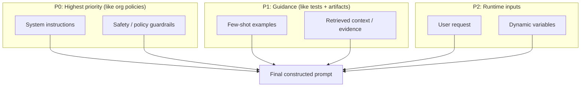

# Prompt engineering — reliability patterns (Azure/DevOps edition)

Prompting isn’t cute wording. It’s **interface + policy design** for a stochastic service.

**DevOps rule:** treat prompts like pipelines: **precedence**, **contracts**, **validation**, **threat model**, **regression tests**.

---

## The prompt hierarchy (aka “pipeline precedence”)

**Mini pop quiz:** If user text conflicts with system rules, who wins? → System/policy.

---

# Q1: What is prompt engineering, and why is it critical for AI applications?
- **Direct answer:** Designing system/user messages + constraints so the model is **predictable**, safe, and cost-efficient.
- **Azure/DevOps bridge:** It’s your **API contract** + quality gates.
- **Fashion analogy:** Styling with a strict dress code—beautiful *and* compliant.

---

# Q2: Explain zero-shot, one-shot, and few-shot prompting.
- **Direct answer:** Zero-shot = no examples; one-shot = 1 example; few-shot = several examples.
- **Trade-off:** More shots = more tokens = more cost/latency.

---

# Q3: What is chain-of-thought (CoT) prompting, and when should you use it?
- **Direct answer:** Encourage step-by-step reasoning. Use for complex reasoning; avoid exposing sensitive reasoning; prefer verifiable tools.

---

# Q4: Explain self-consistency prompting.
- **Direct answer:** Sample multiple solutions and pick the most consistent (vote/score).

---

# Q5: What is tree-of-thought prompting?
- **Direct answer:** Search multiple reasoning branches and prune; powerful but expensive.

---

# Q6: What is ReAct prompting?
- **Direct answer:** Reason → act (tool) → observe → repeat.
- **DevOps bridge:** It’s orchestration with tools (like a pipeline that can run tasks).

---

# Q7: What is a system prompt?
- **Direct answer:** Highest-priority instructions: role, constraints, format, refusal rules.
- **Common mistake:** putting secrets in prompts.

---

# Q8: How do you structure prompts for consistent structured output (JSON/XML)?
- **Direct answer:** Explicit schema + “ONLY JSON” + few-shot + constrained decoding / structured outputs when available.

---

# Q9: What is prompt injection, and how do you defend against it?
- **Direct answer:** Untrusted text tries to override instructions.
- **Defense:** delimit untrusted content, least-privilege tools, validation, red-team evals.

---

# Q10: What is jailbreaking? Common techniques?
- **Direct answer:** Attempts to bypass safety with role-play, obfuscation, multi-turn manipulation.

---

# Q11: How do you optimize prompts for cost and latency?
- **Direct answer:** Reduce tokens and retries; keep top-k retrieval small; prefer schemas over repair loops.

---

# Q12: Prompt engineering vs prompt tuning?
- **Direct answer:** Engineering = text instructions; tuning = learned “soft prompts”/vectors.

---

# Q13: What is a prompt template?
- **Direct answer:** Parameterized prompt with placeholders; version it like code.

---

# Q14: How do you handle multi-turn conversations?
- **Direct answer:** Summarize + keep key facts; don’t paste endless chat logs.

---

# Q15: What is role prompting?
- **Direct answer:** Assign a role to bias style; constraints still matter.

---

# Q16: What is prompt chaining?
- **Direct answer:** Multi-step prompts: extract → validate → decide → format.

---

# Q17: How do you evaluate and iterate on prompt quality?
- **Direct answer:** Build an eval set + regression tests; measure task success and format validity.

---

# Q18: What are meta-prompts?
- **Direct answer:** Prompts that generate prompts (useful, but can reduce determinism).

---

# Q19: Common prompting failure modes and debugging?
- **Direct answer:** Hallucination, format drift, instruction failure, verbosity, tool misuse. Fix via tighter contracts + evals.

---

# Q20: Edge cases and adversarial inputs?
- **Direct answer:** Treat like API threat model: validation, allow-lists, monitoring.

---

# Q21: Lost-in-the-middle in long-context prompting?
- **Direct answer:** Middle content is used less reliably. Put best chunks at top/bottom; keep prompts short.

---

# Q22: What are output parsers?
- **Direct answer:** Validate/normalize output into typed structures; prevents stringly-typed chaos.

---

# Q23: Multi-language prompting effectively?
- **Direct answer:** Keep instructions consistent; use multilingual models/embeddings; budget for token tax.

---

# Q24: Few-shot inconsistent—how stabilize?
- **Fix:** normalize inputs; curate/reorder examples; reduce temperature; add schemas.

---

# Q25: Classification too sensitive to wording—reduce sensitivity.
- **Fix:** constrain label set; add counterexamples; structured output; eval-driven iteration.

---

# Q26: System prompt leaks—how prevent?
- **Direct answer:** Don’t store secrets in prompts; separate policy from data; use server-side rules.

---

# Q27: Agent prompt-injection defenses?
- **Direct answer:** treat tool inputs as untrusted; validate args; sandbox tools; log/audit.

---

# Q28: CoT not improving accuracy—what fix?
- **Fix:** decompose task; add verifiers/tools; ensure needed context via RAG.

---

# Q29: Works in English but fails elsewhere—multilingual support?
- **Fix:** locale-specific examples + evals; retrieval in target language; multilingual embeddings.

---

# Q30: Zero-shot cross-lingual transfer fails—how fix?
- **Fix:** translate, add few-shot per language, or fine-tune adapters.

## Rapid Recall

### Direct answer
- Direct Answer: Designing system/user messages + constraints so the model is predictable, safe, and cost-efficient.
- Why: This matters because it tells you how to reason about direct answer.
- Pitfall: Don't answer "Direct answer" by naming the concept alone; state the mechanism and tradeoff.
- Interview line: Say: Designing system/user messages + constraints so the model is predictable, safe, and cost-efficient.

### Azure/DevOps bridge
- Direct Answer: It’s your API contract + quality gates.
- Why: This matters because it tells you how to reason about azure/devops bridge.
- Pitfall: Don't answer "Azure/DevOps bridge" by naming the concept alone; state the mechanism and tradeoff.
- Interview line: Say: It’s your API contract + quality gates.

### Fashion analogy
- Direct Answer: Styling with a strict dress code—beautiful and compliant.
- Why: This matters because it tells you how to reason about fashion analogy.
- Pitfall: Don't answer "Fashion analogy" by naming the concept alone; state the mechanism and tradeoff.
- Interview line: Say: Styling with a strict dress code—beautiful and compliant.

### Direct answer
- Direct Answer: Zero-shot = no examples; one-shot = 1 example; few-shot = several examples.
- Why: This matters because it tells you how to reason about direct answer.
- Pitfall: Don't answer "Direct answer" by naming the concept alone; state the mechanism and tradeoff.
- Interview line: Say: Zero-shot = no examples; one-shot = 1 example; few-shot = several examples.

### Trade-off
- Direct Answer: More shots = more tokens = more cost/latency.
- Why: This matters because it tells you how to reason about trade-off.
- Pitfall: Don't answer "Trade-off" by naming the concept alone; state the mechanism and tradeoff.
- Interview line: Say: More shots = more tokens = more cost/latency.

### Direct answer
- Direct Answer: Encourage step-by-step reasoning. Use for complex reasoning; avoid exposing sensitive reasoning; prefer verifiable tools.
- Why: This matters because it tells you how to reason about direct answer.
- Pitfall: Don't answer "Direct answer" by naming the concept alone; state the mechanism and tradeoff.
- Interview line: Say: Encourage step-by-step reasoning. Use for complex reasoning; avoid exposing sensitive reasoning; prefer verifiable tools.

### Direct answer
- Direct Answer: Sample multiple solutions and pick the most consistent (vote/score).
- Why: This matters because it tells you how to reason about direct answer.
- Pitfall: Don't answer "Direct answer" by naming the concept alone; state the mechanism and tradeoff.
- Interview line: Say: Sample multiple solutions and pick the most consistent (vote/score).

### Direct answer
- Direct Answer: Search multiple reasoning branches and prune; powerful but expensive.
- Why: This matters because it tells you how to reason about direct answer.
- Pitfall: Don't answer "Direct answer" by naming the concept alone; state the mechanism and tradeoff.
- Interview line: Say: Search multiple reasoning branches and prune; powerful but expensive.

### Direct answer
- Direct Answer: Reason → act (tool) → observe → repeat.
- Why: This matters because it tells you how to reason about direct answer.
- Pitfall: Don't answer "Direct answer" by naming the concept alone; state the mechanism and tradeoff.
- Interview line: Say: Reason → act (tool) → observe → repeat.

### DevOps bridge
- Direct Answer: It’s orchestration with tools (like a pipeline that can run tasks).
- Why: This matters because it tells you how to reason about devops bridge.
- Pitfall: Don't answer "DevOps bridge" by naming the concept alone; state the mechanism and tradeoff.
- Interview line: Say: It’s orchestration with tools (like a pipeline that can run tasks).

### Direct answer
- Direct Answer: Highest-priority instructions: role, constraints, format, refusal rules.
- Why: This matters because it tells you how to reason about direct answer.
- Pitfall: Don't answer "Direct answer" by naming the concept alone; state the mechanism and tradeoff.
- Interview line: Say: Highest-priority instructions: role, constraints, format, refusal rules.

### Common mistake
- Direct Answer: putting secrets in prompts.
- Why: This matters because it tells you how to reason about common mistake.
- Pitfall: Don't answer "Common mistake" by naming the concept alone; state the mechanism and tradeoff.
- Interview line: Say: putting secrets in prompts.

### Direct answer
- Direct Answer: Explicit schema + “ONLY JSON” + few-shot + constrained decoding / structured outputs when available.
- Why: This matters because it tells you how to reason about direct answer.
- Pitfall: Don't answer "Direct answer" by naming the concept alone; state the mechanism and tradeoff.
- Interview line: Say: Explicit schema + “ONLY JSON” + few-shot + constrained decoding / structured outputs when available.

### Direct answer
- Direct Answer: Untrusted text tries to override instructions.
- Why: This matters because it tells you how to reason about direct answer.
- Pitfall: Don't answer "Direct answer" by naming the concept alone; state the mechanism and tradeoff.
- Interview line: Say: Untrusted text tries to override instructions.

### Defense
- Direct Answer: delimit untrusted content, least-privilege tools, validation, red-team evals.
- Why: This matters because it tells you how to reason about defense.
- Pitfall: Don't answer "Defense" by naming the concept alone; state the mechanism and tradeoff.
- Interview line: Say: delimit untrusted content, least-privilege tools, validation, red-team evals.

### Direct answer
- Direct Answer: Attempts to bypass safety with role-play, obfuscation, multi-turn manipulation.
- Why: This matters because it tells you how to reason about direct answer.
- Pitfall: Don't answer "Direct answer" by naming the concept alone; state the mechanism and tradeoff.
- Interview line: Say: Attempts to bypass safety with role-play, obfuscation, multi-turn manipulation.

### Direct answer
- Direct Answer: Reduce tokens and retries; keep top-k retrieval small; prefer schemas over repair loops.
- Why: This matters because it tells you how to reason about direct answer.
- Pitfall: Don't answer "Direct answer" by naming the concept alone; state the mechanism and tradeoff.
- Interview line: Say: Reduce tokens and retries; keep top-k retrieval small; prefer schemas over repair loops.

### Direct answer
- Direct Answer: Engineering = text instructions; tuning = learned “soft prompts”/vectors.
- Why: This matters because it tells you how to reason about direct answer.
- Pitfall: Don't answer "Direct answer" by naming the concept alone; state the mechanism and tradeoff.
- Interview line: Say: Engineering = text instructions; tuning = learned “soft prompts”/vectors.

### Direct answer
- Direct Answer: Parameterized prompt with placeholders; version it like code.
- Why: This matters because it tells you how to reason about direct answer.
- Pitfall: Don't answer "Direct answer" by naming the concept alone; state the mechanism and tradeoff.
- Interview line: Say: Parameterized prompt with placeholders; version it like code.

### Direct answer
- Direct Answer: Summarize + keep key facts; don’t paste endless chat logs.
- Why: This matters because it tells you how to reason about direct answer.
- Pitfall: Don't answer "Direct answer" by naming the concept alone; state the mechanism and tradeoff.
- Interview line: Say: Summarize + keep key facts; don’t paste endless chat logs.

### Direct answer
- Direct Answer: Assign a role to bias style; constraints still matter.
- Why: This matters because it tells you how to reason about direct answer.
- Pitfall: Don't answer "Direct answer" by naming the concept alone; state the mechanism and tradeoff.
- Interview line: Say: Assign a role to bias style; constraints still matter.

### Direct answer
- Direct Answer: Multi-step prompts: extract → validate → decide → format.
- Why: This matters because it tells you how to reason about direct answer.
- Pitfall: Don't answer "Direct answer" by naming the concept alone; state the mechanism and tradeoff.
- Interview line: Say: Multi-step prompts: extract → validate → decide → format.

### Direct answer
- Direct Answer: Build an eval set + regression tests; measure task success and format validity.
- Why: This matters because it tells you how to reason about direct answer.
- Pitfall: Don't answer "Direct answer" by naming the concept alone; state the mechanism and tradeoff.
- Interview line: Say: Build an eval set + regression tests; measure task success and format validity.

### Direct answer
- Direct Answer: Prompts that generate prompts (useful, but can reduce determinism).
- Why: This matters because it tells you how to reason about direct answer.
- Pitfall: Don't answer "Direct answer" by naming the concept alone; state the mechanism and tradeoff.
- Interview line: Say: Prompts that generate prompts (useful, but can reduce determinism).

### Direct answer
- Direct Answer: Hallucination, format drift, instruction failure, verbosity, tool misuse. Fix via tighter contracts + evals.
- Why: This matters because it tells you how to reason about direct answer.
- Pitfall: Don't answer "Direct answer" by naming the concept alone; state the mechanism and tradeoff.
- Interview line: Say: Hallucination, format drift, instruction failure, verbosity, tool misuse. Fix via tighter contracts + evals.

### Direct answer
- Direct Answer: Treat like API threat model: validation, allow-lists, monitoring.
- Why: This matters because it tells you how to reason about direct answer.
- Pitfall: Don't answer "Direct answer" by naming the concept alone; state the mechanism and tradeoff.
- Interview line: Say: Treat like API threat model: validation, allow-lists, monitoring.

### Direct answer
- Direct Answer: Middle content is used less reliably. Put best chunks at top/bottom; keep prompts short.
- Why: This matters because it tells you how to reason about direct answer.
- Pitfall: Don't answer "Direct answer" by naming the concept alone; state the mechanism and tradeoff.
- Interview line: Say: Middle content is used less reliably. Put best chunks at top/bottom; keep prompts short.

### Direct answer
- Direct Answer: Validate/normalize output into typed structures; prevents stringly-typed chaos.
- Why: This matters because it tells you how to reason about direct answer.
- Pitfall: Don't answer "Direct answer" by naming the concept alone; state the mechanism and tradeoff.
- Interview line: Say: Validate/normalize output into typed structures; prevents stringly-typed chaos.

### Direct answer
- Direct Answer: Keep instructions consistent; use multilingual models/embeddings; budget for token tax.
- Why: This matters because it tells you how to reason about direct answer.
- Pitfall: Don't answer "Direct answer" by naming the concept alone; state the mechanism and tradeoff.
- Interview line: Say: Keep instructions consistent; use multilingual models/embeddings; budget for token tax.

### Fix
- Direct Answer: normalize inputs; curate/reorder examples; reduce temperature; add schemas.
- Why: This matters because it tells you how to reason about fix.
- Pitfall: Don't answer "Fix" by naming the concept alone; state the mechanism and tradeoff.
- Interview line: Say: normalize inputs; curate/reorder examples; reduce temperature; add schemas.

### Fix
- Direct Answer: constrain label set; add counterexamples; structured output; eval-driven iteration.
- Why: This matters because it tells you how to reason about fix.
- Pitfall: Don't answer "Fix" by naming the concept alone; state the mechanism and tradeoff.
- Interview line: Say: constrain label set; add counterexamples; structured output; eval-driven iteration.

### Direct answer
- Direct Answer: Don’t store secrets in prompts; separate policy from data; use server-side rules.
- Why: This matters because it tells you how to reason about direct answer.
- Pitfall: Don't answer "Direct answer" by naming the concept alone; state the mechanism and tradeoff.
- Interview line: Say: Don’t store secrets in prompts; separate policy from data; use server-side rules.

### Direct answer
- Direct Answer: treat tool inputs as untrusted; validate args; sandbox tools; log/audit.
- Why: This matters because it tells you how to reason about direct answer.
- Pitfall: Don't answer "Direct answer" by naming the concept alone; state the mechanism and tradeoff.
- Interview line: Say: treat tool inputs as untrusted; validate args; sandbox tools; log/audit.

### Fix
- Direct Answer: decompose task; add verifiers/tools; ensure needed context via RAG.
- Why: This matters because it tells you how to reason about fix.
- Pitfall: Don't answer "Fix" by naming the concept alone; state the mechanism and tradeoff.
- Interview line: Say: decompose task; add verifiers/tools; ensure needed context via RAG.

### Fix
- Direct Answer: locale-specific examples + evals; retrieval in target language; multilingual embeddings.
- Why: This matters because it tells you how to reason about fix.
- Pitfall: Don't answer "Fix" by naming the concept alone; state the mechanism and tradeoff.
- Interview line: Say: locale-specific examples + evals; retrieval in target language; multilingual embeddings.

### Fix
- Direct Answer: translate, add few-shot per language, or fine-tune adapters.
- Why: This matters because it tells you how to reason about fix.
- Pitfall: Don't answer "Fix" by naming the concept alone; state the mechanism and tradeoff.
- Interview line: Say: translate, add few-shot per language, or fine-tune adapters.
