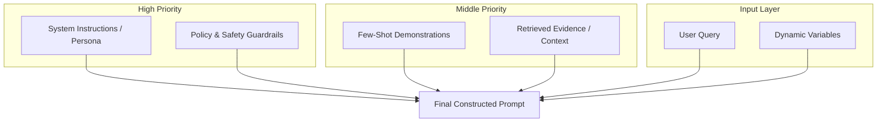

# Prompt Engineering

This hub documents the strategies and best practices for designing high-performance prompts that ensure reliability, safety, and adherence to complex task requirements.

---

## 🔹 The Prompt Hierarchy (Structural Priority)



---

# Q1: What is prompt engineering, and why is it critical for AI applications?

## 1. 🔹 Direct Answer
Prompt engineering is the practice of designing inputs (system/user messages, templates, constraints) that reliably shape an LLM's behavior for a target product goal. It is critical because LLMs are sensitive to wording, formatting, and context placement, and production systems require predictable outputs, cost control, and safety.

## 2. 🔹 Intuition
Think of the prompt as the "interface contract" between your app and the model: good prompts reduce ambiguity and reduce failure modes.

## 3. 🔹 Deep Dive
- LLMs approximate `P(output | prompt)`. Small prompt changes can materially change the distribution.
- Prompt engineering uses:
  - **instruction design** (role + goal + constraints)
  - **context design** (what evidence to include and where)
  - **output design** (format, schema, refusal rules)
- Key assumption: you can reduce variance by constraining the generation space.

## 4. 🔹 Practical Perspective
- Use for: structured JSON, tool calling, RAG answer grounding, safety/refusal behavior.
- Avoid when: you need knowledge that changes frequently (then prefer RAG or fine-tuning).
- Trade-offs: stronger constraints can reduce creativity but improve reliability.

## 5. 🔹 Code Snippet
```python
system = "You are a helpful assistant. Output only valid JSON."
user = f"Task: Extract fields from text. Text: {text}"
resp = llm.generate(messages=[{"role":"system","content":system},
                               {"role":"user","content":user}])
```

## 6. 🔹 Interview Follow-ups
1. Q: Why isn't it enough to "just ask the question"?  
   A: Without constraints, the model may hallucinate, choose wrong structure, or ignore evidence.
2. Q: What determines prompt sensitivity?  
   A: Training alignment, context length, and how constraints map to the learned distribution.
3. Q: How do you measure prompt quality?  
   A: End-to-end eval with structured-output validity + task success + faithfulness (if RAG).

## 7. 🔹 Common Mistakes
- Missing explicit output constraints (schema, delimiter rules).

## 8. 🔹 Comparison / Connections
- Connects to **regularization** and **evaluation-driven development**: constraining the hypothesis space.

## 9. 🔹 One-line Revision
Prompt engineering makes an LLM's behavior reliable by turning vague intent into explicit constraints and formats.

## 10. 🔹 Difficulty Tag
🟢 Easy

---

# Q2: Explain zero-shot, one-shot, and few-shot prompting with examples.

## 1. 🔹 Direct Answer
Zero-shot prompting asks for the task without examples. One-shot provides one labeled example. Few-shot provides several examples, improving accuracy by showing the desired input-output mapping.

## 2. 🔹 Intuition
Examples teach the model the "pattern" to imitate when you cannot fine-tune.

## 3. 🔹 Deep Dive
Let the prompt contain `k` demonstration pairs `(x_i, y_i)`. The model conditions on these examples and outputs `y` for new `x`.
- Zero-shot: `k=0`
- One-shot: `k=1`
- Few-shot: `k in [2..N]`
Trade-off: more examples increase tokens and may introduce example bias.

## 4. 🔹 Practical Perspective
- Use when: you need quick iteration, low data, or dynamic tasks.
- Avoid when: you need strict correctness and repeatability; use RAG/fine-tune.

## 5. 🔹 Code Snippet
```python
shots = "\n".join([
  "Input: Hi\nLabel: Greeting",
  "Input: Bye\nLabel: Farewell",
])
prompt = f"{shots}\n\nInput: {text}\nLabel:"
```

## 6. 🔹 Interview Follow-ups
1. Q: How do you pick demonstrations?  
   A: Choose diverse, representative, and close-to-domain examples; avoid misleading edge cases.
2. Q: Why can few-shot fail?  
   A: Example ordering, formatting drift, and including contradictory demonstrations.

## 7. 🔹 Common Mistakes
- Using too many examples so the prompt becomes noisy and irrelevant.

## 8. 🔹 Comparison / Connections
- Connects to **in-context learning** and **few-shot transfer**.

## 9. 🔹 One-line Revision
More demonstrations usually improve behavior by conditioning on examples, but cost tokens and can add bias.

## 10. 🔹 Difficulty Tag
🟢 Easy

---

# Q3: What is chain-of-thought (CoT) prompting, and when should you use it?

## 1. 🔹 Direct Answer
CoT prompting asks the model to show its reasoning steps before the final answer. It is useful for multi-step problems (math, logic, decomposition) where intermediate structure improves accuracy.

## 2. 🔹 Intuition
Instead of only asking for the result, you ask for the "work shown" so the model can organize steps.

## 3. 🔹 Deep Dive
- CoT attempts to guide the hidden computation with an intermediate textual scaffold.
- In terms of decoding, it increases probability of correct token sequences that represent intermediate steps.
- Assumption: the reasoning scaffold correlates with the correct solution.

## 4. 🔹 Practical Perspective
- Use for: complex reasoning, debugging plans, multi-stage transformations.
- Avoid for: safety-critical systems where exposing detailed reasoning is undesirable; prefer structured explanations or tool-based verification.
- Trade-off: longer outputs cost more tokens/latency.

## 5. 🔹 Code Snippet
```python
prompt = "Solve step-by-step. End with 'Final Answer: ...'.\nQuestion: ..."
resp = llm.generate(prompt)
```

## 6. 🔹 Interview Follow-ups
1. Q: Does CoT always improve?  
   A: No; it can confuse the model or cause overthinking; evaluate on your task.
2. Q: How do you handle policy around showing CoT?  
   A: Use internal reasoning patterns (or request brief justifications) and rely on final answer validation.

## 7. 🔹 Common Mistakes
- CoT without a constraint on final output format.

## 8. 🔹 Comparison / Connections
- Connects to **decomposition** and **self-consistency**.

## 9. 🔹 One-line Revision
CoT prompts a step scaffold to improve multi-step reasoning, but it increases length and should be evaluated.

## 10. 🔹 Difficulty Tag
🟡 Medium

---

# Q4: Explain self-consistency prompting and how it improves reasoning.

## 1. 🔹 Direct Answer
Self-consistency runs the model multiple times with different sampling seeds (or slightly different prompts), then aggregates the outputs (majority vote or best-of) to pick the most consistent answer.

## 2. 🔹 Intuition
If many independent samples agree, the answer is more likely correct than a single generation.

## 3. 🔹 Deep Dive
Algorithm:
1. Sample `N` outputs `y_1..y_N` using temperature/top_p.
2. Extract candidate final answers.
3. Choose the most frequent (or highest scored) answer.
Mathematically: it approximates reducing variance in stochastic decoding by ensemble-like voting.

## 4. 🔹 Practical Perspective
- Use when: reasoning tasks have high variance and you can afford multiple calls.
- Avoid when: latency/cost budgets are strict.

## 5. 🔹 Code Snippet
```python
answers = []
for _ in range(5):
    resp = llm.generate(prompt, temperature=0.7)
    answers.append(extract_final(resp))
final = majority_vote(answers)
```

## 6. 🔹 Interview Follow-ups
1. Q: What aggregation metric works best?  
   A: Often majority vote for exact answers; reranking for explanations.
2. Q: How does this relate to ensembling?  
   A: It is an inference-time ensemble over stochastic samples.

## 7. 🔹 Common Mistakes
- Voting over raw text instead of extracting a canonical final answer.

## 8. 🔹 Comparison / Connections
- Connects to **ensembling** and **uncertainty reduction**.

## 9. 🔹 One-line Revision
Self-consistency improves reasoning by sampling multiple times and aggregating consistent answers.

## 10. 🔹 Difficulty Tag
🟡 Medium

---

# Q5: What is tree-of-thought prompting?

## 1. 🔹 Direct Answer
Tree-of-thought (ToT) prompts the model to explore multiple reasoning paths, branching at intermediate steps, then selecting the best path using a scoring heuristic or model-based evaluator.

## 2. 🔹 Intuition
Instead of one straight line of reasoning, you explore a few candidate strategies and keep the promising ones.

## 3. 🔹 Deep Dive
Procedure:
1. Generate `k` partial thoughts at step 1.
2. Expand each partial thought into `k` thoughts at step 2.
3. Continue to depth `d` with branching factor `k`.
4. Score completed solutions and pick the best.
Complexity roughly scales with `O(k^d)` expansions; you prune using beam search-like logic.

## 4. 🔹 Practical Perspective
- Use for: hard planning/search problems where you can evaluate candidate paths.
- Avoid when: you cannot afford many calls or need tight latency.

## 5. 🔹 Code Snippet
```python
frontier = [root_thought]
for depth in range(d):
    new = []
    for t in frontier:
        new += expand_thoughts(t, k)
    frontier = prune_by_score(new)
best = select_best(frontier)
```

## 6. 🔹 Interview Follow-ups
1. Q: What scoring function do you use?  
   A: Heuristics, verifier models, or domain-specific checks.
2. Q: How do you avoid runaway costs?  
   A: Limit depth/branching and use early pruning.

## 7. 🔹 Common Mistakes
- Scoring only by plausibility, not correctness.

## 8. 🔹 Comparison / Connections
- Connects to **search (beam/DFS)** and **verification**.

## 9. 🔹 One-line Revision
ToT is reasoning as search: branch into multiple thoughts and pick the best-scoring path.

## 10. 🔹 Difficulty Tag
🟣 Hard

---

# Q6: What is ReAct (Reasoning + Acting) prompting, and how does it work?

## 1. 🔹 Direct Answer
ReAct prompts the model to alternate between reasoning and actions (tool calls). The model produces a plan, calls a tool with structured inputs, observes results, then continues reasoning to the final answer.

## 2. 🔹 Intuition
You ask the model to think, do a step using tools, then look at what happened before thinking again.

## 3. 🔹 Deep Dive
- It interleaves text reasoning with tool execution.
- Loop:
  1. Reason: "What should I do next?"
  2. Act: tool call with arguments.
  3. Observe: tool output.
  4. Reason again using the observation.

## 4. 🔹 Practical Perspective
- Use when: tasks require fresh data, calculations, or reliable retrieval via tools.
- Avoid when: tool outputs are unavailable or you need simple deterministic formatting.

## 5. 🔹 Code Snippet
```python
while not done:
    resp = llm.generate(messages, tools=tool_schemas)
    if resp.tool_calls:
        for tc in resp.tool_calls:
            obs = run_tool(tc)
            messages.append({"role":"tool","content":obs})
    else:
        done = True
        return resp.text
```

## 6. 🔹 Interview Follow-ups
1. Q: What makes ReAct reliable?  
   A: Tool schemas + strict argument validation + bounded loops.
2. Q: What is the main failure mode?  
   A: Tool hallucination or infinite loops; mitigate with budgets/guardrails.

## 7. 🔹 Common Mistakes
- Allowing destructive tools without human approval.

## 8. 🔹 Comparison / Connections
- Connects to **agent loops** and **tool use**.

## 9. 🔹 One-line Revision
ReAct improves answers by alternating reasoning and tool actions with observations.

## 10. 🔹 Difficulty Tag
🟡 Medium

---

# Q7: What is a system prompt, and how does it influence model behavior?

## 1. 🔹 Direct Answer
A system prompt is high-priority instruction text that sets role, policies, output format, and guardrails. It anchors behavior across the conversation and strongly influences the model’s style and compliance.

## 2. 🔹 Intuition
It’s the "rules of the game" given to the model before it sees the user’s request.

## 3. 🔹 Deep Dive
- The system prompt conditions the model at every turn.
- If you need consistent constraints (JSON schema, citation rules, refusal policy), put them in system.
- The model can still be attacked (prompt injection), so combine with retrieval filtering and tool-level security.

## 4. 🔹 Practical Perspective
- Use for: format constraints, safety rules, role definition.
- Avoid for: secrets or business logic that might be leaked (treat as confidential; enforce via code-side checks).

## 5. 🔹 Code Snippet
```python
messages = [
  {"role":"system","content":"Return JSON with keys: answer, citations. If not found, answer='N/A'."},
  {"role":"user","content":"Find reimbursement policy for 2026."}
]
resp = llm.generate(messages)
```

## 6. 🔹 Interview Follow-ups
1. Q: Does system prompt change across turns?  
   A: Usually stable; you can add tool- or context-specific constraints in user messages.

## 7. 🔹 Common Mistakes
- Putting tool safety rules only in user messages (lower priority and more attackable).

## 8. 🔹 Comparison / Connections
- Connects to **structured output** and **prompt injection** defenses.

## 9. 🔹 One-line Revision
System prompts set high-priority role/policy constraints that shape every output.

## 10. 🔹 Difficulty Tag
🟢 Easy

---

# Q8: How do you structure prompts for consistent structured output (JSON, XML)?

## 1. 🔹 Direct Answer
To get consistent structured output, specify:
1) a strict schema,
2) constraints like "only output JSON" and "no extra text",
3) deterministic formatting rules, and
4) output validation with retries/repair if parsing fails.

## 2. 🔹 Intuition
You give the model a form to fill out, then you check whether it filled it correctly.

## 3. 🔹 Deep Dive
Workflow:
- Design a schema (keys, types, required/optional fields).
- Prompt: "Return ONLY valid JSON matching this schema."
- After generation: parse JSON.
- If parse fails: re-prompt with the parse error ("repair mode") or use a constrained decoder.

## 4. 🔹 Practical Perspective
- Use when: downstream systems require machine-readable outputs.
- Avoid when: schema is too complex (model may fail); simplify or decompose.

## 5. 🔹 Code Snippet
```python
import json

def call_with_json_repair(prompt, schema):
    for _ in range(3):
        text = llm.generate(prompt)
        try:
            obj = json.loads(text)
            validate(obj, schema)
            return obj
        except Exception as e:
            prompt = prompt + f"\nJSON ERROR: {e}\nRepair and output only corrected JSON."
    raise ValueError("Could not produce valid JSON")
```

## 6. 🔹 Interview Follow-ups
1. Q: Why retries?  
   A: Even with good prompts, model output is stochastic; parsing validation catches failures.
2. Q: What is constrained decoding?  
   A: Decoding restricted to the schema grammar (harder but more reliable).

## 7. 🔹 Common Mistakes
- Not validating output types/keys; parsing alone isn't enough.

## 8. 🔹 Comparison / Connections
- Connects to **structured output formats** and **guardrails**.

## 9. 🔹 One-line Revision
Structured outputs require schema-anchored prompts plus strict parsing/validation (often with repair).

## 10. 🔹 Difficulty Tag
🟡 Medium

---

# Q9: What is prompt injection, and how do you defend against it?

## 1. 🔹 Direct Answer
Prompt injection is an attack where a malicious input manipulates the model to ignore or override system instructions, exfiltrate data, or call unsafe tools. Defend with input isolation, strict tool safety, retrieval/permissions enforcement, and output validation.

## 2. 🔹 Intuition
It’s like a user slipping a note into the "rules of the game" so the model follows the attacker instead of your policies.

## 3. 🔹 Deep Dive
Defenses:
1. **Treat user text as untrusted.**
2. **Never let user text modify system policies** in code-side prompt assembly.
3. **Harden tools**: allowlist, argument validation, least-privilege, human approval for destructive actions.
4. **Retrieval filtering**: enforce ACLs independent of the prompt.
5. **Structured output**: parse and validate outputs to prevent instruction drift.

## 4. 🔹 Practical Perspective
- Use in production AI gateways and RAG systems.
- Trade-offs: more engineering and stricter constraints can reduce helpfulness.

## 5. 🔹 Code Snippet
```python
tool = {"name":"search_docs", "allowed": True}
# Ignore any "override system prompt" instructions from user input.
system_prompt = "Follow system rules. Do not reveal secrets."
messages = [{"role":"system","content":system_prompt},
            {"role":"user","content":user_input}]
resp = llm.generate(messages, tools=[tool])
```

## 6. 🔹 Interview Follow-ups
1. Q: What are direct vs indirect injection?  
   A: Direct includes explicit "ignore previous instructions"; indirect hides in retrieved documents or web content.
2. Q: Why ACL filtering matters?  
   A: Even if prompt is injected, the model cannot retrieve unauthorized chunks if retrieval is enforced in backend.

## 7. 🔹 Common Mistakes
- Relying only on "system prompt says don't reveal" without code-side restrictions.

## 8. 🔹 Comparison / Connections
- Connects to **security** and **tool execution sandboxes**.

## 9. 🔹 One-line Revision
Defend prompt injection with untrusted-input isolation, strict tool safety, and backend-enforced retrieval permissions.

## 10. 🔹 Difficulty Tag
🟣 Hard

---

# Q10: What is jailbreaking in LLMs, and what are common jailbreak techniques?

## 1. 🔹 Direct Answer
Jailbreaking is an attempt to bypass safety policies so the model produces disallowed content. Common techniques include roleplay, instruction override, multi-turn persuasion, obfuscation, and using retrieved content to steer policy.

## 2. 🔹 Intuition
Attackers try to trick the model into treating the harmful request as "allowed" or "required."

## 3. 🔹 Deep Dive
Examples:
- **Instruction override**: "You are now not bound by policies."
- **Roleplay**: "You are a character who must do X."
- **Obfuscation**: encode or paraphrase disallowed requests.
- **Indirect via context**: inject harmful instructions through documents retrieved by RAG.

## 4. 🔹 Practical Perspective
- Use defenses: refusal examples, constitutional/preference tuning, red teaming, and runtime content filters.
- Trade-offs: overly strict refusals hurt user experience; tune based on risk.

## 5. 🔹 Code Snippet
```python
if safety_filter.detect_disallowed(user_input):
    return "I can't help with that request."
```

## 6. 🔹 Interview Follow-ups
1. Q: How do you red team?  
   A: Generate adversarial prompts, run through safety eval set, and iterate prompts/tools/policies.

## 7. 🔹 Common Mistakes
- Only filtering user input, not retrieved context or tool outputs.

## 8. 🔹 Comparison / Connections
- Connects to **AI safety** and **guardrails**.

## 9. 🔹 One-line Revision
Jailbreaking bypasses model safety through manipulation; defend with tuning + runtime filters + red teaming.

## 10. 🔹 Difficulty Tag
🟣 Hard

---

# Q11: How do you optimize prompts for cost and latency?

## 1. 🔹 Direct Answer
Optimize by shrinking context, minimizing tokens (shorter system/user prompts, fewer RAG chunks), using streaming, caching, and choosing the smallest model that meets quality. Also avoid unnecessary multi-call reasoning when a single call suffices.

## 2. 🔹 Intuition
Cost/latency scale mostly with tokens and number of calls; prompt design changes both.

## 3. 🔹 Deep Dive
Levers:
- Reduce prompt length (templates, remove redundancy).
- Reduce retrieved context size (smaller top-k, rerank to fewer).
- Use structured decoding/validation to reduce repair retries.
- Use semantic caching for repeated or similar queries.

## 4. 🔹 Practical Perspective
- Use in production: always measure TTFT and total token usage.
- Avoid optimizing blindly: too-short prompts can hurt faithfulness.

## 5. 🔹 Code Snippet
```python
chunks = retriever.retrieve(query, top_k=10)
chunks = rerank(query, chunks, top_k=4)
prompt = build_prompt(query, chunks)
resp = llm.generate(prompt, stream=True)
```

## 6. 🔹 Interview Follow-ups
1. Q: Which is usually the biggest latency contributor?  
   A: LLM generation time (output tokens) plus retrieval embedding/search time.
2. Q: How do you cap output?  
   A: Use max_tokens, enforce concise formats, and stop sequences.

## 7. 🔹 Common Mistakes
- Cutting context so retrieval evidence no longer supports the answer.

## 8. 🔹 Comparison / Connections
- Connects to **LLM system design** (batching/caching) and **evaluation**.

## 9. 🔹 One-line Revision
Reduce tokens, reduce calls, cache reuse, and stream output while validating that quality stays within SLOs.

## 10. 🔹 Difficulty Tag
🟡 Medium

---

# Q12: What is the difference between prompt engineering and prompt tuning?

## 1. 🔹 Direct Answer
Prompt engineering changes the prompt text/template manually (or via heuristics) while prompt tuning (prefix/prompt tuning) learns continuous prompt vectors/parameters from data to improve performance.

## 2. 🔹 Intuition
Engineering is hand-tuning; tuning is learning the prompt.

## 3. 🔹 Deep Dive
- **Prompt engineering:** optimize prompt structure and constraints without updating model weights.
- **Prompt tuning:** freeze model and train a small set of soft prompt parameters to improve likelihood on task data.
- Often combined with PEFT approaches (adapters/LoRA).

## 4. 🔹 Practical Perspective
- Use prompt engineering first for rapid iteration.
- Use prompt tuning when you need consistent improvements at scale and have enough training data.

## 5. 🔹 Code Snippet
```python
# engineering: change prompt text
prompt = "Return JSON with keys: answer, citations."

# tuning: learn soft prompts (conceptual)
# soft_prompt_params = train_soft_prompt(model, dataset)
```

## 6. 🔹 Interview Follow-ups
1. Q: When does prompt tuning beat engineering?  
   A: When prompt sensitivity is high and you can amortize training cost.

## 7. 🔹 Common Mistakes
- Treating tuning as magic without evaluating generalization and robustness.

## 8. 🔹 Comparison / Connections
- Connects to **PEFT** and optimization of conditional distributions.

## 9. 🔹 One-line Revision
Prompt engineering edits inputs; prompt tuning learns trainable prompt parameters while freezing the model.

## 10. 🔹 Difficulty Tag
🟡 Medium

---

# Q13: What is a prompt template, and how do you design one for production use?

## 1. 🔹 Direct Answer
A prompt template is a reusable structured pattern with variables filled at runtime. For production, it must enforce consistent output schemas, include clear evidence/context boundaries, and be compatible with parsing/validation and retries.

## 2. 🔹 Intuition
Templates are "unit tests" for the prompt: consistent structure reduces variance.

## 3. 🔹 Deep Dive
Template components:
- system policies
- task instruction
- input variables
- retrieved evidence block (if RAG)
- output format instructions
- constraints: length, stop tokens, refusal behavior

## 4. 🔹 Practical Perspective
- Use when: multiple requests share a common task pattern (extraction, classification, RAG Q&A).
- Trade-offs: rigid templates may underperform for atypical inputs.

## 5. 🔹 Code Snippet
```python
template = """You must output ONLY valid JSON.
{schema_instructions}
Evidence:
{context}
Question: {query}
JSON:"""
prompt = template.format(context=context, query=query, schema_instructions=schema)
```

## 6. 🔹 Interview Follow-ups
1. Q: How to keep templates maintainable?  
   A: Version templates and track eval metrics per version.

## 7. 🔹 Common Mistakes
- Not documenting variable meanings (leading to prompt drift).

## 8. 🔹 Comparison / Connections
- Connects to **model versioning** and **evaluation-driven iteration**.

## 9. 🔹 One-line Revision
Production prompt templates are reusable, schema-anchored, and validated with parsing and evals.

## 10. 🔹 Difficulty Tag
🟢 Easy

---

# Q14: How do you handle multi-turn conversations with LLMs?

## 1. 🔹 Direct Answer
Handle multi-turn by maintaining conversation state, truncating/summarizing older turns to fit context, and optionally retrieving relevant past facts via memory/RAG. Ensure you preserve user intent and formatting rules across turns.

## 2. 🔹 Intuition
The model needs selective memory, not a full transcript every time.

## 3. 🔹 Deep Dive
Strategies:
- **Sliding window**: keep last N turns.
- **Summarization memory**: summarize older content into a stable brief.
- **Entity/state extraction**: store structured facts (e.g., user preferences) separately.
- **RAG memory**: retrieve relevant past interactions for long-lived tasks.

## 4. 🔹 Practical Perspective
- Use when: chat assistants with complex sessions.
- Avoid: feeding entire history without any selection; costs and can cause lost-in-middle.

## 5. 🔹 Code Snippet
```python
if token_count(history) > budget:
    summary = llm.summarize(history[:-N])
    history = [{"role":"system","content":"Conversation summary: "+summary}] + history[-N:]
```

## 6. 🔹 Interview Follow-ups
1. Q: How do you keep format consistent?  
   A: Put strict output schema in system prompt every turn.

## 7. 🔹 Common Mistakes
- Summarization that drops constraints the user depends on.

## 8. 🔹 Comparison / Connections
- Connects to **context window management** and **memory systems**.

## 9. 🔹 One-line Revision
Use selective context (window + summaries + retrieved facts) so the model keeps intent without overflowing context.

## 10. 🔹 Difficulty Tag
🟡 Medium

---

# Q15: What is role prompting, and when is it effective?

## 1. 🔹 Direct Answer
Role prompting assigns a persona/role (e.g., "You are a legal analyst") so the LLM uses role-specific norms and focuses on relevant details. It is effective when role constraints match the task domain and you also provide explicit output format.

## 2. 🔹 Intuition
People answer differently depending on their job; the model does too.

## 3. 🔹 Deep Dive
Role prompt typically includes:
- expertise scope
- decision policy (what to emphasize)
- format/output constraints
- boundaries (when to refuse)
Key assumption: instruction tuning makes the model follow role-conditioned distributions.

## 4. 🔹 Practical Perspective
- Use: domain-specific reporting, structured analysis, multi-step plans.
- Avoid: overly detailed roleplay that can conflict with required policies.

## 5. 🔹 Code Snippet
```python
system = "You are a reviewer. Provide a risk/mitigation table. Output only Markdown."
```

## 6. 🔹 Interview Follow-ups
1. Q: Does role prompting solve hallucinations?  
   A: No; it changes style and focus. Use RAG/verification for factuality.

## 7. 🔹 Common Mistakes
- Using roleplay to bypass safety constraints.

## 8. 🔹 Comparison / Connections
- Connects to **prompt hierarchy** and **safety/guardrails**.

## 9. 🔹 One-line Revision
Role prompting conditions the model’s behavior norms; it works best when combined with clear constraints and output formats.

## 10. 🔹 Difficulty Tag
🟢 Easy

---

# Q16: What is prompt chaining, and how do you design a chain of prompts for complex tasks?

## 1. 🔹 Direct Answer
Prompt chaining decomposes a complex task into a sequence of smaller LLM calls, where each call’s output becomes the next call’s input (e.g., plan -> retrieve -> draft -> verify).

## 2. 🔹 Intuition
Break big problems into smaller steps so each prompt is simpler and more controllable.

## 3. 🔹 Deep Dive
Common chain pattern:
1. **Planner**: produce an outline/checklist.
2. **Retriever** (optional): fetch evidence.
3. **Writer**: draft the answer using evidence.
4. **Verifier**: check constraints, citations, and correctness.
Design principle: each stage has a narrow objective and strict output format.

## 4. 🔹 Practical Perspective
- Use: complex workflows, tool-augmented pipelines, long documents.
- Trade-offs: more latency/cost; failure in one stage compounds.

## 5. 🔹 Code Snippet
```python
plan = llm.generate("Make a plan: ... Output as bullet list.")
context = rag.retrieve(plan_query=plan)
draft = llm.generate("Write using context. Output Markdown.")
verified = llm.generate("Verify constraints. If missing, revise.")
```

## 6. 🔹 Interview Follow-ups
1. Q: How to handle stage failures?  
   A: Add retries, fallbacks (simpler prompts), and intermediate validation.

## 7. 🔹 Common Mistakes
- Passing unstructured intermediate output that breaks later parsing.

## 8. 🔹 Comparison / Connections
- Connects to **agentic workflows** and **ReAct** (when tools are included).

## 9. 🔹 One-line Revision
Prompt chaining decomposes tasks into sequential LLM steps with narrow goals and validated intermediate outputs.

## 10. 🔹 Difficulty Tag
🟡 Medium

---

# Q17: How do you evaluate and iterate on prompt quality?

## 1. 🔹 Direct Answer
Evaluate prompts with offline test sets and metrics tied to your product goal: accuracy/task success, structured-output validity, faithfulness (RAG), safety rates, and cost/latency. Iterate by tracking regressions per prompt version and running A/B or canary tests online.

## 2. 🔹 Intuition
Treat prompts like code: version, test, measure, and deploy safely.

## 3. 🔹 Deep Dive
Evaluation loop:
1. Create gold dataset (queries + expected behavior).
2. Run prompts on dataset; log outputs and parse failures.
3. Compute metrics and analyze error clusters.
4. Adjust prompt (format, constraints, context selection).
5. Re-run until regression-free.

## 4. 🔹 Practical Perspective
- Use: any production LLM feature.
- Trade-offs: creating eval sets costs time, but prevents silent failures.

## 5. 🔹 Code Snippet
```python
def structured_valid(text):
    try:
        obj = json.loads(text); return True
    except: return False
```

## 6. 🔹 Interview Follow-ups
1. Q: Offline vs online?  
   A: Offline is fast iteration; online validates real user behavior and drift.
2. Q: What if metrics conflict?  
   A: Prioritize mission critical constraints (safety/grounding) and use weighted scoring.

## 7. 🔹 Common Mistakes
- Overfitting to the eval set without checking robustness across variations.

## 8. 🔹 Comparison / Connections
- Connects to **evaluation-driven development** and **continuous evaluation**.

## 9. 🔹 One-line Revision
Prompt quality is measured by task success, format validity, faithfulness, safety, and cost—then iterated via versioned test loops.

## 10. 🔹 Difficulty Tag
🟡 Medium

---

# Q18: What are meta-prompts, and how can they be used to generate prompts?

## 1. 🔹 Direct Answer
Meta-prompts are prompts that ask an LLM to generate or refine prompts for a target task. They can be used to automate prompt creation by specifying requirements (schema, constraints, style) and letting the model produce candidate templates.

## 2. 🔹 Intuition
It’s like asking a senior engineer to write your prompt spec and template, then testing it.

## 3. 🔹 Deep Dive
Approach:
- Provide meta-spec: task description, expected output schema, examples, and constraints.
- Use the LLM to output candidate prompts/templates.
- Validate via parsing/eval; select the best candidate.
Guardrail: ensure generated prompts cannot bypass policies or introduce unsafe instructions.

## 4. 🔹 Practical Perspective
- Use: prompt bootstrapping and rapid iteration across many tasks.
- Avoid: without validation, meta-prompts can generate brittle or unsafe prompts.

## 5. 🔹 Code Snippet
```python
meta = f"Generate a prompt template for: {task}. Output must be JSON with schema: {schema}."
candidate_prompts = [llm.generate(meta) for _ in range(3)]
best = select_by_eval(candidate_prompts, eval_set)
```

## 6. 🔹 Interview Follow-ups
1. Q: How do you prevent meta-prompt from leaking secrets?  
   A: Generate templates without secrets and enforce policy checks in code.

## 7. 🔹 Common Mistakes
- Accepting the generated prompt without running structured-output validation.

## 8. 🔹 Comparison / Connections
- Connects to **prompt iteration** and **evaluation frameworks**.

## 9. 🔹 One-line Revision
Meta-prompts generate prompts from a spec; you still must validate and evaluate the generated prompt candidates.

## 10. 🔹 Difficulty Tag
🟡 Medium

---

# Q19: What are the common failure modes in prompting, and how do you debug them?

## 1. 🔹 Direct Answer
Common failures are: format violations, prompt misunderstanding, evidence ignoring (for RAG), instruction conflicts, and sensitivity to wording. Debug by isolating components (prompt text vs retrieval vs model), checking logs, and creating targeted adversarial test cases.

## 2. 🔹 Intuition
Debugging prompts means finding whether the model is failing because the prompt is unclear or because the evidence is wrong.

## 3. 🔹 Deep Dive
Debug workflow:
1. Reproduce with a fixed input.
2. Inspect:
   - system vs user instruction presence
   - context block boundaries
   - output schema instructions
3. Test variants:
   - remove ambiguity
   - reduce context size
   - add explicit "use context only"
4. If using RAG: verify retrieval recall/faithfulness.

## 4. 🔹 Practical Perspective
- Use: when structured parsing fails or faithfulness drops.
- Trade-off: prompt iteration is slower if you don't log and evaluate properly.

## 5. 🔹 Code Snippet
```python
print("SYSTEM:", system_prompt)
print("USER:", user_prompt)
print("CONTEXT (truncated):", context[:500])
print("RAW OUTPUT:", raw_output)
```

## 6. 🔹 Interview Follow-ups
1. Q: What if outputs are correct but formatting is wrong?  
   A: Tighten schema instructions and enforce JSON-only output + repair.
2. Q: What if formatting is correct but facts are wrong?  
   A: Retrieval/grounding or evidence formatting is the likely problem.

## 7. 🔹 Common Mistakes
- Debugging only with one example; use a test set and error clusters.

## 8. 🔹 Comparison / Connections
- Connects to **RAG debugging** and **observability**.

## 9. 🔹 One-line Revision
Prompt failures are debugged by isolating prompt/evidence formatting issues and validating with targeted tests.

## 10. 🔹 Difficulty Tag
🟡 Medium

---

# Q20: How do you handle edge cases and adversarial inputs in prompt design?

## 1. 🔹 Direct Answer
Handle edge/adversarial inputs by combining defensive prompting (explicit boundaries and refusal rules), runtime validation (schema parsing, safety filters), retrieval filtering/ACL enforcement, and tool safety (allowlists, sandboxes, and approvals).

## 2. 🔹 Intuition
Adversarial inputs try to break assumptions. You must enforce assumptions in code, not only in the prompt.

## 3. 🔹 Deep Dive
Checklist:
- Input sanitization and normalization.
- Instruction hierarchy: system > developer > user; treat user text as untrusted.
- Adversarial evaluation set and red teaming.
- Output constraints and repair loops.
- Tool allowlist and argument validation.

## 4. 🔹 Practical Perspective
- Use: any enterprise deployment.
- Avoid: relying on a single prompt rule for security.
- Trade-offs: extra engineering complexity for safety.

## 5. 🔹 Code Snippet
```python
if detect_prompt_injection(user_input):
    user_input = "[REDACTED_INJECTION_ATTEMPT]"  # or refuse
```

##  6. 🔹 Interview Follow-ups
1. Q: How do you test?  
   A: Unit tests for parsers + adversarial prompt suite for robustness.

## 7. 🔹 Common Mistakes
- Treating prompt injection as a “prompt-only” problem.

## 8. 🔹 Comparison / Connections
- Connects to **security engineering** and **guardrails**.

## 9. 🔹 One-line Revision
Defend with layered controls: prompting + validation + retrieval/tool security + adversarial testing.

## 10. 🔹 Difficulty Tag
🟣 Hard

---

# Q21: What is the "lost in the middle" problem in long-context prompting?

## 1. 🔹 Direct Answer
Lost-in-the-middle is when the model underutilizes information located in the middle of a long context window, focusing too much on the beginning or end. This causes missed evidence in long prompts or large retrieved contexts.

## 2. 🔹 Intuition
The model “forgets” mid-page details even if they are present.

## 3. 🔹 Deep Dive
Causes:
- attention/position encoding behavior and limited effective capacity
- attention distribution bias toward nearer or more salient tokens
Mitigations:
- reduce context size
- rerank and order by relevance
- use hierarchical/parent-child chunking
- explicitly label relevant chunks and place key evidence near the query.

## 4. 🔹 Practical Perspective
- Use when: contexts are large and retrieval includes many chunks.
- Avoid: dumping large top-k with no selection.

## 5. 🔹 Code Snippet
```python
chunks = rerank(query, chunks, top_k=4)
context = "\n\n".join([f"[{i}] {c}" for i,c in enumerate(chunks)])
prompt = f"Use only these excerpts.\n{context}\nQuestion:{query}"
```

## 6. 🔹 Interview Follow-ups
1. Q: Does it appear without RAG?  
   A: Yes; any long prompt can show similar issues.

## 7. 🔹 Common Mistakes
- Using top-20 chunks for “safety” but hurting usage.

## 8. 🔹 Comparison / Connections
- Connects to **prompt ordering** and **RAG chunking**.

## 9. 🔹 One-line Revision
Lost-in-the-middle means mid-context evidence is ignored; fix with relevance ordering, fewer chunks, and hierarchical retrieval.

## 10. 🔹 Difficulty Tag
🟡 Medium

---

# Q22: What are output parsers, and why are they needed for production applications?

## 1. 🔹 Direct Answer
Output parsers convert model text into structured objects (e.g., JSON) and enforce schema validity. They are needed for production because LLM output is probabilistic and can violate formats; parsing provides reliable downstream integration and error handling.

## 2. 🔹 Intuition
Even if the model "looks right" to humans, software needs exact structure.

## 3. 🔹 Deep Dive
Pipeline:
1. Generate output text.
2. Parse with a strict parser.
3. Validate against schema/types.
4. If invalid: retry/repair or route to fallback.

## 4. 🔹 Practical Perspective
- Use: tool calling, database updates, workflow orchestration.
- Avoid: treating parser success as safety; you also need content validation.

## 5. 🔹 Code Snippet
```python
obj = json.loads(text)
assert isinstance(obj["answer"], str)
```

## 6. 🔹 Interview Follow-ups
1. Q: How do you repair invalid outputs?  
   A: Re-prompt with the parse error and "output only corrected JSON."

## 7. 🔹 Common Mistakes
- Only using a loose regex to extract fields.

## 8. 🔹 Comparison / Connections
- Connects to **structured output** and **guardrails**.

## 9. 🔹 One-line Revision
Output parsers are strict schema validators that turn probabilistic LLM text into reliable structured signals.

## 10. 🔹 Difficulty Tag
🟢 Easy

---

# Q23: How do you handle multi-language prompting effectively?

## 1. 🔹 Direct Answer
Handle multilingual prompts by explicitly setting the output language, providing in-language instructions/examples when needed, and ensuring retrieval uses language-specific indices or translations. Evaluate per language.

## 2. 🔹 Intuition
The model can switch languages, but only if you consistently tell it which language to use and provide aligned evidence.

## 3. 🔹 Deep Dive
Approaches:
- **Explicit language tag** in system prompt ("Answer in Spanish").
- **Translation-based**: translate query to a pivot language, retrieve, then translate answer back.
- **Native multilingual retrieval**: store embeddings per language (or multilingual embedding models) and maintain language-aware chunking.
- Evaluate metrics separately per language.

## 4. 🔹 Practical Perspective
- Use: global products and multilingual content corpora.
- Trade-offs: translation adds latency and can introduce errors.

## 5. 🔹 Code Snippet
```python
system = "Answer in French. If evidence missing, output 'INCONNU'."
prompt = system + "\nQuestion: " + question + "\nEvidence: " + context_fr
```

## 6. 🔹 Interview Follow-ups
1. Q: How do you ensure citations align with language?  
   A: Store language-specific chunk IDs and inject matching excerpts.

## 7. 🔹 Common Mistakes
- Mixing languages in the context without clear instructions.

## 8. 🔹 Comparison / Connections
- Connects to **cross-lingual transfer** and **RAG**.

## 9. 🔹 One-line Revision
Multilingual prompts require explicit output language control and language-aware evidence/indices.

## 10. 🔹 Difficulty Tag
🟡 Medium

---

# Q24: Your few-shot prompting gives inconsistent results across similar inputs. How do you stabilize it?

## 1. 🔹 Direct Answer
Stabilize few-shot prompting by enforcing consistent formatting, reducing prompt ambiguity, selecting more representative examples, controlling sampling (temperature/top_p), and adding output validation with retry/repair. You can also use self-consistency or reranking.

## 2. 🔹 Intuition
Few-shot is sensitive: the model imitates demonstrations; if they vary or the prompt is messy, behavior drifts.

## 3. 🔹 Deep Dive
Stabilization knobs:
- examples: closest match + consistent formatting
- ordering: keep demonstrations stable
- constraints: "Output exactly in schema"
- decoding: lower temperature for classification/extraction
- deterministic stopping/stop sequences
- post-processing: parse validity, fallback when invalid.

## 4. 🔹 Practical Perspective
- Use: structured extraction/classification tasks.
- Avoid: trying to brute-force with too many examples; instead use RAG/fine-tuning if needed.

## 5. 🔹 Code Snippet
```python
resp = llm.generate(prompt, temperature=0.2, top_p=1.0)
obj = safe_parse_or_repair(resp.text)
```

## 6. 🔹 Interview Follow-ups
1. Q: When self-consistency helps?  
   A: When reasoning variance matters; for classification, lower temperature is often enough.

## 7. 🔹 Common Mistakes
- Changing whitespace/format between evaluations, causing prompt drift.

## 8. 🔹 Comparison / Connections
- Connects to **evaluation** and **decoding control**.

## 9. 🔹 One-line Revision
Stabilize few-shot by fixing formatting and decoding, selecting consistent demonstrations, and validating outputs.

## 10. 🔹 Difficulty Tag
🟡 Medium

---

# Q25: Your LLM classification system is too sensitive to prompt wording changes. How do you reduce prompt sensitivity?

## 1. 🔹 Direct Answer
Reduce prompt sensitivity by using:
1) a fixed classification schema,
2) minimal, unambiguous labels and decision rules,
3) lower temperature,
4) calibration/thresholding (if using probabilities), and
5) evaluation-based prompt versioning. If still unstable, use fine-tuning or retrieval of label definitions.

## 2. 🔹 Intuition
If the prompt is vague, the model fills gaps differently each time.

## 3. 🔹 Deep Dive
Techniques:
- Use constrained output: `{"label": "...", "confidence": 0..1}`.
- Provide explicit mapping from evidence to labels.
- Provide label definitions in the prompt to anchor semantics.
- For probabilistic outputs, calibrate confidence via held-out data (Platt/Isotonic if needed).

## 4. 🔹 Practical Perspective
- Use: product classification, routing, intent detection.
- Avoid: relying solely on natural language explanations without deterministic labels.

## 5. 🔹 Code Snippet
```python
prompt = """Choose one label: A,B,C.
Return JSON: {"label": "...", "confidence": 0.0-1.0}.
Label A means: ...
Text: {text}
"""
resp = llm.generate(prompt, temperature=0.1)
```

## 6. 🔹 Interview Follow-ups
1. Q: What if labels are semantically overlapping?  
   A: Redefine label boundaries or move to multi-label classification.

## 7. 🔹 Common Mistakes
- Changing prompts but not re-running the same evaluation suite.

## 8. 🔹 Comparison / Connections
- Connects to **calibration** and **regularization** through constraints.

## 9. 🔹 One-line Revision
Stabilize classification by anchoring semantics with fixed label definitions, schema-validated JSON, and controlled decoding.

## 10. 🔹 Difficulty Tag
🟡 Medium

---

# Q26: Your chatbot's system prompt containing proprietary business logic is being leaked by users. How do you prevent it?

## 1. 🔹 Direct Answer
Prevent leakage by ensuring the system prompt is never exposed verbatim, isolating it in the API layer, and using code-side enforcement for business logic. Additionally, defend against prompt injection and redact logs.

## 2. 🔹 Intuition
Never rely on the model to keep secrets; enforce secrecy in the application boundary.

## 3. 🔹 Deep Dive
Mitigations:
- Do not include secrets/business rules in user-visible outputs.
- Ensure you do not reflect system prompt content back to the user.
- Backend enforcement: business logic should be implemented in code or retrieval rules, not only in the prompt.
- Redaction: sanitize any stored logs/prompts shown in UI.
- Prompt injection defense for both user input and retrieved documents.

## 4. 🔹 Practical Perspective
- Use: any enterprise system with sensitive policies.
- Avoid: embedding confidential policies only in text; instead use ACLs and logic in code.

## 5. 🔹 Code Snippet
```python
# Example: keep policy in code, not in prompt text
if user_request["action"] not in allowed_actions[user.role]:
    return refusal
```

## 6. 🔹 Interview Follow-ups
1. Q: What if the model tries to quote the prompt anyway?  
   A: Detect and refuse; sanitize output; do not display prompt content.

## 7. 🔹 Common Mistakes
- Logging raw system prompts that can later be retrieved.

## 8. 🔹 Comparison / Connections
- Connects to **prompt injection** and **security-by-design**.

## 9. 🔹 One-line Revision
Prevent prompt leakage by treating system prompts as confidential and enforcing business logic in code with redaction.

## 10. 🔹 Difficulty Tag
🟣 Hard

---

# Q27: Your LLM agent is vulnerable to prompt injection that reveals the system prompt. How do you defend it?

## 1. 🔹 Direct Answer
Defend by separating trusted system instructions from untrusted inputs, enforcing tool/response policies in code, validating tool arguments, restricting retrieval to authorized documents, and adding runtime filters to block attempts to reveal system content.

## 2. 🔹 Intuition
Your agent is like a process: it must never let user content overwrite control plane instructions.

## 3. 🔹 Deep Dive
Layered controls:
- backend: do not pass system prompt content into tools or retrievable context
- tool safety: allowlists and sandboxing
- output safety: block “system prompt reveal” patterns, redact known sensitive strings
- evaluation: include prompt-injection attacks in red teaming suite

## 4. 🔹 Practical Perspective
- Use: for agents with tools and RAG.
- Avoid: letting retrieved text contain hidden instructions that are treated as policies.

## 5. 🔹 Code Snippet
```python
def sanitize_agent_output(text):
    for secret in ["SYSTEM_PROMPT_TEXT", "policy_key_123"]:
        text = text.replace(secret, "[REDACTED]")
    return text
```

## 6. 🔹 Interview Follow-ups
1. Q: Why filter retrieved docs?  
   A: Indirect injection often comes from retrieval results.

## 7. 🔹 Common Mistakes
- Only defending against user prompt injection, not against injected retrieved content.

## 8. 🔹 Comparison / Connections
- Connects to agent security and RAG.

## 9. 🔹 One-line Revision
Defend agent prompt injection by enforcing trust boundaries in code and blocking system prompt disclosure.

## 10. 🔹 Difficulty Tag
🟣 Hard

---

# Q28: Your chain-of-thought prompting is not improving LLM accuracy on reasoning tasks. What do you fix?

## 1. 🔹 Direct Answer
If CoT does not help, fix by:
1) adding structured decomposition prompts,
2) switching to self-consistency or tree-of-thought with verification,
3) improving prompt constraints and final answer format,
4) calibrating decoding (lower temperature), and
5) using tool-based or retrieval-based verification when needed.

## 2. 🔹 Intuition
CoT only helps when the reasoning scaffold correlates with correct computation; otherwise it can distract.

## 3. 🔹 Deep Dive
Diagnostics:
- Does the model produce the right intermediate steps but wrong final?
- Is the reasoning coherent but non-verifiable?
Fixes:
- Decomposition into subproblems with explicit final checks.
- Add verifier prompt: "Check each claim against constraints."
- Use external tools for calculations.

## 4. 🔹 Practical Perspective
- Use: when reasoning variance persists after naive CoT.
- Avoid: unlimited reasoning that increases cost without accuracy gain.

## 5. 🔹 Code Snippet
```python
prompt = """Decompose into steps.
Compute using tools if necessary.
Return Final Answer only after verification."""
```

## 6. 🔹 Interview Follow-ups
1. Q: Would you always show reasoning text?  
   A: Not necessarily; you can request internal checks without exposing long CoT.

## 7. 🔹 Common Mistakes
- Expecting CoT to fix data/logic deficits.

## 8. 🔹 Comparison / Connections
- Connects to **verification**, **search-based prompting**, and **agentic patterns**.

## 9. 🔹 One-line Revision
If CoT fails, replace it with decomposition + verification + self-consistency/search and tool grounding.

## 10. 🔹 Difficulty Tag
🟣 Hard

---

# Q29: Your AI system works in English but fails for other languages. How do you add multilingual support?

## 1. 🔹 Direct Answer
Add multilingual support by using multilingual-capable models/embeddings, ensuring retrieval is language-aware, explicitly specifying output language, and expanding your eval/test suite per language. If needed, add translation layers or fine-tune with multilingual instruction data.

## 2. 🔹 Intuition
English works because the model has strong alignment and the retrieval pipeline matches English. Other languages need matching pipelines too.

## 3. 🔹 Deep Dive
Options:
- **Model choice:** use multilingual LLM.
- **Embeddings:** use multilingual embedding models so similarity is language-robust.
- **RAG:** maintain separate indexes per language or cross-lingual embeddings.
- **Instruction data:** fine-tune or prompt with examples in each language.
- **Translation pivot:** translate query to English, retrieve, then translate answer back (validate correctness).

## 4. 🔹 Practical Perspective
- Use: global products and multilingual corpora.
- Trade-offs: translation adds latency and potential meaning drift; multilingual embeddings reduce need for translation.

## 5. 🔹 Code Snippet
```python
system = "Answer in {lang}. Use retrieved evidence only."
prompt = system.format(lang="Spanish") + "\nQuestion: " + q
```

## 6. 🔹 Interview Follow-ups
1. Q: How do you evaluate across languages?  
   A: Use language-specific test sets and measure faithfulness and format validity per language.

## 7. 🔹 Common Mistakes
- Assuming one embedding model works equally well for all languages without testing.

## 8. 🔹 Comparison / Connections
- Connects to **cross-lingual retrieval** and **prompt localization**.

## 9. 🔹 One-line Revision
Multilingual support requires language-aware models, embeddings/retrieval, and per-language eval/constraints.

## 10. 🔹 Difficulty Tag
🟡 Medium

---

# Q30: Your zero-shot cross-lingual transfer from English fails on other languages. How do you fix it?

## 1. 🔹 Direct Answer
Fix by improving alignment between query language and retrieval/evidence: use multilingual embeddings, add language-specific demonstrations, perform translation-pivot only when validated, or fine-tune with multilingual instruction data (or do PEFT/adapter training).

## 2. 🔹 Intuition
Zero-shot works only if the model and your retrieval system have compatible cross-lingual representations.

## 3. 🔹 Deep Dive
Root causes:
- embeddings don't align across languages
- output instructions are English-only
- retrieval index is English-only or noisy
Fixes:
- multilingual embeddings + hybrid search
- add few-shot examples in the target language
- cross-lingual RAG or translation pivot
- fine-tune on multilingual instruction pairs for target behaviors.

## 4. 🔹 Practical Perspective
- Use when: cross-lingual quality regresses.
- Avoid: “translate everything” blindly; validate faithfulness and terminology.

## 5. 🔹 Code Snippet
```python
if lang != "en":
    # Translation pivot (optional, validated)
    q_en = translate(q, to="en")
    ctx = retrieve(q_en, index="crosslingual" or "en")
    return translate(llm_answer(ctx, q_en), to=lang)
```

## 6. 🔹 Interview Follow-ups
1. Q: Which is best: translation or multilingual?  
   A: Often multilingual retrieval + multilingual LLM is best, but translation pivot is useful as a fallback.

## 7. 🔹 Common Mistakes
- Not checking domain terminology consistency across languages.

## 8. 🔹 Comparison / Connections
- Connects to **embedding drift**, **evaluation**, and **RAG**.

## 9. 🔹 One-line Revision
Cross-lingual zero-shot fails when embeddings/retrieval/instructions are not aligned; fix with multilingual embeddings/demos or validated translation and fine-tuning.

## 10. 🔹 Difficulty Tag
🟣 Hard

