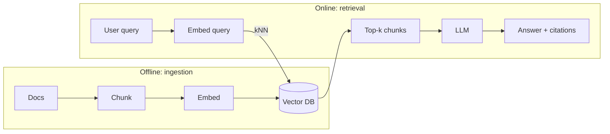

# RAG (Retrieval-Augmented Generation) — the Azure/DevOps-fluent version

RAG is the moment you stop asking an LLM to “remember everything” and start treating it like a service that can **retrieve evidence**.

**One-line mental model:** RAG = **read-through cache** for knowledge + **citations** + **grounding**.

---

# Q1: What is RAG, and why is it important?
- **Direct answer:** RAG retrieves relevant external context (docs/search) and injects it into the prompt so answers are **grounded** and up-to-date.
- **Azure/DevOps bridge:** LLM weights = baked container image; RAG = pulling config/artifacts at runtime.
- **Analogy:** Classic romance track remaster: the voice is the same (model), but you bring in clean backing instruments (fresh facts).
- **Mini prompt:** When is RAG better than fine-tuning? → when facts change and you need citations.

---

# Q2: Explain the architecture of a basic RAG system.
- **Direct answer:** Two pipelines:
  - **Offline ingestion:** load → chunk → embed → store.
  - **Online retrieval:** embed query → search → prompt → generate.
- **DevOps bridge:** ingestion is your nightly pipeline; retrieval is your online API path.

---

# Q3: What are the key components of a RAG pipeline?
- **Ingestion:** parsers, chunker, embedding model, vector store, metadata.
- **Retrieval:** query embedding, search (vector/hybrid), reranker, prompt template.
- **Generation:** LLM, output contract (JSON/markdown), citation formatting.
- **Ops:** eval suite, monitoring (latency + quality), feedback loop.

---

# Q4: Chunking strategies — how choose chunk size?
- **Direct answer:** Chunk size is a trade-off between **retrieval precision** and **context completeness**.
- **Rules of thumb:**
  - start ~300–800 tokens; add **overlap** (30–150 tokens)
  - chunk by structure first (headings/sections) not raw characters
- **Fashion analogy:** don’t cut fabric mid-seam; cut at natural stitch lines.
- **Mini prompt:** What happens if chunks are huge? → relevance dilution + wasted tokens.

---

# Q5: Fixed-size vs semantic vs recursive chunking?
- **Fixed-size:** fast, dumb, often fine for clean docs.
- **Semantic:** split by meaning (sentences/sections); better faithfulness.
- **Recursive:** try paragraph → sentence → character; practical default.

---

# Q6: What are embedding models?
- **Direct answer:** Models that map text into dense vectors where semantic similarity becomes distance (cosine / dot product).
- **DevOps bridge:** embeddings are your **index format**; you can’t mix coordinate systems casually.

---

# Q7: How do you choose an embedding model?
- **Criteria:** domain fit, multilingual needs, vector dimension (cost), speed, license.
- **Mini prompt:** What’s the cardinal sin? → indexing with one embedder and querying with another.

---

# Q8: Explain Agentic RAG.
- **Direct answer:** The model iteratively decides what to retrieve, queries tools/search multiple times, verifies, then answers.
- **DevOps bridge:** it’s an orchestrated workflow (observe → act → verify) with audit logs.
- **MI analogy:** captain adjusts field after each ball instead of locking strategy for 20 overs.

---

# Q9: What is hybrid search, and why better than pure vector?
- **Direct answer:** Combine semantic retrieval (vectors) with lexical retrieval (BM25/keyword).
- **When it matters:** IDs, codes, exact phrases, numbers (“invoice #12345”).
- **Mini prompt:** Vector search for numbers—good or risky? → risky; use hybrid.

---

# Q10: What is re-ranking?
- **Direct answer:** A second model (cross-encoder/LLM) re-scores retrieved candidates to improve ordering/precision.
- **Trade-off:** better quality, extra latency.

---

# Q11: Multi-document / multi-hop questions?
- **Direct answer:** Use retrieval + synthesis across multiple chunks; often needs query decomposition.
- **Patterns:**
  - decompose question → retrieve per sub-question → synthesize
  - iterative/agentic retrieval until confidence threshold

---

# Q12: Lost-in-the-middle in RAG?
- **Direct answer:** Even if you retrieve many chunks, the model may ignore middle context.
- **Fixes:** keep top-k small, rerank hard, place best evidence at top/bottom, summarize evidence.

---

# Q13: How do you evaluate a RAG system? (faithfulness, relevance, context precision/recall)
- **Faithfulness:** answer supported by retrieved context (no invented claims).
- **Answer relevance:** answers the question asked.
- **Context precision/recall:** did we retrieve the right stuff (and not too much junk)?
- **DevOps bridge:** build a regression suite; treat prompt/retrieval changes like releases.

---

# Q14: Explain Self-RAG.
- **Direct answer:** The model learns/decides when to retrieve vs answer from parametric knowledge, often with self-critique signals.
- **Mini prompt:** Why retrieve at all if the model “knows”? → freshness + citations + reduced hallucination.

---

# Q15: What is Graph RAG?
- **Direct answer:** Retrieval over a graph of entities/relations (plus text) for better multi-hop reasoning.
- **When to use:** knowledge bases, org charts, dependency graphs, “how are A and B connected?”

---

# Q16: Structured data (tables/SQL) in RAG?
- **Direct answer:** Don’t embed raw tables blindly. Use:
  - schema-aware retrieval (table/column metadata)
  - text summaries of tables
  - tool use: SQL generation + execution + return rows as evidence
- **Azure/DevOps prompt:** Where do you validate? → SQL sandbox + row limits + allow-listed queries.

## Flashcards

**Direct answer?** #flashcard
RAG retrieves relevant external context (docs/search) and injects it into the prompt so answers are grounded and up-to-date.

**Azure/DevOps bridge?** #flashcard
LLM weights = baked container image; RAG = pulling config/artifacts at runtime.

**Analogy?** #flashcard
Classic romance track remaster: the voice is the same (model), but you bring in clean backing instruments (fresh facts).

**Mini prompt?** #flashcard
When is RAG better than fine-tuning? → when facts change and you need citations.

**Direct answer?** #flashcard
Two pipelines:

**Offline ingestion?** #flashcard
load → chunk → embed → store.

**Online retrieval?** #flashcard
embed query → search → prompt → generate.

**DevOps bridge?** #flashcard
ingestion is your nightly pipeline; retrieval is your online API path.

**Ingestion?** #flashcard
parsers, chunker, embedding model, vector store, metadata.

**Retrieval?** #flashcard
query embedding, search (vector/hybrid), reranker, prompt template.

**Generation?** #flashcard
LLM, output contract (JSON/markdown), citation formatting.

**Ops?** #flashcard
eval suite, monitoring (latency + quality), feedback loop.

**Direct answer?** #flashcard
Chunk size is a trade-off between retrieval precision and context completeness.

**Rules of thumb:?** #flashcard
Rules of thumb:

**start ~300–800 tokens; add overlap (30–150 tokens)?** #flashcard
start ~300–800 tokens; add overlap (30–150 tokens)

**chunk by structure first (headings/sections) not raw characters?** #flashcard
chunk by structure first (headings/sections) not raw characters

**Fashion analogy?** #flashcard
don’t cut fabric mid-seam; cut at natural stitch lines.

**Mini prompt?** #flashcard
What happens if chunks are huge? → relevance dilution + wasted tokens.

**Fixed-size?** #flashcard
fast, dumb, often fine for clean docs.

**Semantic?** #flashcard
split by meaning (sentences/sections); better faithfulness.

**Recursive?** #flashcard
try paragraph → sentence → character; practical default.

**Direct answer?** #flashcard
Models that map text into dense vectors where semantic similarity becomes distance (cosine / dot product).

**DevOps bridge?** #flashcard
embeddings are your index format; you can’t mix coordinate systems casually.

**Criteria?** #flashcard
domain fit, multilingual needs, vector dimension (cost), speed, license.

**Mini prompt?** #flashcard
What’s the cardinal sin? → indexing with one embedder and querying with another.

**Direct answer?** #flashcard
The model iteratively decides what to retrieve, queries tools/search multiple times, verifies, then answers.

**DevOps bridge?** #flashcard
it’s an orchestrated workflow (observe → act → verify) with audit logs.

**MI analogy?** #flashcard
captain adjusts field after each ball instead of locking strategy for 20 overs.

**Direct answer?** #flashcard
Combine semantic retrieval (vectors) with lexical retrieval (BM25/keyword).

**When it matters?** #flashcard
IDs, codes, exact phrases, numbers (“invoice #12345”).

**Mini prompt?** #flashcard
Vector search for numbers—good or risky? → risky; use hybrid.

**Direct answer?** #flashcard
A second model (cross-encoder/LLM) re-scores retrieved candidates to improve ordering/precision.

**Trade-off?** #flashcard
better quality, extra latency.

**Direct answer?** #flashcard
Use retrieval + synthesis across multiple chunks; often needs query decomposition.

**Patterns:?** #flashcard
Patterns:

**decompose question → retrieve per sub-question → synthesize?** #flashcard
decompose question → retrieve per sub-question → synthesize

**iterative/agentic retrieval until confidence threshold?** #flashcard
iterative/agentic retrieval until confidence threshold

**Direct answer?** #flashcard
Even if you retrieve many chunks, the model may ignore middle context.

**Fixes?** #flashcard
keep top-k small, rerank hard, place best evidence at top/bottom, summarize evidence.

**Faithfulness?** #flashcard
answer supported by retrieved context (no invented claims).

**Answer relevance?** #flashcard
answers the question asked.

**Context precision/recall?** #flashcard
did we retrieve the right stuff (and not too much junk)?

**DevOps bridge?** #flashcard
build a regression suite; treat prompt/retrieval changes like releases.

**Direct answer?** #flashcard
The model learns/decides when to retrieve vs answer from parametric knowledge, often with self-critique signals.

**Mini prompt?** #flashcard
Why retrieve at all if the model “knows”? → freshness + citations + reduced hallucination.

**Direct answer?** #flashcard
Retrieval over a graph of entities/relations (plus text) for better multi-hop reasoning.

**When to use?** #flashcard
knowledge bases, org charts, dependency graphs, “how are A and B connected?”

**Direct answer?** #flashcard
Don’t embed raw tables blindly. Use:

**schema-aware retrieval (table/column metadata)?** #flashcard
schema-aware retrieval (table/column metadata)

**text summaries of tables?** #flashcard
text summaries of tables

**tool use?** #flashcard
SQL generation + execution + return rows as evidence

**Azure/DevOps prompt?** #flashcard
Where do you validate? → SQL sandbox + row limits + allow-listed queries.
