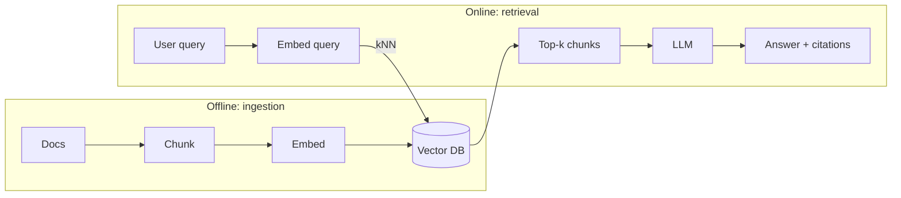

# RAG (Retrieval-Augmented Generation) — the Azure/DevOps-fluent version

RAG is the moment you stop asking an LLM to “remember everything” and start treating it like a service that can **retrieve evidence**.

**One-line mental model:** RAG = **read-through cache** for knowledge + **citations** + **grounding**.

---

# Q1: What is RAG, and why is it important?
- **Direct answer:** RAG retrieves relevant external context (docs/search) and injects it into the prompt so answers are **grounded** and up-to-date.
- **Azure/DevOps bridge:** LLM weights = baked container image; RAG = pulling config/artifacts at runtime.
- **Analogy:** Classic romance track remaster: the voice is the same (model), but you bring in clean backing instruments (fresh facts).
- **Mini prompt:** When is RAG better than fine-tuning? → when facts change and you need citations.

---

# Q2: Explain the architecture of a basic RAG system.
- **Direct answer:** Two pipelines:
  - **Offline ingestion:** load → chunk → embed → store.
  - **Online retrieval:** embed query → search → prompt → generate.
- **DevOps bridge:** ingestion is your nightly pipeline; retrieval is your online API path.

---

# Q3: What are the key components of a RAG pipeline?
- **Ingestion:** parsers, chunker, embedding model, vector store, metadata.
- **Retrieval:** query embedding, search (vector/hybrid), reranker, prompt template.
- **Generation:** LLM, output contract (JSON/markdown), citation formatting.
- **Ops:** eval suite, monitoring (latency + quality), feedback loop.

---

# Q4: Chunking strategies — how choose chunk size?
- **Direct answer:** Chunk size is a trade-off between **retrieval precision** and **context completeness**.
- **Rules of thumb:**
  - start ~300–800 tokens; add **overlap** (30–150 tokens)
  - chunk by structure first (headings/sections) not raw characters
- **Fashion analogy:** don’t cut fabric mid-seam; cut at natural stitch lines.
- **Mini prompt:** What happens if chunks are huge? → relevance dilution + wasted tokens.

---

# Q5: Fixed-size vs semantic vs recursive chunking?
- **Fixed-size:** fast, dumb, often fine for clean docs.
- **Semantic:** split by meaning (sentences/sections); better faithfulness.
- **Recursive:** try paragraph → sentence → character; practical default.

---

# Q6: What are embedding models?
- **Direct answer:** Models that map text into dense vectors where semantic similarity becomes distance (cosine / dot product).
- **DevOps bridge:** embeddings are your **index format**; you can’t mix coordinate systems casually.

---

# Q7: How do you choose an embedding model?
- **Criteria:** domain fit, multilingual needs, vector dimension (cost), speed, license.
- **Mini prompt:** What’s the cardinal sin? → indexing with one embedder and querying with another.

---

# Q8: Explain Agentic RAG.
- **Direct answer:** The model iteratively decides what to retrieve, queries tools/search multiple times, verifies, then answers.
- **DevOps bridge:** it’s an orchestrated workflow (observe → act → verify) with audit logs.
- **MI analogy:** captain adjusts field after each ball instead of locking strategy for 20 overs.

---

# Q9: What is hybrid search, and why better than pure vector?
- **Direct answer:** Combine semantic retrieval (vectors) with lexical retrieval (BM25/keyword).
- **When it matters:** IDs, codes, exact phrases, numbers (“invoice #12345”).
- **Mini prompt:** Vector search for numbers—good or risky? → risky; use hybrid.

---

# Q10: What is re-ranking?
- **Direct answer:** A second model (cross-encoder/LLM) re-scores retrieved candidates to improve ordering/precision.
- **Trade-off:** better quality, extra latency.

---

# Q11: Multi-document / multi-hop questions?
- **Direct answer:** Use retrieval + synthesis across multiple chunks; often needs query decomposition.
- **Patterns:**
  - decompose question → retrieve per sub-question → synthesize
  - iterative/agentic retrieval until confidence threshold

---

# Q12: Lost-in-the-middle in RAG?
- **Direct answer:** Even if you retrieve many chunks, the model may ignore middle context.
- **Fixes:** keep top-k small, rerank hard, place best evidence at top/bottom, summarize evidence.

---

# Q13: How do you evaluate a RAG system? (faithfulness, relevance, context precision/recall)
- **Faithfulness:** answer supported by retrieved context (no invented claims).
- **Answer relevance:** answers the question asked.
- **Context precision/recall:** did we retrieve the right stuff (and not too much junk)?
- **DevOps bridge:** build a regression suite; treat prompt/retrieval changes like releases.

---

# Q14: Explain Self-RAG.
- **Direct answer:** The model learns/decides when to retrieve vs answer from parametric knowledge, often with self-critique signals.
- **Mini prompt:** Why retrieve at all if the model “knows”? → freshness + citations + reduced hallucination.

---

# Q15: What is Graph RAG?
- **Direct answer:** Retrieval over a graph of entities/relations (plus text) for better multi-hop reasoning.
- **When to use:** knowledge bases, org charts, dependency graphs, “how are A and B connected?”

---

# Q16: Structured data (tables/SQL) in RAG?
- **Direct answer:** Don’t embed raw tables blindly. Use:
  - schema-aware retrieval (table/column metadata)
  - text summaries of tables
  - tool use: SQL generation + execution + return rows as evidence
- **Azure/DevOps prompt:** Where do you validate? → SQL sandbox + row limits + allow-listed queries.

## Rapid Recall

### Direct answer
- Direct Answer: RAG retrieves relevant external context (docs/search) and injects it into the prompt so answers are grounded and up-to-date.
- Why: This matters because it tells you how to reason about direct answer.
- Pitfall: Don't answer "Direct answer" by naming the concept alone; state the mechanism and tradeoff.
- Interview line: Say: RAG retrieves relevant external context (docs/search) and injects it into the prompt so answers are grounded and up-to-date.

### Azure/DevOps bridge
- Direct Answer: LLM weights = baked container image; RAG = pulling config/artifacts at runtime.
- Why: This matters because it tells you how to reason about azure/devops bridge.
- Pitfall: Don't answer "Azure/DevOps bridge" by naming the concept alone; state the mechanism and tradeoff.
- Interview line: Say: LLM weights = baked container image; RAG = pulling config/artifacts at runtime.

### Analogy
- Direct Answer: Classic romance track remaster: the voice is the same (model), but you bring in clean backing instruments (fresh facts).
- Why: This matters because it tells you how to reason about analogy.
- Pitfall: Don't answer "Analogy" by naming the concept alone; state the mechanism and tradeoff.
- Interview line: Say: Classic romance track remaster: the voice is the same (model), but you bring in clean backing instruments (fresh facts).

### Mini prompt
- Direct Answer: When is RAG better than fine-tuning? → when facts change and you need citations.
- Why: This matters because it tells you how to reason about mini prompt.
- Pitfall: Don't answer "Mini prompt" by naming the concept alone; state the mechanism and tradeoff.
- Interview line: Say: When is RAG better than fine-tuning? → when facts change and you need citations.

### Direct answer
- Direct Answer: Two pipelines:
- Why: This matters because it tells you how to reason about direct answer.
- Pitfall: Don't answer "Direct answer" by naming the concept alone; state the mechanism and tradeoff.
- Interview line: Say: Two pipelines:

### Offline ingestion
- Direct Answer: load → chunk → embed → store.
- Why: This matters because it tells you how to reason about offline ingestion.
- Pitfall: Don't answer "Offline ingestion" by naming the concept alone; state the mechanism and tradeoff.
- Interview line: Say: load → chunk → embed → store.

### Online retrieval
- Direct Answer: embed query → search → prompt → generate.
- Why: This matters because it tells you how to reason about online retrieval.
- Pitfall: Don't answer "Online retrieval" by naming the concept alone; state the mechanism and tradeoff.
- Interview line: Say: embed query → search → prompt → generate.

### DevOps bridge
- Direct Answer: ingestion is your nightly pipeline; retrieval is your online API path.
- Why: This matters because it tells you how to reason about devops bridge.
- Pitfall: Don't answer "DevOps bridge" by naming the concept alone; state the mechanism and tradeoff.
- Interview line: Say: ingestion is your nightly pipeline; retrieval is your online API path.

### Ingestion
- Direct Answer: parsers, chunker, embedding model, vector store, metadata.
- Why: This matters because it tells you how to reason about ingestion.
- Pitfall: Don't answer "Ingestion" by naming the concept alone; state the mechanism and tradeoff.
- Interview line: Say: parsers, chunker, embedding model, vector store, metadata.

### Retrieval
- Direct Answer: query embedding, search (vector/hybrid), reranker, prompt template.
- Why: This matters because it tells you how to reason about retrieval.
- Pitfall: Don't answer "Retrieval" by naming the concept alone; state the mechanism and tradeoff.
- Interview line: Say: query embedding, search (vector/hybrid), reranker, prompt template.

### Generation
- Direct Answer: LLM, output contract (JSON/markdown), citation formatting.
- Why: This matters because it tells you how to reason about generation.
- Pitfall: Don't answer "Generation" by naming the concept alone; state the mechanism and tradeoff.
- Interview line: Say: LLM, output contract (JSON/markdown), citation formatting.

### Ops
- Direct Answer: eval suite, monitoring (latency + quality), feedback loop.
- Why: This matters because it tells you how to reason about ops.
- Pitfall: Don't answer "Ops" by naming the concept alone; state the mechanism and tradeoff.
- Interview line: Say: eval suite, monitoring (latency + quality), feedback loop.

### Direct answer
- Direct Answer: Chunk size is a trade-off between retrieval precision and context completeness.
- Why: This matters because it tells you how to reason about direct answer.
- Pitfall: Don't answer "Direct answer" by naming the concept alone; state the mechanism and tradeoff.
- Interview line: Say: Chunk size is a trade-off between retrieval precision and context completeness.

### Rules of thumb:
- Direct Answer: Rules of thumb:
- Why: This matters because it tells you how to reason about rules of thumb:.
- Pitfall: Don't answer "Rules of thumb:" by naming the concept alone; state the mechanism and tradeoff.
- Interview line: Say: Rules of thumb:

### start ~300–800 tokens; add overlap (30–150 tokens)
- Direct Answer: start ~300–800 tokens; add overlap (30–150 tokens)
- Why: This matters because it tells you how to reason about start ~300–800 tokens; add overlap (30–150 tokens).
- Pitfall: Don't answer "start ~300–800 tokens; add overlap (30–150 tokens)" by naming the concept alone; state the mechanism and tradeoff.
- Interview line: Say: start ~300–800 tokens; add overlap (30–150 tokens)

### chunk by structure first (headings/sections) not raw characters
- Direct Answer: chunk by structure first (headings/sections) not raw characters
- Why: This matters because it tells you how to reason about chunk by structure first (headings/sections) not raw characters.
- Pitfall: Don't answer "chunk by structure first (headings/sections) not raw characters" by naming the concept alone; state the mechanism and tradeoff.
- Interview line: Say: chunk by structure first (headings/sections) not raw characters

### Fashion analogy
- Direct Answer: don’t cut fabric mid-seam; cut at natural stitch lines.
- Why: This matters because it tells you how to reason about fashion analogy.
- Pitfall: Don't answer "Fashion analogy" by naming the concept alone; state the mechanism and tradeoff.
- Interview line: Say: don’t cut fabric mid-seam; cut at natural stitch lines.

### Mini prompt
- Direct Answer: What happens if chunks are huge? → relevance dilution + wasted tokens.
- Why: This matters because it tells you how to reason about mini prompt.
- Pitfall: Don't answer "Mini prompt" by naming the concept alone; state the mechanism and tradeoff.
- Interview line: Say: What happens if chunks are huge? → relevance dilution + wasted tokens.

### Fixed-size
- Direct Answer: fast, dumb, often fine for clean docs.
- Why: This matters because it tells you how to reason about fixed-size.
- Pitfall: Don't answer "Fixed-size" by naming the concept alone; state the mechanism and tradeoff.
- Interview line: Say: fast, dumb, often fine for clean docs.

### Semantic
- Direct Answer: split by meaning (sentences/sections); better faithfulness.
- Why: This matters because it tells you how to reason about semantic.
- Pitfall: Don't answer "Semantic" by naming the concept alone; state the mechanism and tradeoff.
- Interview line: Say: split by meaning (sentences/sections); better faithfulness.

### Recursive
- Direct Answer: try paragraph → sentence → character; practical default.
- Why: This matters because it tells you how to reason about recursive.
- Pitfall: Don't answer "Recursive" by naming the concept alone; state the mechanism and tradeoff.
- Interview line: Say: try paragraph → sentence → character; practical default.

### Direct answer
- Direct Answer: Models that map text into dense vectors where semantic similarity becomes distance (cosine / dot product).
- Why: This matters because it tells you how to reason about direct answer.
- Pitfall: Don't answer "Direct answer" by naming the concept alone; state the mechanism and tradeoff.
- Interview line: Say: Models that map text into dense vectors where semantic similarity becomes distance (cosine / dot product).

### DevOps bridge
- Direct Answer: embeddings are your index format; you can’t mix coordinate systems casually.
- Why: This matters because it tells you how to reason about devops bridge.
- Pitfall: Don't answer "DevOps bridge" by naming the concept alone; state the mechanism and tradeoff.
- Interview line: Say: embeddings are your index format; you can’t mix coordinate systems casually.

### Criteria
- Direct Answer: domain fit, multilingual needs, vector dimension (cost), speed, license.
- Why: This matters because it tells you how to reason about criteria.
- Pitfall: Don't answer "Criteria" by naming the concept alone; state the mechanism and tradeoff.
- Interview line: Say: domain fit, multilingual needs, vector dimension (cost), speed, license.

### Mini prompt
- Direct Answer: What’s the cardinal sin? → indexing with one embedder and querying with another.
- Why: This matters because it tells you how to reason about mini prompt.
- Pitfall: Don't answer "Mini prompt" by naming the concept alone; state the mechanism and tradeoff.
- Interview line: Say: What’s the cardinal sin? → indexing with one embedder and querying with another.

### Direct answer
- Direct Answer: The model iteratively decides what to retrieve, queries tools/search multiple times, verifies, then answers.
- Why: This matters because it tells you how to reason about direct answer.
- Pitfall: Don't answer "Direct answer" by naming the concept alone; state the mechanism and tradeoff.
- Interview line: Say: The model iteratively decides what to retrieve, queries tools/search multiple times, verifies, then answers.

### DevOps bridge
- Direct Answer: it’s an orchestrated workflow (observe → act → verify) with audit logs.
- Why: This matters because it tells you how to reason about devops bridge.
- Pitfall: Don't answer "DevOps bridge" by naming the concept alone; state the mechanism and tradeoff.
- Interview line: Say: it’s an orchestrated workflow (observe → act → verify) with audit logs.

### MI analogy
- Direct Answer: captain adjusts field after each ball instead of locking strategy for 20 overs.
- Why: This matters because it tells you how to reason about mi analogy.
- Pitfall: Don't answer "MI analogy" by naming the concept alone; state the mechanism and tradeoff.
- Interview line: Say: captain adjusts field after each ball instead of locking strategy for 20 overs.

### Direct answer
- Direct Answer: Combine semantic retrieval (vectors) with lexical retrieval (BM25/keyword).
- Why: This matters because it tells you how to reason about direct answer.
- Pitfall: Don't answer "Direct answer" by naming the concept alone; state the mechanism and tradeoff.
- Interview line: Say: Combine semantic retrieval (vectors) with lexical retrieval (BM25/keyword).

### When it matters
- Direct Answer: IDs, codes, exact phrases, numbers (“invoice #12345”).
- Why: This matters because it tells you how to reason about when it matters.
- Pitfall: Don't answer "When it matters" by naming the concept alone; state the mechanism and tradeoff.
- Interview line: Say: IDs, codes, exact phrases, numbers (“invoice #12345”).

### Mini prompt
- Direct Answer: Vector search for numbers—good or risky? → risky; use hybrid.
- Why: This matters because it tells you how to reason about mini prompt.
- Pitfall: Don't answer "Mini prompt" by naming the concept alone; state the mechanism and tradeoff.
- Interview line: Say: Vector search for numbers—good or risky? → risky; use hybrid.

### Direct answer
- Direct Answer: A second model (cross-encoder/LLM) re-scores retrieved candidates to improve ordering/precision.
- Why: This matters because it tells you how to reason about direct answer.
- Pitfall: Don't answer "Direct answer" by naming the concept alone; state the mechanism and tradeoff.
- Interview line: Say: A second model (cross-encoder/LLM) re-scores retrieved candidates to improve ordering/precision.

### Trade-off
- Direct Answer: better quality, extra latency.
- Why: This matters because it tells you how to reason about trade-off.
- Pitfall: Don't answer "Trade-off" by naming the concept alone; state the mechanism and tradeoff.
- Interview line: Say: better quality, extra latency.

### Direct answer
- Direct Answer: Use retrieval + synthesis across multiple chunks; often needs query decomposition.
- Why: This matters because it tells you how to reason about direct answer.
- Pitfall: Don't answer "Direct answer" by naming the concept alone; state the mechanism and tradeoff.
- Interview line: Say: Use retrieval + synthesis across multiple chunks; often needs query decomposition.

### Patterns:
- Direct Answer: Patterns:
- Why: This matters because it tells you how to reason about patterns:.
- Pitfall: Don't answer "Patterns:" by naming the concept alone; state the mechanism and tradeoff.
- Interview line: Say: Patterns:

### decompose question → retrieve per sub-question → synthesize
- Direct Answer: decompose question → retrieve per sub-question → synthesize
- Why: This matters because it tells you how to reason about decompose question → retrieve per sub-question → synthesize.
- Pitfall: Don't answer "decompose question → retrieve per sub-question → synthesize" by naming the concept alone; state the mechanism and tradeoff.
- Interview line: Say: decompose question → retrieve per sub-question → synthesize

### iterative/agentic retrieval until confidence threshold
- Direct Answer: iterative/agentic retrieval until confidence threshold
- Why: This matters because it tells you how to reason about iterative/agentic retrieval until confidence threshold.
- Pitfall: Don't answer "iterative/agentic retrieval until confidence threshold" by naming the concept alone; state the mechanism and tradeoff.
- Interview line: Say: iterative/agentic retrieval until confidence threshold

### Direct answer
- Direct Answer: Even if you retrieve many chunks, the model may ignore middle context.
- Why: This matters because it tells you how to reason about direct answer.
- Pitfall: Don't answer "Direct answer" by naming the concept alone; state the mechanism and tradeoff.
- Interview line: Say: Even if you retrieve many chunks, the model may ignore middle context.

### Fixes
- Direct Answer: keep top-k small, rerank hard, place best evidence at top/bottom, summarize evidence.
- Why: This matters because it tells you how to reason about fixes.
- Pitfall: Don't answer "Fixes" by naming the concept alone; state the mechanism and tradeoff.
- Interview line: Say: keep top-k small, rerank hard, place best evidence at top/bottom, summarize evidence.

### Faithfulness
- Direct Answer: answer supported by retrieved context (no invented claims).
- Why: This matters because it tells you how to reason about faithfulness.
- Pitfall: Don't answer "Faithfulness" by naming the concept alone; state the mechanism and tradeoff.
- Interview line: Say: answer supported by retrieved context (no invented claims).

### Answer relevance
- Direct Answer: answers the question asked.
- Why: This matters because it tells you how to reason about answer relevance.
- Pitfall: Don't answer "Answer relevance" by naming the concept alone; state the mechanism and tradeoff.
- Interview line: Say: answers the question asked.

### Context precision/recall
- Direct Answer: did we retrieve the right stuff (and not too much junk)?
- Why: This matters because it tells you how to reason about context precision/recall.
- Pitfall: Don't answer "Context precision/recall" by naming the concept alone; state the mechanism and tradeoff.
- Interview line: Say: did we retrieve the right stuff (and not too much junk)?

### DevOps bridge
- Direct Answer: build a regression suite; treat prompt/retrieval changes like releases.
- Why: This matters because it tells you how to reason about devops bridge.
- Pitfall: Don't answer "DevOps bridge" by naming the concept alone; state the mechanism and tradeoff.
- Interview line: Say: build a regression suite; treat prompt/retrieval changes like releases.

### Direct answer
- Direct Answer: The model learns/decides when to retrieve vs answer from parametric knowledge, often with self-critique signals.
- Why: This matters because it tells you how to reason about direct answer.
- Pitfall: Don't answer "Direct answer" by naming the concept alone; state the mechanism and tradeoff.
- Interview line: Say: The model learns/decides when to retrieve vs answer from parametric knowledge, often with self-critique signals.

### Mini prompt
- Direct Answer: Why retrieve at all if the model “knows”? → freshness + citations + reduced hallucination.
- Why: This matters because it tells you how to reason about mini prompt.
- Pitfall: Don't answer "Mini prompt" by naming the concept alone; state the mechanism and tradeoff.
- Interview line: Say: Why retrieve at all if the model “knows”? → freshness + citations + reduced hallucination.

### Direct answer
- Direct Answer: Retrieval over a graph of entities/relations (plus text) for better multi-hop reasoning.
- Why: This matters because it tells you how to reason about direct answer.
- Pitfall: Don't answer "Direct answer" by naming the concept alone; state the mechanism and tradeoff.
- Interview line: Say: Retrieval over a graph of entities/relations (plus text) for better multi-hop reasoning.

### When to use
- Direct Answer: knowledge bases, org charts, dependency graphs, “how are A and B connected?”
- Why: This matters because it tells you how to reason about when to use.
- Pitfall: Don't answer "When to use" by naming the concept alone; state the mechanism and tradeoff.
- Interview line: Say: knowledge bases, org charts, dependency graphs, “how are A and B connected?”

### Direct answer
- Direct Answer: Don’t embed raw tables blindly. Use:
- Why: This matters because it tells you how to reason about direct answer.
- Pitfall: Don't answer "Direct answer" by naming the concept alone; state the mechanism and tradeoff.
- Interview line: Say: Don’t embed raw tables blindly. Use:

### schema-aware retrieval (table/column metadata)
- Direct Answer: schema-aware retrieval (table/column metadata)
- Why: This matters because it tells you how to reason about schema-aware retrieval (table/column metadata).
- Pitfall: Don't answer "schema-aware retrieval (table/column metadata)" by naming the concept alone; state the mechanism and tradeoff.
- Interview line: Say: schema-aware retrieval (table/column metadata)

### text summaries of tables
- Direct Answer: text summaries of tables
- Why: This matters because it tells you how to reason about text summaries of tables.
- Pitfall: Don't answer "text summaries of tables" by naming the concept alone; state the mechanism and tradeoff.
- Interview line: Say: text summaries of tables

### tool use
- Direct Answer: SQL generation + execution + return rows as evidence
- Why: This matters because it tells you how to reason about tool use.
- Pitfall: Don't answer "tool use" by naming the concept alone; state the mechanism and tradeoff.
- Interview line: Say: SQL generation + execution + return rows as evidence

### Azure/DevOps prompt
- Direct Answer: Where do you validate? → SQL sandbox + row limits + allow-listed queries.
- Why: This matters because it tells you how to reason about azure/devops prompt.
- Pitfall: Don't answer "Azure/DevOps prompt" by naming the concept alone; state the mechanism and tradeoff.
- Interview line: Say: Where do you validate? → SQL sandbox + row limits + allow-listed queries.
