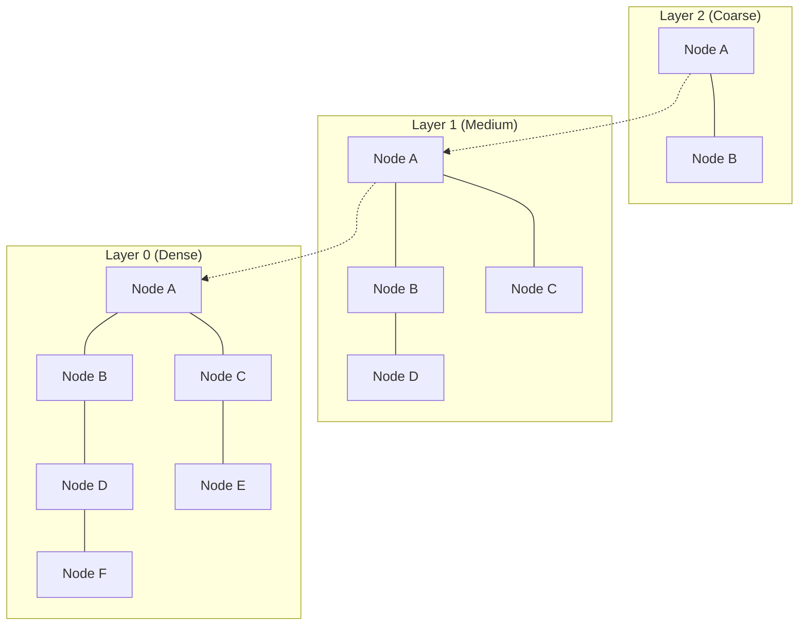

# Vector Databases & Embeddings

This hub contains core concepts and systems for storing, indexing, and retrieving high-dimensional vector data for AI search and RAG.

---

## 🔹 ANN Indexing: HNSW (Hierarchical Navigable Small Worlds)



---

# Q1: What are embeddings in the context of AI engineering?

## 1. 🔹 Direct Answer
Embeddings are dense vector representations of text (or other data) where semantic similarity becomes geometric closeness. They enable semantic search, clustering, and retrieval for RAG and agents.

## 2. 🔹 Intuition
They map “meaning” into coordinates; similar concepts land near each other.

## 3. 🔹 Deep Dive
- Embedding model outputs `e ∈ R^d` for an input span.
- Similarity is measured with cosine/dot/L2.
- Training often uses contrastive objectives so positives are close and negatives are far.

## 4. 🔹 Practical Perspective
- **Use when:** you need paraphrase-robust matching and semantic retrieval.
- **Avoid when:** exact lexical constraints are mandatory (hybrid often best).
- **Trade-offs:** compute cost and potential embedding drift after model updates.

## 5. 🔹 Code Snippet
```python
e = embed_model.encode(["return policy"])  # -> (d,)
```

## 6. 🔹 Interview Follow-ups
1. **Q:** Do embeddings guarantee correct retrieval?  
   **A:** No—geometry correlates with relevance but is not perfect; tune chunking, filters, reranking.
2. **Q:** What’s the difference from token embeddings?  
   **A:** Token embeddings are per token; document embeddings are pooled summaries over tokens.

## 7. 🔹 Common Mistakes
- Assuming embedding similarity implies factual correctness.

## 8. 🔹 Comparison / Connections
- Connects to **representation learning** and **contrastive learning**.

## 9. 🔹 One-line Revision
Embeddings are learned vectors that turn semantic similarity into fast vector search.

## 10. 🔹 Difficulty Tag
🟢 Easy

---

# Q2: How do embedding models convert text to vectors?

## 1. 🔹 Direct Answer
They tokenize the text, encode tokens with a neural network (often a transformer), and then **pool** token representations into a single fixed-size vector.

## 2. 🔹 Intuition
Read the words, summarize them into one “semantic coordinate.”

## 3. 🔹 Deep Dive
1. Tokenize → subword IDs.
2. Run encoder → hidden states per token.
3. Pool (mean/CLS/attention pooling) while masking padding.
4. Optionally normalize for cosine similarity.

## 4. 🔹 Practical Perspective
- **Use when:** you can keep the same preprocessing at both index and query time.
- **Avoid when:** you change tokenization/pooling between training and serving.

## 5. 🔹 Code Snippet
```python
tokens = tokenizer(text, return_tensors="pt", truncation=True)
h = encoder(**tokens).last_hidden_state  # (seq, hidden)
e = h.mean(dim=0)  # illustrative; use masked pooling in production
```

## 6. 🔹 Interview Follow-ups
1. **Q:** Why normalization?  
   **A:** Stabilizes cosine similarity and indexing behavior.

## 7. 🔹 Common Mistakes
- Pooling over padding tokens without masking.

## 8. 🔹 Comparison / Connections
- Connects to transformer encoder representations.

## 9. 🔹 One-line Revision
Embed by encoding tokens then pooling into a single vector.

## 10. 🔹 Difficulty Tag
🟢 Easy

---

# Q3: What is the difference between sparse and dense embeddings?

## 1. 🔹 Direct Answer
Sparse embeddings (TF-IDF/BM25) emphasize exact keyword overlap; dense embeddings are continuous vectors that capture semantic similarity across paraphrases.

## 2. 🔹 Intuition
Sparse = “word overlap”; dense = “meaning similarity.”

## 3. 🔹 Deep Dive
- Sparse similarity is typically based on term weights.
- Dense similarity uses vector metrics (cosine/dot/L2).
- Hybrid search combines both to improve robustness.

## 4. 🔹 Practical Perspective
- **Use when:** queries include rare terms and also paraphrases.
- **Trade-offs:** dense can miss exact IDs; sparse can miss synonyms.

## 5. 🔹 Code Snippet
```python
tfidf_vec = tfidf.transform([query])         # sparse
dense_vec = embed_model.encode([query])[0]  # dense
```

## 6. 🔹 Interview Follow-ups
1. **Q:** Which is “better”?  
   **A:** Depends; benchmark on your query distribution.

## 7. 🔹 Common Mistakes
- Picking one modality without testing on rare-term queries.

## 8. 🔹 Comparison / Connections
- Connects to **hybrid retrieval**.

## 9. 🔹 One-line Revision
Sparse captures exact tokens; dense captures semantics.

## 10. 🔹 Difficulty Tag
🟢 Easy

---

# Q4: Explain cosine similarity, dot product, and Euclidean distance for vector search.

## 1. 🔹 Direct Answer
Cosine similarity measures angle (direction), dot product measures direction + magnitude, and Euclidean distance measures geometric distance. With normalized vectors, cosine and dot product become equivalent up to scaling.

## 2. 🔹 Intuition
Cosine asks “are they pointing the same way?” Euclidean asks “how far apart are they?”

## 3. 🔹 Deep Dive
For vectors `u, v`:
- Cosine: `(u·v)/(||u|| ||v||)`
- Dot: `u·v`
- Euclidean: `||u-v||^2`

## 4. 🔹 Practical Perspective
- **Use when:** you match the metric to your embedding training/normalization.
- **Avoid when:** you assume cosine but index uses L2 without normalization.

## 5. 🔹 Code Snippet
```python
def cosine(u,v,eps=1e-12):
    return float((u@v) / (np.linalg.norm(u)*np.linalg.norm(v)+eps))
```

## 6. 🔹 Interview Follow-ups
1. **Q:** How to pick?  
   **A:** Use your vector DB’s metric options and validate retrieval quality on eval data.

## 7. 🔹 Common Mistakes
- Using unnormalized vectors with cosine assumptions.

## 8. 🔹 Comparison / Connections
- Connects to vector DB indexing metric types.

## 9. 🔹 One-line Revision
Metric choice must align with embedding normalization and vector DB indexing behavior.

## 10. 🔹 Difficulty Tag
🟢 Easy

---

# Q5: What is a vector database, and how does it differ from a traditional database?

## 1. 🔹 Direct Answer
A vector database stores embeddings and supports fast similarity search using ANN/k-NN. Traditional databases support exact matching and structured queries (SQL) but aren’t optimized for high-dimensional similarity at scale.

## 2. 🔹 Intuition
Traditional DB finds exact records; vector DB finds the “nearest meaning.”

## 3. 🔹 Deep Dive
- Vector DB:
  - embedding storage
  - similarity search indexes (HNSW/IVF/PQ)
  - metadata filtering and approximate retrieval
- Traditional DB:
  - indexes for exact keys
  - joins/aggregations over structured data

## 4. 🔹 Practical Perspective
- **Use when:** semantic retrieval is required (RAG, semantic search).
- **Trade-offs:** vector DB adds operational complexity and approximate retrieval semantics.

## 5. 🔹 Code Snippet
```python
hits = vector_db.search(qv, top_k=5, filter={"tenant_id": tenant})
```

## 6. 🔹 Interview Follow-ups
1. **Q:** Can it store documents too?  
   **A:** Usually it stores text references/metadata; raw text often lives elsewhere.

## 7. 🔹 Common Mistakes
- Trying to use SQL scans for semantic search at large scale.

## 8. 🔹 Comparison / Connections
- Connects to RAG indexing and query-time retrieval.

## 9. 🔹 One-line Revision
Vector DB = embeddings + ANN similarity search + metadata filters.

## 10. 🔹 Difficulty Tag
🟢 Easy

---

# Q6: How do you choose the right embedding model for your use case?

## 1. 🔹 Direct Answer
Choose by measured retrieval quality (recall@k/MRR) on your domain, plus latency/cost constraints and compatibility with your vector store (dimension + metric). Ideally validate end-to-end RAG faithfulness too.

## 2. 🔹 Intuition
Embeddings are only good if they retrieve the evidence your users need.

## 3. 🔹 Deep Dive
1. Create a small evaluation set: queries + relevant doc/chunk IDs.
2. Benchmark candidate embedding models for retrieval metrics.
3. Run end-to-end RAG tests on a subset to measure faithfulness.

## 4. 🔹 Practical Perspective
- **Use when:** you can iterate with labeled or weakly labeled eval sets.
- **Avoid when:** relying on unrelated public benchmarks without domain validation.

## 5. 🔹 Code Snippet
```python
def recall_at_k(embed_model, queries, gold_ids, k=5):
    hits = 0
    for q, gold in zip(queries, gold_ids):
        qv = embed_model.encode([q])[0]
        top = vector_db.search(qv, top_k=k)
        hits += int(gold in top)
    return hits/len(queries)
```

## 6. 🔹 Interview Follow-ups
1. **Q:** No labels available?  
   **A:** Use synthetic queries, click logs, or LLM-assisted labeling.

## 7. 🔹 Common Mistakes
- Optimizing embedding selection without testing chunking and filters.

## 8. 🔹 Comparison / Connections
- Connects to evaluation-driven ML and IR metrics.

## 9. 🔹 One-line Revision
Pick embeddings by domain-relevant retrieval metrics under your serving constraints.

## 10. 🔹 Difficulty Tag
🟡 Medium

---

# Q7: What is embedding dimensionality, and how does it affect performance and cost?

## 1. 🔹 Direct Answer
Dimensionality `d` is the vector length. Larger `d` can improve expressiveness but increases memory/storage, index overhead, and query compute time. It’s a quality–cost trade-off.

## 2. 🔹 Intuition
More coordinates = more detail but heavier “map storage and search.”

## 3. 🔹 Deep Dive
- Storage ~ `O(n * d)` (plus index overhead).
- ANN index build/query cost grows with `d`.
- The embedding model’s quality matters more than `d` alone.

## 4. 🔹 Practical Perspective
- **Use when:** you have budgets and can validate retrieval recall.
- **Avoid when:** you are memory-bound; consider lower precision/quantization.

## 5. 🔹 Code Snippet
```python
bytes_est = n_vectors * d * 4  # float32
```

## 6. 🔹 Interview Follow-ups
1. **Q:** How to reduce memory?  
   **A:** Quantize embeddings or use smaller `d` models.

## 7. 🔹 Common Mistakes
- Treating high dimension as always better.

## 8. 🔹 Comparison / Connections
- Connects to quantization and ANN index design.

## 9. 🔹 One-line Revision
Higher embedding dimension can help quality but increases storage and retrieval costs.

## 10. 🔹 Difficulty Tag
🟡 Medium

---

# Q8: How do you handle embedding drift when the embedding model is updated?

## 1. 🔹 Direct Answer
Embedding drift means the new model changes vector geometry so existing indexes no longer align. Handle it with **versioned indexes**, re-embedding/reindexing, and canary dual-run migrations with rollback.

## 2. 🔹 Intuition
Switching the encoder changes the coordinate system; old vectors must be recreated.

## 3. 🔹 Deep Dive
### Migration strategies
- **Full re-embed** + rebuild index.
- **Dual index + routing**: run old/new side by side and compare retrieval metrics.
- Ensure consistent metric/normalization settings.

## 4. 🔹 Practical Perspective
- **Use when:** embedding updates are planned releases.
- **Avoid when:** you update query embedding but forget to rebuild stored vectors.

## 5. 🔹 Code Snippet
```python
# dual-run idea
old_hits = old_index.search(qv_old, top_k=5)
new_hits = new_index.search(qv_new, top_k=5)
```

## 6. 🔹 Interview Follow-ups
1. **Q:** How to detect drift early?  
   **A:** Monitor recall@k proxies and answer faithfulness on sampled queries.

## 7. 🔹 Common Mistakes
- In-place partial updates that create query/index embedding mismatch.

## 8. 🔹 Comparison / Connections
- Connects to MLOps/versioning and RAG reliability.

## 9. 🔹 One-line Revision
Embedding drift is handled by versioned indexes and staged re-indexing with canary rollout.

## 10. 🔹 Difficulty Tag
🟡 Medium

---

# Q9: What are multi-modal embeddings, and how are they generated?

## 1. 🔹 Direct Answer
Multi-modal embeddings map different modalities (text, images, audio) into a shared vector space so you can retrieve cross-modally (e.g., image↔text). They’re generated by modality-specific encoders trained with contrastive or paired losses.

## 2. 🔹 Intuition
They align “same meaning across formats” into nearby vectors.

## 3. 🔹 Deep Dive
### CLIP-style (common)
- Image encoder → image embedding
- Text encoder → text embedding
- Contrastive loss makes paired image/text close and unpaired far.

## 4. 🔹 Practical Perspective
- **Use when:** you need cross-modal search and multimodal RAG.
- **Trade-offs:** more complex data pipelines and evaluation.

## 5. 🔹 Code Snippet
```python
img_vec = vision_encoder(image)
txt_vec = text_encoder("a cat on a sofa")
hits = vector_db.search(img_vec, top_k=5)  # if storing text vectors
```

## 6. 🔹 Interview Follow-ups
1. **Q:** Contrastive vs generative?  
   **A:** Contrastive aligns representations; generative models produce text but may be harder for retrieval.

## 7. 🔹 Common Mistakes
- Using different embedding spaces for query and index without alignment.

## 8. 🔹 Comparison / Connections
- Connects to CLIP and multimodal transformers.

## 9. 🔹 One-line Revision
Multi-modal embeddings align modalities into one vector space for cross-modal similarity.

## 10. 🔹 Difficulty Tag
🟡 Medium

---

# Q10: How do you index and query multi-tenant data in a vector database?

## 1. 🔹 Direct Answer
Index vectors with tenant/permission metadata (e.g., `tenant_id`, ACL groups) and enforce tenant isolation by passing metadata filters at query time. For very large systems, shard by tenant/domain.

## 2. 🔹 Intuition
Your vector index is a catalog; filtering ensures users only search within their catalog.

## 3. 🔹 Deep Dive
### Steps
1. Upsert each embedding with metadata: tenant_id, doc type, access level.
2. At query time, compute user permissions → filter vector DB retrieval.
3. Optionally shard indices by tenant/domain for performance/security.

## 4. 🔹 Practical Perspective
- **Use when:** enterprise security and multi-corpora exist.
- **Avoid when:** relying on the LLM to “not mention” restricted info.

## 5. 🔹 Code Snippet
```python
filter = {"tenant_id": tenant_id, "access_level": {"$in": user_levels}}
chunks = vector_db.search(qv, top_k=8, filter=filter)
```

## 6. 🔹 Interview Follow-ups
1. **Q:** How do you handle permission changes?  
   **A:** Update metadata and re-evaluate caches; avoid stale cache leakage.

## 7. 🔹 Common Mistakes
- Logging retrieved text content for restricted users.

## 8. 🔹 Comparison / Connections
- Connects to RAG access control and guardrails.

## 9. 🔹 One-line Revision
Multi-tenant vector search uses tenant/ACL metadata filters (and sometimes sharding) to prevent leakage.

## 10. 🔹 Difficulty Tag
🟡 Medium

---

# Q11: What is quantization of embeddings, and how does it reduce storage costs?

## 1. 🔹 Direct Answer
Quantization compresses embeddings by representing each dimension with fewer bits (e.g., float32 → INT8/INT4). This reduces storage and can improve latency, with some accuracy trade-off.

## 2. 🔹 Intuition
Store an approximate version of the vector instead of full precision.

## 3. 🔹 Deep Dive
### Examples
- INT8: 8 bits per value
- Product Quantization (PQ): compress distances by splitting vector into subspaces and quantizing each.
### Trade-off
- Approximation error may reduce recall.

## 4. 🔹 Practical Perspective
- **Use when:** memory/storage limits bind.
- **Avoid when:** you cannot tolerate retrieval quality degradation.

## 5. 🔹 Code Snippet
```python
# Conceptual PQ index choice (library-specific)
index = faiss.IndexIVFPQ(d, nlist=256, m=16, nbits=8)
```

## 6. 🔹 Interview Follow-ups
1. **Q:** How do you validate impact?  
   **A:** Measure retrieval recall/answer faithfulness with your eval set.

## 7. 🔹 Common Mistakes
- Quantizing without tuning ANN parameters after compression.

## 8. 🔹 Comparison / Connections
- Connects to ANN index families and vector DB engineering.

## 9. 🔹 One-line Revision
Quantization compresses embeddings to fewer bits, cutting index storage and improving speed at some recall cost.

## 10. 🔹 Difficulty Tag
🟡 Medium

---

# Q12: How do you benchmark and evaluate embedding model quality?

## 1. 🔹 Direct Answer
Evaluate using retrieval metrics like **Recall@k**, MRR, or NDCG on a labeled dataset. For RAG, also measure end-to-end answer **relevance** and **faithfulness**.

## 2. 🔹 Intuition
Good embeddings retrieve the right evidence reliably—not just high similarity scores.

## 3. 🔹 Deep Dive
### Two-level evaluation
1. **IR quality:** query→gold evidence ranking.
2. **System quality:** answer correctness/faithfulness conditioned on retrieved chunks.

## 4. 🔹 Practical Perspective
- **Use when:** you can label a small set or infer relevance.
- **Trade-offs:** end-to-end evaluation is more expensive but more predictive of user impact.

## 5. 🔹 Code Snippet
```python
def recall_at_k(ranked, gold_set, k=5):
    top = set(ranked[:k])
    return len(top & gold_set) / len(gold_set)
```

## 6. 🔹 Interview Follow-ups
1. **Q:** What if you only have unlabeled data?  
   **A:** Use proxy signals (clicks) and LLM-assisted judgment with human sampling.

## 7. 🔹 Common Mistakes
- Over-relying on ROUGE/BLEU for retrieval quality.

## 8. 🔹 Comparison / Connections
- Connects to evaluation-driven iteration in RAG.

## 9. 🔹 One-line Revision
Embedding quality is measured by retrieval metrics, and ideally end-to-end faithfulness for RAG.

## 10. 🔹 Difficulty Tag
🟡 Medium

---

# Q13: What is the role of metadata in vector databases?

## 1. 🔹 Direct Answer
Metadata enables filtering and governance: restrict retrieval to the correct tenant/domain, enforce ACLs, and narrow by time/language/type—improving relevance and safety.

## 2. 🔹 Intuition
Metadata is the “where to search” rule layered on top of similarity.

## 3. 🔹 Deep Dive
- Store metadata alongside vectors.
- Apply filters during search (native filter in vector DB or pre-filter candidates).
- Improve precision and prevent cross-domain contamination.

## 4. 🔹 Practical Perspective
- **Use when:** multi-tenant enterprise settings.
- **Trade-offs:** filtering can reduce recall; tune carefully.

## 5. 🔹 Code Snippet
```python
hits = vector_db.search(qv, top_k=10, filter={"tenant_id": tenant_id})
```

## 6. 🔹 Interview Follow-ups
1. **Q:** How to debug filter-related issues?  
   **A:** Log filter params and compare retrieval recall with/without filters.

## 7. 🔹 Common Mistakes
- Filtering too aggressively and getting empty evidence.

## 8. 🔹 Comparison / Connections
- Connects to RAG metadata filtering.

## 9. 🔹 One-line Revision
Metadata filters narrow retrieval to the right subset for precision, correctness, and access control.

## 10. 🔹 Difficulty Tag
🟢 Easy

---

# Q14: How do you handle large-scale vector search with billions of vectors?

## 1. 🔹 Direct Answer
Use ANN indexing (HNSW/IVF/PQ), sharding and replication across nodes, quantization for memory, and parameter tuning to meet recall/latency SLAs. Cache frequent queries when safe.

## 2. 🔹 Intuition
At billion scale you cannot brute-force; you must use distributed indexes.

## 3. 🔹 Deep Dive
### System levers
- ANN indexes: trade a bit of recall for huge latency gains.
- Sharding: partition embeddings to reduce search space.
- Replication: improve throughput/availability.
- Tune index parameters (efSearch/nprobe).
- Observe: track latency + retrieval quality proxies.

## 4. 🔹 Practical Perspective
- **Use when:** enterprise or web-scale corpora.
- **Avoid when:** your workload is small enough for simpler methods.

## 5. 🔹 Code Snippet
```python
partial = []
for shard in shards:
    partial += shard.search(qv, top_k=50)
top = rerank(query, partial, top_k=10)
```

## 6. 🔹 Interview Follow-ups
1. **Q:** How to shard?  
   **A:** Often by tenant/domain for security and reduced search space.

## 7. 🔹 Common Mistakes
- Ignoring reranking and prompt-token costs that also impact latency.

## 8. 🔹 Comparison / Connections
- Connects to RAG scaling.

## 9. 🔹 One-line Revision
Billion-scale vector search needs ANN + distributed sharding/replication + tuning and caching.

## 10. 🔹 Difficulty Tag
🟡 Medium

---

# Q15: What is hybrid search (combining keyword search with vector search)?

## 1. 🔹 Direct Answer
Hybrid search merges lexical (BM25/keyword) retrieval with dense vector similarity. It improves robustness when queries include both exact terms and semantic paraphrases.

## 2. 🔹 Intuition
Keyword search catches exact names/IDs; vector search catches semantic meaning.

## 3. 🔹 Deep Dive
- Retrieve from both indexes.
- Merge (RRF or weighted scoring).
- Optionally rerank merged candidates.

## 4. 🔹 Practical Perspective
- **Use when:** mixed query types and jargon/IDs exist.
- **Trade-offs:** extra compute for two retrieval paths.

## 5. 🔹 Code Snippet
```python
merged = rrf_merge(vec_ids, bm25_ids)
```

## 6. 🔹 Interview Follow-ups
1. **Q:** How do you tune fusion?  
   **A:** Validate recall@k and end-to-end faithfulness on eval set.

## 7. 🔹 Common Mistakes
- Choosing fusion weights without testing.

## 8. 🔹 Comparison / Connections
- Connects to ensemble retrieval and RAG quality.

## 9. 🔹 One-line Revision
Hybrid search combines lexical exactness with dense semantic matching for better retrieval.

## 10. 🔹 Difficulty Tag
🟡 Medium

---

# Q16: How do you fine-tune an embedding model for a specific domain?

## 1. 🔹 Direct Answer
Fine-tune embeddings using **contrastive learning** with domain-relevant positive pairs (query, relevant chunk) and hard negatives (top wrong results). Then re-index all corpus with the new embedding model version.

## 2. 🔹 Intuition
You’re teaching the embedding space what “relevance” means in your domain.

## 3. 🔹 Deep Dive
### Ingredients
- Data: positives from labels/click logs; negatives from current retrieval.
- Loss: InfoNCE/triplet loss to pull positives closer.
- Training: embed query and chunk; optimize similarity.

## 4. 🔹 Practical Perspective
- **Use when:** retrieval quality is poor in your domain even with good chunking/hybrid.
- **Avoid when:** no reliable relevance signals; risk overfitting noise.

## 5. 🔹 Code Snippet
```python
loss = info_nce(q_vecs, pos_vecs, neg_vecs)  # pseudocode
```

## 6. 🔹 Interview Follow-ups
1. **Q:** Why hard negatives matter?  
   **A:** They teach the model to separate confusing-but-incorrect items.

## 7. 🔹 Common Mistakes
- Updating embeddings without rebuilding the vector index.

## 8. 🔹 Comparison / Connections
- Connects to self-supervised/contrastive learning.

## 9. 🔹 One-line Revision
Domain embeddings improve via contrastive fine-tuning with positives + hard negatives, followed by re-indexing.

## 10. 🔹 Difficulty Tag
🟡 Medium

---

# Q17: Your vector database for RAG is consuming too much memory. How do you reduce it?

## 1. 🔹 Direct Answer
Reduce memory by quantizing embeddings (INT8/INT4/PQ), lowering vector precision, reducing metadata stored in the vector DB, compressing indexes, and removing redundant chunks via dedup/parent-child chunking.

## 2. 🔹 Intuition
Store a smaller, compressed representation of each vector and fewer vectors overall.

## 3. 🔹 Deep Dive
### Common levers
- Quantization: float32 → INT8/INT4/PQ.
- Lower dimension embeddings (if possible).
- Store text outside the vector DB; keep IDs + minimal metadata.
- Better chunking and dedup reduce count of vectors.

## 4. 🔹 Practical Perspective
- **Trade-offs:** memory saving can reduce recall; evaluate and tune ANN parameters afterward.

## 5. 🔹 Code Snippet
```python
index = faiss.IndexIVFPQ(d, nlist=256, m=16, nbits=8)  # PQ compression
```

## 6. 🔹 Interview Follow-ups
1. **Q:** How to validate?  
   **A:** Measure recall@k and answer faithfulness before/after.

## 7. 🔹 Common Mistakes
- Quantizing without recalibrating retrieval parameters.

## 8. 🔹 Comparison / Connections
- Connects to ANN indexing and quantization.

## 9. 🔹 One-line Revision
Memory reduction comes from quantization/compression, metadata minimization, and deduplicating chunk count.

## 10. 🔹 Difficulty Tag
🟡 Medium

---

# Q18: Your vector database cannot scale to millions of embeddings. How do you fix the bottleneck?

## 1. 🔹 Direct Answer
Fix by switching from brute-force to ANN indexes, sharding the index, batching upserts, tuning ANN parameters for your latency/recall SLA, and limiting reranker candidates. Use filters to shrink search space.

## 2. 🔹 Intuition
Don’t scan everything; build an index and search the most promising regions.

## 3. 🔹 Deep Dive
- Identify bottleneck: index size, query latency, upsert throughput, or memory.
- Apply ANN + sharding.
- Reduce candidate load into reranker.

## 4. 🔹 Practical Perspective
- **Trade-offs:** ANN may reduce recall slightly; validate with eval set.

## 5. 🔹 Code Snippet
```python
ids = vector_db.search(qv, top_k=50)   # ANN candidates
top = rerank(query, ids, top_k=5)
```

## 6. 🔹 Interview Follow-ups
1. **Q:** How to tune ANN?  
   **A:** Adjust ef/nprobe and re-measure recall@k.

## 7. 🔹 Common Mistakes
- Optimizing rerank while the vector search remains the true bottleneck.

## 8. 🔹 Comparison / Connections
- Connects to RAG retrieval speed and systems profiling.

## 9. 🔹 One-line Revision
Millions-scale requires ANN indexing, sharding, batching, and careful tuning/candidate reduction.

## 10. 🔹 Difficulty Tag
🟡 Medium

---

# Q19: Your new embedding model has different dimensions from the existing vectors in production. How do you handle the mismatch?

## 1. 🔹 Direct Answer
You must rebuild the index: vectors generated with one dimensionality cannot be searched in an index built for another dimensionality. Use versioned indexes and canary migration/dual-run, with full re-embedding of the corpus.

## 2. 🔹 Intuition
Different dimension = different coordinate system; old points can’t be used.

## 3. 🔹 Deep Dive
### Steps
1. Create new index with new dimension.
2. Re-embed chunks from source.
3. Dual-run and compare retrieval quality.
4. Switch traffic or route by embedding version.

## 4. 🔹 Practical Perspective
- **Trade-offs:** re-indexing cost and storage temporarily increase during migration.

## 5. 🔹 Code Snippet
```python
new_vectors = embed_new.encode(chunks)
new_index = build_index(new_vectors)  # new dim
```

## 6. 🔹 Interview Follow-ups
1. **Q:** Can you project old vectors to new space?  
   **A:** Not reliably without a learned mapping; re-embedding is the standard approach.

## 7. 🔹 Common Mistakes
- Trying to upsert vectors into an index with incompatible dimension.

## 8. 🔹 Comparison / Connections
- Connects to versioning and schema evolution.

## 9. 🔹 One-line Revision
Handle dimension mismatch by re-embedding and rebuilding a versioned index with safe migration.

## 10. 🔹 Difficulty Tag
🔴 Hard

---

# Q20: Your vector search returns irrelevant results despite high similarity scores. How do you fix it?

## 1. 🔹 Direct Answer
Irrelevant retrieval with high similarity usually means your embedding space doesn’t align to your relevance definition or your chunking/filters are wrong. Fix via domain-tuned embeddings, better chunking, hybrid search, reranking, and correct normalization/metric settings.

## 2. 🔹 Intuition
The system is “confident” in similarity, but similarity isn’t matching the question’s intent.

## 3. 🔹 Deep Dive
### Check
- chunk size and boundaries
- metadata filters (missing tenant/time constraints)
- embedding normalization and similarity metric mismatch
- reranking absent/insufficient

## 4. 🔹 Practical Perspective
- **Trade-offs:** reranking improves precision but costs latency.

## 5. 🔹 Code Snippet
```python
cands = vector_db.search(qv, top_k=50)
ranked = reranker.rank(query, cands)
top = ranked[:5]
```

## 6. 🔹 Interview Follow-ups
1. **Q:** How do you debug quickly?  
   **A:** Inspect top retrieved chunks and compare with gold evidence; evaluate recall@k.

## 7. 🔹 Common Mistakes
- Trusting top similarity without verifying relevance.

## 8. 🔹 Comparison / Connections
- Connects to reranking and RAG debugging.

## 9. 🔹 One-line Revision
Improve relevance using domain alignment, hybrid retrieval, reranking, and chunk/filter engineering.

## 10. 🔹 Difficulty Tag
🟡 Medium

---

# Q21: You deployed a new embedding model, and search quality crashed overnight. How do you handle embedding drift?

## 1. 🔹 Direct Answer
Treat it as an incident: route traffic back (rollback), validate configuration (normalization/metric/dimensions), and rebuild/re-index using the correct embedding version. Then canary test the new index before full rollout.

## 2. 🔹 Intuition
Your new coordinate system doesn’t match the indexed points—or the geometry changed unexpectedly.

## 3. 🔹 Deep Dive
### Incident workflow
1. Rollback/route to old index.
2. Confirm no query/index mismatch: embedding model version and normalization.
3. If necessary, re-embed the entire corpus for the new model.
4. Compare retrieval metrics on a fixed eval set to quantify regression.

## 4. 🔹 Practical Perspective
- **Use when:** monitors catch sudden quality drops.
- **Trade-offs:** rollback may temporarily reduce quality until the fix ships.

## 5. 🔹 Code Snippet
```python
index = old_index if incident else new_index
hits = index.search(qv, top_k=10)
```

## 6. 🔹 Interview Follow-ups
1. **Q:** What if re-indexing was done but quality still drops?  
   **A:** New embedding may not align to your domain; consider hybrid retrieval or training domain embeddings.

## 7. 🔹 Common Mistakes
- Attempting in-place updates that create inconsistent versions.

## 8. 🔹 Comparison / Connections
- Connects to MLOps observability and reliability engineering.

## 9. 🔹 One-line Revision
Embedding drift incidents require rollback, configuration validation, and versioned re-indexing with monitoring.

## 10. 🔹 Difficulty Tag
🔴 Hard

---

# Q22: Your semantic search fails for short queries. How do you improve it?

## 1. 🔹 Direct Answer
Short queries are under-specified. Improve semantic search with query expansion (HyDE/step-back), hybrid retrieval, increasing candidate count and reranking, and using query-aware embedding models.

## 2. 🔹 Intuition
“Pricing” needs context; embeddings need better phrasing to retrieve the right passages.

## 3. 🔹 Deep Dive
### Techniques
- **HyDE:** generate a hypothetical longer answer, embed it, search.
- **Step-back:** ask for the underlying concept terms.
- **Hybrid:** keyword helps with short terms.
- **Candidate expansion:** retrieve more and rerank down.

## 4. 🔹 Practical Perspective
- **Trade-offs:** query expansion increases latency/cost; keep it conditional.

## 5. 🔹 Code Snippet
```python
expanded = llm.generate(f"Expand this query with key terms:\n{query}")
qv = embed_model.encode([expanded])[0]
cands = vector_db.search(qv, top_k=50)
return rerank(query, cands, top_k=5)
```

## 6. 🔹 Interview Follow-ups
1. **Q:** How to avoid intent drift?  
   **A:** Preserve entities extracted from the original query; constrain expansion to likely meanings.

## 7. 🔹 Common Mistakes
- Over-expansion that retrieves unrelated content.

## 8. 🔹 Comparison / Connections
- Connects to query transformation and RAG recall tuning.

## 9. 🔹 One-line Revision
Fix short-query failures with query expansion, hybrid retrieval, and reranking over larger candidate sets.

## 10. 🔹 Difficulty Tag
🟡 Medium

