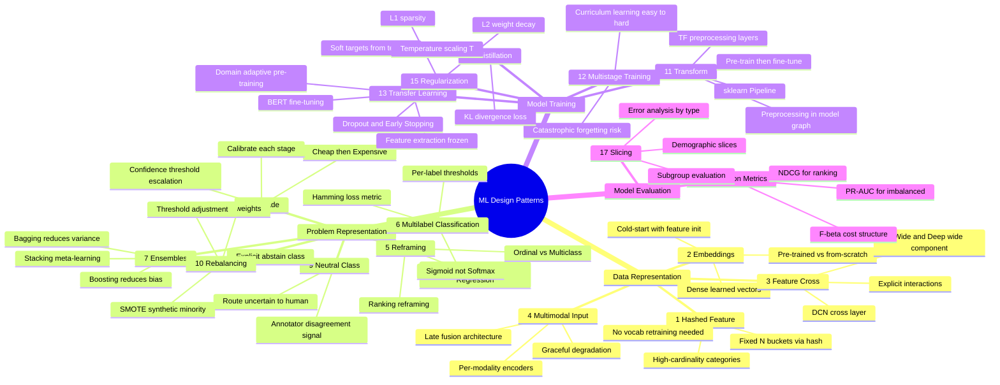

# Machine Learning Design Patterns



---

## Why Patterns Exist

**The problem**: ML teams repeatedly solve the same structural problems from scratch — high-cardinality categories, sparse inputs, imbalanced classes, multi-task objectives — producing brittle, inconsistent solutions that are hard to reproduce or reason about.

**The core insight**: recurring ML problems have recurring solutions. Naming and codifying them creates a shared vocabulary that makes design decisions explicit and transferable.

**The mechanics**: 20 patterns across five chapters — data representation, problem representation, model training, and model evaluation — each addressing a concrete failure mode with a concrete technique.

**What breaks**: patterns are solutions to specific structural problems. Applying a pattern where the structural problem doesn't exist adds complexity without benefit. The pattern is wrong if the problem it solves isn't present.

---

## Data Representation Patterns

### Pattern 1: Hashed Feature

**The problem**: categorical features with high cardinality (user IDs, product SKUs, URL paths) blow up the model when one-hot encoded. One million unique product IDs means a one-million-dimensional input vector. Adding a new category requires retraining.

**The core insight**: you do not need a unique dimension per category. Map every category to one of N fixed buckets using a hash function. The vocabulary size is fixed at compile time regardless of how many new categories appear.

**The mechanics**:

```python
import hashlib

def hash_feature(category_value: str, n_buckets: int = 10000) -> int:
    """
    Map any string to a fixed bucket index.
    Deterministic: same input always maps to same bucket.
    """
    hash_bytes = hashlib.md5(category_value.encode()).hexdigest()
    return int(hash_bytes, 16) % n_buckets

# Usage: replace raw category with bucket index
feature_index = hash_feature("user_12345678", n_buckets=10000)

# In a neural network: embed the bucket index
embedding_layer = nn.Embedding(10000, 32)
feature_embed = embedding_layer(torch.tensor(feature_index))
```

TensorFlow example:

```python
import tensorflow as tf

# Hash to 10000 buckets, then embed
hashed = tf.strings.to_hash_bucket_fast(input_tensor, num_buckets=10000)
embedded = tf.keras.layers.Embedding(10000, 32)(hashed)
```

**What breaks**: hash collisions are unavoidable. With N=10000 buckets and 1M categories, ~100 categories share each bucket on average. Colliding categories are indistinguishable to the model — if "electronics" and "gardening" hash to the same bucket, their signals are mixed. Increasing N_buckets reduces collisions but uses more memory. The sweet spot depends on category frequency distribution.

---

### Pattern 2: Embeddings

**The problem**: one-hot encoding is sparse and treats all categories as equally dissimilar. A model cannot learn that "New York" and "Manhattan" are related, or that "rock" and "jazz" share a genre category of "music." Every category starts with zero signal from similar categories.

**The core insight**: learn dense low-dimensional vectors (embeddings) that place similar items near each other in vector space. Similarity in embedding space reflects semantic or behavioral similarity.

**The mechanics**:

```python
class EmbeddingModel(nn.Module):
    def __init__(self, vocab_size: int, embed_dim: int = 64):
        super().__init__()
        self.embed = nn.Embedding(vocab_size, embed_dim)

    def forward(self, category_ids):
        return self.embed(category_ids)  # [batch, embed_dim]

# Word2Vec skip-gram: learn embeddings that predict context
# The model learns that "king" - "man" + "woman" ≈ "queen"

# For items: train on user interaction sequences
# Items that appear together in sessions become nearby in embedding space
```

Pre-trained embeddings vs learned-from-scratch:
- Use pre-trained (Word2Vec, GloVe, BERT) when data is scarce
- Train from scratch on task-specific data when you have sufficient labeled examples and domain-specific semantics

```python
# Transfer: initialize with pre-trained, fine-tune during training
pretrained_weights = load_word2vec("word2vec-google-news-300")
embed_layer = nn.Embedding.from_pretrained(pretrained_weights, freeze=False)
```

**What breaks**: embeddings require substantial data to converge. A vocabulary of 100K items needs millions of training examples for the embeddings to capture meaningful structure. With sparse data, embeddings for rare items (cold-start problem) remain near-random — the model has no signal to learn from. Cold-start solutions: initialize rare items with feature-based representations (average of their attribute embeddings).

---

### Pattern 3: Feature Cross

**The problem**: linear models cannot learn that "New York + winter" predicts coat purchases, even if they know "New York" and "winter" individually. The interaction between features is a distinct signal that no individual feature captures.

**The core insight**: create a new feature by crossing (combining) two existing features. The cross is a single categorical feature whose value is the concatenation of both. Linear models can now memorize this interaction directly.

**The mechanics**:

```python
def feature_cross(feature_a: str, feature_b: str) -> str:
    """
    Create a cross feature from two categorical values.
    """
    return f"{feature_a}_x_{feature_b}"

# Example: city x job_type cross
city = "new_york"
job_type = "software_engineer"
cross = feature_cross(city, job_type)
# Result: "new_york_x_software_engineer"
# This becomes its own one-hot or hashed feature
cross_index = hash_feature(cross, n_buckets=100000)

# Practical example: Wide & Deep uses feature crosses in the wide component
# The wide component memorizes (user_country x device_type x time_of_day)
# The deep component generalizes from dense embeddings
```

Dense feature crosses with DCN (Deep & Cross Network):

```python
class CrossLayer(nn.Module):
    """
    Explicit polynomial feature interactions.
    x_{l+1} = x_0 * (w_l . x_l) + b_l + x_l
    """
    def __init__(self, input_dim):
        super().__init__()
        self.w = nn.Linear(input_dim, 1, bias=False)
        self.b = nn.Parameter(torch.zeros(input_dim))

    def forward(self, x0, xl):
        return x0 * self.w(xl) + self.b + xl
```

**What breaks**: feature crosses explode combinatorially. If you have 1000 city values and 100 job types, the cross has 100,000 unique values — most of which appear rarely. The model overfits to frequent crosses and ignores rare but important ones. Hashing reduces the dimension, but sparse crosses still need sufficient training examples to learn stable weights.

---

### Pattern 4: Multimodal Input

**The problem**: real-world tasks often have multiple data types — product listings have images, titles (text), price (numerical), and category (categorical). A model that only accepts one type ignores potentially decisive signals from others.

**The core insight**: process each modality with the architecture designed for it; combine their outputs at a late fusion point. The combination learns which modalities are relevant for the prediction.

**The mechanics**: late fusion architecture:

```python
class MultimodalModel(nn.Module):
    def __init__(self, text_dim=768, image_dim=2048, num_dim=10, cat_dim=64):
        super().__init__()
        # Specialized encoders per modality
        self.text_encoder = nn.Linear(text_dim, 256)    # output of BERT
        self.image_encoder = nn.Linear(image_dim, 256)  # output of ResNet
        self.num_encoder = nn.Linear(num_dim, 64)
        self.cat_embedding = nn.Embedding(1000, cat_dim)

        # Fusion layer: concatenate all modality representations
        fusion_dim = 256 + 256 + 64 + cat_dim
        self.fusion = nn.Sequential(
            nn.Linear(fusion_dim, 256),
            nn.ReLU(),
            nn.Dropout(0.3),
            nn.Linear(256, 1),
            nn.Sigmoid()
        )

    def forward(self, text_embed, image_embed, numerical, category_ids):
        t = torch.relu(self.text_encoder(text_embed))
        v = torch.relu(self.image_encoder(image_embed))
        n = torch.relu(self.num_encoder(numerical))
        c = self.cat_embedding(category_ids).squeeze(1)

        combined = torch.cat([t, v, n, c], dim=-1)
        return self.fusion(combined)
```

Early fusion (concatenate raw features): simpler, but forces the model to learn modality-specific representations from scratch. Better when modalities have similar structure.

**What breaks**: a modality missing at inference time breaks the model unless you handle it explicitly. If images are missing for some products, the image encoder must receive a zero vector (or a learned "missing" embedding) rather than crashing. Design a graceful degradation strategy for every modality.

---

## Problem Representation Patterns

### Pattern 5: Reframing

**The problem**: the obvious problem framing is not always the best one. A classification problem with unequal class costs might be better framed as regression (predict cost directly) or as ranking (order items by risk score). The wrong framing forces the model to make hard binary decisions where the value is in the score, not the decision.

**The core insight**: the framing of the problem — what the model predicts and what loss it optimizes — determines what information is preserved and what is discarded. Change the framing when the original framing discards information the business needs.

**The mechanics**:

Regression reframing: instead of "classify as churn vs retain" (loses probability information), predict "probability of churn in next 30 days" (preserves gradations for targeting interventions).

Ordinal reframing: instead of predicting a 1-5 star rating as 5-class classification, predict it as a regression (MSE on numerical output) when the ordering matters more than the exact class.

Ranking reframing: instead of classifying each search result as relevant/not-relevant, rank all results by relevance score and optimize NDCG. The ranking model handles the threshold implicitly.

```python
# Classification framing: hard decision, loses calibration
output = nn.Sigmoid()(logit)  # predict P(churn)
label = (output > 0.5).float()

# Reframed as calibrated probability (preserved for downstream use)
# Train with binary cross-entropy but use the probability directly
# No threshold applied — downstream system decides action based on cost
```

**What breaks**: regression reframing fails when the output isn't really continuous. Predicting a 1-5 star rating as regression assumes equal spacing (difference between 1 and 2 equals difference between 4 and 5), which is often false for human opinion data. Use ordinal regression in that case.

---

### Pattern 6: Multilabel Classification

**The problem**: a document can belong to multiple categories simultaneously (sports AND politics), but standard softmax classification forces the model to pick exactly one category. The model must predict a distribution over mutually exclusive classes, which is the wrong constraint.

**The core insight**: use a sigmoid per output neuron rather than softmax across all outputs. Each neuron independently decides "is this label present?" — labels are not mutually exclusive.

**The mechanics**:

```python
class MultilabelClassifier(nn.Module):
    def __init__(self, input_dim: int, n_labels: int):
        super().__init__()
        self.fc = nn.Linear(input_dim, n_labels)

    def forward(self, x):
        return torch.sigmoid(self.fc(x))  # independent probability per label
        # NOT softmax — softmax forces sum-to-1, wrong for multilabel

# Labels: multi-hot encoding
# [1, 0, 1, 0, 1] = labels 0, 2, 4 are present
labels = torch.tensor([[1, 0, 1, 0, 1],
                        [0, 1, 1, 0, 0]], dtype=torch.float)

# Loss: binary cross-entropy per label (not categorical cross-entropy)
loss = F.binary_cross_entropy(predictions, labels)
# Each label independently contributes to the loss

# Evaluation: Hamming loss (fraction of wrong label assignments)
# NOT accuracy (which requires exact match of all labels)
from sklearn.metrics import hamming_loss
hamming = hamming_loss(y_true, (predictions > 0.5).numpy())
```

**What breaks**: the threshold 0.5 for converting probabilities to binary predictions is arbitrary. A rare label (appears in 1% of examples) will almost never exceed 0.5, so the model predicts it absent even when it's right. Per-label threshold tuning on a validation set — set threshold for each label to maximize F1 for that label — is necessary for multilabel problems with class imbalance.

---

### Pattern 7: Ensembles

**The problem**: a single model's predictions are subject to its specific inductive biases, initialization, and training data sample. One model that overfits, memorizes noise, or gets stuck in a local optimum will produce systematically wrong predictions in a particular region of input space.

**The core insight**: average predictions from diverse models. Diversity means each model makes different errors. When errors are uncorrelated, averaging cancels them out.

**The mechanics**:

Bagging (reduce variance): train multiple models on bootstrap samples of the data; average predictions.

```python
from sklearn.ensemble import RandomForestClassifier
# Random Forest = bagging over decision trees
# Each tree sees a random subset of data (rows) and features (columns)
rf = RandomForestClassifier(n_estimators=100, max_features='sqrt')
rf.fit(X_train, y_train)
# Prediction: majority vote of 100 trees
```

Boosting (reduce bias): train models sequentially, each correcting the errors of the previous.

```python
import xgboost as xgb
# XGBoost: each tree fits residuals of the previous ensemble
model = xgb.XGBClassifier(n_estimators=500, learning_rate=0.1, max_depth=6)
model.fit(X_train, y_train, eval_set=[(X_val, y_val)], early_stopping_rounds=50)
```

Stacking (meta-learning): train a meta-model on the predictions of base models.

```python
# Level 0: base models train on training data
# Level 1: meta-model trains on out-of-fold predictions from base models

from sklearn.model_selection import KFold
kf = KFold(n_splits=5)
meta_features = np.zeros((len(X_train), n_base_models))

for model_idx, base_model in enumerate(base_models):
    for train_idx, val_idx in kf.split(X_train):
        base_model.fit(X_train[train_idx], y_train[train_idx])
        meta_features[val_idx, model_idx] = base_model.predict_proba(X_train[val_idx])[:, 1]

# Meta-model trains on these out-of-fold predictions
meta_model = LogisticRegression()
meta_model.fit(meta_features, y_train)
```

**What breaks**: ensembles reduce variance but do not reduce bias. If all models share the same architecture, training data, or feature set, they learn correlated errors — ensemble gains are marginal. True diversity requires different algorithms, different feature subsets, or different training data.

---

### Pattern 8: Cascade

**The problem**: a single complex model handles all cases, including easy ones that don't need its full power. Running the expensive model on every input wastes compute and creates latency. But running only a cheap model misses hard cases.

**The core insight**: chain models from cheap to expensive. The cheap model handles easy cases; hard or uncertain cases escalate to more expensive models.

**The mechanics**:

```python
class CascadeClassifier:
    def __init__(self, models, confidence_thresholds):
        """
        models: list of models ordered cheap to expensive
        confidence_thresholds: confidence required to accept model k's output
        """
        self.models = models
        self.thresholds = confidence_thresholds

    def predict(self, x):
        for i, (model, threshold) in enumerate(zip(self.models, self.thresholds)):
            prob = model.predict_proba(x)[0]
            confidence = max(prob)

            if confidence >= threshold or i == len(self.models) - 1:
                return prob.argmax()
            # else: confidence too low, escalate to next model

# Example: spam detection cascade
# Stage 1: rule-based filter (regex patterns) — handles 80% of obvious spam
# Stage 2: logistic regression — handles 15% of ambiguous cases
# Stage 3: BERT classifier — handles remaining 5% of hard cases
# Net result: 5% of traffic requires expensive model, overall latency reduced 10x
```

**What breaks**: cascade calibration requires the confidence threshold to actually reflect uncertainty. If stage 1's model is overconfident (outputs 0.95 for inputs it should be uncertain about), hard cases never escalate to the expensive model and are misclassified silently. Calibrate each stage's confidence before setting thresholds.

---

### Pattern 9: Neutral Class

**The problem**: a binary or multiclass model is forced to make a classification even when the input is genuinely ambiguous. An image that's 51% likely to be a cat gets classified as "cat" with the same confidence as a clearly-cat image. Downstream systems cannot distinguish confident from uncertain predictions.

**The core insight**: add an explicit "uncertain" or "abstain" class. When the model is not confident enough to choose between classes, it predicts "neutral." This preserves the uncertainty signal for downstream use.

**The mechanics**:

```python
# Before: binary classification (positive vs negative)
# Problem: model must predict one or the other even for borderline examples

# After: three classes (positive, negative, neutral/abstain)
class NeutralClassifier(nn.Module):
    def __init__(self, input_dim):
        super().__init__()
        self.fc = nn.Linear(input_dim, 3)  # positive, negative, neutral

    def forward(self, x):
        return torch.softmax(self.fc(x), dim=-1)

# Training: label borderline examples as "neutral" class
# Use inter-annotator disagreement to identify ambiguous examples
# If annotators disagree > 30%: label as "neutral"

# At inference time: only act on positive/negative predictions
# Route "neutral" predictions to human review queue
def decision(prob_vector, neutral_threshold=0.4):
    neutral_prob = prob_vector[2]
    if neutral_prob > neutral_threshold:
        return "route_to_human_review"
    else:
        return "positive" if prob_vector[0] > prob_vector[1] else "negative"
```

**What breaks**: the neutral class only works if there are enough genuinely ambiguous training examples to learn the boundary. If you label arbitrarily mixed examples as "neutral," the model learns nothing — it sees no consistent pattern distinguishing "neutral" from "confident." Neutral labels must come from principled ambiguity signals (annotator disagreement, low confidence from an ensemble, deliberate boundary cases).

---

### Pattern 10: Rebalancing

**The problem**: class imbalance (1% fraud, 99% non-fraud) causes the model to learn "always predict the majority class." This achieves 99% accuracy while providing zero value. The loss function is dominated by easy majority-class examples.

**The core insight**: the model should learn the minority class. Weight loss contributions by class frequency, or change the sample distribution, so that minority-class errors cost proportionally more during training.

**The mechanics**:

Class weighting (simplest):

```python
from sklearn.utils.class_weight import compute_class_weight
import numpy as np

# Automatically compute inverse-frequency weights
class_weights = compute_class_weight(
    class_weight='balanced',
    classes=np.unique(y_train),
    y=y_train
)
# class_weights[0] ~= 1.0 (majority), class_weights[1] ~= 99.0 (minority)

# PyTorch: pass to loss function
criterion = nn.CrossEntropyLoss(weight=torch.tensor(class_weights, dtype=torch.float))
```

SMOTE — oversample minority class by generating synthetic examples:

```python
from imblearn.over_sampling import SMOTE

smote = SMOTE(sampling_strategy=0.1, random_state=42)
# sampling_strategy=0.1: make minority class 10% of majority class size
X_resampled, y_resampled = smote.fit_resample(X_train, y_train)

# SMOTE generates new minority examples by interpolating between
# existing minority examples in feature space
```

Threshold adjustment: train on imbalanced data; shift decision threshold to improve minority-class recall.

```python
from sklearn.metrics import precision_recall_curve

precision, recall, thresholds = precision_recall_curve(y_val, model.predict_proba(X_val)[:, 1])
# Find threshold that achieves desired recall (e.g., 80% recall)
target_recall = 0.80
threshold_idx = np.argmax(recall >= target_recall)
optimal_threshold = thresholds[threshold_idx]
```

**What breaks**: SMOTE can generate synthetic examples that land in the decision boundary of the majority class, creating noisy training examples in ambiguous regions. This hurts precision. Prefer class weighting when the feature space is complex (images, text); use SMOTE only for simple structured features.

---

## Model Training Patterns

### Pattern 11: Transform

**The problem**: the preprocessing pipeline used during training is implemented separately from the serving pipeline. When the two diverge — different normalization constants, different encoding logic, different feature order — the model receives inputs at serving time that are systematically different from what it was trained on.

**The core insight**: bundle preprocessing into the model graph. The model artifact contains both the transformation logic and the learned parameters. There is no separate preprocessing code to keep in sync.

**The mechanics**:

```python
# TensorFlow: preprocessing layers baked into the model
import tensorflow as tf

class TransformModel(tf.keras.Model):
    def __init__(self):
        super().__init__()
        # Preprocessing layers: statistics computed during adapt()
        self.normalizer = tf.keras.layers.Normalization()
        self.string_lookup = tf.keras.layers.StringLookup()
        # Model layers
        self.dense1 = tf.keras.layers.Dense(128, activation='relu')
        self.output_layer = tf.keras.layers.Dense(1, activation='sigmoid')

    def call(self, inputs):
        # Normalization and encoding happen inside the model
        normalized = self.normalizer(inputs['numerical'])
        encoded = self.string_lookup(inputs['categorical'])
        x = tf.concat([normalized, tf.cast(encoded, tf.float32)], axis=-1)
        x = self.dense1(x)
        return self.output_layer(x)

# Fit preprocessing on training data
model.normalizer.adapt(X_train_numerical)
model.string_lookup.adapt(X_train_categorical)

# Now save: model includes preprocessing parameters
model.save("model_with_transform")
```

scikit-learn Pipeline equivalent:

```python
from sklearn.pipeline import Pipeline
from sklearn.preprocessing import StandardScaler, OneHotEncoder
from sklearn.compose import ColumnTransformer

# Single artifact that includes all preprocessing
pipeline = Pipeline([
    ('preprocessor', ColumnTransformer([
        ('num', StandardScaler(), numerical_cols),
        ('cat', OneHotEncoder(handle_unknown='ignore'), categorical_cols)
    ])),
    ('classifier', RandomForestClassifier())
])

pipeline.fit(X_train, y_train)
# pipeline.predict(X_test) applies same preprocessing automatically
import joblib
joblib.dump(pipeline, 'model_with_preprocessing.joblib')
```

**What breaks**: the Transform pattern fails silently when upstream data systems change schema — a new column name, a new category value, a changed unit. The pipeline that was correct at training time applies stale logic. Validate input schema at serving time against the schema seen during training.

---

### Pattern 12: Multistage Training

**The problem**: training a complex model from scratch on a small task-specific dataset leads to overfitting or slow convergence. The model has too many parameters relative to the signal available.

**The core insight**: break training into stages. Earlier stages learn general representations on larger data; later stages fine-tune on task-specific data. Each stage initializes from a better starting point than random.

**The mechanics**:

Pretraining + fine-tuning (transfer learning):

```python
import torchvision.models as models

# Stage 1: pre-trained on ImageNet (1.2M labeled images)
backbone = models.resnet50(pretrained=True)

# Stage 2: fine-tune on target task (e.g., medical images, 5K examples)
# Freeze early layers, train only the final layers first
for param in backbone.parameters():
    param.requires_grad = False

# Replace classification head for new task
backbone.fc = nn.Linear(2048, n_target_classes)

# Only the new head trains in stage 1
optimizer = torch.optim.Adam(backbone.fc.parameters(), lr=1e-3)
train(backbone, optimizer, n_epochs=5)

# Stage 2: unfreeze entire network, train with smaller learning rate
for param in backbone.parameters():
    param.requires_grad = True

optimizer = torch.optim.Adam(backbone.parameters(), lr=1e-5)
train(backbone, optimizer, n_epochs=20)
```

Curriculum learning: order training examples from easy to hard. Start with high-confidence examples; introduce ambiguous ones gradually.

```python
def curriculum_loader(dataset, confidence_scores, epoch, n_epochs):
    """
    Gradually introduce harder examples as training progresses.
    """
    threshold = 1.0 - (epoch / n_epochs) * 0.8  # from 1.0 to 0.2
    easy_indices = [i for i, s in enumerate(confidence_scores) if s >= threshold]
    hard_indices = [i for i, s in enumerate(confidence_scores) if s < threshold]

    # Include all easy + fraction of hard examples
    fraction_hard = epoch / n_epochs
    n_hard = int(len(hard_indices) * fraction_hard)
    selected = easy_indices + random.sample(hard_indices, n_hard)
    return Subset(dataset, selected)
```

**What breaks**: fine-tuning catastrophically forgets: when a model pre-trained on task A is aggressively fine-tuned on task B, it loses its performance on task A. This matters for multi-task systems that need to retain general capabilities. Mitigate with low learning rate during fine-tuning and elastic weight consolidation (EWC).

---

### Pattern 13: Transfer Learning

**The problem**: training deep models requires enormous labeled datasets (millions of examples) and compute. For domain-specific tasks — medical imaging, legal NLP, specialized product categories — labeled data is scarce and expensive to produce.

**The core insight**: representations learned on related, data-rich tasks generalize. A language model trained on 800GB of text learns syntax, semantics, and world knowledge that transfers to downstream NLP tasks with small datasets.

**The mechanics**:

BERT fine-tuning for classification:

```python
from transformers import BertForSequenceClassification, BertTokenizer
import torch

# Pre-trained BERT: 110M parameters trained on BookCorpus + Wikipedia
tokenizer = BertTokenizer.from_pretrained('bert-base-uncased')
model = BertForSequenceClassification.from_pretrained(
    'bert-base-uncased',
    num_labels=2
)

# Fine-tune: only need ~10K labeled examples for many tasks
# BERT's representations generalize; only the head needs substantial adaptation

def fine_tune(model, train_loader, n_epochs=3, lr=2e-5):
    optimizer = torch.optim.AdamW(model.parameters(), lr=lr)
    for epoch in range(n_epochs):
        for batch in train_loader:
            outputs = model(**batch)
            loss = outputs.loss
            loss.backward()
            optimizer.step()
            optimizer.zero_grad()
```

Feature extraction (no fine-tuning): freeze the pre-trained model; use its output as fixed features for a lightweight downstream model.

```python
# Extract BERT embeddings without fine-tuning
with torch.no_grad():
    outputs = bert_model(input_ids, attention_mask=attention_mask)
    embeddings = outputs.last_hidden_state[:, 0, :]  # CLS token

# Train a simple classifier on these fixed embeddings
classifier = LogisticRegression()
classifier.fit(embeddings.numpy(), y_train)
```

**What breaks**: transfer learning fails when source and target domains are too different. ImageNet features transfer well within natural images; they transfer poorly to satellite imagery or microscopy images. Domain mismatch shows as slower convergence and lower final performance than domain-specific pretraining would achieve. Use domain-adaptive pretraining (DAP) when a large unlabeled corpus from the target domain is available.

---

### Pattern 14: Distillation

**The problem**: large models (BERT-large, GPT-3) are accurate but too slow for production serving. A 340M parameter model taking 500ms per inference is unusable in a latency-sensitive context. But the small model trained directly achieves much worse accuracy.

**The core insight**: train the small model to mimic the large model's output distribution, not just the hard labels. The large model's soft probabilities carry more information than hard labels (the probability distribution over "cat" and "leopard" contains implicit similarity information that 0/1 labels don't).

**The mechanics**:

```python
import torch.nn.functional as F

def distillation_loss(student_logits, teacher_logits, true_labels, T=4.0, alpha=0.7):
    """
    T: temperature (higher = softer probability distribution)
    alpha: weight on distillation loss vs hard label loss
    """
    # Soft targets from teacher
    soft_teacher = F.softmax(teacher_logits / T, dim=-1)
    soft_student = F.log_softmax(student_logits / T, dim=-1)

    # Distillation loss: student matches teacher's soft probabilities
    distill_loss = F.kl_div(soft_student, soft_teacher, reduction='batchmean') * (T ** 2)

    # Hard label loss: student also predicts correct labels
    hard_loss = F.cross_entropy(student_logits, true_labels)

    return alpha * distill_loss + (1 - alpha) * hard_loss

# Training loop
for batch in train_loader:
    with torch.no_grad():
        teacher_logits = teacher_model(batch)  # frozen teacher
    student_logits = student_model(batch)

    loss = distillation_loss(student_logits, teacher_logits, batch.labels)
    loss.backward()
    optimizer.step()
```

DistilBERT achieves 97% of BERT performance at 40% of the size and 60% faster inference.

**What breaks**: distillation requires access to the teacher model's logits (not just its predictions). If you only have access to a black-box teacher (e.g., via API), you cannot distill — you only see hard labels. Also, distillation assumes the student has sufficient capacity to learn the teacher's distribution. A student with 100x fewer parameters than the teacher will not successfully distill a very large model.

---

### Pattern 15: Regularization

**The problem**: a model with sufficient capacity to fit the training data will memorize noise and outliers rather than learning generalizable patterns. It fits the training distribution exactly but fails on slightly different test examples.

**The core insight**: penalize or constrain the model during training to prevent it from using its full capacity. The penalty forces the model to find simpler explanations that generalize better.

**The mechanics**:

L1 regularization (Lasso) — promotes sparsity by pushing weights to exactly zero:

```python
# L1: add sum of absolute weights to loss
l1_lambda = 0.001
l1_penalty = l1_lambda * sum(param.abs().sum() for param in model.parameters())
loss = task_loss + l1_penalty
# Result: many weights become exactly 0 -- automatic feature selection
```

L2 regularization (Ridge) — shrinks all weights proportionally:

```python
# PyTorch: weight_decay in optimizer applies L2 regularization
optimizer = torch.optim.Adam(model.parameters(), lr=1e-3, weight_decay=1e-4)
# weight_decay = lambda in L2 penalty: lambda * sum(w_i^2)
```

Dropout — randomly zero out neurons during training:

```python
class RegularizedNet(nn.Module):
    def __init__(self):
        super().__init__()
        self.fc1 = nn.Linear(512, 256)
        self.dropout = nn.Dropout(p=0.5)  # 50% of neurons zeroed at each forward pass
        self.fc2 = nn.Linear(256, 10)

    def forward(self, x):
        x = torch.relu(self.fc1(x))
        x = self.dropout(x)  # only during training; disabled at eval
        return self.fc2(x)
```

Early stopping — stop training when validation loss stops improving:

```python
best_val_loss = float('inf')
patience = 5
no_improve_count = 0

for epoch in range(100):
    train_loss = train_epoch(model, train_loader)
    val_loss = evaluate(model, val_loader)

    if val_loss < best_val_loss:
        best_val_loss = val_loss
        no_improve_count = 0
        torch.save(model.state_dict(), 'best_model.pt')
    else:
        no_improve_count += 1
        if no_improve_count >= patience:
            model.load_state_dict(torch.load('best_model.pt'))
            break
```

**What breaks**: too much regularization underfits — the model becomes too simple to capture the true signal. L1 lambda too high zeroes out informative features. Dropout probability too high (>0.7) prevents learning. Regularization strength must be tuned on a validation set, not set arbitrarily.

---

## Model Evaluation Patterns

### Pattern 16: Evaluation Metrics

**The problem**: accuracy is a misleading metric for most real ML problems. 99% accuracy on a 1% positive-class fraud detection problem means the model predicts "not fraud" for everything. The chosen metric shapes what the model optimizes — choose it wrong and you get a useless model.

**The core insight**: match the metric to the cost structure of errors in the specific problem. Different errors (false positive vs false negative) have different costs. The metric must reflect those costs.

**The mechanics**:

Classification metrics:

```python
from sklearn.metrics import (
    classification_report, roc_auc_score,
    average_precision_score, confusion_matrix
)

# Use PR-AUC for imbalanced problems (not ROC-AUC)
pr_auc = average_precision_score(y_true, y_scores)

# Use F-beta to weight precision vs recall by cost
# beta > 1: recall more important (e.g., disease detection -- don't miss cases)
# beta < 1: precision more important (e.g., content moderation -- don't remove good content)
from sklearn.metrics import fbeta_score
f2 = fbeta_score(y_true, y_pred, beta=2)  # recall 2x more important

# Report by class, not just overall
print(classification_report(y_true, y_pred, target_names=['negative', 'positive']))
```

Ranking metrics:

```python
# NDCG: relevance weighted by position (positions closer to 1 matter more)
# A relevant result at position 1 is worth more than at position 10

def ndcg_at_k(relevance_scores, k=10):
    """
    relevance_scores: list of relevance for items in predicted ranking order
    """
    dcg = sum(rel / math.log2(i + 2)
              for i, rel in enumerate(relevance_scores[:k]))
    # Ideal DCG: same items sorted by relevance
    ideal = sorted(relevance_scores, reverse=True)[:k]
    idcg = sum(rel / math.log2(i + 2)
               for i, rel in enumerate(ideal))
    return dcg / idcg if idcg > 0 else 0.0
```

**What breaks**: choosing the metric before understanding the error cost structure leads to optimizing the wrong thing. A team that maximizes ROC-AUC on a fraud model might ship a model that correctly identifies 98% of non-fraud transactions but catches only 20% of fraud. Define the business cost of each error type first, then choose the metric that reflects it.

---

### Pattern 17: Slicing

**The problem**: aggregate metrics hide subgroup failures. A model achieves 92% overall accuracy but 60% accuracy on elderly users, or performs well for English text but fails for Spanish. The aggregate metric passes; the subgroup failure ships to production.

**The core insight**: always evaluate performance on meaningful subgroups before declaring a model ready. Aggregate metrics are misleading when subgroup distributions differ from the overall distribution.

**The mechanics**:

```python
class SliceEvaluator:
    def __init__(self, df: pd.DataFrame, label_col: str, pred_col: str):
        self.df = df
        self.label_col = label_col
        self.pred_col = pred_col

    def evaluate_slice(self, filter_condition: str, slice_name: str):
        subset = self.df.query(filter_condition)
        if len(subset) == 0:
            print(f"WARNING: No examples for slice '{slice_name}'")
            return None

        y_true = subset[self.label_col]
        y_pred = subset[self.pred_col]

        from sklearn.metrics import f1_score, accuracy_score
        return {
            "slice": slice_name,
            "n_examples": len(subset),
            "accuracy": accuracy_score(y_true, y_pred),
            "f1": f1_score(y_true, y_pred, average='weighted')
        }

    def evaluate_all_slices(self, slice_definitions: dict):
        results = []
        for name, condition in slice_definitions.items():
            result = self.evaluate_slice(condition, name)
            if result:
                results.append(result)
        return pd.DataFrame(results).sort_values('f1')

# Usage
evaluator = SliceEvaluator(test_df, 'label', 'prediction')
results = evaluator.evaluate_all_slices({
    "age_under_25": "age < 25",
    "age_over_65": "age >= 65",
    "mobile_users": "device == 'mobile'",
    "spanish_language": "language == 'es'"
})
```

**What breaks**: you can only evaluate slices you define in advance. Unexpected subgroup failures (intersectional: elderly Spanish mobile users) are invisible unless specifically tested. Automated slice discovery tools (Slice Finder, Robustness Gym) search for underperforming subgroups by testing slice hypotheses automatically.

---

### Pattern 18: Skew Detection

**The problem**: the model performs well on test data but degrades in production. The test data's distribution has drifted from the production data's distribution — but this is invisible without explicitly measuring the distribution difference.

**The core insight**: compare the distribution of features (and predictions) between training/test time and serving time. A large statistical divergence means the model is being asked to make predictions on inputs it was not trained on.

**The mechanics**:

Population Stability Index (PSI) for monitoring:

```python
import numpy as np

def compute_psi(expected: np.ndarray, actual: np.ndarray, n_bins: int = 10) -> float:
    """
    PSI = sum[(Actual% - Expected%) * ln(Actual% / Expected%)]
    PSI < 0.1: no significant change
    PSI 0.1-0.2: moderate change, investigate
    PSI > 0.2: significant change, retrain
    """
    expected_hist, bin_edges = np.histogram(expected, bins=n_bins)
    actual_hist, _ = np.histogram(actual, bins=bin_edges)

    # Add small epsilon to prevent division by zero
    expected_pct = (expected_hist + 1e-6) / (expected_hist.sum() + 1e-6 * n_bins)
    actual_pct = (actual_hist + 1e-6) / (actual_hist.sum() + 1e-6 * n_bins)

    psi = np.sum((actual_pct - expected_pct) * np.log(actual_pct / expected_pct))
    return psi

# Monitor PSI for every feature weekly
# Alert when PSI > 0.2
for feature_name in feature_columns:
    psi = compute_psi(training_data[feature_name], production_data[feature_name])
    if psi > 0.2:
        alert(f"Feature {feature_name} has significant drift: PSI={psi:.3f}")
```

KL divergence for prediction distribution:

```python
from scipy.stats import entropy

def kl_divergence(p: np.ndarray, q: np.ndarray, n_bins: int = 20) -> float:
    """KL(p || q) — measures how different q is from p"""
    hist_p, bins = np.histogram(p, bins=n_bins, density=True)
    hist_q, _ = np.histogram(q, bins=bins, density=True)
    # Add epsilon to avoid log(0)
    hist_p = hist_p + 1e-10
    hist_q = hist_q + 1e-10
    return entropy(hist_p, hist_q)
```

**What breaks**: PSI and KL divergence measure marginal feature distributions. They miss joint distribution changes — a feature might have stable marginals while its relationship to other features changes (concept drift). Monitor prediction distribution and model output distribution, not just feature distributions, to catch concept drift.

---

### Pattern 19: Baseline Comparison

**The problem**: a team reports that their ML model achieves 85% accuracy. Is this good? Without a baseline, the number is meaningless — the same 85% might represent a breakthrough or near-random performance depending on the problem structure.

**The core insight**: every ML system must beat a simple non-ML baseline. If it does not, either the ML is wrong or the task is trivially solvable without ML.

**The mechanics**:

```python
class BaselineEvaluator:
    def evaluate_baselines(self, X_train, y_train, X_test, y_test):
        results = {}

        # Baseline 1: majority class predictor
        from sklearn.dummy import DummyClassifier
        majority = DummyClassifier(strategy='most_frequent')
        majority.fit(X_train, y_train)
        results['majority_class'] = accuracy_score(y_test, majority.predict(X_test))

        # Baseline 2: random predictor
        random_clf = DummyClassifier(strategy='stratified')
        random_clf.fit(X_train, y_train)
        results['random'] = accuracy_score(y_test, random_clf.predict(X_test))

        # Baseline 3: logistic regression (simple linear model)
        from sklearn.linear_model import LogisticRegression
        lr = LogisticRegression(max_iter=1000)
        lr.fit(X_train, y_train)
        results['logistic_regression'] = accuracy_score(y_test, lr.predict(X_test))

        # Baseline 4: rule-based heuristic (domain knowledge)
        # e.g., "predict churn if last_login > 90 days"
        rule_pred = (X_test['days_since_last_login'] > 90).astype(int)
        results['rule_based'] = accuracy_score(y_test, rule_pred)

        return results
```

Minimum requirement: the ML model must outperform all baselines by a margin justifying its complexity. Document baseline results with every model card.

**What breaks**: teams sometimes set baselines too easy to beat — a majority-class predictor on 99% non-fraud data achieves 99% accuracy, making any ML model look impressive. Set the strongest practical baseline (rule-based system currently in production) as the true comparison target.

---

### Pattern 20: Prediction Bias

**The problem**: a model passes overall accuracy requirements but systematically disadvantages one group of users. A loan model denies 40% of Black applicants vs 10% of white applicants with similar credit profiles. The overall accuracy is high, but the outcomes are discriminatory.

**The core insight**: fairness is not achieved by removing protected attributes. Other features (zip code, name, device type) are proxies for protected attributes. Measure fairness metrics explicitly and enforce them as constraints.

**The mechanics**:

Key fairness metrics:

```python
def evaluate_fairness(y_true, y_pred, sensitive_attr):
    """
    Compute fairness metrics across groups defined by sensitive_attr.
    sensitive_attr: array of 0/1 indicating group membership
    """
    groups = {0: "group_A", 1: "group_B"}
    metrics = {}

    for g_val, g_name in groups.items():
        mask = sensitive_attr == g_val
        tp = ((y_pred[mask] == 1) & (y_true[mask] == 1)).sum()
        fp = ((y_pred[mask] == 1) & (y_true[mask] == 0)).sum()
        fn = ((y_pred[mask] == 0) & (y_true[mask] == 1)).sum()
        tn = ((y_pred[mask] == 0) & (y_true[mask] == 0)).sum()

        metrics[g_name] = {
            "positive_rate": (tp + fp) / mask.sum(),       # Demographic parity
            "tpr": tp / (tp + fn) if (tp + fn) > 0 else 0, # Equal opportunity
            "fpr": fp / (fp + tn) if (fp + tn) > 0 else 0  # Equalized odds check
        }

    # Disparate impact ratio: should be >= 0.8 (80% rule)
    di = metrics["group_B"]["positive_rate"] / (metrics["group_A"]["positive_rate"] + 1e-10)
    metrics["disparate_impact"] = di

    return metrics

# Constraints at training time:
# Adversarial debiasing: add a discriminator that predicts sensitive attribute
# from model representations; penalize the model for making this easy
class AdversarialDebiasing(nn.Module):
    def __init__(self, encoder, classifier, adversary):
        super().__init__()
        self.encoder = encoder
        self.classifier = classifier
        self.adversary = adversary  # predicts sensitive attribute from encoder output

    def forward(self, x):
        z = self.encoder(x)
        y_hat = self.classifier(z)
        attr_hat = self.adversary(z)
        return y_hat, attr_hat

# Total loss: classification_loss - lambda * adversary_loss
# Maximizing adversary loss = making representations uninformative about sensitive attr
```

**What breaks**: demographic parity and equal opportunity are mutually incompatible when base rates differ across groups (proved mathematically by Chouldechova 2017). You cannot simultaneously have equal positive rates AND equal FPR AND equal FNR when the prevalence of the outcome differs by group. Every fairness criterion involves a value choice about which type of fairness to prioritize — that choice must be made explicitly and documented.

## Flashcards

**Why use Hashed Feature instead of one-hot for high-cardinality categoricals?** #flashcard
Fixed vocabulary size (N buckets) regardless of how many new categories appear — no retraining needed. Tradeoff: hash collisions mix unrelated categories' signals.

**When should you use pre-trained embeddings vs training from scratch?** #flashcard
Pre-trained (Word2Vec, GloVe, BERT) when labeled data is scarce; train from scratch when you have enough labeled examples and domain-specific semantics that generic embeddings wouldn't capture.

**Why do feature crosses explode combinatorially, and how do you control it?** #flashcard
Crossing two categoricals multiplies their cardinalities (1000 cities × 100 job types = 100K values), most rare. Hash the cross to a fixed bucket size to bound dimensionality.

**Cascade pattern: what has to be true for the confidence threshold to work?** #flashcard
Each stage's confidence must be calibrated. An overconfident cheap model never escalates hard cases to the expensive model — they get silently misclassified instead.

**Why can't demographic parity and equal opportunity both hold when base rates differ across groups?** #flashcard
Chouldechova (2017): equal positive rates, equal FPR, and equal FNR cannot all hold simultaneously when outcome prevalence differs by group — fairness criteria trade off and require an explicit, documented choice.

**Bagging vs boosting: what does each reduce, and why?** #flashcard
Bagging (e.g., Random Forest) reduces variance by averaging models trained on bootstrap samples. Boosting (e.g., XGBoost) reduces bias by training models sequentially, each correcting the previous ensemble's residuals.

**Why must preprocessing be baked into the model graph (Transform pattern)?** #flashcard
If training-time and serving-time preprocessing are separate code paths, they drift — different normalization constants or encoding logic silently cause training/serving skew.

**Why is PSI > 0.2 used as a retraining trigger, and what does it miss?** #flashcard
PSI measures how much a feature's marginal distribution shifted between training and production. It misses concept drift, where marginals stay stable but the feature's relationship to the label changes.

**Why must every ML model beat a non-ML baseline?** #flashcard
Without a baseline (majority class, rule-based heuristic), an accuracy number is meaningless. Use the strongest practical baseline — the system currently in production — not a weak strawman.
