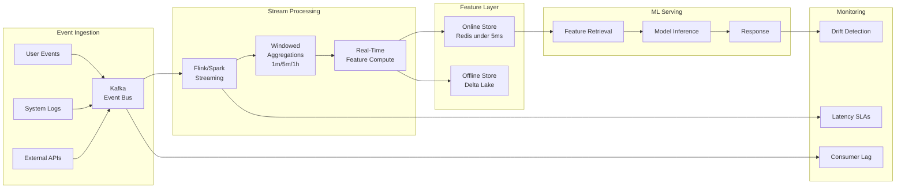

# Streaming ML Pipeline Architecture



---

## What Real-Time ML Pipelines Are

**The problem**: batch ML pipelines score users nightly. Fraud decisions must happen in 100ms during a payment. Recommendations must reflect the current session. Batch ML is blind to events from the last few hours.

**The core insight**: real-time ML pipelines replace scheduled batch jobs with continuously running stream processors that compute features and trigger predictions within milliseconds of an event.

**The five layers**:

```
Layer               | Component              | Latency
--------------------|------------------------|----------
Event Ingestion     | Kafka, Kinesis         | <1ms publish
Stream Processing   | Flink, Spark Streaming | 1-100ms
Feature Storage     | Redis, Bigtable        | <5ms lookup
Model Inference     | REST API, gRPC         | 5-50ms
Response Delivery   | API Gateway            | <10ms
```

---

## Kafka: Topic and Partition Design

**The mechanics**:

```python
from kafka import KafkaProducer
import json, time

producer = KafkaProducer(
    bootstrap_servers=['kafka:9092'],
    value_serializer=lambda v: json.dumps(v).encode('utf-8'),
    key_serializer=lambda k: k.encode('utf-8'),
    batch_size=65536,      # 64KB batch
    linger_ms=5,           # wait 5ms to fill batch
    compression_type='snappy',
    acks='all'             # wait all replicas
)

def publish_transaction(user_id: str, txn: dict):
    producer.send(
        topic='transaction-events',
        key=user_id,       # same user → same partition → ordering guaranteed
        value={
            'user_id': user_id,
            'amount': txn['amount'],
            'merchant_id': txn['merchant_id'],
            'event_time': int(time.time() * 1000)
        }
    )
```

**Partitioning strategy**:

```
Key          | Effect                          | Use case
-------------|----------------------------------|---------------------------
user_id      | All events per user colocated   | User-centric features
None random  | Maximum throughput              | No ordering needed
merchant_id  | Merchant events colocated       | Merchant risk scoring
```

**What breaks**: hot partitions. A user generating 1000 events/sec sends to a single partition — bottleneck. Fix: salted partitioning (`user_id + random_suffix % N`).

---

## Flink: Windowed Aggregations

**The mechanics**:

```sql
-- Flink SQL: 5-minute tumbling window velocity features
CREATE TABLE transaction_events (
    user_id     VARCHAR,
    amount      DOUBLE,
    merchant_id VARCHAR,
    event_time  TIMESTAMP(3),
    WATERMARK FOR event_time AS event_time - INTERVAL '10' SECOND
) WITH (
    'connector'    = 'kafka',
    'topic'        = 'transaction-events',
    'format'       = 'json'
);

-- Tumbling window (non-overlapping)
CREATE VIEW velocity_5min AS
SELECT
    user_id,
    COUNT(*)                    AS txn_count_5min,
    SUM(amount)                 AS total_amount_5min,
    COUNT(DISTINCT merchant_id) AS distinct_merchants_5min,
    TUMBLE_END(event_time, INTERVAL '5' MINUTE) AS window_end
FROM transaction_events
GROUP BY user_id, TUMBLE(event_time, INTERVAL '5' MINUTE);

-- Sliding window: updated every 1 min, 1h lookback
CREATE VIEW velocity_1h AS
SELECT
    user_id,
    COUNT(*) AS txn_count_1h,
    SUM(amount) AS total_amount_1h,
    HOP_END(event_time, INTERVAL '1' MINUTE, INTERVAL '1' HOUR) AS window_end
FROM transaction_events
GROUP BY user_id, HOP(event_time, INTERVAL '1' MINUTE, INTERVAL '1' HOUR);
```

### Watermarks and Late Data

**The problem**: events arrive out of order due to network delays. An event timestamped 10:00 arrives at 10:05. Without watermarks, the 10:00-10:05 window has already emitted and the event is silently dropped.

**The core insight**: watermarks define the late-arrival tolerance. `WATERMARK AS event_time - INTERVAL '30' SECOND` means: the window emits 30 seconds after its end time, accepting events up to 30 seconds late.

```python
# Tradeoff
# Aggressive watermark (10s tolerance) → low latency, more late drops
# Conservative watermark (5min tolerance) → high latency, fewer drops
# Use case drives choice: fraud = low latency; billing = low drops
```

---

## Exactly-Once Semantics

**The mechanics**:

```python
from pyflink.datastream import StreamExecutionEnvironment, CheckpointingMode

env = StreamExecutionEnvironment.get_execution_environment()
env.enable_checkpointing(60000)  # checkpoint every 60s
env.get_checkpoint_config().set_checkpointing_mode(
    CheckpointingMode.EXACTLY_ONCE
)

# Kafka sink with transactional producer
from pyflink.datastream.connectors.kafka import KafkaSink, DeliveryGuarantee

sink = (
    KafkaSink.builder()
    .set_bootstrap_servers("kafka:9092")
    .set_delivery_guarantee(DeliveryGuarantee.EXACTLY_ONCE)
    .set_transactional_id_prefix("flink-feature-proc")
    .build()
)
```

**Tradeoff table**:

```
Guarantee      | Throughput | Latency | Use case
---------------|-----------|---------|--------------------------------
At-most-once   | Highest   | Lowest  | Non-critical metrics
At-least-once  | High      | Low     | Idempotent feature updates
Exactly-once   | Lower     | Higher  | Fraud scoring, billing events
```

---

## Online Inference Integration

**Asynchronous precompute pattern** (preferred for high-traffic):

```python
import redis, json, requests

cache = redis.Redis(host='redis')
INFERENCE_URL = "http://inference:8080/predict"

def handle_feature_update(features: dict):
    entity_id = features['user_id']
    old_features = json.loads(cache.get(f"features:{entity_id}") or '{}')

    # Only re-infer if features changed meaningfully
    if abs(features.get('txn_count_5min', 0) -
           old_features.get('txn_count_5min', 0)) >= 3:
        prediction = requests.post(
            INFERENCE_URL, json={'features': features}, timeout=0.05
        ).json()
        cache.setex(f"prediction:{entity_id}", 300, json.dumps(prediction))

    cache.setex(f"features:{entity_id}", 300, json.dumps(features))

def get_prediction(entity_id: str) -> dict:
    cached = cache.get(f"prediction:{entity_id}")
    if cached:
        return json.loads(cached)
    return synchronous_inference(entity_id)  # cold-start fallback
```

---

## Latency vs Throughput Tradeoffs

```
Use Case              | Latency Target | Throughput  | Pattern
----------------------|---------------|-------------|----------------------------
Payment fraud         | <100ms        | 10K TPS     | Synchronous, Redis features
Feed ranking          | <200ms        | 100K TPS    | Precomputed, cache refresh
Product search        | <50ms         | 50K TPS     | Pre-indexed, ANN lookup
Real-time bidding     | <10ms         | 1M TPS      | In-process model, no network
Personalization       | <300ms        | 20K TPS     | Cached prediction, async
```

**Capacity planning (Little's Law)**:

```python
def estimate_workers(target_tps: int, p99_latency_ms: float) -> int:
    # N = lambda * W (Little's Law)
    concurrent = target_tps * (p99_latency_ms / 1000)
    return int(concurrent * 1.5)  # 50% headroom

# Fraud: 10K TPS, 80ms p99 → recommend 1200 workers
estimate_workers(10_000, 80)
```

---

## Monitoring Streaming Pipelines

```python
from prometheus_client import Counter, Histogram, Gauge

events_processed = Counter('events_processed_total', 'Events processed', ['topic'])
e2e_latency = Histogram(
    'ml_pipeline_e2e_latency_seconds', 'End-to-end latency',
    buckets=[0.01, 0.05, 0.1, 0.25, 0.5, 1.0]
)
consumer_lag = Gauge('kafka_consumer_lag', 'Messages behind offset',
                     ['topic', 'partition'])
feature_age = Gauge('feature_age_seconds', 'Feature staleness', ['feature_view'])
```

**Alert rules**:

```yaml
- alert: ConsumerLagHigh
  expr: kafka_consumer_lag > 10000
  annotations: {summary: "Pipeline falling behind — features going stale"}

- alert: PipelineLatencySLABreach
  expr: histogram_quantile(0.99, ml_pipeline_e2e_latency_seconds) > 0.5
  annotations: {summary: "p99 > 500ms SLA breach"}
```

**What breaks**: monitoring Kafka broker health but not consumer lag. The cluster appears healthy while the pipeline falls minutes behind, silently degrading feature freshness. Always monitor consumer lag per group with lag-based alerts.

## Flashcards

**alert?** #flashcard
ConsumerLagHigh

**alert?** #flashcard
PipelineLatencySLABreach
