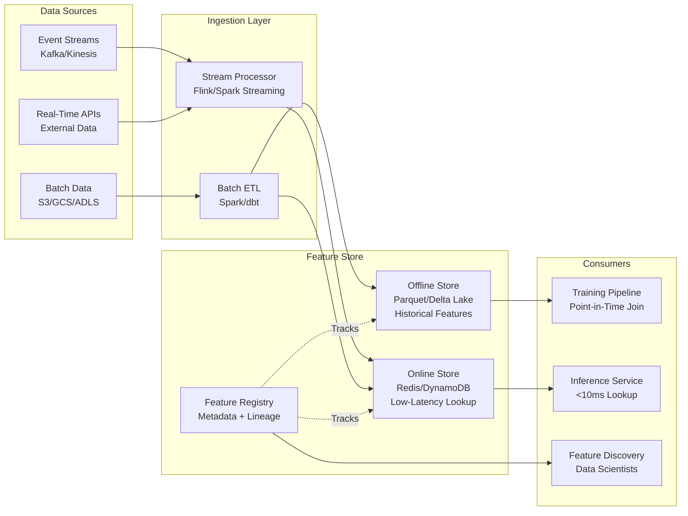

# Feature Store Architecture



---

## What a Feature Store Is

**The problem**: ML teams recompute the same features (30-day purchase count, item CTR) independently per model. Training and serving pipelines compute them differently, causing training-serving skew. Features have no metadata, versioning, or discoverability.

**The core insight**: features are shared infrastructure, not per-model logic. A Feature Store centralizes feature computation, storage, and serving so the same definition is used at training and serving time, by any team.

**Four components**:

```
Component          | Responsibility
-------------------|--------------------------------------------------
Offline Store      | Historical feature values for model training
Online Store       | Low-latency feature lookup for model serving
Feature Registry   | Metadata: feature definitions, lineage, owners
Transformation Layer | Compute features from raw data (stream + batch)
```

**What breaks**: teams bypass the store, computing features inline "just this once" because the store lacks what they need. This defeats the purpose — the store must be easier to use than bypassing it.

---

## Offline Store Design

**The problem**: training requires point-in-time correct features — values available at the exact moment each label was generated, not today's values. Using a user's current 100-purchase count for a fraud label generated when they had 5 purchases is leakage.

**The core insight**: the offline store is a historical log of feature values over time, enabling point-in-time joins between label events and feature snapshots.

```python
import pandas as pd
from feast import FeatureStore

store = FeatureStore(repo_path=".")

entity_df = pd.DataFrame({
    "user_id": ["u1", "u2", "u3"],
    "event_timestamp": [
        pd.Timestamp("2024-01-15 10:00:00"),
        pd.Timestamp("2024-01-16 14:30:00"),
        pd.Timestamp("2024-01-17 09:15:00"),
    ],
    "label": [1, 0, 1]
})

# Feast retrieves feature values as of each event_timestamp — no future leakage
training_df = store.get_historical_features(
    entity_df=entity_df,
    features=[
        "user_features:purchase_count_30d",
        "user_features:avg_transaction_amount",
        "user_features:distinct_merchants_7d",
    ]
).to_df()
```

**Storage format**: Parquet on object storage (S3, GCS), partitioned by date. Delta Lake/Iceberg preferred for ACID + time travel:

```python
from delta import DeltaTable

dt = DeltaTable.forPath(spark, "s3://feature-store/user_features/")

historical_features = (
    dt.toDF()
    .filter("event_timestamp <= '2024-01-15 10:00:00'")
    .groupBy("user_id")
    .agg({"feature_value": "last"})
)
```

**What breaks**: point-in-time joins are expensive at scale — a 100M-row training set against a 1B-row feature table can run for hours. Mitigations: partition by date, cache snapshots at regular intervals and binary-search the nearest one, or use Iceberg's time-travel queries.

---

## Online Store Design

**The problem**: inference needs feature values in <10ms. The offline store (Parquet on S3, 100ms+ reads) is too slow.

**The core insight**: the online store is a key-value cache of the latest feature values per entity — trading history for speed.

```python
import redis, json

class OnlineFeatureStore:
    def __init__(self, redis_client: redis.Redis):
        self.redis = redis_client

    def get_features(self, entity_id: str, feature_view: str) -> dict:
        key = f"{feature_view}:{entity_id}"
        raw = self.redis.get(key)
        return json.loads(raw) if raw else self._get_default_features(feature_view)

    def write_features(self, entity_id: str, feature_view: str, features: dict):
        key = f"{feature_view}:{entity_id}"
        self.redis.setex(key, time=86400, value=json.dumps(features))

# Materialization: offline → online sync, run every 15 min or hourly
def materialize_to_online(store: FeatureStore, feature_view: str):
    store.materialize_incremental(end_date=datetime.utcnow(), feature_views=[feature_view])
```

DynamoDB is a common alternative for multi-region, high-availability serving (`ConsistentRead=False` for lower latency).

**Serving latency targets**:

```
Online store type   | p50 latency | p99 latency | Notes
--------------------|-------------|-------------|------
Redis (same region) | 0.5ms       | 2ms         | Best for <10ms budgets
DynamoDB DAX cache  | 1ms         | 5ms         | Multi-region, managed
Bigtable            | 3ms         | 10ms        | Best for wide rows
PostgreSQL + pgpool | 5ms         | 20ms        | Simple but slower
```

**What breaks**: the online store holds only the latest value per entity. Rolling-window features (30-day count) must be updated incrementally as events arrive, not recomputed — and that update logic must be idempotent so replayed events don't double-count.

---

## Feature Transformation Layer

### Stream Processing for Real-Time Features

**The problem**: velocity features ("transactions in last 5 minutes") need near-instant updates; hourly/daily batch ETL is too stale.

```python
# Flink: 5-minute rolling count/sum per user, written to Redis
t_env.execute_sql("""
    CREATE TABLE transactions (
        user_id STRING, amount DOUBLE, merchant_id STRING,
        event_time TIMESTAMP(3),
        WATERMARK FOR event_time AS event_time - INTERVAL '5' SECOND
    ) WITH ('connector'='kafka', 'topic'='transactions', 'format'='json')
""")

t_env.execute_sql("""
    INSERT INTO user_velocity_features
    SELECT user_id, COUNT(*) AS txn_count_5min, SUM(amount) AS total_amount_5min,
           TUMBLE_END(event_time, INTERVAL '5' MINUTE) AS window_end
    FROM transactions
    GROUP BY user_id, TUMBLE(event_time, INTERVAL '5' MINUTE)
""")
```

### Batch ETL for Historical Features

**The problem**: long-window aggregates (30/90-day) are too expensive to compute per request. Pre-compute daily.

```python
from pyspark.sql.functions import col, count, avg, countDistinct

thirty_day_features = (
    spark.read.parquet("s3://data-lake/transactions/")
    .filter(col("event_date") >= "2024-01-01")
    .groupBy("user_id")
    .agg(
        count("*").alias("purchase_count_30d"),
        avg("amount").alias("avg_transaction_amount_30d"),
        countDistinct("merchant_id").alias("distinct_merchants_30d"),
    )
)

thirty_day_features.write.format("delta").mode("overwrite").save("s3://feature-store/user_features/")
thirty_day_features.foreachPartition(lambda rows: materialize_to_redis(rows))
```

**What breaks**: batch and stream computing the same feature independently can diverge (late-arriving data, timezone handling, definition drift). Fix: single source-of-truth definition in the Feature Registry; stream pre-aggregates, batch corrects overnight.

---

## Feature Registry

**The problem**: as feature libraries grow to thousands of entries across teams, duplication ("user_age" computed 5 ways), deprecated-feature bugs, and poor discoverability follow.

**The core insight**: the Registry catalogs feature metadata — computation logic, owners, SLAs, lineage — not the data itself.

```python
from feast import FeatureView, Entity, Feature, ValueType
from feast.data_source import FileSource
from datetime import timedelta

user = Entity(name="user_id", value_type=ValueType.STRING)

user_transaction_features = FeatureView(
    name="user_transaction_features",
    entities=["user_id"],
    ttl=timedelta(days=1),
    features=[
        Feature(name="purchase_count_30d", dtype=ValueType.INT64),
        Feature(name="avg_transaction_amount_30d", dtype=ValueType.FLOAT),
    ],
    online=True,
    batch_source=FileSource(
        path="s3://feature-store/user_transaction_features/",
        event_timestamp_column="event_timestamp",
    ),
    tags={"team": "trust-safety", "owner": "alice@company.com", "sla_ms": "10"}
)

store.apply([user, user_transaction_features])
```

**What breaks**: the Registry only works if teams register features before use. One-off notebook features that never get registered make the Registry incomplete. Enforce via CI/CD: block deployment if a used feature isn't registered.

---

## Point-in-Time Correctness

**The problem**: each label (churn, fraud, click) was generated at a specific time. Training features must reflect values as of that time — using post-event values is leakage.

```python
# WRONG — leakage: joins on current feature values
labels_df.join(features_df, on="user_id")

# CORRECT — most recent feature row where feature_timestamp <= label_timestamp
def point_in_time_join(labels, features, entity_col="user_id",
                        label_time_col="label_timestamp", feature_time_col="feature_timestamp"):
    result_rows = []
    for _, label_row in labels.iterrows():
        cutoff = label_row[label_time_col]
        valid = features[
            (features[entity_col] == label_row[entity_col]) &
            (features[feature_time_col] <= cutoff)
        ]
        if len(valid) == 0:
            continue
        latest = valid.sort_values(feature_time_col, ascending=False).iloc[0]
        result_rows.append({**label_row.to_dict(), **latest.to_dict()})
    return pd.DataFrame(result_rows)
```

**What breaks**: naive point-in-time joins are O(n×m) — too slow at scale. Use: **sorted merge join** (both tables sorted by entity_id+timestamp, single pass), **snapshot materialization** (hourly snapshots, binary search), or native `AS OF TIMESTAMP` support in Iceberg/Delta Lake.

---

## Online/Offline Parity Testing

**The problem**: pipeline bugs, timezone mismatches, or incremental-update errors cause the online store to silently diverge from what training used.

```python
from scipy.stats import ks_2samp

def check_online_offline_parity(store, feature_names, entity_ids, sample_size=1000):
    entity_df = pd.DataFrame({"user_id": entity_ids[:sample_size], "event_timestamp": [datetime.now()] * sample_size})
    offline = store.get_historical_features(entity_df=entity_df, features=feature_names).to_df()
    online = store.get_online_features(features=feature_names,
                                        entity_rows=[{"user_id": uid} for uid in entity_ids[:sample_size]]).to_df()

    discrepancies = {}
    for feat in feature_names:
        name = feat.split(":")[1]
        off, on = offline[name].dropna(), online[name].dropna()
        if len(off) and len(on):
            stat, p_value = ks_2samp(off, on)
            mean_diff = abs(off.mean() - on.mean()) / (off.std() + 1e-10)
            discrepancies[name] = {"ks_statistic": stat, "alert": stat > 0.1 or mean_diff > 0.1}
    return discrepancies

# SLAs: mean feature value within 5%, KS statistic < 0.1, null rate within 1pp
```

Common causes: different null handling between batch/stream, timezone bugs, upstream schema changes, double-counted incremental updates.

---

## Streaming Backfill

When deploying a new streaming feature, training needs historical values. Solution: replay raw Kafka events (from topic retention or S3 archive) through the same Flink job in batch mode, writing outputs with original event timestamps — not backfill execution time. Backfill must use the same watermark logic as production and pass point-in-time parity checks before use.

---

## Feature Freshness vs Latency

```
Feature type              | Computation  | Update cadence | Staleness tolerance | Storage
--------------------------|--------------|----------------|---------------------|-------------------
Real-time (velocity)      | Flink/Kafka  | < 1 min        | Seconds             | Redis
Near-real-time (daily)    | Spark batch  | 1–24 hours     | Minutes             | Redis + S3
Historical (lifetime val) | SQL warehouse| Daily/weekly   | Hours               | BigQuery + Redis
```

**Decision rule**: if a feature changes in <5 min and impacts model output, use streaming. If it changes hourly and the model runs <1 day before prediction, batch is fine. Test: delay feature refresh in offline eval and measure PR-AUC drop — if <0.5%, batch suffices.

---

## Feature Monitoring

**1. Feature drift (covariate shift)** — distribution of values changes:

```python
def population_stability_index(reference, current, buckets=10):
    """PSI > 0.25 indicates significant drift; requires retraining."""
    ref_hist, edges = np.histogram(reference, bins=buckets, density=True)
    cur_hist, _ = np.histogram(current, bins=edges, density=True)
    ref_hist, cur_hist = np.clip(ref_hist, 1e-10, None), np.clip(cur_hist, 1e-10, None)
    return np.sum((cur_hist - ref_hist) * np.log(cur_hist / ref_hist))
```

**2. Feature freshness** — is the feature updating on schedule?

```python
def check_feature_freshness(store, feature_view_name, max_staleness_hours=2):
    staleness = (datetime.now() - store.get_latest_feature_timestamp(feature_view_name)).total_seconds() / 3600
    if staleness > max_staleness_hours:
        alert(f"{feature_view_name} is {staleness:.1f}h stale, SLA={max_staleness_hours}h")
```

**3. Online/offline parity drift** — run the parity test daily; if KS > 0.1 after a pipeline update, rollback and investigate.

---

## Open-Source Feature Store Comparison

```
Tool         | Offline Store  | Online Store           | Streaming | Deployment    | Best for
-------------|----------------|------------------------|-----------|---------------|---------------------------
Feast        | S3/GCS/Parquet | Redis/DynamoDB/Bigtable| Yes       | Self-hosted   | Control, cost, flexibility
Tecton       | S3/Parquet     | DynamoDB/Redis         | Native    | SaaS/on-prem  | Enterprise, managed scale
Hopsworks    | Hive/Parquet   | RonDB/MySQL Cluster    | Yes       | On-prem+Cloud | Full ML platform
Vertex AI FS | BigQuery       | Bigtable               | No        | GCP only      | GCP-native stacks
SageMaker FS | S3             | DynamoDB               | Partial   | AWS only      | AWS-native stacks
```

**Build vs buy**: only build custom if scale exceeds 100TB offline features + 100M entity lookups/day. Below that, Feast with Redis + S3 covers most use cases.

---

## Feature Store Interview Questions

**Design a Feature Store for a fraud detection system:**
- Identify real-time (velocity) vs batch (user history) features
- Describe offline store schema and point-in-time join logic
- Choose online store (Redis) and explain the materialization job
- Define SLAs: <5ms online lookup, <100ms offline retrieval
- Address schema evolution (adding a new feature)

**Q: What is point-in-time correctness and why does it matter?**
A: Each training example must use only features available at the time of its target event. Violating this leaks future information into training, inflating offline metrics. The classic bug: joining on entity key without a timestamp constraint, so "30-day spend" includes transactions after the label event. Fix: store a computation timestamp per feature and fetch the most recent value with `timestamp ≤ event_timestamp`.

**Q: How do you ensure online/offline parity?**
A: (1) Same transformation code for both paths, ideally a shared library; (2) online pipeline writes derived features back to the offline store so both use identical materialized values; (3) shadow testing before launch — compare online vs offline values for the same entity/timestamp, alert if KS > 0.1 or mean diff > 5%; (4) continuous hourly parity monitoring, rollback on regression. Root causes are usually null handling, timezone bugs, freshness gaps, or upstream schema changes.

**Q: When would you use streaming vs batch features?**
A: Depends on how fast the feature changes and how much it affects the model. Velocity features (transactions in last hour) change in minutes and drive fraud/risk decisions — need streaming. Lifetime value or 90-day patterns change slowly — daily batch is enough. Validate by delaying refresh in offline eval and measuring the metric drop.

**Q: How do you backfill a streaming feature for historical training data?**
A: Replay raw events through the same streaming job in batch mode, writing outputs with original event timestamps. Watermarking must match production, `feature_timestamp = window_end_time` (not backfill time), and results must pass point-in-time parity checks before use.

## Flashcards

**Sorted merge join?** #flashcard
Both tables sorted by (entity_id, timestamp); single pass with two pointers.

**Snapshot materialization?** #flashcard
Store feature snapshots at fixed intervals (hourly); binary search for the nearest snapshot before cutoff.

**What does PSI > 0.25 indicate?** #flashcard
Significant feature drift; requires retraining.

**What is a feature freshness SLA?** #flashcard
The maximum acceptable age of a feature value at serving time (e.g., txn_count_5min <1 min stale; purchase_count_30d up to 24h stale). Drives batch vs streaming choice.

**Four controls for online/offline parity?** #flashcard
Same transformation code, same materialized data source, shadow testing before launch, continuous parity monitoring.

**Streaming backfill key requirement?** #flashcard
Replay raw events through the same job in batch mode; write with original event timestamps (window_end_time), not backfill execution time.
