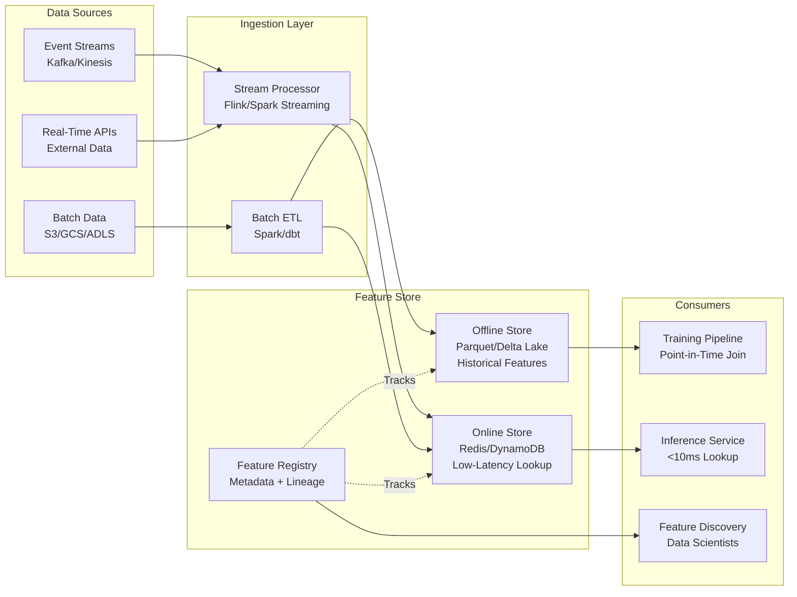

# Feature Store Architecture



---

## What a Feature Store Is

**The problem**: ML teams repeatedly compute the same features (user's 30-day purchase count, item's click-through rate) independently for each model and pipeline. Training pipelines compute features differently than serving pipelines, causing training-serving skew. Features have no metadata, no versioning, and no discoverability across teams.

**The core insight**: features are a shared infrastructure asset, not per-model logic. A Feature Store centralizes feature computation, storage, and serving — ensuring that the same feature definition is used at training time and serving time, by any team, for any model.

**The mechanics**: a Feature Store has four components:

```
Component          | Responsibility
-------------------|--------------------------------------------------
Offline Store      | Historical feature values for model training
Online Store       | Low-latency feature lookup for model serving
Feature Registry   | Metadata: feature definitions, lineage, owners
Transformation Layer | Compute features from raw data (stream + batch)
```

**What breaks**: the most common Feature Store failure is teams bypassing the store — they compute features inline in the training pipeline "just this once" because the store doesn't have the feature they need. This defeats the purpose. The store must be easy enough to add features to that bypassing it costs more than using it.

---

## Offline Store Design

### What It Stores

**The problem**: training a model requires point-in-time correct features — the values that were available at the exact moment each label was generated, not the values today. If a user had 5 purchases on the day a fraud label was generated, using their current 100-purchase count will introduce data leakage.

**The core insight**: the offline store is a historical log of feature values at every point in time. It enables point-in-time joins between label events and feature snapshots.

**The mechanics**:

```python
# Point-in-time correct feature retrieval
# Given: event log with (entity_id, label, event_timestamp)
# Returns: feature values as of event_timestamp for each entity

import pandas as pd
from feast import FeatureStore

store = FeatureStore(repo_path=".")

# Entity DataFrame: the timestamps drive point-in-time lookup
entity_df = pd.DataFrame({
    "user_id": ["u1", "u2", "u3"],
    "event_timestamp": [
        pd.Timestamp("2024-01-15 10:00:00"),
        pd.Timestamp("2024-01-16 14:30:00"),
        pd.Timestamp("2024-01-17 09:15:00"),
    ],
    "label": [1, 0, 1]  # fraud labels
})

# Feast retrieves the feature values as of each event_timestamp
training_df = store.get_historical_features(
    entity_df=entity_df,
    features=[
        "user_features:purchase_count_30d",
        "user_features:avg_transaction_amount",
        "user_features:distinct_merchants_7d",
    ]
).to_df()

# training_df: features are the values available at event_timestamp
# No future leakage because Feast filters by timestamp
```

**Storage format**: Parquet on object storage (S3, GCS) partitioned by date. Row Groups aligned with entity ID for efficient lookup.

```python
# Offline store: time-partitioned feature snapshots
# Schema: entity_id | feature_1 | feature_2 | ... | event_timestamp | created_timestamp

# Delta Lake (preferred for ACID + time travel)
from delta import DeltaTable

dt = DeltaTable.forPath(spark, "s3://feature-store/user_features/")

# Point-in-time join via Delta time travel
historical_features = (
    dt.toDF()
    .filter("event_timestamp <= '2024-01-15 10:00:00'")
    .groupBy("user_id")
    .agg({"feature_value": "last"})  # most recent value before cutoff
)
```

**What breaks**: point-in-time joins are expensive at scale. A training set with 100M rows, each requiring a timestamp-bounded lookup against a feature table with 1B rows, runs for hours. Solutions:
- Partition offline store by date to reduce scan scope
- Cache feature snapshots at regular intervals (hourly) and binary-search the nearest snapshot
- Use Apache Iceberg's time-travel queries which maintain metadata for efficient historical reads

---

## Online Store Design

### Low-Latency Feature Serving

**The problem**: model inference at serving time requires feature values in <10ms. Recomputing features from raw data on every request is too slow. The offline store (Parquet on S3) has 100ms+ read latency. A dedicated low-latency store is needed.

**The core insight**: the online store is a key-value cache of the most recent feature values per entity. It trades completeness (no history) for speed (<5ms reads).

**The mechanics**:

```python
# Online store: materialized current feature values

# Redis as online store
import redis
import json

class OnlineFeatureStore:
    def __init__(self, redis_client: redis.Redis):
        self.redis = redis_client

    def get_features(self, entity_id: str, feature_view: str) -> dict:
        """Retrieve features for a single entity in <5ms."""
        key = f"{feature_view}:{entity_id}"
        raw = self.redis.get(key)
        if raw is None:
            return self._get_default_features(feature_view)
        return json.loads(raw)

    def write_features(self, entity_id: str, feature_view: str, features: dict):
        """Materialize features to online store."""
        key = f"{feature_view}:{entity_id}"
        self.redis.setex(
            key,
            time=86400,  # 24h TTL
            value=json.dumps(features)
        )

# Materialization job: offline → online sync
def materialize_to_online(store: FeatureStore, feature_view: str):
    """
    Sync recent feature values from offline to online store.
    Run as a scheduled job (every 15 minutes or hourly).
    """
    store.materialize_incremental(
        end_date=datetime.utcnow(),
        feature_views=[feature_view]
    )
```

**DynamoDB as online store** (for multi-region, high availability):

```python
import boto3

dynamodb = boto3.resource('dynamodb')
table = dynamodb.Table('feature_store_online')

def get_online_features(entity_id: str) -> dict:
    response = table.get_item(
        Key={'entity_id': entity_id},
        ConsistentRead=False  # eventually consistent = lower latency
    )
    return response.get('Item', {})
```

**Serving latency targets**:

```
Online store type   | p50 latency | p99 latency | Notes
--------------------|-------------|-------------|------
Redis (same region) | 0.5ms       | 2ms         | Best for <10ms budgets
DynamoDB DAX cache  | 1ms         | 5ms         | Multi-region, managed
Bigtable            | 3ms         | 10ms        | Best for wide rows
PostgreSQL + pgpool | 5ms         | 20ms        | Simple but slower
```

**What breaks**: the online store contains only the latest value per entity. For features that need to be computed over a rolling time window (30-day count), the online store holds a pre-aggregated value that must be updated incrementally as new events arrive — not recomputed from scratch. Incremental update logic is complex and must be idempotent (same event processed twice should not double-count).

---

## Feature Transformation Layer

### Stream Processing for Real-Time Features

**The problem**: some features must reflect events that happened seconds ago (velocity features: "transactions in last 5 minutes"). Batch ETL runs hourly or daily — too stale. Stream processing computes features continuously as events arrive.

**The mechanics**:

```python
# Apache Flink: streaming feature computation
# Compute "transactions in last 5 minutes" per user in real-time

from pyflink.datastream import StreamExecutionEnvironment
from pyflink.table import StreamTableEnvironment, EnvironmentSettings

env = StreamExecutionEnvironment.get_execution_environment()
t_env = StreamTableEnvironment.create(env)

# Source: Kafka topic with transaction events
t_env.execute_sql("""
    CREATE TABLE transactions (
        user_id STRING,
        amount DOUBLE,
        merchant_id STRING,
        event_time TIMESTAMP(3),
        WATERMARK FOR event_time AS event_time - INTERVAL '5' SECOND
    ) WITH (
        'connector' = 'kafka',
        'topic' = 'transactions',
        'properties.bootstrap.servers' = 'kafka:9092',
        'format' = 'json'
    )
""")

# Compute 5-minute rolling count feature
t_env.execute_sql("""
    CREATE TABLE user_velocity_features (
        user_id STRING,
        txn_count_5min BIGINT,
        total_amount_5min DOUBLE,
        window_end TIMESTAMP(3),
        PRIMARY KEY (user_id) NOT ENFORCED
    ) WITH (
        'connector' = 'redis',
        'host' = 'redis',
        'port' = '6379'
    )
""")

t_env.execute_sql("""
    INSERT INTO user_velocity_features
    SELECT
        user_id,
        COUNT(*) AS txn_count_5min,
        SUM(amount) AS total_amount_5min,
        TUMBLE_END(event_time, INTERVAL '5' MINUTE) AS window_end
    FROM transactions
    GROUP BY
        user_id,
        TUMBLE(event_time, INTERVAL '5' MINUTE)
""")
```

### Batch ETL for Historical Features

**The problem**: features that aggregate over long time windows (30-day, 90-day) are too expensive to compute in real-time for every entity on every request. Pre-compute them daily with batch ETL.

**The mechanics**:

```python
# Spark batch feature computation
from pyspark.sql import SparkSession
from pyspark.sql.functions import col, count, avg, countDistinct
from pyspark.sql.window import Window

spark = SparkSession.builder.appName("feature_computation").getOrCreate()

transactions = spark.read.parquet("s3://data-lake/transactions/")

# Compute 30-day aggregate features per user
thirty_day_features = (
    transactions
    .filter(col("event_date") >= "2024-01-01")  # rolling 30-day window
    .groupBy("user_id")
    .agg(
        count("*").alias("purchase_count_30d"),
        avg("amount").alias("avg_transaction_amount_30d"),
        countDistinct("merchant_id").alias("distinct_merchants_30d"),
        countDistinct("country").alias("distinct_countries_30d")
    )
    .withColumn("feature_timestamp", current_timestamp())
)

# Write to offline store (Delta Lake)
thirty_day_features.write.format("delta").mode("overwrite").save(
    "s3://feature-store/user_features/"
)

# Materialize to online store for serving
thirty_day_features.foreachPartition(lambda rows: materialize_to_redis(rows))
```

**What breaks**: batch ETL and stream processing computing the same feature (e.g., "30-day purchase count") independently will produce different values due to late-arriving data, timezone handling, and definition discrepancies. Establish a single source-of-truth definition in the Feature Registry; stream pre-aggregates, batch corrects overnight.

---

## Feature Registry

### Metadata, Discovery, and Lineage

**The problem**: as a feature library grows to thousands of features across dozens of teams, teams duplicate features ("user_age" computed 5 different ways), use deprecated features that cause silent bugs, and cannot discover what features exist for a given entity.

**The core insight**: the Feature Registry is the catalog of all feature definitions. It stores the feature's metadata, computation logic, owners, SLAs, and lineage — not the data itself.

**The mechanics**:

```python
# Feast: Feature Registry definition
from feast import FeatureView, Entity, Feature, ValueType
from feast.data_source import KafkaSource, FileSource
from datetime import timedelta

# Define entity
user = Entity(
    name="user_id",
    value_type=ValueType.STRING,
    description="Unique user identifier"
)

# Define feature view (computation logic)
user_transaction_features = FeatureView(
    name="user_transaction_features",
    entities=["user_id"],
    ttl=timedelta(days=1),  # features expire after 1 day in online store
    features=[
        Feature(name="purchase_count_30d", dtype=ValueType.INT64),
        Feature(name="avg_transaction_amount_30d", dtype=ValueType.FLOAT),
        Feature(name="distinct_merchants_30d", dtype=ValueType.INT64),
    ],
    online=True,
    batch_source=FileSource(
        path="s3://feature-store/user_transaction_features/",
        event_timestamp_column="event_timestamp",
        created_timestamp_column="created_timestamp",
    ),
    tags={
        "team": "trust-safety",
        "owner": "alice@company.com",
        "sensitivity": "PII",
        "sla_ms": "10"
    }
)

# Apply to registry
from feast import FeatureStore
store = FeatureStore(repo_path=".")
store.apply([user, user_transaction_features])
```

**Feature discoverability**:

```python
# List all features for a given entity
features = store.list_feature_views()
user_features = [fv for fv in features if "user_id" in fv.entities]

# Get feature documentation
for fv in user_features:
    print(f"Feature View: {fv.name}")
    print(f"Owner: {fv.tags.get('owner')}")
    print(f"Features: {[f.name for f in fv.features]}")
    print(f"SLA: {fv.tags.get('sla_ms')}ms")
    print()
```

**What breaks**: the Feature Registry only works if teams actually register features before using them. If teams build one-off features in notebooks that never get registered, the Registry is incomplete and teams can't trust it for discovery. Enforce registration via CI/CD: any feature used in a production model must be in the registry or the deployment is blocked.

---

## Point-in-Time Correctness

### The Hardest Problem in Feature Stores

**The problem**: when training data is assembled, each label (churn event, fraud event, click) was generated at a specific time. The feature values used for training must be the values that existed at that specific time — not the values computed after the event, which would constitute data leakage.

**The core insight**: feature values are time-varying. A user who made 0 purchases on January 1st might have made 50 purchases by February 1st. Using the February 1st value to train a model that predicts churn on January 1st is leakage. The offline store must support time-bounded lookups.

**The mechanics**:

```python
# Naive join (WRONG — data leakage)
# Uses current feature values, not values at label time
labels_df.join(features_df, on="user_id")  # leakage: features are as of now

# Point-in-time join (CORRECT)
# For each label, find the most recent feature values BEFORE label timestamp

def point_in_time_join(
    labels: pd.DataFrame,
    features: pd.DataFrame,
    entity_col: str = "user_id",
    label_time_col: str = "label_timestamp",
    feature_time_col: str = "feature_timestamp"
) -> pd.DataFrame:
    """
    For each label row, find the most recent feature row
    where feature_timestamp <= label_timestamp.
    """
    result_rows = []

    for _, label_row in labels.iterrows():
        entity_id = label_row[entity_col]
        cutoff = label_row[label_time_col]

        # Filter feature rows: same entity, feature computed BEFORE label
        valid_features = features[
            (features[entity_col] == entity_id) &
            (features[feature_time_col] <= cutoff)
        ]

        if len(valid_features) == 0:
            # No features available at label time — use defaults
            continue

        # Take the most recent feature snapshot before cutoff
        latest_features = valid_features.sort_values(
            feature_time_col, ascending=False
        ).iloc[0]

        result_rows.append({**label_row.to_dict(), **latest_features.to_dict()})

    return pd.DataFrame(result_rows)
```

**What breaks**: naive point-in-time joins are O(n×m) — extremely slow for large datasets. Production implementations use:
- **Sorted merge join**: both tables sorted by (entity_id, timestamp); single pass with two pointers
- **Snapshot materialization**: store feature snapshots at fixed intervals (hourly); binary search for the nearest snapshot before cutoff
- **SQL with `AS OF`**: Iceberg and Delta Lake support `SELECT ... AS OF TIMESTAMP` natively

---

## Online/Offline Parity Testing

**The problem**: the offline store (training) and online store (serving) can diverge. A pipeline bug, timezone mismatch, or incremental update error causes the online store to serve different values than training used — silent training-serving skew that doesn't manifest as an error.

**Parity test** (run hourly as a health check):

```python
from scipy.stats import ks_2samp
import pandas as pd
from datetime import datetime

def check_online_offline_parity(store, feature_names, entity_ids, sample_size=1000):
    """Detect online/offline feature discrepancy."""
    entity_df = pd.DataFrame({
        "user_id": entity_ids[:sample_size],
        "event_timestamp": [datetime.now()] * sample_size
    })
    offline_features = store.get_historical_features(
        entity_df=entity_df, features=feature_names
    ).to_df()

    online_features = store.get_online_features(
        features=feature_names,
        entity_rows=[{"user_id": uid} for uid in entity_ids[:sample_size]]
    ).to_df()

    discrepancies = {}
    for feat in feature_names:
        name = feat.split(":")[1]
        offline_vals = offline_features[name].dropna()
        online_vals = online_features[name].dropna()

        if len(offline_vals) > 0 and len(online_vals) > 0:
            stat, p_value = ks_2samp(offline_vals, online_vals)
            mean_diff = abs(offline_vals.mean() - online_vals.mean()) / (offline_vals.std() + 1e-10)
            discrepancies[name] = {
                "ks_statistic": stat,
                "p_value": p_value,
                "normalized_mean_diff": mean_diff,
                "alert": stat > 0.1 or mean_diff > 0.1
            }

    return discrepancies

# Parity SLAs:
# Mean feature value: within 5% between online/offline
# KS statistic: < 0.1
# Null rate: within 1 percentage point
```

**Common parity failure causes**: different null handling between batch and stream, timezone bugs, schema changes in upstream data, incremental update that double-counts events.

---

## Streaming Feature Computation (Flink)

**Lambda pattern for real-time features**:

```
Kafka events → Flink → Redis (online store)
                    → S3 / BigQuery (offline store, for training)
```

**Flink windowed aggregation with `AggregateFunction`**:

```python
from pyflink.datastream import StreamExecutionEnvironment
from pyflink.datastream.functions import AggregateFunction
from pyflink.datastream.window import TumblingEventTimeWindows, Time

class TxnVelocityAgg(AggregateFunction):
    def create_accumulator(self):
        return {"count": 0, "total_amount": 0.0}

    def add(self, value, accumulator):
        accumulator["count"] += 1
        accumulator["total_amount"] += value["amount"]
        return accumulator

    def get_result(self, accumulator):
        return accumulator

    def merge(self, a, b):
        return {
            "count": a["count"] + b["count"],
            "total_amount": a["total_amount"] + b["total_amount"]
        }

env = StreamExecutionEnvironment.get_execution_environment()
transactions = env.add_source(kafka_source)

velocity_features = (
    transactions
    .key_by(lambda x: x["user_id"])
    .window(TumblingEventTimeWindows.of(Time.hours(1)))
    .aggregate(TxnVelocityAgg())
)

# Write to both stores simultaneously
velocity_features.add_sink(redis_sink)    # online
velocity_features.add_sink(s3_sink)       # offline
```

**Streaming backfill problem**: when deploying a new streaming feature, training needs historical values. Solution: replay raw Kafka events (from topic retention or S3 archive) through the same Flink job in batch mode, writing outputs with original event timestamps. Key requirement: backfill must use the same watermark logic and write `feature_timestamp = window_end_time`, not backfill execution time.

---

## Feature Freshness vs Latency

```
Feature type              | Computation | Update cadence | Staleness tolerance | Storage
--------------------------|-------------|----------------|---------------------|-------------------
Real-time (velocity)      | Flink/Kafka | < 1 min        | Seconds             | Redis
Near-real-time (daily)    | Spark batch | 1–24 hours     | Minutes             | Redis + S3
Historical (lifetime val) | SQL warehouse| Daily/weekly   | Hours               | BigQuery + Redis
Model predictions as feat | Async infer | Event-driven   | Seconds             | Redis
```

**Decision rule**:
- Feature changes in < 5 min AND impacts model output → streaming required
- Feature changes hourly, model runs < 1 day before prediction → batch OK
- Feature changes daily → offline store with daily refresh is sufficient
- Test: deliberately delay feature refresh in offline eval and measure PR-AUC drop; if < 0.5%, batch is fine

---

## Feature Monitoring

**Three types of drift to monitor**:

1. **Feature drift (covariate shift)**: distribution of feature values changes

```python
import numpy as np

def population_stability_index(reference, current, buckets=10):
    """PSI > 0.25 indicates significant drift; requires retraining."""
    ref_hist, edges = np.histogram(reference, bins=buckets, density=True)
    cur_hist, _ = np.histogram(current, bins=edges, density=True)
    ref_hist = np.clip(ref_hist, 1e-10, None)
    cur_hist = np.clip(cur_hist, 1e-10, None)
    return np.sum((cur_hist - ref_hist) * np.log(cur_hist / ref_hist))
```

2. **Feature freshness**: is the feature being updated on schedule?

```python
def check_feature_freshness(store, feature_view_name, max_staleness_hours=2):
    latest = store.get_latest_feature_timestamp(feature_view_name)
    staleness = (datetime.now() - latest).total_seconds() / 3600
    if staleness > max_staleness_hours:
        alert(f"{feature_view_name} is {staleness:.1f}h stale, SLA={max_staleness_hours}h")
```

3. **Online/offline parity drift**: did parity worsen after a pipeline change? Run the parity test on a daily sample; if KS statistic > 0.1 after a pipeline update, rollback and investigate.

---

## Open-Source Feature Store Comparison

```
Tool         | Offline Store  | Online Store         | Streaming | Deployment  | Best for
-------------|----------------|----------------------|-----------|-------------|---------------------------
Feast        | S3/GCS/Parquet | Redis/DynamoDB/Bigtable| Yes     | Self-hosted | Control, cost, flexibility
Tecton       | S3/Parquet     | DynamoDB/Redis       | Native    | SaaS/on-prem| Enterprise, managed scale
Hopsworks    | Hive/Parquet   | RonDB/MySQL Cluster  | Yes       | On-prem+Cloud| Full ML platform
Vertex AI FS | BigQuery       | Bigtable             | No        | GCP only    | GCP-native stacks
SageMaker FS | S3             | DynamoDB             | Partial   | AWS only    | AWS-native stacks
```

**When to build vs buy**: build a custom feature store only if your scale exceeds 100TB offline features + 100M entity lookups/day. Below that scale, Feast with Redis + S3 covers 95% of use cases with minimal operational overhead.

---

## Feature Store Interview Questions

**Design a Feature Store for a fraud detection system:**
- Identify which features need real-time (velocity) vs batch (user history)
- Describe the offline store schema and point-in-time join logic
- Specify online store choice (Redis) and explain the materialization job
- Define SLAs: <5ms online lookup, <100ms offline historical retrieval
- Address: how do you handle schema evolution (new feature added)?

**How do you ensure training-serving consistency?**
- Single feature definition in the registry, shared by training and serving
- Bundle transformation logic with the feature definition (not in the model)
- Log the feature vector used at serving time; periodically compare with what training pipeline would produce
- Run a shadow serving job that recomputes features from scratch and compares with cached values (detects drift in transformation logic)

**What is a feature freshness SLA?**
- The maximum acceptable age of a feature value at serving time
- Example: `txn_count_5min` must be <1 minute stale; `purchase_count_30d` may be up to 24 hours stale
- Freshness SLA drives choice of batch vs streaming ingestion
- Monitor feature freshness as a production metric; alert when SLA is violated

**Q: What is point-in-time correctness and why does it matter?**
A: Point-in-time correctness means that when constructing training data, each example uses only features available at the time of the target event — not features computed from data that arrived later. Violating this causes leakage: the model sees future information during training but not at serving time, inflating offline metrics. The most common violation: joining on entity key without a timestamp constraint, so a user's "30-day spend" in the training feature includes transactions after the fraud event you're predicting. Fix: for every feature, store the computation timestamp, and during historical joins, fetch the most recent feature value with `timestamp ≤ event_timestamp`.

**Q: How do you ensure online/offline parity?**
A: Four controls: (1) Same transformation code — both online and offline pipelines use the same feature computation logic, often from a shared library; (2) Same data source — online pipeline writes derived features back to S3 as it computes, so offline training uses the exact same materialized values; (3) Shadow testing — before launch, compare online store values with offline historical values for the same entity/timestamp pairs; alert if KS > 0.1 or mean diff > 5%; (4) Continuous parity monitoring — run the shadow test on a sample every hour; if parity degrades after a pipeline update, roll back. Root causes: different null handling, timezone bugs, different data freshness, schema changes in upstream data.

**Q: When would you use streaming features vs batch features?**
A: The decision turns on two axes: how fast the feature changes, and how much it affects model output. Real-time velocity features (transactions in last 1 hour, login attempts in last 10 minutes) change in minutes and directly impact fraud/risk models — they require streaming via Flink/Kafka. User lifetime value or 90-day spending patterns change slowly — daily batch jobs are sufficient. Test by deliberately delaying feature refresh in offline evaluation and measuring PR-AUC drop.

**Q: How do you backfill a streaming feature for historical training data?**
A: Replay the raw event stream (from Kafka topic retention or S3 archive) through the same Flink/Spark streaming job in batch mode, writing outputs with their original event timestamps to the offline store. Key requirements: (1) watermarking logic must handle late arrivals the same way as production; (2) write results with `feature_timestamp = window_end_time`, not backfill execution time; (3) backfilled features must pass point-in-time parity checks against a held-out period before using for training.

## Flashcards

**Partition offline store by date to reduce scan scope?** #flashcard
Partition offline store by date to reduce scan scope

**Cache feature snapshots at regular intervals (hourly) and binary-search the nearest snapshot?** #flashcard
Cache feature snapshots at regular intervals (hourly) and binary-search the nearest snapshot

**Use Apache Iceberg's time-travel queries which maintain metadata for efficient historical reads?** #flashcard
Use Apache Iceberg's time-travel queries which maintain metadata for efficient historical reads

**Sorted merge join?** #flashcard
both tables sorted by (entity_id, timestamp); single pass with two pointers

**Snapshot materialization?** #flashcard
store feature snapshots at fixed intervals (hourly); binary search for the nearest snapshot before cutoff

**SQL with AS OF?** #flashcard
Iceberg and Delta Lake support SELECT ... AS OF TIMESTAMP natively

**Identify which features need real-time (velocity) vs batch (user history)?** #flashcard
Identify which features need real-time (velocity) vs batch (user history)

**Describe the offline store schema and point-in-time join logic?** #flashcard
Describe the offline store schema and point-in-time join logic

**Specify online store choice (Redis) and explain the materialization job?** #flashcard
Specify online store choice (Redis) and explain the materialization job

**Define SLAs?** #flashcard
<5ms online lookup, <100ms offline historical retrieval

**Address?** #flashcard
how do you handle schema evolution (new feature added)?

**Single feature definition in the registry, shared by training and serving?** #flashcard
Single feature definition in the registry, shared by training and serving

**Bundle transformation logic with the feature definition (not in the model)?** #flashcard
Bundle transformation logic with the feature definition (not in the model)

**Log the feature vector used at serving time; periodically compare with what training pipeline would produce?** #flashcard
Log the feature vector used at serving time; periodically compare with what training pipeline would produce

**Run a shadow serving job that recomputes features from scratch and compares with cached values (detects drift in transformation logic)?** #flashcard
Run a shadow serving job that recomputes features from scratch and compares with cached values (detects drift in transformation logic)

**The maximum acceptable age of a feature value at serving time?** #flashcard
The maximum acceptable age of a feature value at serving time

**Example?** #flashcard
txn_count_5min must be <1 minute stale; purchase_count_30d may be up to 24 hours stale

**Freshness SLA drives choice of batch vs streaming ingestion?** #flashcard
Freshness SLA drives choice of batch vs streaming ingestion

**Monitor feature freshness as a production metric; alert when SLA is violated?** #flashcard
Monitor feature freshness as a production metric; alert when SLA is violated
