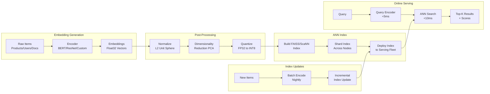

# Embedding Pipeline at Scale



---

## What Embedding Pipelines Do

**The problem**: ML retrieval systems (search, recommendations, ads) need to find the K most similar items to a query from millions or billions of items. Brute-force dot-product search over 100M items at 768 dimensions takes ~30ms on 1 GPU — too slow for production retrieval at <10ms latency.

**The core insight**: Approximate Nearest Neighbor (ANN) search trades a small loss in recall (missing 1-5% of true top-K) for 100-1000x speedup. The embedding pipeline generates, stores, indexes, and serves embeddings efficiently at scale.

---

## Batch Embedding Generation

### Efficient Batched Encoding

**The mechanics**:

```python
import torch
import numpy as np
from torch.utils.data import DataLoader, Dataset
from transformers import AutoTokenizer, AutoModel
from typing import List

class TextEmbeddingPipeline:
    def __init__(self, model_name: str = "sentence-transformers/all-MiniLM-L6-v2"):
        self.tokenizer = AutoTokenizer.from_pretrained(model_name)
        self.model = AutoModel.from_pretrained(model_name)
        self.model.eval()
        if torch.cuda.is_available():
            self.model = self.model.cuda()

    @torch.no_grad()
    def encode_batch(self, texts: List[str], batch_size: int = 512) -> np.ndarray:
        all_embeddings = []

        for i in range(0, len(texts), batch_size):
            batch = texts[i:i + batch_size]
            encoded = self.tokenizer(
                batch,
                padding=True,
                truncation=True,
                max_length=512,
                return_tensors="pt"
            )
            if torch.cuda.is_available():
                encoded = {k: v.cuda() for k, v in encoded.items()}

            outputs = self.model(**encoded)
            # Mean pooling over token embeddings
            attention_mask = encoded['attention_mask']
            token_embeddings = outputs.last_hidden_state
            input_mask_expanded = attention_mask.unsqueeze(-1).float()
            embeddings = (
                (token_embeddings * input_mask_expanded).sum(1) /
                input_mask_expanded.sum(1).clamp(min=1e-9)
            )
            # L2 normalize: unit sphere → cosine similarity = dot product
            embeddings = torch.nn.functional.normalize(embeddings, p=2, dim=-1)
            all_embeddings.append(embeddings.cpu().numpy())

        return np.vstack(all_embeddings)

# Distributed batch encoding with Spark
from pyspark.sql.functions import pandas_udf
import pandas as pd

pipeline = TextEmbeddingPipeline()

@pandas_udf("array<float>")
def encode_texts_udf(texts: pd.Series) -> pd.Series:
    embeddings = pipeline.encode_batch(texts.tolist())
    return pd.Series(embeddings.tolist())

# Apply to full catalog
items_df = spark.read.parquet("s3://data/item_catalog/")
items_df_with_embeddings = items_df.withColumn(
    "embedding",
    encode_texts_udf("description")
)
items_df_with_embeddings.write.parquet("s3://embeddings/items/v2/")
```

**Throughput optimization**:

```python
# fp16 inference: 2x throughput, ~same quality
model = model.half()  # FP16

# TorchScript for faster inference
scripted_model = torch.jit.script(model)

# ONNX export for production serving
torch.onnx.export(
    model,
    dummy_input,
    "embedding_model.onnx",
    opset_version=17,
    input_names=["input_ids", "attention_mask"],
    output_names=["embeddings"],
    dynamic_axes={"input_ids": {0: "batch_size", 1: "seq_len"}}
)

# TensorRT optimization (NVIDIA): 3-5x speedup over ONNX
# Quantize to INT8 with calibration dataset
```

---

## ANN Index Design

### FAISS (Facebook AI Similarity Search)

**The mechanics**:

```python
import faiss
import numpy as np

d = 768  # embedding dimension
N = 10_000_000  # 10M items

# Flat index: exact search (brute force) — use as baseline
index_flat = faiss.IndexFlatIP(d)  # Inner Product (= cosine sim for unit vectors)
index_flat.add(embeddings)         # all 10M embeddings

# IVF (Inverted File) index: partition space into Voronoi cells
# nlist: number of clusters (cells)
# nprobe: number of cells to search at query time
nlist = 2048  # √N rule: sqrt(10M) ≈ 3162, use power of 2
quantizer = faiss.IndexFlatIP(d)
index_ivf = faiss.IndexIVFFlat(quantizer, d, nlist, faiss.METRIC_INNER_PRODUCT)
index_ivf.train(embeddings[:500_000])  # train on subset
index_ivf.add(embeddings)
index_ivf.nprobe = 64  # search 64/2048 cells — tradeoff recall vs latency

# HNSW (Hierarchical Navigable Small World): graph-based, fastest queries
index_hnsw = faiss.IndexHNSWFlat(d, 32)  # 32 = graph connectivity (M)
index_hnsw.hnsw.efConstruction = 200     # construction quality
index_hnsw.hnsw.efSearch = 64           # search quality
index_hnsw.add(embeddings)

# IVF-PQ: compress embeddings for 10-100x memory reduction
# PQ (Product Quantization): split d-dim vector into M sub-vectors of d/M dims
# Quantize each sub-vector to one of 256 centroids → 1 byte per sub-vector
# 768-dim FP32: 3072 bytes → IVF-PQ (M=96, 8-bit): 96 bytes (32x compression)
index_ivfpq = faiss.IndexIVFPQ(quantizer, d, nlist, 96, 8)
index_ivfpq.train(train_embeddings)
index_ivfpq.add(embeddings)
index_ivfpq.nprobe = 64

# Query
query_embedding = np.random.randn(1, d).astype('float32')
query_embedding /= np.linalg.norm(query_embedding)  # normalize

top_k = 100
scores, indices = index_ivfpq.search(query_embedding, top_k)
```

### ScaNN (Google)

```python
import scann

# ScaNN: typically 2-3x faster than FAISS for the same recall
searcher = (
    scann.scann_ops_pybind.builder(embeddings, num_neighbors=100, distance_measure="dot_product")
    .tree(num_leaves=2000, num_leaves_to_search=100, training_sample_size=250000)
    .score_ah(2, anisotropic_quantization_threshold=0.2)
    .reorder(200)
    .build()
)

neighbors, distances = searcher.search(query_embedding, final_num_neighbors=10)
```

### Index Comparison

```
Index     | Build Time | Query Time | Memory  | Recall@100 | Best for
----------|-----------|------------|---------|------------|------------------
Flat IP   | O(1)      | O(N·d)     | N·d·4B  | 100%       | Exact, small N
IVF-Flat  | Minutes   | O(nprobe·N/nlist·d) | N·d·4B | 95-99% | Large N, fast
HNSW      | Hours     | O(log N)   | N·d·4B + graph | 97-99% | Low latency
IVF-PQ    | Hours     | Fast       | N·(d/M) | 90-97%    | Very large N, memory-constrained
ScaNN     | Hours     | Fastest    | Medium  | 95-99%    | Google infra, high throughput
```

---

## Embedding Compression

### Dimensionality Reduction

```python
from sklearn.decomposition import PCA

# Reduce 768-dim to 128-dim: 6x memory, faster search
pca = PCA(n_components=128)
pca.fit(embeddings_sample)  # fit on 1M sample

# Check retained variance
explained = sum(pca.explained_variance_ratio_)
print(f"Variance retained: {explained:.3f}")  # aim for >0.95

compressed = pca.transform(embeddings)  # [N, 128]

# Re-normalize after PCA (PCA doesn't preserve unit norm)
compressed /= np.linalg.norm(compressed, axis=1, keepdims=True)
```

### Scalar Quantization (FP32 → INT8)

```python
# INT8 quantization: 4x memory reduction, minimal quality loss

def quantize_embeddings(embeddings: np.ndarray) -> tuple[np.ndarray, float, float]:
    """Quantize FP32 embeddings to INT8."""
    min_val = embeddings.min()
    max_val = embeddings.max()
    scale = (max_val - min_val) / 255.0

    quantized = ((embeddings - min_val) / scale).astype(np.int8)
    return quantized, min_val, scale

def dequantize_embeddings(
    quantized: np.ndarray, min_val: float, scale: float
) -> np.ndarray:
    return quantized.astype(np.float32) * scale + min_val

# FAISS native INT8 quantization
index = faiss.IndexScalarQuantizer(d, faiss.ScalarQuantizer.QT_int8)
index.train(embeddings)
index.add(embeddings)
```

---

## Incremental Index Updates

**The problem**: new items are added continuously. Rebuilding a 100M-item FAISS index from scratch takes hours and consumes 2x memory (old + new index). The serving fleet would go stale for hours.

**The mechanics**:

```python
class IncrementalIndexManager:
    def __init__(self, base_index: faiss.Index, new_items_threshold: int = 100_000):
        self.base_index = base_index
        self.delta_index = faiss.IndexFlatIP(base_index.d)  # flat index for new items
        self.threshold = new_items_threshold
        self.new_item_count = 0

    def add_items(self, new_embeddings: np.ndarray, item_ids: list):
        """Add new items to delta index; merge when threshold reached."""
        self.delta_index.add(new_embeddings)
        self.new_item_count += len(new_embeddings)

        if self.new_item_count >= self.threshold:
            self._merge_delta_into_base()

    def _merge_delta_into_base(self):
        """Merge delta into base index nightly/hourly."""
        # Extract all vectors from delta
        all_delta = faiss.rev_swig_ptr(self.delta_index.get_xb(), self.delta_index.ntotal * self.delta_index.d)
        all_delta = np.array(all_delta).reshape(self.delta_index.ntotal, -1)

        # Add to base (efficient for IVF: just adds to existing cells)
        self.base_index.add(all_delta)
        self.delta_index.reset()
        self.new_item_count = 0

    def search(self, query: np.ndarray, k: int) -> tuple:
        """Search both indexes; merge and re-rank results."""
        base_scores, base_ids = self.base_index.search(query, k)
        delta_scores, delta_ids = self.delta_index.search(query, k)

        # Merge results and take top-K
        all_scores = np.concatenate([base_scores[0], delta_scores[0]])
        all_ids = np.concatenate([base_ids[0], delta_ids[0]])
        top_k_idx = np.argsort(-all_scores)[:k]

        return all_scores[top_k_idx], all_ids[top_k_idx]
```

---

## Caching Strategies

**The mechanics**:

```python
import redis
import hashlib

class EmbeddingCache:
    def __init__(self, redis_client: redis.Redis, ttl_seconds: int = 3600):
        self.cache = redis_client
        self.ttl = ttl_seconds

    def get_embedding(self, item_id: str) -> np.ndarray | None:
        cached = self.cache.get(f"emb:{item_id}")
        if cached:
            return np.frombuffer(cached, dtype=np.float16)
        return None

    def set_embedding(self, item_id: str, embedding: np.ndarray):
        # Store as FP16 bytes (2x smaller than FP32)
        embedding_fp16 = embedding.astype(np.float16)
        self.cache.setex(f"emb:{item_id}", self.ttl, embedding_fp16.tobytes())

    def get_query_results(self, query: str, k: int) -> list | None:
        """Cache entire search results for popular queries."""
        query_hash = hashlib.md5(f"{query}:{k}".encode()).hexdigest()
        cached = self.cache.get(f"qcache:{query_hash}")
        if cached:
            return json.loads(cached)
        return None

# Caching strategy by use case
# Item embeddings: cache indefinitely (items rarely change)
# Query embeddings: cache 1 hour (same query repeated by many users)
# Search results: cache 15 minutes (results change as index updates)
```

---

## Production Architecture

```
Query arrives at search service
     │
     ▼
Query encoder (ONNX/TensorRT) — 3ms
     │
     ▼
Load balancer → ANN index shard
     │        (index partitioned across 8 nodes, each holds 1/8 of items)
     ▼
ANN search per shard — 5ms
     │
     ▼
Merge results from all shards — 1ms
     │
     ▼
Re-rank top-200 with cross-encoder — 10ms (optional)
     │
     ▼
Return top-K results — total: <20ms

# Index sharding: partition items by item_id hash
# Shard 0: item_ids where hash(id) % 8 == 0
# Each shard holds 1/8 of items → 8x smaller search space → 8x faster per shard
```

**What breaks**: index sharding requires a merge step across shards. If shard 3 goes down, results from that shard are missing — the system silently returns fewer results without error. Implement health checks per shard; degrade gracefully by routing to replica shards.
