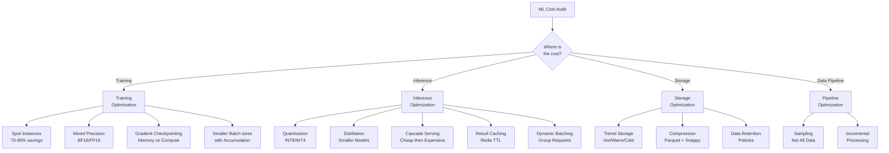

# Cost Optimization in ML Systems



---

## Why ML Cost Optimization Matters

**The problem**: ML systems have unique cost drivers that compound quickly. A model that runs 50K inferences per second at 100ms each requires 5,000 concurrent inference workers. At $0.002 per GPU-second, that's $864,000/day just for inference. Training a large model costs $1-10M in compute. Unoptimized ML systems routinely waste 40-70% of their compute budget.

**The core insight**: cost optimization is not a one-time activity — it is a continuous discipline. Every architectural decision (model size, serving strategy, batch size, storage format) has a cost implication. Senior ML engineers understand these tradeoffs and design systems that meet quality requirements at the minimum viable cost.

---

## Training Cost Optimization

### Spot Instances

**The problem**: on-demand GPU instances are expensive ($2-32/hour per GPU). Training runs can be interrupted, but most ML frameworks do not handle interruption gracefully.

**The core insight**: spot instances (AWS) / preemptible instances (GCP) offer 60-90% discounts. Make training fault-tolerant and use spot for all training that can tolerate interruption.

**The mechanics**:

```python
import torch
import os

class FaultTolerantTrainer:
    def __init__(self, checkpoint_dir: str, checkpoint_interval_steps: int = 500):
        self.checkpoint_dir = checkpoint_dir
        self.interval = checkpoint_interval_steps
        os.makedirs(checkpoint_dir, exist_ok=True)

    def save_checkpoint(self, model, optimizer, scheduler, step: int, metrics: dict):
        checkpoint = {
            'step': step,
            'model_state_dict': model.state_dict(),
            'optimizer_state_dict': optimizer.state_dict(),
            'scheduler_state_dict': scheduler.state_dict() if scheduler else None,
            'metrics': metrics,
        }
        path = os.path.join(self.checkpoint_dir, f'checkpoint_step_{step}.pt')
        torch.save(checkpoint, path)

        # Keep only last 3 checkpoints (save storage)
        checkpoints = sorted(
            [f for f in os.listdir(self.checkpoint_dir) if f.endswith('.pt')]
        )
        for old_ckpt in checkpoints[:-3]:
            os.remove(os.path.join(self.checkpoint_dir, old_ckpt))

    def load_latest_checkpoint(self, model, optimizer, scheduler=None) -> int:
        checkpoints = sorted(
            [f for f in os.listdir(self.checkpoint_dir) if f.endswith('.pt')]
        )
        if not checkpoints:
            return 0  # no checkpoint: start from scratch

        latest = os.path.join(self.checkpoint_dir, checkpoints[-1])
        checkpoint = torch.load(latest, map_location='cpu')

        model.load_state_dict(checkpoint['model_state_dict'])
        optimizer.load_state_dict(checkpoint['optimizer_state_dict'])
        if scheduler and checkpoint['scheduler_state_dict']:
            scheduler.load_state_dict(checkpoint['scheduler_state_dict'])

        print(f"Resumed from step {checkpoint['step']}")
        return checkpoint['step']

    def train(self, model, optimizer, dataloader, scheduler=None):
        start_step = self.load_latest_checkpoint(model, optimizer, scheduler)

        for step, batch in enumerate(dataloader):
            if step < start_step:
                continue

            loss = train_step(model, optimizer, batch)

            if step % self.interval == 0:
                self.save_checkpoint(model, optimizer, scheduler, step, {'loss': loss})
```

**AWS Spot with automatic retry**:

```yaml
# AWS Batch job with spot + on-demand fallback
{
  "jobDefinition": "ml-training",
  "attemptDurationSeconds": 86400,
  "retryStrategy": {
    "attempts": 10,
    "evaluateOnExit": [
      {"onStatusReason": "Host EC2*terminated", "action": "RETRY"},
      {"onReason": "CannotPullContainerError*", "action": "RETRY"}
    ]
  },
  "platformCapabilities": ["EC2"],
  "tags": {"UseSpot": "true"}
}
```

**Savings by instance strategy**:

```
Strategy              | Cost     | Interruption Risk | Best for
----------------------|----------|-------------------|------------------
On-demand             | 100%     | None              | Critical, short jobs
Reserved (1-year)     | 40%      | None              | Predictable workloads
Spot/Preemptible      | 10-30%   | 5-15% per hour    | Long training, fault-tolerant
Spot + On-demand mix  | 25-40%   | Low               | Production training
```

---

### Mixed Precision Training

**The mechanics**:

```python
from torch.cuda.amp import GradScaler, autocast

scaler = GradScaler()  # handles FP16 gradient underflow

for batch in dataloader:
    optimizer.zero_grad()

    # Forward pass in FP16 (2x memory, 2x faster on Tensor Cores)
    with autocast(dtype=torch.float16):
        outputs = model(batch['input'])
        loss = criterion(outputs, batch['label'])

    # Backward pass: scale loss to prevent underflow in FP16
    scaler.scale(loss).backward()

    # Unscale gradients, clip, then optimizer step
    scaler.unscale_(optimizer)
    torch.nn.utils.clip_grad_norm_(model.parameters(), max_norm=1.0)
    scaler.step(optimizer)
    scaler.update()

# BF16 (preferred on Ampere+ GPUs — more stable than FP16)
with autocast(dtype=torch.bfloat16):
    # BF16: same exponent range as FP32, less mantissa precision
    # Does not need loss scaling (no underflow risk)
    outputs = model(batch['input'])

# Cost impact:
# FP16/BF16 training: ~1.5-2x faster → 33-50% cost reduction
# Memory: ~50% less → larger batch size → fewer gradient accumulation steps
```

---

## Inference Cost Optimization

### Quantization

**The problem**: FP32 inference is 2-4x slower and uses 2-4x more memory than INT8. For serving millions of requests, this is a massive cost difference.

**The mechanics**:

```python
import torch
from torch.quantization import quantize_dynamic, get_default_qconfig

# Post-Training Quantization (PTQ): no retraining needed
# Dynamic quantization: quantize weights, compute activations in FP32
quantized_model = quantize_dynamic(
    model,
    {torch.nn.Linear, torch.nn.LSTM},  # quantize these layer types
    dtype=torch.qint8
)

# Static quantization: quantize both weights and activations
# Requires calibration dataset (representative samples)
model.qconfig = get_default_qconfig('x86')  # or 'qnnpack' for ARM
torch.quantization.prepare(model, inplace=True)

# Run calibration data through model to estimate activation ranges
with torch.no_grad():
    for batch in calibration_loader:
        model(batch)

torch.quantization.convert(model, inplace=True)

# ONNX + TensorRT INT8: highest throughput
import tensorrt as trt

builder = trt.Builder(trt.Logger(trt.Logger.WARNING))
config = builder.create_builder_config()
config.set_flag(trt.BuilderFlag.INT8)

# Calibrator provides representative data for INT8 calibration
config.int8_calibrator = MyCalibrator(calibration_loader)

# Quantization impact:
# FP32 → INT8: 4x smaller model, 2-4x faster inference, <1% accuracy loss (most models)
# FP32 → INT4: 8x smaller, 4-8x faster, 1-3% accuracy loss (LLMs tolerant)
```

### Dynamic Batching

**The problem**: a model inference call on a single request wastes GPU utilization. GPUs are throughput-optimized: a batch of 64 takes almost the same time as a batch of 1, but produces 64 results.

**The mechanics**:

```python
import asyncio
from asyncio import Queue
from typing import List
import torch

class DynamicBatcher:
    def __init__(self, model, max_batch_size: int = 64, max_wait_ms: float = 5.0):
        self.model = model
        self.max_batch = max_batch_size
        self.max_wait = max_wait_ms / 1000.0
        self.queue: Queue = Queue()

    async def predict(self, features: dict) -> dict:
        """Called per request — waits for batch to fill."""
        future = asyncio.Future()
        await self.queue.put((features, future))
        return await future

    async def batch_processor(self):
        """Background task: collects requests, batches, infers."""
        while True:
            batch_items = []
            deadline = asyncio.get_event_loop().time() + self.max_wait

            # Collect requests until batch is full or deadline reached
            while len(batch_items) < self.max_batch:
                try:
                    remaining = deadline - asyncio.get_event_loop().time()
                    if remaining <= 0:
                        break
                    item = await asyncio.wait_for(self.queue.get(), timeout=remaining)
                    batch_items.append(item)
                except asyncio.TimeoutError:
                    break

            if not batch_items:
                continue

            features_list = [item[0] for item in batch_items]
            futures = [item[1] for item in batch_items]

            # Batch inference
            batch_tensor = collate_features(features_list)
            with torch.no_grad():
                predictions = self.model(batch_tensor)

            # Return results to individual request futures
            for i, future in enumerate(futures):
                future.set_result(predictions[i].tolist())
```

### Cascade Serving

**The problem**: running an expensive model on every request is wasteful. 80% of requests have obvious answers a cheap model can handle. Only 20% need the expensive model.

**The mechanics**:

```python
class CascadeInferenceService:
    def __init__(self):
        # Stage 1: fast rule-based filter (0ms)
        self.rules = RuleEngine()
        # Stage 2: lightweight model (2ms, quantized INT8)
        self.fast_model = load_quantized_model("fast_model_int8.onnx")
        # Stage 3: full model (20ms, FP16)
        self.full_model = load_model("full_model_fp16.pt")

    def predict(self, features: dict) -> dict:
        # Stage 1: rule-based (handles ~50% of traffic)
        rule_result = self.rules.evaluate(features)
        if rule_result.confidence > 0.95:
            return rule_result

        # Stage 2: fast model (handles ~35% of remaining)
        fast_score = self.fast_model.predict(features)
        if fast_score > 0.9 or fast_score < 0.1:  # high confidence either way
            return {"score": fast_score, "stage": 2}

        # Stage 3: expensive model (only ~15% of traffic reaches here)
        full_score = self.full_model.predict(features)
        return {"score": full_score, "stage": 3}

# Cost impact:
# Without cascade: 100% requests hit full model (20ms, $$$)
# With cascade:    50% rules (0ms), 35% fast (2ms), 15% full (20ms)
# Avg latency: 0.5×0 + 0.35×2 + 0.15×20 = 3.7ms (vs 20ms)
# Avg cost:    0.5×0 + 0.35×0.1 + 0.15×1.0 = 0.185x (vs 1.0x) → 81.5% cost reduction
```

### Result Caching

**The mechanics**:

```python
import redis
import hashlib
import json

class InferenceCacheLayer:
    def __init__(self, model, redis_client: redis.Redis, ttl_seconds: int = 300):
        self.model = model
        self.cache = redis_client
        self.ttl = ttl_seconds
        self.cache_hits = 0
        self.cache_misses = 0

    def predict(self, features: dict) -> dict:
        # Create a stable cache key from features
        cache_key = self._make_cache_key(features)
        cached = self.cache.get(cache_key)

        if cached:
            self.cache_hits += 1
            return json.loads(cached)

        self.cache_misses += 1
        result = self.model.predict(features)
        self.cache.setex(cache_key, self.ttl, json.dumps(result))
        return result

    def _make_cache_key(self, features: dict) -> str:
        # Sort keys for determinism; hash for compact key
        feature_str = json.dumps(features, sort_keys=True)
        return f"pred:{hashlib.sha1(feature_str.encode()).hexdigest()}"

    @property
    def hit_rate(self) -> float:
        total = self.cache_hits + self.cache_misses
        return self.cache_hits / total if total > 0 else 0.0

# Caching strategies by use case:
# User feed: cache per (user_id, context_hash), TTL=5min → ~40% hit rate
# Search: cache per (query_hash, filters), TTL=1h → ~70% hit rate for popular queries
# Fraud score: do NOT cache (must be real-time)
```

---

## Storage Cost Optimization

### Tiered Storage

**The mechanics**:

```python
class TieredDataManager:
    """
    Hot tier: Redis/SSD — last 7 days, frequent access (<5ms)
    Warm tier: S3 Standard — 7-90 days, occasional access (~100ms)
    Cold tier: S3 Glacier — 90+ days, rare access (~hours)
    """

    def archive_old_data(self, cutoff_days: int = 90):
        import boto3
        s3 = boto3.client('s3')

        # Move data older than cutoff to Glacier
        response = s3.list_objects_v2(
            Bucket='ml-data',
            Prefix='training/'
        )
        for obj in response.get('Contents', []):
            age_days = (datetime.now() - obj['LastModified'].replace(tzinfo=None)).days
            if age_days > cutoff_days:
                s3.copy_object(
                    Bucket='ml-data-archive',
                    CopySource={'Bucket': 'ml-data', 'Key': obj['Key']},
                    Key=obj['Key'],
                    StorageClass='GLACIER'
                )

# Storage cost comparison (AWS, per GB/month):
# Redis (ElastiCache): ~$0.16/GB
# S3 Standard:         ~$0.023/GB  (7x cheaper than Redis)
# S3 Standard-IA:      ~$0.0125/GB (13x cheaper)
# S3 Glacier:          ~$0.004/GB  (40x cheaper than Redis)
# S3 Glacier Deep Archive: ~$0.00099/GB  (160x cheaper than Redis)
```

### Parquet + Compression

```python
# Parquet vs CSV: 5-10x storage reduction, 10-100x faster queries

import pandas as pd

# Write with snappy compression (fast, good ratio)
df.to_parquet(
    "features.parquet",
    compression='snappy',     # alternatives: gzip, zstd, brotli
    engine='pyarrow',
    index=False
)

# Storage benchmarks (100M rows, 50 columns):
# CSV uncompressed:  48 GB
# CSV gzipped:       12 GB
# Parquet snappy:     8 GB  (6x smaller than CSV)
# Parquet zstd:       5 GB  (10x smaller)
# Delta Lake zstd:    4 GB  (12x smaller, + ACID, time-travel)
```

---

## Cost Monitoring and Attribution

**The mechanics**:

```python
# Track cost per model, per experiment, per team
import mlflow

with mlflow.start_run():
    # Log cost metrics alongside model metrics
    mlflow.log_metrics({
        "training_cost_usd": compute_training_cost(
            gpu_hours=48.5,
            instance_type="p3.16xlarge",
            spot_discount=0.72
        ),
        "inference_cost_per_1000_requests": 0.003,
        "storage_cost_monthly_usd": 420.0
    })

# Cost alerting
def compute_training_cost(
    gpu_hours: float,
    instance_type: str,
    spot_discount: float = 1.0
) -> float:
    on_demand_prices = {
        "p3.16xlarge": 24.48,   # 8x V100 GPUs
        "p4d.24xlarge": 32.77,  # 8x A100 GPUs
        "g5.48xlarge": 16.29    # 8x A10G GPUs
    }
    return gpu_hours * on_demand_prices[instance_type] * (1 - spot_discount)

# Cost vs quality Pareto: find the cheapest model that meets quality threshold
results = []
for model_size in ['7B', '13B', '34B', '70B']:
    cost = measure_inference_cost(model_size)
    quality = measure_quality(model_size)
    results.append({'model': model_size, 'cost': cost, 'quality': quality})

# Pick smallest model that meets quality threshold (e.g., >0.85 BLEU)
threshold = 0.85
viable = [r for r in results if r['quality'] >= threshold]
cheapest_viable = min(viable, key=lambda r: r['cost'])
```

**What breaks**: optimizing cost without quality guardrails. Quantizing a model to INT4 reduces cost by 8x but increases errors by 5% — if that 5% represents $2M in fraud missed or 5% more user churn, the cost optimization was counterproductive. Always measure cost per quality unit (cost per AUC point, cost per BLEU point), not absolute cost.

## Flashcards

**Why are spot/preemptible instances viable for training but not for serving production traffic?** #flashcard
Training can checkpoint and resume, tolerating interruption for a 60-90% discount; serving must stay available to users, so interruption risk directly costs uptime — spot is reserved for fault-tolerant batch/training workloads.

**Why does dynamic batching cut inference cost without a quality tradeoff, while quantization and cascading do involve one?** #flashcard
Batching just groups requests to use idle GPU throughput — same model, same weights, no accuracy change. Quantization and cascade serving substitute a cheaper/smaller model for some or all requests, trading some accuracy for cost.

**In cascade serving, why must each stage only return early on high-confidence predictions?** #flashcard
A cheap stage returning low-confidence predictions early would silently degrade quality on ambiguous cases; gating early return on confidence (e.g. score > 0.9 or < 0.1) ensures only the "easy" majority skips the expensive model, preserving accuracy on hard cases.

**Why should a fraud-scoring service avoid caching predictions, even though caching cuts cost elsewhere?** #flashcard
Fraud scores must reflect the latest signal for a real-time decision; a cached stale score could let a now-risky transaction through or block a now-safe one — the cost savings aren't worth the correctness risk for a real-time risk decision.

**Why compare models on "cost per quality unit" rather than absolute cost when choosing a serving model size?** #flashcard
The cheapest model is worthless if it falls below the quality threshold the product needs; picking on cost-per-AUC-point (or cost-per-BLEU-point) finds the cheapest model that still clears the bar, rather than the cheapest model period.
