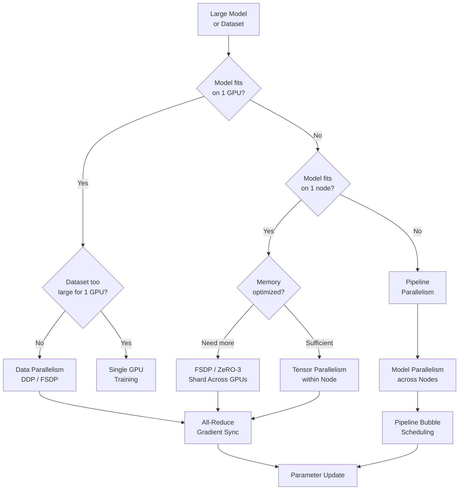

# Distributed Training Architecture



---

## Why Distributed Training Is Required

**The problem**: GPT-3 (175B parameters) requires ~1.4TB of GPU memory just to store parameters in FP32. A single A100 (80GB) cannot hold the model. Even smaller models (7B parameters, ~28GB FP16) require specialized training strategies to fit within memory while training efficiently.

**The core insight**: there are three dimensions to parallelize: data (split batches across GPUs), tensor (split individual weight matrices), and pipeline (split model layers across GPUs). Each has different tradeoffs in memory efficiency, communication overhead, and implementation complexity.

---

## Data Parallelism

### Distributed Data Parallel (DDP)

**The problem**: a single GPU processes one batch at a time. To train faster, split the batch across N GPUs, each processing 1/N of the data. After each forward/backward pass, gradients must be synchronized.

**The core insight**: each GPU maintains a full copy of the model. Gradients are averaged across all GPUs via All-Reduce after each backward pass. Communication overhead is O(model_size), regardless of batch size.

**The mechanics**:

```python
import torch
import torch.distributed as dist
import torch.multiprocessing as mp
from torch.nn.parallel import DistributedDataParallel as DDP
from torch.utils.data.distributed import DistributedSampler

def setup(rank: int, world_size: int):
    """Initialize distributed process group."""
    dist.init_process_group(
        backend="nccl",       # NCCL: optimized for NVIDIA GPU communication
        init_method="env://",
        rank=rank,
        world_size=world_size
    )
    torch.cuda.set_device(rank)

def cleanup():
    dist.destroy_process_group()

def train_ddp(rank: int, world_size: int, dataset, model_class):
    setup(rank, world_size)

    # Each GPU gets a different shard of data
    sampler = DistributedSampler(
        dataset, num_replicas=world_size, rank=rank, shuffle=True
    )
    dataloader = DataLoader(dataset, batch_size=256, sampler=sampler)

    # Wrap model in DDP: handles gradient sync automatically
    model = model_class().to(rank)
    model = DDP(model, device_ids=[rank])

    optimizer = torch.optim.AdamW(model.parameters(), lr=3e-4)

    for epoch in range(num_epochs):
        sampler.set_epoch(epoch)  # ensures different shuffle each epoch
        for batch in dataloader:
            inputs, labels = batch[0].to(rank), batch[1].to(rank)

            outputs = model(inputs)
            loss = criterion(outputs, labels)

            optimizer.zero_grad()
            loss.backward()
            # DDP automatically All-Reduces gradients here
            optimizer.step()

    cleanup()

# Launch: one process per GPU
mp.spawn(train_ddp, args=(world_size, dataset, MyModel), nprocs=world_size)
```

**Communication pattern (All-Reduce)**:

```
GPU 0 gradient: [0.1, 0.2, 0.3]
GPU 1 gradient: [0.2, 0.1, 0.4]
GPU 2 gradient: [0.3, 0.3, 0.2]
GPU 3 gradient: [0.4, 0.2, 0.1]
→ All-Reduce (sum + divide by 4)
→ Each GPU gets: [0.25, 0.20, 0.25]  # averaged gradient

# Ring All-Reduce: bandwidth = O(2 * (N-1)/N * model_size)
# Nearly constant communication cost regardless of N GPUs
```

---

## Fully Sharded Data Parallel (FSDP)

**The problem**: DDP requires each GPU to hold a full copy of the model. A 7B parameter model in FP16 needs 14GB per GPU just for parameters, plus 14GB for gradients, plus optimizer states — 56GB+ total per GPU. Many GPUs don't have enough memory.

**The core insight**: FSDP shards (splits) model parameters, gradients, and optimizer states across all GPUs. Each GPU holds only 1/N of each. Memory per GPU scales as O(model_size / N).

**The mechanics**:

```python
from torch.distributed.fsdp import FullyShardedDataParallel as FSDP
from torch.distributed.fsdp import MixedPrecision, BackwardPrefetch
from torch.distributed.fsdp.wrap import transformer_auto_wrap_policy

# Mixed precision: compute in BF16, store in FP32
mp_policy = MixedPrecision(
    param_dtype=torch.bfloat16,   # parameters: BF16 during forward/backward
    reduce_dtype=torch.float32,    # gradient reduction: FP32 for stability
    buffer_dtype=torch.bfloat16    # buffers: BF16
)

# FSDP wraps model: parameters sharded across all GPUs
model = FSDP(
    model,
    auto_wrap_policy=transformer_auto_wrap_policy,  # wrap each transformer layer
    mixed_precision=mp_policy,
    backward_prefetch=BackwardPrefetch.BACKWARD_PRE,  # overlap comm/compute
    cpu_offload=CPUOffload(offload_params=True),  # offload to CPU RAM (more memory)
    sharding_strategy=ShardingStrategy.FULL_SHARD  # shard params + grads + optimizer
)

# Memory comparison: 7B model, 8 GPUs
# DDP:  Each GPU needs ~56GB (full model + gradients + optimizer states)
# FSDP: Each GPU needs ~7GB  (1/8 of everything) — fits on 40GB A100
```

### ZeRO Stages (DeepSpeed)

**The mechanics**:

```python
import deepspeed

ds_config = {
    "train_batch_size": 2048,
    "gradient_accumulation_steps": 4,
    "zero_optimization": {
        "stage": 3,                    # ZeRO-3: shard params + grads + optimizer
        "overlap_comm": True,          # overlap gradient comm with compute
        "contiguous_gradients": True,  # reduce memory fragmentation
        "reduce_bucket_size": 5e8,     # 500MB communication buckets
        "stage3_prefetch_bucket_size": 5e8,
        "stage3_param_persistence_threshold": 1e6,
        "stage3_max_live_parameters": 1e9,
        "offload_optimizer": {
            "device": "cpu",           # ZeRO-Infinity: optimizer states on CPU
            "pin_memory": True
        },
        "offload_param": {
            "device": "nvme",          # extreme: params on NVMe SSD
            "nvme_path": "/local_nvme"
        }
    },
    "bf16": {"enabled": True},
    "gradient_clipping": 1.0
}

# ZeRO Stage Comparison:
# Stage 1: shard optimizer states only     → 4x memory reduction
# Stage 2: shard optimizer + gradients     → 8x memory reduction
# Stage 3: shard everything               → N×memory reduction (N = GPU count)
# ZeRO-Infinity: shard to CPU/NVMe       → near-unlimited model size

model_engine, optimizer, _, _ = deepspeed.initialize(
    model=model,
    model_parameters=model.parameters(),
    config=ds_config
)
```

---

## Tensor Parallelism

**The problem**: even FSDP has communication overhead proportional to model size on every forward pass (gather then scatter parameters). For very large attention layers, tensor parallelism splits the computation itself within a layer.

**The core insight**: split weight matrices across GPUs column-wise and row-wise (Megatron-style). Each GPU computes a partial matrix multiply; results are All-Reduced before the next layer.

**The mechanics**:

```python
# Megatron-LM tensor parallelism: split MLP layers
# Original: Linear(hidden_dim=4096, ffn_dim=16384)
# With TP=8: each GPU handles Linear(4096, 16384//8=2048)

# Column parallel: split weight columns across GPUs
class ColumnParallelLinear(nn.Module):
    def __init__(self, in_features: int, out_features: int, tp_size: int):
        super().__init__()
        # Each GPU holds out_features/tp_size columns
        self.weight = nn.Parameter(
            torch.randn(in_features, out_features // tp_size)
        )

    def forward(self, x):
        # Each GPU computes partial output: [batch, seq, ffn//tp_size]
        return x @ self.weight

# Row parallel: each GPU computes partial output, then All-Reduce
class RowParallelLinear(nn.Module):
    def __init__(self, in_features: int, out_features: int, tp_size: int):
        super().__init__()
        self.weight = nn.Parameter(
            torch.randn(in_features // tp_size, out_features)
        )

    def forward(self, x):
        partial = x @ self.weight
        # All-Reduce: sum partial outputs across all TP GPUs
        dist.all_reduce(partial, op=dist.ReduceOp.SUM)
        return partial

# Tensor parallel: best within a single node (NVLink bandwidth)
# Do not use across nodes (InfiniBand is much slower than NVLink)
```

---

## Pipeline Parallelism

**The problem**: even with tensor parallelism, the model may be too large for the number of GPUs in one node. Pipeline parallelism splits the model's layers across multiple nodes.

**The core insight**: assign consecutive model layers to different GPUs. GPU 0 processes layers 0-11, GPU 1 processes layers 12-23, etc. Use micro-batches to keep all GPUs busy.

**The mechanics**:

```python
# 1F1B (One Forward One Backward) pipeline schedule
# Minimizes GPU idle time ("pipeline bubble")

# GPipe schedule (simpler, more bubble):
# Forward: GPU0 → GPU1 → GPU2 → GPU3
# Backward: GPU3 → GPU2 → GPU1 → GPU0
# Bubble fraction = (p-1)/(m + p - 1)  where p=pipeline stages, m=microbatches
# With m=8, p=4: bubble = 3/11 ≈ 27% idle time

# 1F1B schedule (less bubble):
# Alternates between forward and backward passes
# Bubble fraction = (p-1)/(2m + p - 1) ≈ half of GPipe bubble

from torch.distributed.pipeline.sync import Pipe

# Split model into 4 stages for 4 GPUs
model_stage_0 = nn.Sequential(*layers[0:12]).to("cuda:0")
model_stage_1 = nn.Sequential(*layers[12:24]).to("cuda:1")
model_stage_2 = nn.Sequential(*layers[24:36]).to("cuda:2")
model_stage_3 = nn.Sequential(*layers[36:48]).to("cuda:3")

pipeline_model = Pipe(
    nn.Sequential(model_stage_0, model_stage_1, model_stage_2, model_stage_3),
    chunks=8  # split each batch into 8 micro-batches
)
```

---

## Gradient Accumulation and Checkpointing

### Gradient Accumulation (Large Effective Batch)

```python
# Simulate batch_size=2048 on GPU that only fits batch_size=128
accumulation_steps = 16  # 16 × 128 = 2048 effective batch

optimizer.zero_grad()
for step, (inputs, labels) in enumerate(dataloader):
    outputs = model(inputs)
    loss = criterion(outputs, labels) / accumulation_steps  # normalize
    loss.backward()

    if (step + 1) % accumulation_steps == 0:
        # Clip gradients after accumulating
        torch.nn.utils.clip_grad_norm_(model.parameters(), max_norm=1.0)
        optimizer.step()
        optimizer.zero_grad()
```

### Gradient Checkpointing (Memory vs Compute)

```python
from torch.utils.checkpoint import checkpoint_sequential

# Trade compute for memory: recompute activations during backward pass
# instead of storing them. 60-70% memory reduction at ~30% compute cost.

def forward_with_checkpointing(model, inputs):
    # Segment model into chunks; only store chunk boundaries
    return checkpoint_sequential(
        model.layers,
        segments=4,    # 4 checkpoint segments
        input=inputs
    )

# Memory comparison: 24-layer transformer, batch=32, seq=2048
# Without checkpointing: 40GB activations
# With checkpointing (4 segments): ~10GB activations (4x reduction)
# Cost: ~25% longer backward pass (recompute 3/4 of activations)
```

---

## 3D Parallelism: Combining All Three

**The mechanics**:

```
Architecture: 8 nodes × 8 GPUs = 64 GPUs total

Data Parallelism (DP=8):   8 independent model replicas
Tensor Parallelism (TP=8): each replica split across 8 GPUs within a node
Pipeline Parallelism (PP=8): 8 pipeline stages across nodes

Effective batch = base_batch × DP = 256 × 8 = 2048
Memory per GPU = model_memory / (TP × PP) = 280GB / 64 ≈ 4.4GB per GPU

# Megatron-DeepSpeed combines all three:
ds_config = {
    "tensor_parallel_size": 8,
    "pipeline_parallel_size": 8,
    "data_parallel_size": 8,
    "zero_optimization": {"stage": 1}  # only optimizer state sharding with 3D
}
```

---

## Communication Primitives

```
Operation    | Description                        | Use case
-------------|------------------------------------|-----------------------
All-Reduce   | Sum/average across all GPUs        | DDP gradient sync
All-Gather   | Gather shards → full tensor        | FSDP param unsharding
Reduce-Scatter| Reduce + distribute result shards | FSDP gradient sharding
Broadcast    | One GPU → all GPUs                 | Model init
Point-to-point| Direct GPU-to-GPU send/recv       | Pipeline parallelism
```

**Hardware bandwidth**:

```
Link              | Bandwidth      | Latency  | Use for
------------------|----------------|----------|------------------
NVLink 4.0        | 900 GB/s       | <1μs     | Within-node TP
InfiniBand HDR    | 200 Gb/s (25GB)| ~1μs     | Cross-node DP
RoCE (Ethernet)   | 100 Gb/s       | ~5μs     | Cross-node (budget)
PCIe Gen5         | 128 GB/s       | ~1μs     | GPU-CPU transfers
```

**What breaks**: using tensor parallelism across nodes (connected via InfiniBand instead of NVLink). InfiniBand is 10-36x slower than NVLink — tensor parallel communication becomes the bottleneck. Rule: TP within nodes (NVLink), DP/PP across nodes (InfiniBand).
