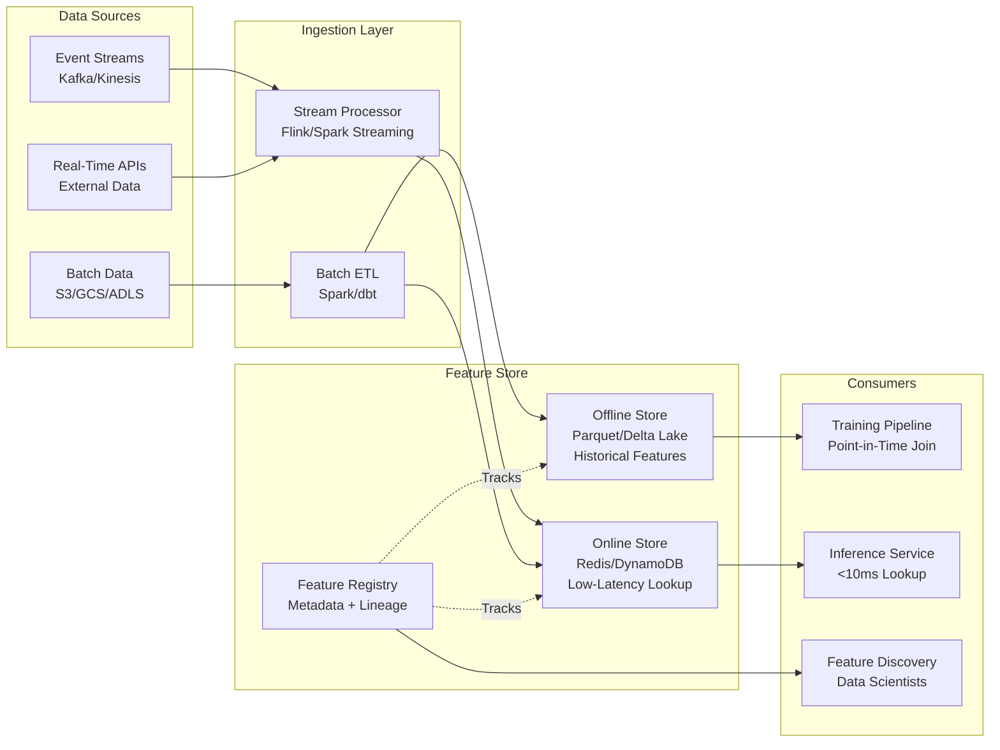

# Feature Store Architecture



---

## What a Feature Store Is

**The problem**: ML teams repeatedly compute the same features (user's 30-day purchase count, item's click-through rate) independently for each model and pipeline. Training pipelines compute features differently than serving pipelines, causing training-serving skew. Features have no metadata, no versioning, and no discoverability across teams.

**The core insight**: features are a shared infrastructure asset, not per-model logic. A Feature Store centralizes feature computation, storage, and serving — ensuring that the same feature definition is used at training time and serving time, by any team, for any model.

**The mechanics**: a Feature Store has four components:

```
Component          | Responsibility
-------------------|--------------------------------------------------
Offline Store      | Historical feature values for model training
Online Store       | Low-latency feature lookup for model serving
Feature Registry   | Metadata: feature definitions, lineage, owners
Transformation Layer | Compute features from raw data (stream + batch)
```

**What breaks**: the most common Feature Store failure is teams bypassing the store — they compute features inline in the training pipeline "just this once" because the store doesn't have the feature they need. This defeats the purpose. The store must be easy enough to add features to that bypassing it costs more than using it.

---

## Offline Store Design

### What It Stores

**The problem**: training a model requires point-in-time correct features — the values that were available at the exact moment each label was generated, not the values today. If a user had 5 purchases on the day a fraud label was generated, using their current 100-purchase count will introduce data leakage.

**The core insight**: the offline store is a historical log of feature values at every point in time. It enables point-in-time joins between label events and feature snapshots.

**The mechanics**:

```python
# Point-in-time correct feature retrieval
# Given: event log with (entity_id, label, event_timestamp)
# Returns: feature values as of event_timestamp for each entity

import pandas as pd
from feast import FeatureStore

store = FeatureStore(repo_path=".")

# Entity DataFrame: the timestamps drive point-in-time lookup
entity_df = pd.DataFrame({
    "user_id": ["u1", "u2", "u3"],
    "event_timestamp": [
        pd.Timestamp("2024-01-15 10:00:00"),
        pd.Timestamp("2024-01-16 14:30:00"),
        pd.Timestamp("2024-01-17 09:15:00"),
    ],
    "label": [1, 0, 1]  # fraud labels
})

# Feast retrieves the feature values as of each event_timestamp
training_df = store.get_historical_features(
    entity_df=entity_df,
    features=[
        "user_features:purchase_count_30d",
        "user_features:avg_transaction_amount",
        "user_features:distinct_merchants_7d",
    ]
).to_df()

# training_df: features are the values available at event_timestamp
# No future leakage because Feast filters by timestamp
```

**Storage format**: Parquet on object storage (S3, GCS) partitioned by date. Row Groups aligned with entity ID for efficient lookup.

```python
# Offline store: time-partitioned feature snapshots
# Schema: entity_id | feature_1 | feature_2 | ... | event_timestamp | created_timestamp

# Delta Lake (preferred for ACID + time travel)
from delta import DeltaTable

dt = DeltaTable.forPath(spark, "s3://feature-store/user_features/")

# Point-in-time join via Delta time travel
historical_features = (
    dt.toDF()
    .filter("event_timestamp <= '2024-01-15 10:00:00'")
    .groupBy("user_id")
    .agg({"feature_value": "last"})  # most recent value before cutoff
)
```

**What breaks**: point-in-time joins are expensive at scale. A training set with 100M rows, each requiring a timestamp-bounded lookup against a feature table with 1B rows, runs for hours. Solutions:
- Partition offline store by date to reduce scan scope
- Cache feature snapshots at regular intervals (hourly) and binary-search the nearest snapshot
- Use Apache Iceberg's time-travel queries which maintain metadata for efficient historical reads

---

## Online Store Design

### Low-Latency Feature Serving

**The problem**: model inference at serving time requires feature values in <10ms. Recomputing features from raw data on every request is too slow. The offline store (Parquet on S3) has 100ms+ read latency. A dedicated low-latency store is needed.

**The core insight**: the online store is a key-value cache of the most recent feature values per entity. It trades completeness (no history) for speed (<5ms reads).

**The mechanics**:

```python
# Online store: materialized current feature values

# Redis as online store
import redis
import json

class OnlineFeatureStore:
    def __init__(self, redis_client: redis.Redis):
        self.redis = redis_client

    def get_features(self, entity_id: str, feature_view: str) -> dict:
        """Retrieve features for a single entity in <5ms."""
        key = f"{feature_view}:{entity_id}"
        raw = self.redis.get(key)
        if raw is None:
            return self._get_default_features(feature_view)
        return json.loads(raw)

    def write_features(self, entity_id: str, feature_view: str, features: dict):
        """Materialize features to online store."""
        key = f"{feature_view}:{entity_id}"
        self.redis.setex(
            key,
            time=86400,  # 24h TTL
            value=json.dumps(features)
        )

# Materialization job: offline → online sync
def materialize_to_online(store: FeatureStore, feature_view: str):
    """
    Sync recent feature values from offline to online store.
    Run as a scheduled job (every 15 minutes or hourly).
    """
    store.materialize_incremental(
        end_date=datetime.utcnow(),
        feature_views=[feature_view]
    )
```

**DynamoDB as online store** (for multi-region, high availability):

```python
import boto3

dynamodb = boto3.resource('dynamodb')
table = dynamodb.Table('feature_store_online')

def get_online_features(entity_id: str) -> dict:
    response = table.get_item(
        Key={'entity_id': entity_id},
        ConsistentRead=False  # eventually consistent = lower latency
    )
    return response.get('Item', {})
```

**Serving latency targets**:

```
Online store type   | p50 latency | p99 latency | Notes
--------------------|-------------|-------------|------
Redis (same region) | 0.5ms       | 2ms         | Best for <10ms budgets
DynamoDB DAX cache  | 1ms         | 5ms         | Multi-region, managed
Bigtable            | 3ms         | 10ms        | Best for wide rows
PostgreSQL + pgpool | 5ms         | 20ms        | Simple but slower
```

**What breaks**: the online store contains only the latest value per entity. For features that need to be computed over a rolling time window (30-day count), the online store holds a pre-aggregated value that must be updated incrementally as new events arrive — not recomputed from scratch. Incremental update logic is complex and must be idempotent (same event processed twice should not double-count).

---

## Feature Transformation Layer

### Stream Processing for Real-Time Features

**The problem**: some features must reflect events that happened seconds ago (velocity features: "transactions in last 5 minutes"). Batch ETL runs hourly or daily — too stale. Stream processing computes features continuously as events arrive.

**The mechanics**:

```python
# Apache Flink: streaming feature computation
# Compute "transactions in last 5 minutes" per user in real-time

from pyflink.datastream import StreamExecutionEnvironment
from pyflink.table import StreamTableEnvironment, EnvironmentSettings

env = StreamExecutionEnvironment.get_execution_environment()
t_env = StreamTableEnvironment.create(env)

# Source: Kafka topic with transaction events
t_env.execute_sql("""
    CREATE TABLE transactions (
        user_id STRING,
        amount DOUBLE,
        merchant_id STRING,
        event_time TIMESTAMP(3),
        WATERMARK FOR event_time AS event_time - INTERVAL '5' SECOND
    ) WITH (
        'connector' = 'kafka',
        'topic' = 'transactions',
        'properties.bootstrap.servers' = 'kafka:9092',
        'format' = 'json'
    )
""")

# Compute 5-minute rolling count feature
t_env.execute_sql("""
    CREATE TABLE user_velocity_features (
        user_id STRING,
        txn_count_5min BIGINT,
        total_amount_5min DOUBLE,
        window_end TIMESTAMP(3),
        PRIMARY KEY (user_id) NOT ENFORCED
    ) WITH (
        'connector' = 'redis',
        'host' = 'redis',
        'port' = '6379'
    )
""")

t_env.execute_sql("""
    INSERT INTO user_velocity_features
    SELECT
        user_id,
        COUNT(*) AS txn_count_5min,
        SUM(amount) AS total_amount_5min,
        TUMBLE_END(event_time, INTERVAL '5' MINUTE) AS window_end
    FROM transactions
    GROUP BY
        user_id,
        TUMBLE(event_time, INTERVAL '5' MINUTE)
""")
```

### Batch ETL for Historical Features

**The problem**: features that aggregate over long time windows (30-day, 90-day) are too expensive to compute in real-time for every entity on every request. Pre-compute them daily with batch ETL.

**The mechanics**:

```python
# Spark batch feature computation
from pyspark.sql import SparkSession
from pyspark.sql.functions import col, count, avg, countDistinct
from pyspark.sql.window import Window

spark = SparkSession.builder.appName("feature_computation").getOrCreate()

transactions = spark.read.parquet("s3://data-lake/transactions/")

# Compute 30-day aggregate features per user
thirty_day_features = (
    transactions
    .filter(col("event_date") >= "2024-01-01")  # rolling 30-day window
    .groupBy("user_id")
    .agg(
        count("*").alias("purchase_count_30d"),
        avg("amount").alias("avg_transaction_amount_30d"),
        countDistinct("merchant_id").alias("distinct_merchants_30d"),
        countDistinct("country").alias("distinct_countries_30d")
    )
    .withColumn("feature_timestamp", current_timestamp())
)

# Write to offline store (Delta Lake)
thirty_day_features.write.format("delta").mode("overwrite").save(
    "s3://feature-store/user_features/"
)

# Materialize to online store for serving
thirty_day_features.foreachPartition(lambda rows: materialize_to_redis(rows))
```

**What breaks**: batch ETL and stream processing computing the same feature (e.g., "30-day purchase count") independently will produce different values due to late-arriving data, timezone handling, and definition discrepancies. Establish a single source-of-truth definition in the Feature Registry; stream pre-aggregates, batch corrects overnight.

---

## Feature Registry

### Metadata, Discovery, and Lineage

**The problem**: as a feature library grows to thousands of features across dozens of teams, teams duplicate features ("user_age" computed 5 different ways), use deprecated features that cause silent bugs, and cannot discover what features exist for a given entity.

**The core insight**: the Feature Registry is the catalog of all feature definitions. It stores the feature's metadata, computation logic, owners, SLAs, and lineage — not the data itself.

**The mechanics**:

```python
# Feast: Feature Registry definition
from feast import FeatureView, Entity, Feature, ValueType
from feast.data_source import KafkaSource, FileSource
from datetime import timedelta

# Define entity
user = Entity(
    name="user_id",
    value_type=ValueType.STRING,
    description="Unique user identifier"
)

# Define feature view (computation logic)
user_transaction_features = FeatureView(
    name="user_transaction_features",
    entities=["user_id"],
    ttl=timedelta(days=1),  # features expire after 1 day in online store
    features=[
        Feature(name="purchase_count_30d", dtype=ValueType.INT64),
        Feature(name="avg_transaction_amount_30d", dtype=ValueType.FLOAT),
        Feature(name="distinct_merchants_30d", dtype=ValueType.INT64),
    ],
    online=True,
    batch_source=FileSource(
        path="s3://feature-store/user_transaction_features/",
        event_timestamp_column="event_timestamp",
        created_timestamp_column="created_timestamp",
    ),
    tags={
        "team": "trust-safety",
        "owner": "alice@company.com",
        "sensitivity": "PII",
        "sla_ms": "10"
    }
)

# Apply to registry
from feast import FeatureStore
store = FeatureStore(repo_path=".")
store.apply([user, user_transaction_features])
```

**Feature discoverability**:

```python
# List all features for a given entity
features = store.list_feature_views()
user_features = [fv for fv in features if "user_id" in fv.entities]

# Get feature documentation
for fv in user_features:
    print(f"Feature View: {fv.name}")
    print(f"Owner: {fv.tags.get('owner')}")
    print(f"Features: {[f.name for f in fv.features]}")
    print(f"SLA: {fv.tags.get('sla_ms')}ms")
    print()
```

**What breaks**: the Feature Registry only works if teams actually register features before using them. If teams build one-off features in notebooks that never get registered, the Registry is incomplete and teams can't trust it for discovery. Enforce registration via CI/CD: any feature used in a production model must be in the registry or the deployment is blocked.

---

## Point-in-Time Correctness

### The Hardest Problem in Feature Stores

**The problem**: when training data is assembled, each label (churn event, fraud event, click) was generated at a specific time. The feature values used for training must be the values that existed at that specific time — not the values computed after the event, which would constitute data leakage.

**The core insight**: feature values are time-varying. A user who made 0 purchases on January 1st might have made 50 purchases by February 1st. Using the February 1st value to train a model that predicts churn on January 1st is leakage. The offline store must support time-bounded lookups.

**The mechanics**:

```python
# Naive join (WRONG — data leakage)
# Uses current feature values, not values at label time
labels_df.join(features_df, on="user_id")  # leakage: features are as of now

# Point-in-time join (CORRECT)
# For each label, find the most recent feature values BEFORE label timestamp

def point_in_time_join(
    labels: pd.DataFrame,
    features: pd.DataFrame,
    entity_col: str = "user_id",
    label_time_col: str = "label_timestamp",
    feature_time_col: str = "feature_timestamp"
) -> pd.DataFrame:
    """
    For each label row, find the most recent feature row
    where feature_timestamp <= label_timestamp.
    """
    result_rows = []

    for _, label_row in labels.iterrows():
        entity_id = label_row[entity_col]
        cutoff = label_row[label_time_col]

        # Filter feature rows: same entity, feature computed BEFORE label
        valid_features = features[
            (features[entity_col] == entity_id) &
            (features[feature_time_col] <= cutoff)
        ]

        if len(valid_features) == 0:
            # No features available at label time — use defaults
            continue

        # Take the most recent feature snapshot before cutoff
        latest_features = valid_features.sort_values(
            feature_time_col, ascending=False
        ).iloc[0]

        result_rows.append({**label_row.to_dict(), **latest_features.to_dict()})

    return pd.DataFrame(result_rows)
```

**What breaks**: naive point-in-time joins are O(n×m) — extremely slow for large datasets. Production implementations use:
- **Sorted merge join**: both tables sorted by (entity_id, timestamp); single pass with two pointers
- **Snapshot materialization**: store feature snapshots at fixed intervals (hourly); binary search for the nearest snapshot before cutoff
- **SQL with `AS OF`**: Iceberg and Delta Lake support `SELECT ... AS OF TIMESTAMP` natively

---

## Open-Source Feature Store Comparison

```
Tool         | Offline Store  | Online Store       | Streaming | Cloud-Native
-------------|---------------|--------------------|-----------|--------------
Feast        | S3/GCS/Parquet | Redis/DynamoDB/Bigtable | Yes   | Any
Tecton       | S3/Parquet     | DynamoDB/Redis     | Yes       | AWS/GCP/Azure
Hopsworks    | Hive/Parquet   | RonDB/MySQL Cluster| Yes       | On-prem + Cloud
Vertex AI FS | BigQuery       | Bigtable           | No        | GCP only
SageMaker FS | S3             | DynamoDB           | Partial   | AWS only
```

**When to build vs buy**: build a custom feature store only if your scale exceeds 100TB offline features + 100M entity lookups/day. Below that scale, Feast with Redis + S3 covers 95% of use cases with minimal operational overhead.

---

## Feature Store Interview Questions

**Design a Feature Store for a fraud detection system:**
- Identify which features need real-time (velocity) vs batch (user history)
- Describe the offline store schema and point-in-time join logic
- Specify online store choice (Redis) and explain the materialization job
- Define SLAs: <5ms online lookup, <100ms offline historical retrieval
- Address: how do you handle schema evolution (new feature added)?

**How do you ensure training-serving consistency?**
- Single feature definition in the registry, shared by training and serving
- Bundle transformation logic with the feature definition (not in the model)
- Log the feature vector used at serving time; periodically compare with what training pipeline would produce
- Run a shadow serving job that recomputes features from scratch and compares with cached values (detects drift in transformation logic)

**What is a feature freshness SLA?**
- The maximum acceptable age of a feature value at serving time
- Example: `txn_count_5min` must be <1 minute stale; `purchase_count_30d` may be up to 24 hours stale
- Freshness SLA drives choice of batch vs streaming ingestion
- Monitor feature freshness as a production metric; alert when SLA is violated
