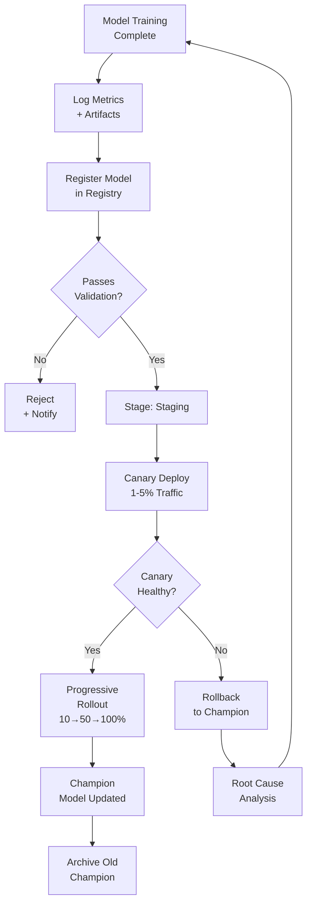

# Model Registry & Versioning



---

## Why Model Versioning Matters

**The problem**: ML models are not static software. They are retrained regularly, producing new versions that may improve or regress. Without a registry, teams lose track of which model is in production, cannot reproduce past model behaviour, and cannot safely roll back when a model degrades.

**The core insight**: a Model Registry is the system-of-record for all trained models. It stores model artifacts, metrics, lineage, and deployment history — enabling safe promotion, rollback, and auditing.

---

## MLflow Model Registry

### Registering a Model

**The mechanics**:

```python
import mlflow
import mlflow.sklearn
from sklearn.ensemble import GradientBoostingClassifier

mlflow.set_tracking_uri("http://mlflow-server:5000")
mlflow.set_experiment("fraud-detection")

with mlflow.start_run(run_name="fraud_v2.3") as run:
    model = GradientBoostingClassifier(n_estimators=500, max_depth=6)
    model.fit(X_train, y_train)

    # Log parameters
    mlflow.log_params({
        "n_estimators": 500,
        "max_depth": 6,
        "data_version": "v4.1.2",
        "training_date": "2024-01-15"
    })

    # Log metrics
    mlflow.log_metrics({
        "pr_auc": 0.847,
        "f1_at_threshold_0.5": 0.73,
        "false_positive_rate": 0.02,
        "recall_at_5pct_fpr": 0.81
    })

    # Log model with signature (schema validation at serving time)
    from mlflow.models.signature import infer_signature
    signature = infer_signature(X_train, model.predict_proba(X_train))
    mlflow.sklearn.log_model(
        model,
        artifact_path="model",
        signature=signature,
        registered_model_name="fraud-detection-model"
    )

    run_id = run.info.run_id

# Register in registry
client = mlflow.tracking.MlflowClient()
client.create_registered_model(
    name="fraud-detection-model",
    description="GBT fraud detection model — transaction risk scoring"
)
```

### Stage Transitions

**The mechanics**:

```python
# Transition model through stages: None → Staging → Production → Archived
client = mlflow.tracking.MlflowClient()

# Move to Staging after validation
client.transition_model_version_stage(
    name="fraud-detection-model",
    version=23,
    stage="Staging",
    archive_existing_versions=False  # keep current Production version
)

# After canary validation, promote to Production
client.transition_model_version_stage(
    name="fraud-detection-model",
    version=23,
    stage="Production",
    archive_existing_versions=True  # archive old Production (v22)
)

# Load Production model at serving time
production_model = mlflow.sklearn.load_model(
    "models:/fraud-detection-model/Production"
)

# Load by specific version for reproducibility
version_22 = mlflow.sklearn.load_model(
    "models:/fraud-detection-model/22"
)
```

---

## Champion / Challenger Pattern

**The problem**: how do you safely test a new model (challenger) against the current production model (champion) without risking degraded user experience?

**The core insight**: run champion and challenger simultaneously on the same traffic, scoring each request with both. The challenger receives a small traffic fraction; results are compared before full promotion.

**The mechanics**:

```python
import random
from typing import Optional

class ChampionChallengerRouter:
    def __init__(
        self,
        champion_model,
        challenger_model,
        challenger_traffic_pct: float = 0.05  # 5% to challenger
    ):
        self.champion = champion_model
        self.challenger = challenger_model
        self.challenger_pct = challenger_traffic_pct

    def predict(self, features: dict, request_id: str) -> dict:
        # Deterministic assignment by request_id
        hash_val = int(hashlib.md5(request_id.encode()).hexdigest(), 16)
        use_challenger = (hash_val % 10000) < (self.challenger_pct * 10000)

        champion_pred = self.champion.predict(features)
        challenger_pred = self.challenger.predict(features)

        # Always serve champion; log challenger for comparison
        self._log_shadow_prediction(
            request_id=request_id,
            champion_score=champion_pred,
            challenger_score=challenger_pred,
            served_variant="challenger" if use_challenger else "champion"
        )

        if use_challenger:
            return {"score": challenger_pred, "model_version": "challenger_v23"}
        return {"score": champion_pred, "model_version": "champion_v22"}

    def _log_shadow_prediction(self, **kwargs):
        # Write to experiment log table for offline comparison
        experiment_log.write(kwargs)
```

---

## Canary Deployment

### Progressive Traffic Rollout

**The problem**: deploying a new model to 100% of traffic immediately risks a widespread degradation if the model has a bug or silent regression. Canary deployment limits blast radius.

**The mechanics**:

```yaml
# Kubernetes: progressive rollout with Argo Rollouts
apiVersion: argoproj.io/v1alpha1
kind: Rollout
metadata:
  name: fraud-model-serving
spec:
  strategy:
    canary:
      steps:
        - setWeight: 1    # 1% canary traffic
        - pause: {duration: 10m}
        - setWeight: 5    # 5% canary traffic
        - pause: {duration: 30m}
        - setWeight: 20
        - pause: {duration: 1h}
        - setWeight: 50
        - pause: {duration: 2h}
        - setWeight: 100  # full rollout
      canaryService: fraud-model-canary-svc
      stableService: fraud-model-stable-svc
      analysis:
        templates:
          - templateName: fraud-model-health
        startingStep: 2
        args:
          - name: service-name
            value: fraud-model-canary-svc
```

**Canary health checks**:

```python
def canary_health_check(
    canary_metrics: dict,
    baseline_metrics: dict,
    guardrails: dict
) -> bool:
    """
    Returns True if canary passes all guardrail checks.
    """
    checks = {
        "error_rate": canary_metrics["error_rate"] <= guardrails["max_error_rate"],
        "p99_latency": canary_metrics["p99_latency_ms"] <= guardrails["max_p99_ms"],
        "pr_auc_regression": (
            canary_metrics["pr_auc"] >=
            baseline_metrics["pr_auc"] * (1 - guardrails["max_regression_pct"])
        ),
        "false_positive_rate": (
            canary_metrics["fpr"] <= baseline_metrics["fpr"] * 1.1  # max 10% increase
        )
    }

    if not all(checks.values()):
        failed = [k for k, v in checks.items() if not v]
        trigger_automatic_rollback(reason=f"Canary failed: {failed}")
        return False
    return True
```

---

## Automatic Rollback

**The mechanics**:

```python
import subprocess

def trigger_automatic_rollback(reason: str, model_name: str = "fraud-detection-model"):
    """
    Automatic rollback: re-promote previous Production version.
    """
    client = mlflow.tracking.MlflowClient()

    # Find latest Archived version (previous champion)
    versions = client.search_model_versions(f"name='{model_name}'")
    archived = [v for v in versions if v.current_stage == "Archived"]
    previous_champion = max(archived, key=lambda v: int(v.version))

    # Promote archived back to Production
    client.transition_model_version_stage(
        name=model_name,
        version=previous_champion.version,
        stage="Production"
    )

    # Alert
    send_alert(
        severity="HIGH",
        message=f"Automatic rollback to v{previous_champion.version}. Reason: {reason}"
    )

    # Kubernetes: rollback deployment
    subprocess.run([
        "kubectl", "rollout", "undo",
        "deployment/fraud-model-serving"
    ])
```

---

## Model Lineage and Reproducibility

**The mechanics**:

```python
# Log everything needed to reproduce a model exactly
with mlflow.start_run():
    mlflow.log_params({
        # Data
        "training_data_path": "s3://data-lake/training/v4.1.2/",
        "training_data_hash": compute_sha256("s3://data-lake/training/v4.1.2/"),
        "data_split_seed": 42,
        "train_samples": 4_200_000,
        "val_samples": 600_000,

        # Code
        "git_commit": subprocess.check_output(
            ["git", "rev-parse", "HEAD"]
        ).decode().strip(),
        "requirements_hash": compute_sha256("requirements.txt"),

        # Environment
        "python_version": "3.11.2",
        "cuda_version": "12.1",
        "torch_version": "2.2.0",

        # Hyperparameters (all of them)
        "learning_rate": 0.001,
        "batch_size": 2048,
        "n_epochs": 50,
        "seed": 42
    })
```

**DVC for data versioning** (complement to MLflow):

```bash
# Track training data version
dvc add data/training_v4.1.2.parquet
git add data/training_v4.1.2.parquet.dvc .gitignore
git commit -m "Training data v4.1.2 — added Q4 2023 transactions"

# Push data to remote
dvc push

# Reproduce exact experiment (checks out data + code + runs pipeline)
dvc repro train_model
```

---

## Model Registry Comparison

```
Tool         | UI | Lineage | Serving | Comparison | Best for
-------------|----|---------|---------|-----------|--------------
MLflow       | ✓  | ✓       | ✓       | ✓         | Open source, any stack
W&B Registry | ✓  | ✓       | ✗       | ✓         | Deep learning teams
SageMaker MR | ✓  | ✓       | ✓       | Partial   | AWS-native
Vertex AI MR | ✓  | ✓       | ✓       | Partial   | GCP-native
Hugging Face | ✓  | ✗       | ✓       | ✗         | NLP/LLM models
```

**What breaks**: registries that track metrics but not data versions. Two runs with identical code and hyperparameters but different training data will produce different models. Without data versioning (DVC, LakeFS), you cannot reproduce a model or diagnose a regression that was caused by a data pipeline change.
