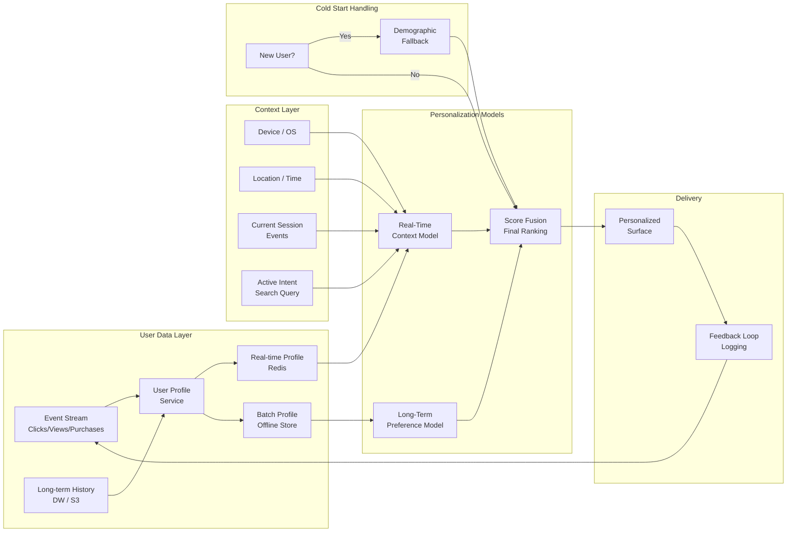

# Personalization System Design



---

## What Personalization Systems Do

**The problem**: serving the same content to all users is suboptimal. A user who exclusively reads tech news should not see sports headlines. A user who buys running shoes should not see fashion ads. Personalization adapts the product experience to each individual user's preferences, context, and intent.

**The core insight**: personalization is a combination of (1) user modelling — understanding stable long-term preferences, (2) context modelling — understanding the current session's intent, and (3) a ranking layer — combining both signals to produce a relevant ordered list.

---

## User Modelling

### Long-Term Preference Profile

**The problem**: a user's preferences are not directly observable — only their actions are. From clicks, purchases, and dwell time, the system must infer what the user actually likes vs. what they merely noticed.

**The mechanics**:

```python
from dataclasses import dataclass, field
from typing import Dict, List
import numpy as np

@dataclass
class UserProfile:
    user_id: str

    # Explicit signals (high confidence)
    explicit_likes: List[str] = field(default_factory=list)
    explicit_dislikes: List[str] = field(default_factory=list)

    # Implicit signals (aggregated over time)
    category_affinity: Dict[str, float] = field(default_factory=dict)
    brand_affinity: Dict[str, float] = field(default_factory=dict)
    price_sensitivity: float = 0.5  # 0=price-insensitive, 1=very price-sensitive

    # Behavioural features
    avg_session_length_minutes: float = 15.0
    preferred_content_formats: Dict[str, float] = field(default_factory=dict)
    active_hours: List[int] = field(default_factory=list)

    # Embedding representation (learned)
    user_embedding: np.ndarray = field(default_factory=lambda: np.zeros(128))

def update_user_profile(profile: UserProfile, event: dict) -> UserProfile:
    """Update profile based on a new user event."""
    category = event.get('item_category')
    if not category:
        return profile

    # Exponential moving average: recent events weighted more
    alpha = 0.1  # learning rate for EMA
    current_affinity = profile.category_affinity.get(category, 0.0)

    if event['type'] == 'purchase':
        signal = 1.0
    elif event['type'] == 'long_dwell':  # >60s
        signal = 0.7
    elif event['type'] == 'click':
        signal = 0.4
    elif event['type'] == 'skip':
        signal = -0.3
    elif event['type'] == 'explicit_dislike':
        signal = -1.0
    else:
        signal = 0.0

    profile.category_affinity[category] = (
        (1 - alpha) * current_affinity + alpha * signal
    )
    return profile
```

### Embedding-Based User Modelling

**The mechanics**:

```python
import torch
import torch.nn as nn

class UserTower(nn.Module):
    """
    Encode user into a dense embedding that captures preferences.
    Used in two-tower retrieval architecture.
    """
    def __init__(self, n_users: int, n_items: int, embed_dim: int = 128):
        super().__init__()
        self.user_embed = nn.Embedding(n_users, embed_dim)
        self.item_embed = nn.Embedding(n_items, embed_dim)

        # Context features
        self.category_embed = nn.Embedding(500, 32)
        self.hour_embed = nn.Embedding(24, 8)
        self.device_embed = nn.Embedding(10, 8)

        # History encoder: aggregate item history
        self.history_attention = nn.MultiheadAttention(
            embed_dim, num_heads=4, batch_first=True
        )

        fusion_dim = embed_dim + 32 + 8 + 8
        self.fc = nn.Sequential(
            nn.Linear(fusion_dim, 256),
            nn.ReLU(),
            nn.Linear(256, embed_dim)
        )

    def forward(
        self,
        user_id: torch.Tensor,
        item_history: torch.Tensor,    # [batch, history_len]
        category_prefs: torch.Tensor,  # [batch]
        hour: torch.Tensor,
        device: torch.Tensor
    ) -> torch.Tensor:
        u = self.user_embed(user_id)   # [batch, embed_dim]

        # Encode item history with attention
        h = self.item_embed(item_history)  # [batch, history_len, embed_dim]
        h_agg, _ = self.history_attention(u.unsqueeze(1), h, h)
        h_agg = h_agg.squeeze(1)

        # Context embeddings
        cat = self.category_embed(category_prefs)
        hr = self.hour_embed(hour)
        dev = self.device_embed(device)

        combined = torch.cat([h_agg, cat, hr, dev], dim=-1)
        return nn.functional.normalize(self.fc(combined), p=2, dim=-1)
```

---

## Context Modelling

### Real-Time Session Context

**The problem**: a user's long-term profile says they like running gear. But right now they're searching for "birthday gifts for kids." Their current intent is completely different from their profile. Personalization that ignores context shows running shoes for a kids' gift search.

**The core insight**: personalization has two components: long-term preference (who the user is) and short-term context (what the user wants right now). Context must dominate when it signals a clear intent.

**The mechanics**:

```python
class SessionContextEncoder:
    def __init__(self):
        self.session_events: list = []
        self.session_start: float = 0.0

    def update(self, event: dict):
        self.session_events.append(event)

    def get_context_features(self) -> dict:
        recent_events = self.session_events[-10:]  # last 10 events

        # Extract intent signals from recent behaviour
        recent_categories = [e.get('category') for e in recent_events if e.get('category')]
        recent_queries = [e.get('query') for e in recent_events if e.get('query')]
        recent_price_range = [e.get('price') for e in recent_events if e.get('price')]

        # Dominant category in session
        from collections import Counter
        category_counts = Counter(recent_categories)
        dominant_category = category_counts.most_common(1)[0][0] if category_counts else None

        import time
        return {
            "session_length_minutes": (time.time() - self.session_start) / 60,
            "dominant_category": dominant_category,
            "recent_queries": recent_queries[-3:],  # last 3 queries
            "avg_price_viewed": np.mean(recent_price_range) if recent_price_range else None,
            "event_count": len(self.session_events),
            "is_browsing": len(recent_queries) == 0,  # no search = browsing mode
            "is_searching": len(recent_queries) > 0   # active search intent
        }

    def get_intent_weight(self) -> float:
        """
        How much to weight session context vs long-term profile.
        Strong intent signal → weight context more.
        """
        has_clear_query = len([e for e in self.session_events[-5:] if e.get('query')]) > 0
        has_dominant_category = len(set(
            e.get('category') for e in self.session_events[-5:] if e.get('category')
        )) == 1  # all recent events from same category

        if has_clear_query:
            return 0.8  # query intent is strong: 80% context, 20% profile
        elif has_dominant_category:
            return 0.6
        else:
            return 0.3  # exploratory browsing: rely more on profile
```

---

## Cold Start Problem

### User Cold Start

**The problem**: a new user has no history. The user profile is empty. The recommendation system has no signal to personalize on.

**The three-stage cold start strategy**:

```python
class ColdStartHandler:
    def get_strategy(self, user: dict) -> str:
        """Determine which cold-start strategy to apply."""
        history_events = user.get('event_count', 0)

        if history_events == 0:
            return "population_prior"   # zero history
        elif history_events < 5:
            return "demographic_fallback"  # minimal history
        elif history_events < 20:
            return "collaborative_similarity"  # some history
        else:
            return "personalized"  # sufficient history

    def population_prior(self, context: dict) -> list:
        """Serve trending/popular content with no personalization."""
        return self.trending_items(
            geo=context.get('country'),
            time_of_day=context.get('hour'),
            device=context.get('device_type')
        )

    def demographic_fallback(self, user: dict, context: dict) -> list:
        """Use age, location, device to proxy preferences."""
        demographic_key = (
            user.get('age_bucket'),    # 18-24, 25-34, etc.
            user.get('country'),
            context.get('device_type')
        )
        return self.demographic_precomputed_lists.get(
            demographic_key,
            self.population_prior(context)
        )

    def collaborative_similarity(self, user: dict) -> list:
        """Find similar users based on limited history; borrow their preferences."""
        user_embedding = self.embed_sparse_history(user['recent_items'])
        similar_users = self.user_index.search(user_embedding, k=50)
        # Aggregate items liked by similar users; filter out user's seen items
        return self.aggregate_similar_user_items(similar_users, user['seen_items'])
```

### Item Cold Start

**The problem**: new items have no interaction history. Collaborative filtering cannot represent them. The system defaults to never showing new items.

**The mechanics**:

```python
def handle_item_cold_start(item: dict) -> np.ndarray:
    """
    Generate embedding for new item from content features.
    No interaction history needed.
    """
    # Content-based embedding: use item attributes
    title_embedding = text_encoder.encode(item['title'])
    category_embedding = category_encoder.encode(item['category'])
    brand_embedding = brand_encoder.encode(item.get('brand', 'unknown'))

    # Price bucket embedding
    price_bucket = min(int(item['price'] / 50), 19)  # 20 buckets
    price_embedding = price_encoder.encode(price_bucket)

    # Fuse content features into item embedding space
    content_embedding = content_fusion_model(
        title_embedding, category_embedding, brand_embedding, price_embedding
    )

    # Initialize with content embedding; refine as interactions accumulate
    return content_embedding

# Exploration budget for new items
def new_item_boost(item_score: float, item_age_hours: float) -> float:
    """Boost new items to give them impression budget for learning."""
    if item_age_hours < 24:
        return item_score * 1.3  # 30% boost for first 24 hours
    elif item_age_hours < 72:
        return item_score * 1.1  # 10% boost for 24-72 hours
    return item_score
```

---

## Score Fusion

### Combining Long-Term Profile and Context

**The mechanics**:

```python
def personalized_score(
    item_id: str,
    user_profile: UserProfile,
    session_context: dict,
    base_score: float,
    context_weight: float  # from get_intent_weight()
) -> float:
    """
    Compute final personalized score by fusing multiple signals.
    """
    profile_weight = 1.0 - context_weight

    # Long-term preference signal
    item_category = get_item_category(item_id)
    profile_score = user_profile.category_affinity.get(item_category, 0.0)

    # Context signal
    context_score = 0.0
    if session_context.get('dominant_category') == item_category:
        context_score = 1.0  # strong session match

    # Price sensitivity
    item_price = get_item_price(item_id)
    price_score = 1.0
    if user_profile.price_sensitivity > 0.7:
        avg_price = user_profile.avg_price_purchased or 100
        if item_price > avg_price * 1.5:
            price_score = 0.6  # user is price sensitive, penalize expensive items

    # Diversity: penalize items similar to recently shown
    diversity_penalty = compute_diversity_penalty(item_id, session_context['seen_items'])

    # Final score: weighted combination
    personalization_signal = (
        profile_weight * profile_score +
        context_weight * context_score
    ) * price_score * (1.0 - 0.3 * diversity_penalty)

    # Blend base score (quality) with personalization signal
    return 0.6 * base_score + 0.4 * personalization_signal
```

---

## Real-Time Profile Updates

**The mechanics**:

```python
from kafka import KafkaConsumer

class RealTimeProfileUpdater:
    def __init__(self, redis_client, kafka_bootstrap: str):
        self.redis = redis_client
        self.consumer = KafkaConsumer(
            'user-events',
            bootstrap_servers=[kafka_bootstrap],
            value_deserializer=lambda m: json.loads(m.decode()),
            group_id='profile-updater'
        )

    def run(self):
        for message in self.consumer:
            event = message.value
            user_id = event['user_id']

            # Load current profile from Redis
            profile_key = f"profile:{user_id}"
            raw = self.redis.get(profile_key)
            profile = json.loads(raw) if raw else {}

            # Update category affinity with EMA
            category = event.get('item_category')
            if category:
                current = profile.get('category_affinity', {}).get(category, 0.0)
                signal_map = {
                    'purchase': 1.0, 'long_dwell': 0.7,
                    'click': 0.3, 'skip': -0.2
                }
                signal = signal_map.get(event['type'], 0.0)
                profile.setdefault('category_affinity', {})[category] = (
                    0.9 * current + 0.1 * signal
                )

            # Write back with TTL
            self.redis.setex(profile_key, 7 * 86400, json.dumps(profile))  # 7 day TTL
```

---

## Personalization at Scale: Architecture

```
Traffic: 100K requests/second
User count: 500M users
Item catalog: 50M items

Components:
┌─────────────────────────────────────────┐
│ Load Balancer                           │
│ (route by user_id for session affinity) │
└────────────────┬────────────────────────┘
                 │
┌────────────────▼────────────────────────┐
│ Personalization Service (stateless)     │
│ - Retrieve user profile from Redis      │
│ - Retrieve session context from Redis   │
│ - Call retrieval service (ANN search)   │
│ - Apply personalized scoring            │
│ - Return ranked list                    │
│ P99 budget: 50ms total                 │
└────────────────┬────────────────────────┘
     │           │             │
     ▼           ▼             ▼
Profile Store  ANN Index   Item Features
(Redis)      (FAISS/ScaNN) (Redis + S3)
<5ms read    <10ms search   <5ms read
```

**What breaks**: personalizing cold-start users with demographic fallbacks creates filter bubbles faster than personalized recommendations. A user in the "25-34 tech male" demographic bucket gets served tech content → engages with tech → reinforces the bucket. The demographic model never learns they actually prefer cooking content. Mix exploration (random from diverse categories) into cold-start responses.
