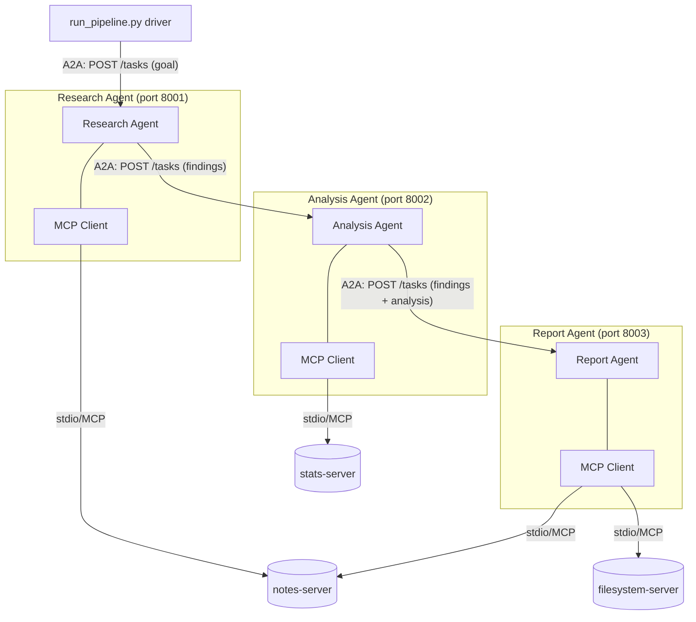

# Project: Three Agents, Multiple MCP Servers, Talking via A2A

**What this is:** three independent agent *processes* — Research, Analysis, Report —
each with its own restricted MCP client(s) wired to real MCP servers, handing work
to each other over a real implementation of the A2A (Agent2Agent) protocol. Give it
a goal like `"Why did churn increase in Q3 and what should we do about it?"` and it
runs a full Research → Analyze → Report pipeline and writes a Markdown report to
disk, entirely offline, with zero API keys.

This project exists to make two protocols that are easy to explain but hard to
picture — **MCP** and **A2A** — concrete: you can read the wire messages, see the
process boundaries, and watch a task get handed from one agent to the next.

---

## 1. The key terms, defined against this actual system

### Agent
A process that (a) has a goal, (b) can call tools to act on the world, and (c) makes
its own decisions about which tools to call and what to do with the result. In this
project there are three: **Research Agent**, **Analysis Agent**, **Report Agent**.
Each one is a standalone OS process (`agents/research_agent.py`, etc.) — not three
objects inside one Python program. That separation is the point: in a real
deployment these could be three different teams' services, written in different
languages, deployed independently.

### MCP (Model Context Protocol)
An open protocol for connecting an agent to *tools and data* — "agent-to-tool."
It standardizes three things so you don't hand-write a bespoke integration for
every data source:
- **Resources** — read-only data exposed via URI templates (not used in this
  minimal build, but part of the spec).
- **Tools** — functions the agent can invoke, declared with `@mcp.tool()` and a
  Pydantic-inferred JSON schema for their arguments. See `mcp_servers/notes_server.py`'s
  `search_notes(keyword: str)` for a concrete example.
- **Prompts** — reusable prompt templates a server can offer (not used here).

### MCP Server
A small, focused process that owns one capability and exposes it over MCP. This
project has three:

| Server | File | Tools it exposes |
|---|---|---|
| `notes-server` | `mcp_servers/notes_server.py` | `search_notes`, `read_all_notes` — a stand-in for a search/knowledge-base API |
| `stats-server` | `mcp_servers/stats_server.py` | `get_metric`, `compute_trend`, `summarize_all_metrics` — real numeric compute over `data/metrics.json` |
| `filesystem-server` | `mcp_servers/filesystem_server.py` | `write_report`, `list_reports` — the only server with write access |

Each server is a normal Python script built on `mcp.server.fastmcp.FastMCP`, run as
a **subprocess**, communicating over **stdio** using JSON-RPC — the same transport
Claude Desktop and other MCP hosts use for local servers. Nothing about these
servers refers to "agents" or "A2A" at all; they just expose tools, which is the
whole point of the protocol boundary.

### MCP Client
The thing that *speaks* MCP to a server: it spawns the server subprocess, does the
MCP handshake, calls `list_tools()` to discover what's available, and calls
`call_tool()` to invoke one. See `agents/mcp_client.py`. Critically, **each agent
here owns its own MCP client(s), restricted to only the servers it needs**:

- Research Agent's client → `notes-server` only (it can search notes, nothing else).
- Analysis Agent's client → `stats-server` only (it can compute trends, nothing else).
- Report Agent's client → **both** `filesystem-server` and `notes-server` (it needs
  to write the report *and* can re-check a raw quote while writing it) — this shows
  the *other* half of "multiple MCP clients, multiple MCP servers": a single agent
  can also hold one client wired to more than one server.

This is the "Hierarchical Multi-Client" pattern: instead of one shared client with
access to every tool (which would let the Research Agent accidentally overwrite
files, say), each agent's blast radius is limited to exactly the servers its job
requires.

### A2A (Agent2Agent) protocol
A protocol for **agent-to-agent** communication — handing a unit of work from one
autonomous agent to another, each of which may be built, owned, and deployed
independently, possibly by different teams or vendors. This is deliberately a
different layer from MCP: **MCP is agent-to-tool, A2A is agent-to-agent.** A single
system commonly needs both, as this one does.

This project implements the real A2A spec's core concepts (trimmed to what's
needed for one linear pipeline — see `agents/a2a_protocol.py`):

- **Agent Card** — a JSON document an agent publishes at
  `/.well-known/agent-card.json` describing its name, description, and skills. Any
  other agent (or a human) can `GET` this URL to discover what an agent claims it
  can do *before* sending it work. Try it yourself while the pipeline is running:
  `curl http://127.0.0.1:8001/.well-known/agent-card.json`.
- **Task** — the unit of work handed between agents, with a lifecycle
  (`submitted` → `working` → `completed`/`failed`) and a `goal`.
- **Message / Parts** — the actual content inside a task, broken into typed parts
  (`text` for prose, `data` for structured JSON), so a task can carry both a
  natural-language finding and machine-readable data in the same envelope.
- **`send_task()`** — the A2A client call: discover the peer's Agent Card, then
  `POST` a `Task` to its `/tasks` endpoint and get back the completed `Task`.

In this pipeline, A2A messages flow: driver → Research Agent → Analysis Agent →
Report Agent, each hop a real HTTP `POST /tasks` between three separate local
server processes on ports 8001/8002/8003.

### Why two protocols instead of one
It's tempting to think "the agents could just call each other's tools via MCP too."
The distinction that matters in practice: MCP tools are typically fine-grained,
stateless, low-level actions (`search_notes`, `compute_trend`) meant to be called
many times as an agent reasons. A2A tasks are coarse-grained handoffs of an entire
unit of work with its own goal and lifecycle, meant to cross a trust/ownership
boundary — you'd A2A-call another company's agent, but you wouldn't want to hand it
raw MCP tool access to your internal database.

---

## 2. Architecture



Each agent box is its own OS process running a FastAPI app (the A2A server side)
plus its own MCP client(s) (spawning MCP server subprocesses over stdio). The
arrows between agent boxes are real HTTP requests; the arrows down to the
`(server)` nodes are real MCP JSON-RPC calls over stdio.

### The scenario: Research → Analyze → Report

1. **Driver** (`run_pipeline.py`) starts all three agent processes, waits for their
   Agent Cards to become reachable, then submits an initial `Task` — containing a
   goal like `"Why did churn increase in Q3?"` — to the Research Agent.
2. **Research Agent** extracts keywords from the goal, calls its `notes-server` MCP
   client's `search_notes` tool for each keyword, collects the matching raw notes,
   then opens an A2A connection to the Analysis Agent and sends it a new `Task`
   carrying those findings.
3. **Analysis Agent** reads the findings, decides which metrics are relevant, calls
   its `stats-server` MCP client's `compute_trend` tool for each one (real
   arithmetic: quarter-over-quarter % change, trend direction, next-quarter
   projection), then hands a `Task` with findings + analysis to the Report Agent.
4. **Report Agent** assembles a Markdown report from both, calls its
   `filesystem-server` MCP client's `write_report` tool to persist it to
   `output/quarterly_report.md`, and returns the completed `Task` back up the chain.
5. The driver prints the final result and terminates all three subprocesses.

---

## Setup

Requires Python 3.10+ (the `mcp` SDK needs it — this repo's default `python3` may
be older; a `venv` built on a newer interpreter is recommended, e.g.
`/opt/homebrew/bin/python3.13 -m venv .venv`).

```bash
python3 -m venv .venv
.venv/bin/pip install -r requirements.txt
```

## Run

```bash
.venv/bin/python run_pipeline.py "Why did churn increase in Q3 and what should we do about it?"
```

Or with the default goal:

```bash
.venv/bin/python run_pipeline.py
```

While it's running, you can inspect the A2A layer yourself in another terminal:

```bash
curl http://127.0.0.1:8001/.well-known/agent-card.json   # Research Agent's Agent Card
curl http://127.0.0.1:8002/.well-known/agent-card.json   # Analysis Agent's Agent Card
curl http://127.0.0.1:8003/.well-known/agent-card.json   # Report Agent's Agent Card
```

The final report lands at `output/quarterly_report.md`.

## Structure

| Path | Purpose |
|---|---|
| `mcp_servers/notes_server.py` | MCP server exposing `search_notes` / `read_all_notes` over the raw text corpus in `data/notes.txt`. |
| `mcp_servers/stats_server.py` | MCP server exposing `get_metric` / `compute_trend` / `summarize_all_metrics` over `data/metrics.json`. |
| `mcp_servers/filesystem_server.py` | MCP server exposing `write_report` / `list_reports`, the only writer to `output/`. |
| `agents/mcp_client.py` | Minimal MCP client wrapper: spawns a server over stdio, does the handshake, lists/calls tools. |
| `agents/a2a_protocol.py` | Minimal A2A implementation: `AgentCard`, `Task`, `Message`/`Part`, `make_agent_app()` (server side), `send_task()` (client side). |
| `agents/research_agent.py` | Agent 1: notes-server MCP client + A2A server/client. |
| `agents/analysis_agent.py` | Agent 2: stats-server MCP client + A2A server/client. |
| `agents/report_agent.py` | Agent 3: filesystem-server + notes-server MCP client + A2A server. |
| `run_pipeline.py` | Spawns all three agent processes, submits the initial A2A task, prints the result. |
| `data/notes.txt`, `data/metrics.json` | Self-contained sample corpus/metrics — no external APIs or downloads. |

## Where to Next

- [05-llms/applications/01-agentic-workflows.md](../../05-llms/applications/01-agentic-workflows.md) for the broader theory of agentic systems, tool use, and orchestration patterns this project is a hands-on instance of.
- [12-projects/09-mcp-agent-system/](../09-mcp-agent-system/) for a variant that explores additional MCP patterns (HITL approval servers, remote SSE servers, MCP Resources) without a true A2A layer — useful for seeing more MCP surface area once this project's A2A/MCP split is clear.
