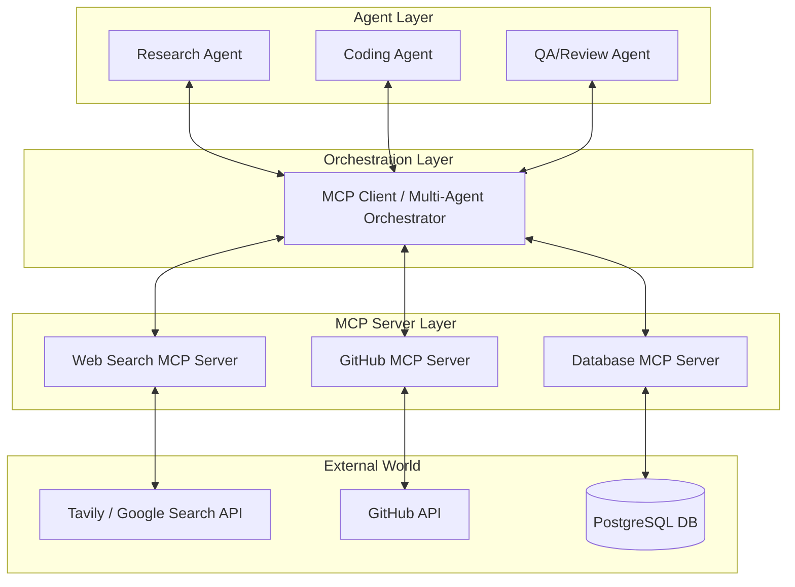

# 09 — MCP Multi-Agent Ecosystem

**Objective:** Build a scalable, multi-agent architecture where autonomous AI agents interact with external data sources and APIs through the **Model Context Protocol (MCP)**. 

This project bridges the gap between isolated LLMs and real-world execution by using a standardized protocol to expose tools and resources.

---

## 1. What is the Model Context Protocol (MCP)?

The Model Context Protocol is an open standard introduced to unify how AI models connect to data sources, tools, and environments. Instead of writing custom API wrappers for every LLM integration, MCP uses a client-server architecture:

- **MCP Client:** The application hosting the AI agent (e.g., Claude Desktop, a custom multi-agent orchestrator, or an IDE). It manages the LLM context and routes tool calls.
- **MCP Server:** A lightweight, specialized program that connects to a specific data source or API (e.g., a GitHub server, a PostgreSQL server, a Slack server). It exposes its capabilities to the client in a standard format.

### How MCP Servers Are Created
An MCP server is typically built using an official SDK (available in Python and TypeScript). It defines three core primitives:
1. **Resources:** Read-only data (like a file or a database snapshot) exposed via URI templates.
2. **Tools:** Executable functions (like running a query or hitting an API) that the LLM can invoke.
3. **Prompts:** Reusable prompt templates provided by the server.

**Basic workflow to create one:**
1. Initialize an MCP server instance using the SDK.
2. Decorate Python/TS functions with `@server.tool()` to define what the LLM can call.
3. Define the connection protocol (usually `stdio` for local execution or SSE for HTTP).
4. Run the server, which listens for JSON-RPC messages from the client.

---

## 2. System Architecture: Multi-Agent to Multi-Server

In this project, we build a complex ecosystem where multiple specialized AI agents collaborate, all routing their external interactions through a central MCP Client connected to multiple MCP Servers.

### How the Architecture Works:
1. **The Agents:** We have three agents with different system prompts (Researcher, Coder, Reviewer). They communicate with each other (e.g., via a framework like LangGraph, AutoGen, or a custom event loop).
2. **The MCP Client:** Instead of giving agents raw Python tools, the orchestrator runs an MCP Client. The client spins up the MCP Servers as subprocesses (using `stdio`).
3. **Tool Discovery:** When the agents boot up, the MCP Client queries the servers for their available tools and injects their JSON schemas into the agents' context windows.
4. **Execution:** 
   - The *Research Agent* decides it needs documentation. It issues a tool call.
   - The *MCP Client* routes this to the **Web Search MCP Server**.
   - The server queries the external API and returns the result through the client back to the agent.
   - The *Coding Agent* uses the **GitHub MCP Server** to read repo files and push commits.

---

## 3. Implementation Steps

### Step 1: Build Custom MCP Servers
Write two simple Python MCP servers:
1. **Weather/Search Server:** Connects to an external REST API.
2. **Local File/DB Server:** Allows reading/writing to a local SQLite database or file system.

*Key skill:* Using the `@server.tool()` decorator and defining Pydantic models for strict input validation.

### Step 2: Implement the MCP Client
Use the MCP Python SDK to build a client that:
- Connects to the servers via `stdio`.
- Fetches the `list_tools()` response.
- Formats these tools into the standard OpenAI/Anthropic tool schema.

### Step 3: Build the Agent Orchestrator
Build a simple multi-agent loop:
- Maintain a shared message history.
- Pass the MCP tool schemas to an LLM (e.g., `gpt-4o` or `claude-3-5-sonnet`).
- When the LLM outputs a tool call, intercept it, pass the arguments to the MCP Client, execute it on the Server, and append the result to the history.

---

## 4. Project Variations & Extensions

Once the base architecture is working, try these variations to increase complexity and realism:

### Variation A: Human-in-the-Loop (HITL) Approval Server
Create a specialized MCP Server that doesn't talk to an API, but instead pauses execution and sends a Slack/Discord message to a human for approval. 
- *Why:* Essential for production agents making destructive actions (like executing SQL `DROP` or spending money).
- *Flow:* Agent requests action → MCP Server sends Slack ping → Server waits for human reply → Server returns "Approved" or "Rejected" to the Agent.

### Variation B: Remote MCP Servers via SSE
Instead of running MCP servers locally via `stdio`, host them on a cloud provider (like AWS CloudRun or Vercel) and connect via Server-Sent Events (SSE) and HTTP POST.
- *Why:* Allows a lightweight client (like a mobile app or a browser extension) to utilize powerful, secure, centralized tools without distributing API keys to the client.

### Variation C: Agentic RAG with MCP Resources
Instead of just using MCP *Tools* (functions), use MCP *Resources*. Build a vector database MCP Server.
- *Flow:* The MCP Server exposes document summaries as `resources`. The agent reads the resources, decides which ones are relevant, and then uses a `query_vector_db` tool to fetch exact chunks.

### Variation D: Hierarchical Multi-Client (The "Company" Architecture)
Instead of one client for all agents, give each agent its own restricted MCP Client.
- The **Coder Agent** gets the GitHub and Terminal MCP servers.
- The **Finance Agent** gets the Stripe and Database MCP servers.
- *Why:* Security and context-window optimization. You don't want the Coder Agent distracted by or having access to financial API tools.

---

## 5. What You Will Learn
- **Protocol Standardization:** Why decoupling tool definitions from agent logic makes systems scalable.
- **Process Management:** Handling asynchronous subprocesses and IPC (Inter-Process Communication).
- **Multi-Agent Orchestration:** Managing state and routing between specialized LLMs.
- **Security Boundaries:** How MCP isolates API keys and credentials inside the server, keeping them away from the LLM client.
