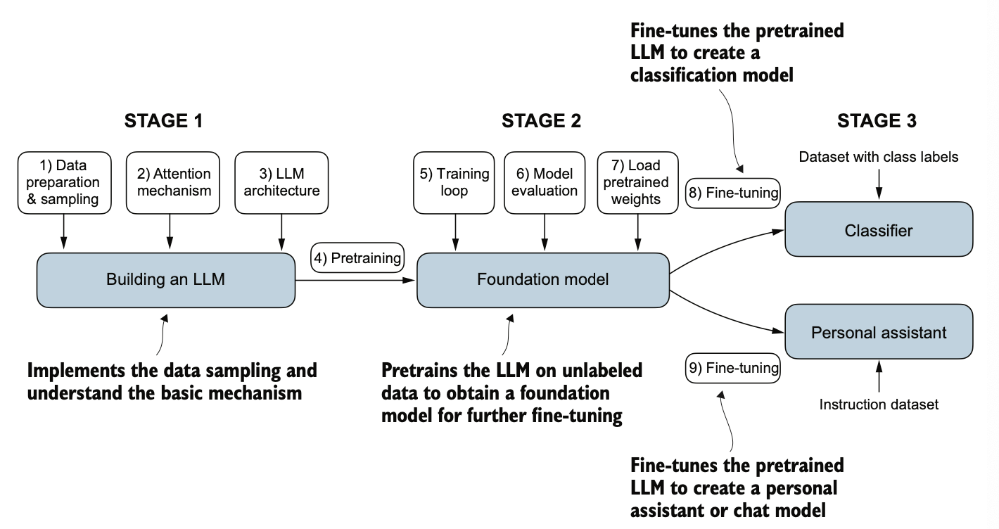

# How to train Your Dragon (LLM)

<figure><figcaption></figcaption></figure>

Overview:

* What is a LLM?
* Transform artitecture
* Overall process

## What is a LLM?

* Large language models
* New era for NLP as earlier we had traditional methods which underperformed in tasks that demanded complex understanding and generation abilities.
* ex— they were not able to write email from a list of keywords.
* LLMs are trained on vast quantites of data, the sucess lies behind transformer architecture that underpins many LLMs and vast amount of data on which LLMs are trained on which allows them to capture wide variety of linguistic nuances, contexts and patterns that is challenging to encode manually.
* These have billions of parameters which are adjustable weights in the network that are optimized during training to predict the next word in the sequece.
* The transformer artitecture allows them to pay selective attention to different parts of input when making predictions making them especially adept at handling the nuances and complexities of human language.
* LLMs can be categorised as an intersection between Deep learning and GenAI.
* custom built LLMs those are tailored for specific tasks or domains can outperform general purpose LLMs such as ChatGPT.
* THe pretrained model ChatGPT serve as a foundational resource that can be further refined through fine tuning, a process where the model is specifically trained on a narrower dataset that is more specific to a particular tasks.
* LLMs user self-supervised learning where the model generated its own labels from the input data.

## Transformer artitecture

* Transformer consists of two submodules: an encoder and a decoder.
  * encoder&#x20;
    * processes the input text and encodes it into a series of numerical representations or vectors that capture the contextual information of the input.
  * Decoder&#x20;
    * takes the encoded vectors and generated the output text.
* Both the encoder and decoder consists of many layers connected by so called self-attention mechanism, which allows the model to weigh the importatnce of difference words or toekns in a sequence relative to each other.
* this enables the model to cpture long rage dependencies and contextual relationships withing the input data, enhancing its ability to generate coherent and contextually relevant output.
* Steps
  * encoder&#x20;
    * input text — input text to be translated
    * preprocessing steps — input text is prepared for the encoder.
    * encoder then produces the text encodings used by the decoder
    * encoder returns the embedding vectors as input to the decoder.
  * Decoder
    * A partial output test, the model completes the translation one word at a time
    * The input text is prepared for the decoder
    * The decoder generates the translated text one word at a time
    * the complete output
* There are many LLMs each having different training approach from GPT. GPT is designed for generative tasks, BERT specializes in masked word prediction  where the model predicts the masked or hidden word in a given sequence.
* &#x20;Bert&#x20;
  * receives inputs where words are randomly masked during training
  * Fills in the missing words to generate the original sentence
* GPT&#x20;
  * Receives incomplete text
  * Learns to generate one word at a time
  * designed for generative tasks and producing coherent text sequence
  * can solve various tasks based on their inputs without needing retraining, fintuning or task specific model artitecture changes.
* Transformers vs LLMs
  * Todays LLMs are based on transformer artitecture.
  * But these can be used for computer vision&#x20;
* Training dataset&#x20;
  *   token is a unit of text that a model

      reads and the number of tokens in a dataset is roughly equivalent to the number of

      words and punctuation characters in the text
  *   scale and diversity of this training dataset allow these

      models to perform well on diverse tasks, including language syntax, semantics, and

      context—even some requiring general knowledge.
  *   pretrained nature of these models makes them incredibly versatile for further

      fine-tuning on downstream tasks, which is why they are also known as base or founda-

      tion models.
  *   Also, LLMs can be fine-tuned on specific tasks with rela-

      tively smaller datasets, reducing the computational resources needed and improving

      performance.
  *   After imple-

      menting the pretraining code, we will learn how to reuse openly available model weights

      and load them into the architecture we will implement,
* GPT - Artitecture
  *   GPT-3 is a scaled-up version of this model that has more parameters and was trained

      on a larger dataset.
  * Main goal is to predict the next word which is a form of self supervised learning
  *   Since this next-

      word prediction task allows us to create labels “on the fly,” it is possible to use massive

      unlabeled text datasets to train LLMs.
  * The general artitecture is simple
    * essentially it is just the decoder part without the encoder
    * Since they generate text by predicting text one word at a time these are considered autoregressive model, which incoprate their previous outputs as inputs for future predictions.
    *   Artitecture like these are larger than original transformer For instance, the original transformer repeated the encoder and decoder blocks

        six times. GPT-3 has 96 transformer layers and 175 billion parameters in total.
    * the decoder 1 generates the 1st word and passed it to decoder 2 which generates 2nd word and both 1st and second word is passed to the decoder 3 and this goes on.
    * The original transformer model which consists of encoder and decoder was explicitly designed for language translation GPT models have only decoder but these are also capable of performing translations tasks which was unexpected to the researchers.(emergent behavious)

## Overall Process on Building the large Language model

<figure><figcaption></figcaption></figure>

1.  **Building Your LLM \[ implementing artitecture and data preparation process]**

* Overview of this section
  * Data preparation and sampling
  * Attention Mechanism
    * Simplified self-attention
    * self-attention
    * Casual attention
    * Multi-head attention
  * LLM architecture
* Details&#x20;
  * Data preparation and sampling
    * Before we implement and train LLMs we need to prepare the the training dataset, which includes splitting text into individual word and subword tokens which can be encoded into vector representation for the LLM.
    * Understanding word embeddings
      * Computers can't process raw text directly they needs numbers so we convert the data into a vector format known as embeddings.
      * Any kind of data text, video photo is converted into numbers having some meaning and passed to the ml models to use them.
      * For this we need some kind of mechanism to convert the data into numbers so that it captures the info of words, for that we use the embedding model.
      *   At its core, an embedding is a mapping from discrete objects, such as words, images,

          or even entire documents, to points in a continuous vector space—the primary pur-

          pose of embeddings is to convert nonnumeric data into a format that neural networks

          can process.
      * there are several algorithms and frameworks which can be used to generate word embeddings. ex — Word2Vec, text embedding ada-002
      * Word2vec is a trained neural network to generate word embedding by predicting the context of a word given the target word or viceversa. which gives us the two dimensional word embeddings for visualisation similar terms are clustured together.
      * A higher dimensionality captures more nuanced relationships but at the cost of computation
        *

            <figure><figcaption></figcaption></figure>
      * But now the LLMs commonly produce their own embeddings that are part of the input layer and are updated during training. The advantage of optimising the embeddings as part of LLM training instead of using Word2Vec is that embeddings are optimized to the specific tasks and data at hand.
      * WHile using with LLMs we use embeddings with much high dimensionality, it is a tradeoff between the performance and efficiency.
      * Steps required for preparing the embeddings
        * converting the word into token
          * split text into individual tokens, these can be individual words or special characters, including punctuation marks
          * Whole embedding process can be&#x20;
          * input text > tokenised text ( individual words, special charachters ) > token IDs > token embeddings
          *   ex -— we have text size of 20,479 characters which we will turn them into embeddings for LLM training

              * Divide the text based on space including spl charachters
              * Remove the whitespace
              *

                  <figure><figcaption></figcaption></figure>

        * turning the tokens into token ID( embedding vectors)
          * Now we convert these tokens from a python string to integer representation to produce the token ID.
          * To do this each unique token is added to the vocabulary in alphabetical order.
          *

              <figure><figcaption></figcaption></figure>
  * Attention Mechanism
    * Simplified self-attention
    * self-attention
    * Casual attention
    * Multi-head attention
  * LLM architecture

2. **Foundation model \[pertaining an LLM to create a foundation model]**
   1. Training loop
   2. Model evaluation
   3. Load pre-trained weights
3. **Fine tuning \[ fine tuning the foundation model to become a personal assistant or text classifier]**
