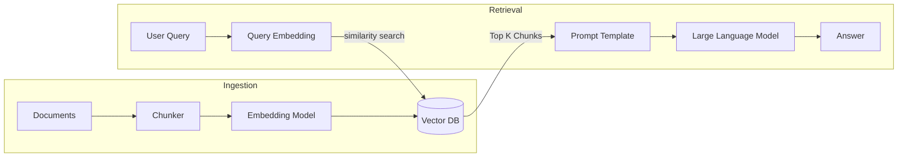
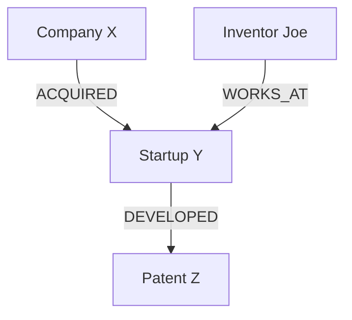

# Retrieval-Augmented Generation (RAG) - Comprehensive Interview Notes

# Q1: What is Retrieval-Augmented Generation (RAG), and why is it important?

## 1. 🔹 Direct Answer
**Retrieval-Augmented Generation (RAG)** is a framework that enhances Large Language Models (LLMs) by dynamically retrieving relevant facts from an external, authoritative knowledge base (like private documents or real-time web search) and providing that data as context in the prompt. It is critical because it solves the "frozen knowledge" problem of LLMs, enabling them to answer questions with up-to-the-minute accuracy, cite sources, and drastically reduce hallucinations.

## 2. 🔹 Intuition
Imagine an LLM is a world-renowned genius who took their last exam in 2023. They are incredibly smart, but they don't know what happened yesterday.
- **Without RAG:** You ask the genius about a news event from this morning. They try to guess the answer based on patterns they know, often making things up (hallucinating).
- **With RAG:** You give the genius a current newspaper before they answer. They read the relevant article and explain the event to you using their superior reasoning skills while pointing at the newspaper for proof.

## 3. 🔹 Deep Dive
- **The Core Problem (Parametric Memory):** LLMs store knowledge in their weights (parametric memory). Updating this memory requires expensive re-training or fine-tuning.
- **The RAG Solution (Non-Parametric Memory):** RAG decouples the *Reasoning Engine* (the LLM) from the *Knowledge Store* (Vector Database).
- **Workflow:**
  1. **User Query:** "What's our company's new remote work policy?"
  2. **Retrieval:** The system converts the query into a vector and searches a database for the most mathematically similar text chunks.
  3. **Augmentation:** The retrieved chunks are pasted into a prompt template: `Extract the answer from this context: [Context] Query: [User Query]`.
  4. **Generation:** The LLM generates a grounded response.

## 4. 🔹 Practical Perspective
- **Use Cases:** Enterprise knowledge bases (HR policies, technical docs), Real-time customer support, Legal/Medical research assistants.
- **When NOT to use:** If you need to change the model's *behavior* (e.g., tone, style, specialized medical jargon handling), RAG isn't enough; you may need fine-tuning. RAG is for *knowledge*, Fine-tuning is for *form/style*.
- **Trade-offs:** Adds latency (retrieval step), increases complexity (managing vector DBs), and costs more tokens per request.

## 5. 🔹 Code Snippet
```python
# Conceptual RAG Flow
def simple_rag(query, vector_db, llm):
    # 1. Retrieve
    relevant_docs = vector_db.similarity_search(query, k=3)
    context = "\n".join([doc.page_content for doc in relevant_docs])
    
    # 2. Augment
    prompt = f"Using the context below, answer the question.\nContext: {context}\nQuestion: {query}"
    
    # 3. Generate
    return llm.predict(prompt)
```

## 6. 🔹 Interview Follow-ups
1. **Q:** *Does RAG eliminate hallucinations entirely?* 
   **A:** No. If the retriever fetches irrelevant data ("trash in"), the LLM might still try to bridge the gap and hallucinate ("trash out"). Advanced techniques like Re-ranking and Self-RAG are needed.
2. **Q:** *Why not just fine-tune on the data?* 
   **A:** Fine-tuning is expensive, slow to update, and the model can still hallucinate facts. RAG is real-time, cheaper, and provides transparent citations.

## 7. 🔹 Common Mistakes
- **Assuming RAG replaces Fine-tuning:** They are complementary. A "Med-Llama" model might be fine-tuned to speak like a doctor, but it still needs RAG to look up specific patient records.
- **Ignoring Chunking:** If your chunks are too small, they lose context; if they are too large, they dilute the relevance scores.

## 8. 🔹 Comparison / Connections
- **Open-Book vs. Closed-Book Exam:** Standard LLM is a closed-book exam (relying on memory). RAG is an open-book exam (relying on the textbook).

## 9. 🔹 One-line Revision
RAG is an architectural pattern that grounds LLM outputs in external, verifiable data by retrieving relevant context for every query, ensuring accuracy and source attribution.

## 10. 🔹 Difficulty Tag
🟢 Easy

---

# Q2: Explain the architecture of a basic RAG system.

## 1. 🔹 Direct Answer
A basic RAG architecture consists of two distinct pipelines: the **Ingestion Pipeline** (offline) and the **Retrieval Pipeline** (online). In data ingestion, documents are loaded, chunked, embedded, and stored in a vector database. In retrieval, a user query is embedded, similar chunks are fetched from the database, and the LLM generates a response enriched by that retrieved context.

## 2. 🔹 Intuition
Think of a library.
- **Ingestion:** This is the Librarian's job before the doors open. They take new books, tear them into logical sections (chunking), tag them with topics (embedding), and put them on specific shelves (vector database).
- **Retrieval:** This is when a student arrives. The student asks for "Climate change statistics in Brazil." The Librarian finds the 3 most relevant sections, hands them to the student, and the student writes their paper based on those specific pages.

## 3. 🔹 Deep Dive
- **1. Ingestion Pipeline (The "Indexing" phase):**
  - **Load:** PDF, HTML, or Markdown parsers.
  - **Chunk:** Splitting text into manageable sizes (e.g., 500 tokens).
  - **Embed:** Passing chunks through an Embedding Model (e.g., `text-embedding-3-small`) to get vector representations.
  - **Store:** Saving indices in a Vector DB (Pinecone, Milvus, Chroma).
- **2. Retrieval & Generation Pipeline (The "Inference" phase):**
  - **Query Embedding:** User query is converted to a vector using the *same* embedding model.
  - **Vector Search:** Finding the "K" nearest neighbors using Cosine Similarity or Euclidean Distance.
  - **Prompt Construction:** Merging query + context.
  - **LLM Completion:** Generating the final answer.

## 4. 🔹 Practical Perspective
- **Real-world use cases:** Almost all production RAG systems start here. It's the "MVP" (Minimum Viable Product) for any LLM application involving private data.
- **Trade-offs:** Basic RAG is fast to build but brittle. It fails if the keyword isn't exact (semantic gap) or if the answer is spread across 5 different pages not captured in the "Top K" retrieval.

## 5. 🔹 Code Snippet


## 6. 🔹 Interview Follow-ups
1. **Q:** *Why is the embedding model choice critical?* 
   **A:** If you use Model A to index your documents but Model B to embed the user query, the vectors will be in different coordinate spaces. They will never match.
2. **Q:** *What is the 'Semantic Gap'?* 
   **A:** When the vector math thinks two sentences are similar because they share words, but they have opposite meanings (e.g., "I love this" vs "This I do not love"). 

## 7. 🔹 Common Mistakes
- **Neglecting the Metadata:** Failing to store metadata (page number, source URL) in the vector DB prevents the system from giving citations, which is the whole point of RAG.

## 8. 🔹 Comparison / Connections
- **ETL (Extract, Transform, Load):** RAG Ingestion is essentially an ETL process optimized for semantic search rather than relational queries.

## 9. 🔹 One-line Revision
RAG architecture connects an offline document indexing pipeline with an online semantic retrieval loop to provide LLMs with relevant, grounded context for generation.

## 10. 🔹 Difficulty Tag
🟢 Easy

---

# Q3: What are the key components of a RAG pipeline?

## 1. 🔹 Direct Answer
The five indispensable components of a RAG pipeline are: 
1. **Document Loader/Parser** (Handles file types)
2. **Text Chunker** (Strategy for splitting text)
3. **Embedding Model** (Semantic vector conversion)
4. **Vector Database** (Efficient high-dimensional storage)
5. **Orchestrator** (The "Glue" like LangChain or LlamaIndex that manages the flow).

## 2. 🔹 Intuition
Imagine a high-end restaurant.
- **Parser:** The delivery truck bringing raw ingredients.
- **Chunker:** The chef chopping vegetables into bite-sized pieces so they cook evenly.
- **Embedding Model:** A food critic who labels each bowl: "Spicy," "Sweet," "Savory."
- **Vector DB:** The pantry where ingredients are stored by flavor profile.
- **Orchestrator:** The Waiter who hears your order, runs to the pantry, grabs the right spices, hands them to the stove (LLM), and brings you the meal.

## 3. 🔹 Deep Dive
1. **Document Loader:** Must handle "OCR" (Optical Character Recognition) if documents are scanned images or complex PDFs.
2. **Text Chunker:** Defines the "context window." Includes strategies like sliding windows (overlapped chunks) to ensure no information is cut off mid-sentence.
3. **Embedding Model:** The "brain" of retrieval. Popular choices include OpenAI's `text-embedding-3`, Cohere, or open-source HuggingFace models (BGE, e5).
4. **Vector Database:** Uses algorithms like HNSW (Hierarchical Navigable Small Worlds) to find vectors in milliseconds across millions of entries.
5. **Retriever:** The logic that decides *how* to search (e.g., "Give me the top 5 most similar chunks").

## 4. 🔹 Practical Perspective
- **Real-world use cases:** When debugging a low-quality RAG system, an engineer must isolate which component is failing. If the search finds the wrong docs, the **Embedding Model** or **Chunking** is the problem. If the search finds the right docs but the answer is wrong, the **LLM** or **Prompt** is the problem.
- **Trade-offs:** Customizing every component increases performance but makes the system harder to maintain.

## 5. 🔹 Code Snippet
```python
# The Orchestrator (using LlamaIndex as an example)
from llama_index.core import VectorStoreIndex, SimpleDirectoryReader

# 1. Load (Parser)
documents = SimpleDirectoryReader("./data").load_data()

# 2, 3, 4. (Chunk, Embed, Index to VDB - often abstracted in basic calls)
index = VectorStoreIndex.from_documents(documents)

# 5. Retrieval & Generation
query_engine = index.as_query_engine()
response = query_engine.query("What is component X?")
```

## 6. 🔹 Interview Follow-ups
1. **Q:** *Why is the 'Chunker' often considered the most underrated component?* 
   **A:** Because semantic embeddings are sensitive. A chunk that is too small might lose the subject of a paragraph, leading to retrieval failures even if the model is perfect.
2. **Q:** *Do we always need a Vector Database?* 
   **A:** For small datasets (1-10 documents), you can keep them in memory. Vector DBs are for scale.

## 7. 🔹 Common Mistakes
- **Hardcoding everything:** Not using an orchestrator makes it extremely difficult to swap out embedding models or LLMs later as technology improves.

## 8. 🔹 Comparison / Connections
- **Microservices:** A RAG pipeline is essentially a set of specialized microservices working together to serve a single query.

## 9. 🔹 One-line Revision
A RAG pipeline is a structured system comprising loaders, chunkers, embedding models, vector stores, and an orchestrator to facilitate fact-based generation.

## 10. 🔹 Difficulty Tag
🟢 Easy

---

# Q4: What are chunking strategies, and how do you choose the right chunk size?

## 1. 🔹 Direct Answer
**Chunking** is the process of breaking long documents into smaller, meaningful segments to fit within the LLM’s context window and to optimize semantic search. Choosing the right size is a balancing act: **Small chunks** (e.g., 256 tokens) provide high precision (better for finding specific facts), while **Large chunks** (e.g., 1024 tokens) provide more context (better for understanding nuance and summaries).

## 2. 🔹 Intuition
Think of a standard textbook.
- **Small chunks:** Like indexing every single *sentence*. If you search for "Napoleon's height," you'll find the exact sentence. But you won't know *why* he was in that battle.
- **Large chunks:** Like indexing whole *chapters*. You'll get the full story of the battle, but searching for a tiny detail might get "lost" in the 50 pages of other data.
- **Choosing the size:** If your users ask "What happened on Page 5?", you need small chunks. If they ask "Summarize the theme of the book," you need large chunks.

## 3. 🔹 Deep Dive
- **Factors in choosing size:**
  1. **Nature of Content:** Legal contracts (which have long, nested clauses) need larger chunks. FAQ lists need small, one-question-per-chunk sizes.
  2. **Embedding Model Limits:** Most embedding models have a "token limit" (e.g., 512 or 8191). If you chunk larger than the limit, the model will simply cut off the end of your text.
  3. **Retrieval Strategy:** If you use "Parent Document Retrieval," you can search small chunks but return the whole original page to the LLM.
- **Metric for Success:** **Retrieval Recall.** If your "Top K" chunks don't contain enough info to answer the question, your chunks are likely too small.

## 4. 🔹 Practical Perspective
- **The "Goldilocks" Zone:** A common industry starting point is **512 tokens with a 10-20% overlap**. Overlap ensures that if a critical fact starts at token 510 and ends at token 515, it won't be truncated at the chunk boundary.
- **Trade-offs:**
  - *Large chunks:* Slower retrieval, more expensive LLM tokens, lower precision.
  - *Small chunks:* Higher precision, risk of losing "semantic context" (the LLM doesn't know who "he" refers to if the name was in the previous chunk).

## 5. 🔹 Code Snippet
```python
from langchain.text_splitter import RecursiveCharacterTextSplitter

text = "Your very long document text..."

splitter = RecursiveCharacterTextSplitter(
    chunk_size=512,      # Target size
    chunk_overlap=50,    # 10% overlap to preserve context
    separators=["\n\n", "\n", ".", " "] # Priority for splitting
)

chunks = splitter.split_text(text)
print(f"Created {len(chunks)} chunks.")
```

## 6. 🔹 Interview Follow-ups
1. **Q:** *Why do we use overlap?* 
   **A:** To maintain context continuity. It ensures semantic links between chunks aren't severed by an arbitrary character count.
2. **Q:** *Is there such a thing as 'Dynamic Chunking'?* 
   **A:** Yes. Semantic chunking uses the embedding model itself to detect when the *meaning* of a text changes and splits exactly at that point, rather than at a fixed character limit.

## 7. 🔹 Common Mistakes
- **Ignoring the Tokenizer:** Characters != Tokens. A 500-character chunk might be 150 tokens or 400 tokens depending on the language. Always chunk by tokens to match your model's limits.

## 8. 🔹 Comparison / Connections
- **Video Compression:** Chunking is like choosing the "Keyframe" interval. Too many and the file is huge; too few and you lose the detail between movements.

## 9. 🔹 One-line Revision
Chunking optimizes RAG by dividing text into segments that balance semantic granularity (small) with contextual understanding (large), typically utilizing overlaps to preserve meaning.

## 10. 🔹 Difficulty Tag
🟡 Medium

---

# Q5: Compare fixed-size chunking, semantic chunking, and recursive chunking.

## 1. 🔹 Direct Answer
These are the three primary methods for text segmentation in RAG:
1. **Fixed-size Chunking:** Splits text at a hard character/token limit (e.g., every 500 characters). Fast but ignores structure.
2. **Recursive Chunking:** Splits text using a hierarchy of separators (e.g., Paragraph $\rightarrow$ Newline $\rightarrow$ Period). It tries to keep logical structures together until the size limit is hit.
3. **Semantic Chunking:** Uses embeddings to identify "concept breaks." It measures cosine similarity between sentences; if similarity drops below a threshold, a new chunk starts.

## 2. 🔹 Intuition
Imagine you have a long loaf of bread (your document).
- **Fixed-size:** You close your eyes and chop every 2 inches. You might chop right through a raisin or a crust. (Fast, but messy).
- **Recursive:** You look for the natural scores in the bread and pull it apart where it's already divided. If a piece is still too big, then you chop it. (Logical and clean).
- **Semantic:** You taste different parts of the loaf. You realize the left side is sourdough and the right side is whole wheat. You cut exactly where the flavor changes. (Expensive, but high quality).

## 3. 🔹 Deep Dive
- **Fixed-size:** Fastest, but highest risk of "chopping" sentences in half.
- **Recursive:** The industry default. It processes a list of delimiters (e.g., `["\n\n", "\n", " ", ""]`). It tries to keep paragraphs together, then sentences, then words.
- **Semantic:** The gold standard for precision. It calculates whether sentence B follows logically from sentence A. If the cosine similarity is too low, it assumes a new topic has started.

## 4. 🔹 Practical Perspective
- **Use Fixed-size:** For very simple datasets or when testing basic infrastructure.
- **Use Recursive:** For 95% of production RAG apps. It balances speed and structural integrity perfectly.
- **Use Semantic:** When cost is no object and document quality is extremely varied or dense (e.g., academic papers).

## 5. 🔹 Code Snippet
- (Refer to logic in previous answer or use LangChain `SemanticChunker`)

## 6. 🔹 Interview Follow-ups
1. **Q:** *Which one is best for Code?* 
   **A:** Recursive, but with custom delimiters like `class`, `def`, or brackets. You never want to split a function definition.
2. **Q:** *Why does semantic chunking add cost?* 
   **A:** Because to decide where to split, you have to call an embedding model API for *every single sentence* in your document before even storing them.

## 7. 🔹 Common Mistakes
- **Applying Semantic Chunking to formatted lists:** Lists are already structurally separated. Semantic chunking might mistakenly group unrelated list items if they sound similar.

## 8. 🔹 Comparison / Connections
- **Data Sharding:** Chunking is like horizontal scaling for text. You break up the load so search can be parallelized and precise.

## 9. 🔹 One-line Revision
Fixed-size is basic and brittle; Recursive respects document structure; Semantic uses machine intelligence to split text by underlying conceptual meaning.

## 10. 🔹 Difficulty Tag
🟡 Medium

---

# Q6: What are embedding models, and how do they convert text to vectors?

## 1. 🔹 Direct Answer
**Embedding models** are neural networks trained to map high-dimensional, discrete text (words/sentences) into a low-dimensional, continuous vector space (a list of numbers, like `[0.1, -0.5, 0.8...]`). They capture the **semantic meaning** of text by placing "similar" concepts in nearby mathematical coordinates. This allows computers to "calculate" meaning using geometry (e.g., Cosine Similarity) rather than simple keyword matching.

## 2. 🔹 Intuition
Imagine a giant 3D map of the universe.
- Keywords are like street addresses. If I say "Home," and you say "House," a robot looking for exact text thinks they are 100% different.
- **Embeddings** are like GPS coordinates. The embedding model realizes "Home," "House," and "Residence" all happen on the same plot of land. Even if they are spelled differently, their (X, Y, Z) numbers are almost identical. An embedding model "knows" that *Cat* is closer to *Lion* than it is to *Microwave*.

## 3. 🔹 Deep Dive
- **Dimensions:** A vector typically has hundreds or thousands of dimensions (e.g., OpenAI `text-embedding-3-small` has 1536). Each dimension represents a latent "feature" or "concept" (though humans can't easily read them).
- **The Process:**
  1. **Tokenization:** Text is split into tokens.
  2. **Transformer Encoder:** Tokens pass through a pre-trained encoder (like BERT).
  3. **Pooling:** The outputs are mathematically averaged (Mean Pooling) or summarized ([CLS] token) into a single final vector representing the entire sentence/chunk.

## 4. 🔹 Practical Perspective
- **Real-world use cases:** Search engines, Recommendation systems, Semantic deduplication.
- **Trade-offs:** 
  - *Large dimensions:* Better accuracy, but slower search and uses more RAM/Disk.
  - *Matryoshka Embeddings:* Some newer models allow you to "truncate" a 1024-dimension vector down to 256 without losing much accuracy.

## 5. 🔹 Code Snippet
```python
from sentence_transformers import SentenceTransformer
model = SentenceTransformer('all-MiniLM-L6-v2')

# Calculate similarity (Cosine Similarity)
sentences = ["The cat sits outside", "A feline is resting in the garden"]
embeddings = model.encode(sentences)
# [0.1, -0.2, ...]
```

## 6. 🔹 Interview Follow-ups
1. **Q:** *Why is Cosine Similarity the default for embeddings?* 
   **A:** Because it measures the *direction/angle* between vectors, ignoring the *length* (magnitude). This is helpful because document chunks vary in length, but the "angle" of the topic remains the same.

## 7. 🔹 Common Mistakes
- **Mixing models:** Never use OpenAI embeddings for indexing and HuggingFace for querying. The coordinate systems are not interchangeable. 

## 8. 🔹 Comparison / Connections
- **Colors:** If "Red" is `(255, 0, 0)` and "Orange" is `(255, 100, 0)`, they are numerically similar. Embeddings are just "colors" for ideas.

## 9. 🔹 One-line Revision
Embedding models transform human language into mathematical vectors where distance represents semantic similarity, enabling computers to perform high-speed geometric reasoning over text.

## 10. 🔹 Difficulty Tag
🟢 Easy

---

# Q7: How do you choose an embedding model for your RAG system?

## 1. 🔹 Direct Answer
Choosing an embedding model depends on four key factors: **Context Window** (chunk size), **Dimensionality** (storage cost), **Language Support** (multi-lingual vs English), and **Benchmarked Accuracy** (MTEB leaderboard). For general use, OpenAI’s `text-embedding-3-large` is a safe corporate bet, but for specialized tasks or privacy, high-ranking open-source models like `BGE` or `Cohere` often provide better performance or lower latency at lower cost.

## 2. 🔹 Intuition
Imagine picking a pair of glasses for a specific job.
- **Cheap reading glasses (Small models):** Good for reading quick receipts in a well-lit room. (Small 384-dim vectors, fast search).
- **High-tech binoculars (Large models):** You need to see a specific lion 3 miles away in the jungle. (Long vectors, 1536+ dimensions, massive context window).
- **Thermal Night Vision (Specialized models):** You are looking for a specific chemical leak in a dark factory. (Domain-specific models for Medical, Legal, or Programming).

## 3. 🔹 Deep Dive
- **MTEB Leaderboard (Massive Text Embedding Benchmark):** Always check the current rankings. 
- **Selection Criteria:**
  1. **Latency:** Local models (GPU) are faster for high-throughput than remote APIs.
  2. **Max Sequence Length:** If your chunks are 1000 tokens, you cannot use a model that only supports 512 tokens.
  3. **Storage/Cost:** 1536-dim vectors take 4x more disk space than 384-dim vectors.

## 4. 🔹 Practical Perspective
- **Industry Trend:** **Matryoshka Embeddings** allow you to compress large vectors for speed and storage without losing semantic depth.
- **Trade-offs:** 
  - *Cloud APIs:* Easy, but data leaves your infrastructure.
  - *Self-hosted:* Privacy and no per-token cost, but requires GPU maintenance.

## 5. 🔹 Code Snippet
(Refer to previous model lists for dimensions and types)

## 6. 🔹 Interview Follow-ups
1. **Q:** *Why is context window important in embeddings?* 
   **A:** If you feed a 1000-token chunk into a model with a 512-token window, the last 488 tokens are invisible to the vector. They won't be searchable.

## 7. 🔹 Common Mistakes
- **Over-dimensioning:** Using a 3072-dimension vector to store 2-sentence FAQ chunks is a waste of money and search time. Use "small" or "lightweight" models for short-text tasks.

## 8. 🔹 Comparison / Connections
- **Image Resolution:** 1536-dim vectors are like 4K photos. 384-dim vectors are like 720p. 4K is better, but takes much longer to upload and store.

## 9. 🔹 One-line Revision
Select an embedding model by balancing MTEB accuracy against context window requirements and vector dimensionality to optimize for storage, latency, and budget.

## 10. 🔹 Difficulty Tag
🟡 Medium

---

# Q8: Explain Agentic RAG.

## 1. 🔹 Direct Answer
**Agentic RAG** is an evolution of standard RAG where the system doesn't just blindly retrieve data; it uses an **AI Agent** to actively reason about the query before, during, and after retrieval. An Agentic RAG system can choose which tool or database to search, critique the quality of retrieved results, perform multiple iterative "hops" to find missing information, and decide for itself if the final answer is actually grounded in fact.

## 2. 🔹 Intuition
- **Basic RAG:** A student with a stack of papers. You ask a question, they look through the papers, find the most similar sentence, and read it out loud. If the answer isn't in those papers, they say "I don't know."
- **Agentic RAG:** A private investigator. You ask a question. They search their files. They realize "Wait, this file mentions a person, but doesn't give their address." They then proactively go to a *different* database to find the address, combine the facts, check them for logic, and give you a comprehensive report.

## 3. 🔹 Deep Dive
- **Capabilities of Agentic RAG:**
  1. **Routing:** "Should I search the Finance DB, the HR DB, or the Web?"
  2. **Query Decomposition:** Breaking "Compare revenue 2022 vs 2023" into two separate searches.
  3. **Self-Correction:** If the retrieved snippet is an error or irrelevant, the agent tries a different search strategy.
  4. **Multi-Hop Reasoning:** Searching for A $\rightarrow$ finding hint for B $\rightarrow$ searching for B.

## 4. 🔹 Practical Perspective
- **Use Cases:** Research assistants, autonomous tech support, financial analysis across multiple reports.
- **Trade-offs:** 
  - *Cost:* Multiple LLM calls increase token usage.
  - *Latency:* 10-second reasoning vs 1-second retrieval.

## 5. 🔹 Code Snippet
(Refer to the pseudo-code logic in previous turn)

## 6. 🔹 Interview Follow-ups
1. **Q:** *Why is Agentic RAG better for 'Open Domain' questions?* 
   **A:** Because agents can "step back" (Step-back prompting) to search for a broader topic first before narrowing down.

## 7. 🔹 Common Mistakes
- **Over-Agentizing:** Most simple 1-step questions don't need an agent. Only add agentic layers if the information is fragmented or requires conditional tool use.

## 8. 🔹 Comparison / Connections
- **Google Search vs Research Paper:** Basic RAG is like looking at page 1 of Google. Agentic RAG is like writing a thesis and following all the citations.

## 9. 🔹 One-line Revision
Agentic RAG implements an autonomous reasoning loop around the retrieval process, enabling multi-step research, tool routing, and iterative self-correction to handle complex information gaps.

## 10. 🔹 Difficulty Tag
🔴 Hard (SOTA Implementation)

---

# Q9: What is hybrid search, and why is it better than pure vector search?

## 1. 🔹 Direct Answer
**Hybrid Search** combines two fundamentally different retrieval techniques: **Keyword-based (BM25/Sparse)** search and **Vector-based (Dense/Semantic)** search. It is superior to pure vector search because it balances the "conceptual understanding" of embeddings with the "terminological precision" of keywords, effectively handling both abstract meaning and specific jargon/IDs that embeddings often ignore or "fuzzy" into irrelevant results.

## 2. 🔹 Intuition
Imagine you are looking for a very specific book in a massive library.
- **Vector Search (Dense):** Like looking for "Books that feel sad and are about lonely robots." You'll find great matches based on the *vibe*, even if the word "Scrap" isn't in your query.
- **Keyword Search (Sparse):** Like looking for the exact title: "Model-X12-Service-Manual-v4.0." If you misspell it, you find nothing. If you get it right, you find exactly that unique document.
- **Hybrid Search:** You search for "lonely robots" AND the code "X12." You get the exact specific manual for the specific sad robot you need.

## 3. 🔹 Deep Dive
- **Dense Vectors (Embeddings):** Capture synonyms and latent meaning. Great for: "How do I fix a leak?"
- **Sparse Vectors (BM25/TF-IDF):** Capture frequency and exact tokens. Great for: "Error code 0xc0000005" or "SKU-99812."
- **Merging (RRF - Reciprocal Rank Fusion):** Since vector scores (0 to 1) and BM25 scores (0 to 100+) aren't on the same scale, Hybrid Search uses RRF to combine the *lists*. If a document is #1 in both lists, it becomes #1 overall.
  - Formula: $Score(d) = \sum_{rank \in R} \frac{1}{k + rank(d)}$ (where $k$ is usually 60).

## 4. 🔹 Practical Perspective
- **Real-world use cases:** E-commerce (searching for product names vs. categories), Technical Documentation (searching for specific function names), Medical data (searching for drug IDs vs. symptoms).
- **Trade-offs:** Adds latency (two searches), requires two different database indices (keyword + vector), and needs careful tuning of the fusion weights.

## 5. 🔹 Code Snippet
```python
# Conceptual Hybrid Search with RRF logic
def hybrid_search(query, vector_db, keyword_db):
    dense_results = vector_db.search(query, k=50) # Semantic
    sparse_results = keyword_db.search(query, k=50) # Keyword
    
    # Reciprocal Rank Fusion (RRF)
    all_docs = {}
    for rank, doc in enumerate(dense_results):
        all_docs[doc.id] = (1 / (60 + rank))
    for rank, doc in enumerate(sparse_results):
        all_docs[doc.id] = all_docs.get(doc.id, 0) + (1 / (60 + rank))
        
    return sorted(all_docs.items(), key=lambda x: x[1], reverse=True)[:5]
```

## 6. 🔹 Interview Follow-ups
1. **Q:** *Why is pure vector search bad for acronyms?* 
   **A:** Embedding models are trained on general language. If an acronym like "AWS" or "PPO" is used in a specific way, the embedding might push it toward "Amazon" or "Insurance" based on common usage, whereas a keyword search would find its exact occurrence in your niche document.
2. **Q:** *What is BGE-M3?* 
   **A:** A popular open-source model that generates both dense and sparse vectors natively, simplifying the hybrid search architecture.

## 7. 🔹 Common Mistakes
- **Applying equal weight (0.5/0.5) to all queries:** For short, specific queries, BM25 should be weighted higher. For long, descriptive questions, Vector search is better.

## 8. 🔹 Comparison / Connections
- **Google Search:** Modern Google is the ultimate hybrid search engine, matching your exact keywords while understanding your intent.

## 9. 🔹 One-line Revision
Hybrid search merges the precise token matching of BM25 with the semantic understanding of vectors to provide more robust and accurate retrieval across global and technical queries.

## 10. 🔹 Difficulty Tag
🟡 Medium

---

# Q10: What is re-ranking, and how does it improve RAG retrieval quality?

## 1. 🔹 Direct Answer
**Re-ranking** is a second-stage retrieval process that takes the initial broad results (the "top 50" from a vector search) and re-sorts them using a much more powerful, context-aware model called a **Cross-Encoder**. It significantly improves precision by accurately judging precisely how well a specific chunk answers a specific query, filtering out "semantically similar" but irrelevant noise that first-stage bi-encoders often include.

## 2. 🔹 Intuition
Imagine you are looking for a house to buy.
- **Stage 1 (Vector Search):** You use a filter on Zillow: "3 Bedrooms, Under $500k, Near a park." This finds 100 houses in 1 second. (Fast, but maybe the houses are ugly or have bad roofs).
- **Stage 2 (Re-ranking):** You personally fly through those 100 houses. You spend 10 minutes looking into each kitchen and checking the wood floors. You pick the top 5. (Slow, but much more accurate).

## 3. 🔹 Deep Dive
- **Bi-Encoders (First stage):** Embed the query and doc separately ($E_q$, $E_d$). Similarity is a simple dot product. $O(N)$ speed. 
- **Cross-Encoders (Re-ranker):** Processes both inputs *together* as a single pair ($E_{q+d}$). It allows the models' attention heads to see exactly how query words interact with document words. $O(N^2)$ complexity.
- **The Workflow:**
  1. Retrieve 50-100 chunks using fast Vector/Hybrid search.
  2. Send the 50 chunks + the user query to a Cross-Encoder (like `Cohere Rerank` or `BGE-Reranker`).
  3. The re-ranker outputs a specific relevance score (0.0 to 1.0) for each.
  4. Only the top 5 re-ranked results are sent to the LLM.

## 4. 🔹 Practical Perspective
- **Real-world use cases:** Production-grade RAG where "hallucinations" are high. If the search finds the wrong context, no amount of prompt engineering can fix the answer. Re-ranking fixes retrieval.
- **Trade-offs:** Adds latency (~100-300ms depending on the number of chunks) and additional API/compute cost.

## 5. 🔹 Code Snippet
```python
# Using a re-ranker via API (Conceptual)
def rerank_results(query, initial_chunks):
    # Cross-encoder evaluates (Query, Chunk) pairs together
    reranked = reranker_model.score_pairs(query, initial_chunks)
    # Sort by the new, high-precision score
    return sorted(reranked, key=lambda x: x.score, reverse=True)[:5]
```

## 6. 🔹 Interview Follow-ups
1. **Q:** *Why not use the re-ranker for the initial search?* 
   **A:** Because Cross-Encoders are too slow. Running one across 1 million documents would take minutes. We use Bi-encoders to "filter" and Cross-encoders to "decide."
2. **Q:** *Can re-ranking fix 'Lost in the Middle'?* 
   **A:** Yes. By ensuring only the absolute 2-3 most relevant items reach the prompt, you prevent the LLM from being distracted by middle-tier noise.

## 7. 🔹 Common Mistakes
- **Re-ranking too many chunks:** If you try to re-rank 500 chunks, your total RAG latency will spike into the multi-second range, frustrating users.

## 8. 🔹 Comparison / Connections
- **The Recruiting Funnel:** An HR recruiter (Vector search) scans 1,000 resumes for keywords. Only 5 candidates get a deep technical interview (Re-ranking).

## 9. 🔹 One-line Revision
Re-ranking utilizes high-precision cross-encoders to re-sort a small subset of retrieved chunks, drastically improving the relevance and grounding of the context provided to the LLM.

## 10. 🔹 Difficulty Tag
🟡 Medium

---

# Q11: How do you handle multi-document and multi-hop questions in RAG?

## 1. 🔹 Direct Answer
Handling multi-document or multi-hop queries requires moving from "Simple RAG" to **Multi-Step Retrieval** or **Agentic RAG**. This involves techniques like **Query Decomposition** (breaking a complex question into sub-questions), **Iterative Retrieval** (using info from the first search to inform the second), and **Knowledge Graph integration** to traverse relationships between isolated documents.

## 2. 🔹 Intuition
- **Simple Question:** "What is the capital of France?" (Answer is in one place).
- **Multi-Hop Question:** "What is the climate of the city where the Eiffel Tower is located?"
  1. You first need to find where the Eiffel Tower is (Paris).
  2. Then you need to find the climate of Paris.
If you just search for the "Eiffel tower climate" in a database, you might find nothing. You have to "hop" from the tower to the city to the weather.

## 3. 🔹 Deep Dive
- **Query Decomposition:** The "Orchestrator" asks the LLM: "Break this query into steps."
  - Step 1: `Find city of Eiffel Tower`.
  - Step 2: `Find climate of [Result from Step 1]`.
- **Fused Retrieval:** Using a **Reranker** that can merge data from different sources into a coherent logical chain.
- **Small-to-Big Retrieval:** Fetching a small child chunk (high precision) but pulling in the entire parent document or surrounding sections (multi-document context) to ensure the LLM sees the whole picture.
- **RAG-Fusion:** Generating multiple variations of the query, performing 5 parallel searches, and merging the results using RRF.

## 4. 🔹 Practical Perspective
- **Real-world use cases:** Scientific research (connecting facts from different papers), Legal analysis (checking how different laws interact), Financial audits.
- **Trade-offs:** High latency and high token cost. Each "hop" usually requires a separate LLM call.

## 5. 🔹 Code Snippet
```python
# Multi-hop Logic
def multi_hop_search(query):
    # 1. Decompose
    sub_queries = llm("Break this into sub-queries: " + query)
    
    context_pool = ""
    for sub in sub_queries:
        # 2. Sequential/Iterative retrieval
        results = search(sub)
        context_pool += results
        # 3. Inform next search if necessary
    
    return llm("Answer using: " + context_pool)
```

## 6. 🔹 Interview Follow-ups
1. **Q:** *What happens if 'Step 1' is wrong?* 
   **A:** The entire chain fails. This is called "Error Compounding." To fix it, you need "Self-RAG" where the agent checks if its internal reasoning makes sense before moving to the next hop.
2. **Q:** *What is 'Recursive Retrieval'?* 
   **A:** A process in LlamaIndex where a retrieved chunk might contain a link to *another* chunk (e.g., a citation), which the system then automatically fetches.

## 7. 🔹 Common Mistakes
- **Expecting the LLM to 'just know' the connection:** If facts are in two different documents and you only retrieve one based on simple similarity, the LLM physically cannot find the connection. You must force the search logic to find both.

## 8. 🔹 Comparison / Connections
- **Web Crawling:** Multi-hop RAG is essentially "crawling" through your private database using LLM-directed links.

## 9. 🔹 One-line Revision
Multi-hop RAG solves fragmented information problems by decomposing queries into sub-tasks and iteratively retrieving data across disparate documents to build a complete factual chain.

## 10. 🔹 Difficulty Tag
🔴 Hard

---

# Q12: What is the "lost in the middle" problem in RAG systems?

## 1. 🔹 Direct Answer
**"Lost in the Middle" (LitM)** is an empirical phenomenon where LLMs struggle to pay attention to or accurately retrieve facts placed in the center of a long context window. While models have high "Primacy" (beginning) and "Recency" (end) bias, their recall drops significantly for information buried in the middle of a large list of retrieved RAG chunks.

## 2. 🔹 Intuition
Imagine you are at a party and meet 20 people in 5 minutes.
- You remember the first person you met (they were the introduction).
- You remember the person you *just* spoke to 10 seconds ago.
- If I ask you the name of the 10th person you met, you likely have no idea.
LLMs act the same way; they become "distracted" by the volume of text and naturally focus on the headers (start) and the final instruction (end).

## 3. 🔹 Deep Dive
- **Mathematical Cause (Attention Dilution):** Self-attention weights are distributed across the entire sequence. With 50,000 tokens, the mathematical "signal" for any single token in the middle becomes minuscule.
- **Stanford Research (2023):** Proved that if a "needle" of information is in a "haystack" of 20 documents, accuracy is a U-shaped curve. 90% at ends, 40-50% in the middle.
- **The RAG Trap:** Many developers think "More data is better," so they retrieve 20 chunks. This actually *lowers* accuracy because of LitM.

## 4. 🔹 Practical Perspective
- **Fix 1: Re-ranking for Order:** If your RAG search finds 10 chunks, place Chunk 1 at the top and Chunk 2 at the very bottom, with less relevant noise in the middle.
- **Fix 2: Precision Retrieval:** Use a re-ranker to reduce the 20 chunks to the 3 absolute best ones. 3 high-quality chunks are always better than 20 mediocre ones.
- **Fix 3: Prompt Engineering:** Repeat the instructions or the key context at the very end of the prompt ("Remember to answer using the facts about X found in the middle of this text").

## 5. 🔹 Code Snippet
```python
# Re-ordering chunks to counter LitM
def litm_reorder(sorted_chunks):
    """
    Sorts [1, 2, 3, 4, 5] into [1, 3, 5, 4, 2]
    Result: Highest relevance is at the start and end of the prompt.
    """
    reordered = []
    # Alternate putting best chunks at top and bottom
    for i, chunk in enumerate(sorted_chunks):
        if i % 2 == 0:
            reordered.insert(0, chunk) # Top
        else:
            reordered.append(chunk) # Bottom
    return reordered
```

## 6. 🔹 Interview Follow-ups
1. **Q:** *Does this affect models with 1-million token windows like Gemini?* 
   **A:** Yes, though to a lesser degree. While they can *store* 1M tokens, the "attention density" still degrades as the haystack grows.
2. **Q:** *Why does training on long contexts sometimes fail to fix this?* 
   **A:** Because language on the internet (training data) often puts the most important info in titles and conclusions. The model learns this "positional bias" from humans.

## 7. 🔹 Common Mistakes
- **Blindly increasing 'Top K':** Thinking "I'll just increase k=10 to k=50 to be safe." This almost always results in lower performance due to LitM.

## 8. 🔹 Comparison / Connections
- **Serial Position Effect:** This is the exact LLM version of a well-known psychology concept where humans demonstrate superior recall for the beginning and end of lists.

## 9. 🔹 One-line Revision
The "Lost in the Middle" problem refers to an LLM's degraded ability to utilize context items located in the spatial center of a long prompt, requiring strategies like chunk-reduction or relevance-reordering to fix.

## 10. 🔹 Difficulty Tag
🟡 Medium

---

# Q13: How do you evaluate a RAG system? Explain faithfulness, relevance, and context precision/recall.

## 1. 🔹 Direct Answer
Evaluations of RAG systems are typically measured using the **RAGAS** (RAG Assessment) framework, which focuses on the **"RAG Triad."** 
1. **Faithfulness (Groundedness):** Is the answer derived *only* from the retrieved context (no hallucinations)?
2. **Answer Relevance:** Does the answer actually address the user's question?
3. **Context Precision/Recall:** Did the retriever find the right information, and was it ranked correctly?

## 2. 🔹 Intuition
Think of a student writing a report based on a library search.
- **Context Precision/Recall:** Did the student pick the right books from the library? (Retriever Eval)
- **Faithfulness:** Did the student tell the truth based on those books, or did they make up "fun facts"? (Hallucination Eval)
- **Answer Relevance:** Even if the facts are true, did the student actually answer the prompt you gave them? (Utility Eval)

## 3. 🔹 Deep Dive
- **Faithfulness:** Calculated by extracting claims from the answer and checking if each claim is "entailed" (mathematically supported) by the retrieved chunks.
- **Context Recall:** If you have a "Gold Answer" (the perfect response), what percentage of the facts in that gold answer are present in your retrieved chunks?
- **LLM-as-a-Judge:** We use a high-order model (GPT-4o) to act as the "examiner," reading the (Query, Context, Answer) triplet and assigning scores based on a rubric.
- **Traditional Metrics:** We still use **Hit Rate** (did the right doc appear in Top K?) and **MRR (Mean Reciprocal Rank)** for the retrieval stage.

## 4. 🔹 Practical Perspective
- **Real-world use cases:** Essential for "A/B Testing" different RAG setups. If you change your chunking from 500 to 1000 tokens, you run RAGAS to see if *Faithfulness* went up or down.
- **Trade-offs:** Running automated evaluations with LLMs is expensive and adds latent cost to the dev cycle.

## 5. 🔹 Code Snippet
```python
# Conceptual RAGAS Evaluation logic
eval_results = ragas.evaluate(
    query=user_query,
    answer=ai_answer,
    context=retrieved_chunks,
    metrics=["faithfulness", "answer_relevancy", "context_recall"]
)
print(f"Hallucination Score: {1 - eval_results['faithfulness']}")
```

## 6. 🔹 Interview Follow-ups
1. **Q:** *Can you use ROUGE/BLEU for RAG evaluation?* 
   **A:** No. ROUGE/BLEU check for word-overlap. An LLM can be 100% faithful using completely different synonyms. You must use semantic metrics.
2. **Q:** *What is 'In-context Learning' evaluation?* 
   **A:** Measuring how well the model follows the specific constraints (like "answer in JSON") provided in the RAG prompt.

## 7. 🔹 Common Mistakes
- **Only evaluating the final answer:** If the answer is bad, you won't know if it's because the retriever failed or the generator failed. You *must* evaluate the retriever (Precision/Recall) independently.

## 8. 🔹 Comparison / Connections
- **The Courtroom:** A lawyer (Retriever) brings evidence. A witness (LLM) testifies. Faithfulness is "The truth, the whole truth, and nothing but the truth." Relevance is "Objection: Irrelevant!"

## 9. 🔹 One-line Revision
RAG evaluation measures the "Triad" of faithfulness (no hallucinations), answer relevance (utility), and context precision (retrieval quality) to ensure the system is both accurate and useful.

## 10. 🔹 Difficulty Tag
🟡 Medium

---

# Q14: Explain Self-RAG. How does the model decide when to retrieve?

## 1. 🔹 Direct Answer
**Self-RAG** is an advanced framework where the LLM is trained to output special **"Reflection Tokens"** to control its own retrieval process. The model explicitly decides when retrieval is necessary, critique the relevance of retrieved chunks, and evaluates its own final generation for support and utility, essentially acting as its own quality-control agent during a single inference pass.

## 2. 🔹 Intuition
Imagine a confident but humble expert.
- **Standard RAG:** You give the expert a book and tell them to read it before they talk.
- **Self-RAG:** The expert starts talking. Suddenly they realize, "Wait, I don't actually know the exact date of this treaty." They pause, walk over to the shelf, look it up, verify the fact, and then continue their sentence. They only use the book when they sense their own ignorance.

## 3. 🔹 Deep Dive
- **Reflection Tokens:** Self-RAG models are fine-tuned to output tokens like:
  - `[Retrieve]`: "I need more info."
  - `[IsRel]`: "Is this chunk helpful?"
  - `[IsSup]`: "Does the chunk support my sentence?"
  - `[IsUse]`: "Is this answer actually good?"
- **The Workflow:**
  1. LLM receives a prompt.
  2. If it outputs `[Retrieve]`, the system triggers the vector search.
  3. LLM processes retrieved chunks and filters them via `[IsRel]`.
  4. LLM generates multiple candidate responses in parallel.
  5. LLM uses its own scores to pick the "Best" candidate (the one with the highest utility/support tokens).

## 4. 🔹 Practical Perspective
- **Real-world use cases:** High-efficiency systems where you want to avoid retrieval costs for simple questions ("Hello," "What is 2+2?") but need it for complex ones.
- **Trade-offs:** 
  - *Complexity:* Requires a specialized, fine-tuned model that understands reflection tokens. 
  - *Throughput:* Generating multiple candidates and scoring them can be slower than a single standard pass.

## 5. 🔹 Code Snippet
(Conceptual Output from a Self-RAG model)
```text
Query: "Who won the Nobel prize for physics in 2024?"
Model: [Retrieve] 
System: <Inserts context from Search>
Model: [IsRel:Relevant] The 2024 Nobel Prize was awarded to [IsSup:Supported] John Hopfield and Geoffrey Hinton. [IsUse:5]
```

## 6. 🔹 Interview Follow-ups
1. **Q:** *How is this different from 'Agentic RAG'?* 
   **A:** Agentic RAG is a software loop *around* the model. Self-RAG is a behavior *inside* the model (weights/tokens).
2. **Q:** *Can you implement Self-RAG with GPT-4?* 
   **A:** You can "mimic" it via prompting (asking the model to write "I need to search"), but "True" Self-RAG refers to models fine-tuned to use these specific logical tokens for mathematical optimization.

## 7. 🔹 Common Mistakes
- **Using tiny models:** Smaller models (3B) usually lack the "self-awareness" or reasoning depth to accurately predict when they need to retrieve, leading to over-confidence or endless loops.

## 8. 🔹 Comparison / Connections
- **Metacognition:** This is the AI equivalent of "thinking about thinking"—knowing the limits of one's own knowledge.

## 9. 🔹 One-line Revision
Self-RAG enables an LLM to dynamically trigger, critique, and verify its own retrieval steps using internal reflection tokens to maximize factual grounding and minimize redundant work.

## 10. 🔹 Difficulty Tag
🔴 Hard (SOTA Research)

---

# Q15: What is Graph RAG, and when would you use it over traditional RAG?

## 1. 🔹 Direct Answer
**Graph RAG** combines LLMs with a **Knowledge Graph** (a network of entities and their relationships) instead of just a vector database of text chunks. In Graph RAG, retrieval involves traversing the "edges" between "nodes" to find connections. It is used over traditional RAG when questions require **Global Summarization** (explaining themes across the whole dataset) or **Multi-hop complex reasoning** where facts are scattered across hundreds of unrelated documents.

## 2. 🔹 Intuition
- **Traditional RAG:** Like "Ctrl+F" on a massive folder of Word documents. You find the page with the right words.
- **Graph RAG:** Like asking a well-connected socialite about a town. They don't just know the "text" of the town; they know "Person A works for Person B," and "Person B is the brother of Person C." 
If you ask, "Is Person A connected to Person C?", Traditional RAG might fail because no single document mentions both. Graph RAG sees the "brother" link and builds the bridge instantly.

## 3. 🔹 Deep Dive
- **Construction (The Graph Index):**
  1. Use an LLM to extract **Entities** (people, places, concepts) and **Relationships** (works_at, located_in) from raw text.
  2. Map these into a Graph Database (Neo4j, FalkorDB).
  3. Group related nodes into "Communities."
- **Retrieval:**
  - **Local Search:** Finding specific entities and their immediate neighbors.
  - **Global Search:** Using the Graph to summarize "What are the main themes in this entire 5,000-page dataset?" (Microsoft's GraphRAG framework specializes in this).
- **Comparison:** Vector RAG is "Bottom-Up" (finds specific parts). Graph RAG can be "Top-Down" (sees the whole structure).

## 4. 🔹 Practical Perspective
- **Real-world use cases:** Investigative journalism, Biological research (connecting gene-drug interactions), Intelligence analysis, Summarizing full repositories of code.
- **Trade-offs:** 
  - *Cost:* Building the initial graph is incredibly expensive (requires reading every page multiple times to extract entities).
  - *Maintenance:* Adding new data requires complex graph-rebuilding or node-merging logic.

## 5. 🔹 Code Snippet
(Conceptual Graph Structure)

*Query: "Is Joe connected to Patent Z?" Graph RAG follows the links; Vector RAG might not.*

## 6. 🔹 Interview Follow-ups
1. **Q:** *Why is Graph RAG better for 'Global' questions?* 
   **A:** Because traditional RAG only sees the Top K chunks. If a theme is mentioned on every page, Top K only sees a tiny fraction. Graph RAG aggregates these mentions into "Community Summaries" describing the whole cluster.
2. **Q:** *Can you combine Vector Search with Graph Search?* 
   **A:** Yes. This is called **Hybrid Graph RAG**, where you embed the nodes and perform vector search to find the "starting point" in the graph.

## 7. 🔹 Common Mistakes
- **Assuming Graph RAG is always better:** For simple Q&A on a single document, Graph RAG is an expensive overkill that usually performs worse than simple Vector RAG.

## 8. 🔹 Comparison / Connections
- **The Internet:** The Web is a graph (Hyperlinks). Searching via keywords (Vector) vs. following the links (Graph).

## 9. 🔹 One-line Revision
Graph RAG utilizes structural entity-relationship mapping to enable multi-hop reasoning and high-level dataset summarization that traditional vector-based chunk retrieval cannot achieve.

## 10. 🔹 Difficulty Tag
🔴 Hard (Advanced Engineering)

---

# Q16: How do you handle structured data (tables, SQL databases) in a RAG pipeline?

## 1. 🔹 Direct Answer
Structured data in RAG is handled via **Table-to-Text Conversion**, **Metadata Filtering**, or most effectively, **Text-to-SQL (Semantic Parsing)**. You don't "embed" a whole database; instead, you provide the LLM with the database schema (Table names, columns, descriptions) and ask it to generate a SQL query. The system runs the SQL, converts the rows back to text/markdown, and feeds *that* clean data back into the LLM as the "retrieved context."

## 2. 🔹 Intuition
Imagine a robot trying to find "The highest selling product in 2023."
- **Wrong way (Vector Search):** You embed 100 spreadsheets. The robot looks for the *vibe* of "High sales." It sees the number $1,000,000 and the number $10. It might pick $10 because both are "numbers." It can't do math.
- **Right way (Text-to-SQL):** You show the robot the labels on the drawers: "This drawer is Sales." The robot writes a logical command: `SELECT product FROM sales ORDER BY revenue DESC LIMIT 1`. It opens the drawer, sees the answer is "iPhone," and tells you correctly.

## 3. 🔹 Deep Dive
- **The Metadata Approach:** For small tables, convert each row into a text string: `"Product: iPhone, Sales: 1000, Date: 2023-01-01"`. Embed these strings. Good for small data.
- **The Text-to-SQL Approach:**
  1. **Schema Injection:** Put `CREATE TABLE` statements in the prompt.
  2. **Query Generation:** LLM outputs SQL.
  3. **Execution:** Python runs the SQL against the DB.
  4. **Post-processing:** Convert SQL results (JSON/List) into a human-readable table context for the final answer.
- **The Challenge:** LLMs often hallucinate column names or fail at complex joins without "Few-Shot" examples of correct SQL queries.

## 4. 🔹 Practical Perspective
- **Real-world use cases:** Business Intelligence (BI) dashboards, HR portals ("How many vacation days do I have left?"), Inventory management.
- **Trade-offs:** 
  - *Security:* You must use "Read-Only" users and sanitize inputs to prevent **SQL Injection** via the LLM prompt.
  - *Correctness:* 100% accuracy in SQL generation is still difficult for complex schemas.

## 5. 🔹 Code Snippet
```python
# Simple Text-to-SQL RAG Flow
def structured_rag(user_query, db_schema):
    # 1. Generate SQL
    sql_command = llm(f"Use this schema: {db_schema}. Query: {user_query}")
    
    # 2. Execute
    data_rows = db.execute(sql_command)
    
    # 3. Final Answer
    return llm(f"Answer query: {user_query} using this data: {data_rows}")
```

## 6. 🔹 Interview Follow-ups
1. **Q:** *What if the table is too huge to put in a prompt?* 
   **A:** You only put the **Schema** (The column names) in the prompt, never the actual data rows. The LLM only needs to know the *structure* to write the query.
2. **Q:** *Can you use Vector Search and SQL together?* 
   **A:** Yes (Metadata Filtering). Search: "Find documents about iPhones" (Vector) $\rightarrow$ Filter: "WHERE date > '2023-01-01'" (SQL).

## 7. 🔹 Common Mistakes
- **Embedding raw CSV files as blobs:** Text embeddings are terrible at representing columns and relationships. Always serialize into "Key: Value" strings or use SQL.

## 8. 🔹 Comparison / Connections
- **Excel vs. Word:** RAG for text is like reading a memo. RAG for structured data is like running a pivot table.

## 9. 🔹 One-line Revision
Structured RAG utilizes semantic parsing to translate natural language into query-able logic (SQL) or serialized text snapshots to enable precise, mathematical reasoning over relational data.

## 10. 🔹 Difficulty Tag
🟡 Medium

