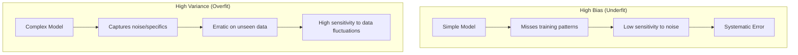

# Fundamentals of Machine Learning

These notes follow the **Gold Standard** for interview preparation: providing a direct, punchy answer followed by deep technical intuition and practical implementation.

---

# Q1: Explain Epoch, Batch, Batch Size, and Iteration.

## 1. 🔹 Direct Answer
An **Epoch** represents one full pass through the entire training dataset. A **Batch** is a subset of the data used for a single parameter update. **Batch Size** is the number of examples in that subset. An **Iteration** is a single update of the model's weights (one gradient descent step).

## 2. 🔹 Intuition
Imagine you are studying a 100-page textbook (the Dataset).
- **Epoch:** Reading the entire 100-page book once.
- **Batch Size:** Reading 10 pages at a time before stopping to think/take notes. Here, batch size is 10.
- **Iteration:** Each time you stop to take notes (update your knowledge), that's an iteration. 

## 3. 🔹 Deep Dive
- **Memory vs. Noise:** Larger batch sizes (e.g., 512) provide more stable gradient estimates but require more VRAM. Smaller batch sizes (e.g. 32) introduce "gradient noise," which can help the model escape local minima.
- **Learning Rate Scaling:** A common rule of thumb is to scale the learning rate linearly with the batch size.

## 4. 🔹 Practical Perspective
- **Generalization:** Research suggests that very large batches can lead to "sharp minima" that generalize poorly. Smaller batches often find "flatter minima."

## 5. 🔹 Code Snippet
```python
# PyTorch DataLoader logic
from torch.utils.data import DataLoader
loader = DataLoader(dataset, batch_size=32, shuffle=True)

for epoch in range(num_epochs):
    for batch in loader:
        optimizer.zero_grad()
        loss = criterion(model(batch), labels)
        loss.backward()
        optimizer.step()
```

## 6. 🔹 Difficulty Tag
🟢 Easy

---

# Q2: What are embeddings in Machine Learning?

## 1. 🔹 Direct Answer
**Embeddings** are learned dense vector representations of discrete entities (words, users, products). They map high-cardinality categorical data into a continuous vector space where semantically similar items are geometrically close.

## 2. 🔹 Intuition
Instead of representing fruit as "Apple" (ID: 1) and "Orange" (ID: 2), we represent them as vectors. In that vector space, "Apple" and "Orange" will be closer to each other than to "Car" or "Laptop" because they share "fruit-like" features.

## 3. 🔹 Deep Dive
- **Dimensionality Reduction:** Embeddings reduce the sparsity of one-hot encoding. A vocabulary of 50k words becomes a dense 300D or 768D vector.
- **Learned Relationships:** Unlike PCA, embeddings are learned for a specific task (or via self-supervision like Word2Vec), capturing complex behavioral relationships.

## 4. 🔹 Code Snippet
```python
import torch.nn as nn
# Maps 10,000 words to 128-dimensional vectors
embedding_layer = nn.Embedding(num_embeddings=10000, embedding_dim=128)
```

## 5. 🔹 Difficulty Tag
🟢 Easy

---

# Q3: What is Softmax Activation Function?

## 1. 🔹 Direct Answer
**Softmax** is a function that turns a vector of $K$ real values (logits) into a probability distribution of $K$ probabilities summing to 1. It is the mathematical bridge between "model scores" and "class probabilities."

## 2. 🔹 Intuition
If three horses (A, B, C) have speeds $[10, 8, 5]$, Softmax converts these "scores" into "chances of winning," such as $[0.85, 0.12, 0.03]$. It squashes values between 0 and 1 and ensures the total is 100%.

## 3. 🔹 Deep Dive
- **Equation:** $\sigma(z)_i = \frac{e^{z_i}}{\sum_{j=1}^K e^{z_j}}$
- **Properties:** It is monotonic and differentiable. However, it can be sensitive to outliers because the exponential function grows very quickly.
- **Multiclass default:** It is the standard output activation for multiclass classification problems, usually paired with Cross-Entropy Loss.

## 4. 🔹 Difficulty Tag
🟢 Easy

---

# Q4: What is Machine Learning?

## 1. 🔹 Direct Answer
**Machine Learning** is the field of AI that focuses on building systems that learn patterns from data rather than following explicit, hand-coded instructions. It involves optimizing a model's parameters to minimize a loss function on a specific task.

## 2. 🔹 Intuition
- **Traditional Programming:** You write a detailed recipe: "If temperature > 30, turn on AC."
- **Machine Learning:** You give the computer 1,000 days of data and say: "Figure out when the AC should be on to keep people happy."

## 3. 🔹 Deep Dive
- **Mathematical Framing:** Mapping $f: X \rightarrow Y$ such that $Y = f(X, \theta)$.
- **Key components:** Data, Model (Architecture), Loss Function (Objective), and Optimizer (Learning algorithm).

## 4. 🔹 Difficulty Tag
🟢 Easy

---

# Q5: Differentiate between Supervised and Unsupervised Learning.

## 1. 🔹 Direct Answer
**Supervised Learning** trains on labeled data (input-output pairs). **Unsupervised Learning** identifies hidden patterns or structures in unlabeled data (input only).

## 2. 🔹 Intuition
- **Supervised:** A teacher showing pictures of dogs and saying "This is a dog."
- **Unsupervised:** A child looking at a pile of toys and grouping all the red ones together and blue ones together without being told what they are.

## 3. 🔹 Deep Dive
- **Supervised Tasks:** Classification, Regression.
- **Unsupervised Tasks:** Clustering (K-Means), Dimensionality Reduction (PCA/t-SNE), Association rules.
- **Modern Middle Ground:** **Self-Supervised Learning** (SSL) where labels are generated from the data itself (e.g., masking a word and asking the model to predict it).

## 4. 🔹 Difficulty Tag
🟢 Easy

---

---

# Q6: What is Reinforcement Learning (RL)?

## 1. 🔹 Direct Answer
**Reinforcement Learning** is a branch of machine learning where an **agent** learns to make a sequence of decisions in an **environment** to maximize a cumulative **reward**. It is characterized by trial-and-error learning and delayed feedback (rewards).

## 2. 🔹 Intuition
Imagine training a dog. You don't tell the dog "move your left leg 3 inches forward." Instead, when the dog sits on command, you give it a treat (Reward). If it doesn't, it gets nothing. Over time, the dog learns the sequence of actions that leads to the treat.

## 3. 🔹 Deep Dive
- **Key Components:**
  - **Agent:** The learner/decision-maker.
  - **Environment:** The world the agent interacts with.
  - **State ($S$):** The current situation.
  - **Action ($A$):** What the agent does.
  - **Reward ($R$):** Feedback from the environment.
- **The Challenge:** RL must solve the **Credit Assignment Problem** (which specific action led to the reward?) and the **Exploration vs. Exploitation Tradeoff** (try new things or stick to what works?).

## 4. 🔹 Practical Perspective
- **Applications:** Robotics, game AI (AlphaGo), autonomous driving, and recommender systems.
- **Trade-off:** RL can be extremely sample-inefficient and unstable to train compared to supervised learning.

## 5. 🔹 Difficulty Tag
🟣 Hard

---

# Q7: What is Bias (in the Context of Machine Learning)?

## 1. 🔹 Direct Answer
**Bias** is the error introduced by approximating a real-world problem with a simplified model. High bias leads to **underfitting**, where the model fails to capture the underlying patterns in the training data.

## 2. 🔹 Intuition
Bias is like having a "preconceived notion." If you decide before looking at any data that "all houses cost exactly $500k," you are highly biased. No matter how much data you see, your simple model will never capture the complexity of the housing market.

## 3. 🔹 Deep Dive
- **Mathematical Framing:** $Bias[\hat{f}(x)] = E[\hat{f}(x)] - f(x)$. It is the difference between the average prediction of our model and the true value.
- **High Bias Signs:** High training error, high validation error, and a model that is "too simple" (e.g., trying to fit a linear line to quadratic data).

## 4. 🔹 Difficulty Tag
🟢 Easy

---

# Q8: What is the difference between Classification and Regression?

## 1. 🔹 Direct Answer
**Classification** predicts a discrete label or category (e.g., Cat vs. Dog). **Regression** predicts a continuous, numerical value (e.g., Price, Temperature).

## 2. 🔹 Intuition
- **Classification:** "Is this an apple or an orange?" (Discrete buckets).
- **Regression:** "How many grams does this apple weigh?" (Continuous scale).

## 3. 🔹 Deep Dive
- **Loss Functions:** Classification usually uses **Cross-Entropy**; Regression uses **MSE** (Mean Squared Error) or **MAE** (Mean Absolute Error).
- **Evaluation:** Classification uses **Accuracy, Precision, Recall, F1**; Regression uses **R-squared, RMSE, MAE**.
- **Edge Case:** Logistic Regression—despite the name—is used for classification.

## 4. 🔹 Difficulty Tag
🟢 Easy

---

# Q9: Explain Overfitting and Underfitting. How can you prevent them?

## 1. 🔹 Direct Answer
- **Underfitting (High Bias):** The model is too simple to capture the underlying logic. (Error on both Train and Test sets).
- **Overfitting (High Variance):** The model learns the noise in the training data rather than the signal. (Low error on Train, High error on Test).

## 2. 🔹 Intuition
- **Underfitting:** A student who only memorizes one page of a 100-page book. They fail the practice test AND the real exam.
- **Overfitting:** A student who memorizes every exact word of the practice test. they get 100% on the practice test but fail the real exam because the questions are slightly different.

## 3. 🔹 Deep Dive
- **Prevention (Underfitting):** Increase model complexity, feature engineering, reduce regularization, train for more epochs.
- **Prevention (Overfitting):** Add more data, **Regularization** (L1/L2), **Dropout**, **Early Stopping**, or cross-validation.

## 4. 🔹 Bias-Variance Visualization


---

# Q10: What Are L1 and L2 Loss Functions?

## 1. 🔹 Direct Answer
**L1 Loss (MAE)** is the sum of absolute differences between targets and predictions. **L2 Loss (MSE)** is the sum of squared differences. 

## 2. 🔹 Intuition
- **L1:** You are penalized for every dollar you are off. Being off by $10 is twice as bad as being off by $5.
- **L2:** You are penalized for the *square* of your error. Being off by $10 is **four times** as bad as being off by $5. It hates large errors more than small ones.

## 3. 🔹 Deep Dive
- **Mathematical Form:** 
  - $L1 = \sum |y_i - \hat{y}_i|$
  - $L2 = \sum (y_i - \hat{y}_i)^2$
- **Comparison:**
  - **L1** is **robust to outliers**. An extreme outlier won't pull the model as much as in L2.
  - **L2** is **mathematically easier** to optimize (differentiable everywhere, while L1 is not at zero). It encourages the model to reduce large errors at the cost of many small ones.

## 4. 🔹 Difficulty Tag
🟢 Easy

---

# Q11: What is Regularization? Explain L1 (Lasso) and L2 (Ridge) regularization.

## 1. 🔹 Direct Answer
**Regularization** is a technique used to prevent overfitting by adding a penalty term to the cost function. **L1 Regularization (Lasso)** adds the absolute value of coefficients, while **L2 Regularization (Ridge)** adds the squared value of coefficients.

## 2. 🔹 Intuition
- **Regularization:** Imagine you are incentivizing a student not just to get high marks, but to do so with the "simplest possible explanation." You penalize them for every extra word they use.
- **L1 (Lasso):** Penalizes "extra concepts" so harshly that the student stops using them entirely (coefficients become 0).
- **L2 (Ridge):** Encourages the student to keep their explanation "mild" and "balanced" instead of relying too heavily on one specific argument.

## 3. 🔹 Deep Dive
- **Mathematical Form:** 
  - $L1: Cost = Loss + \lambda \sum |w_j|$
  - $L2: Cost = Loss + \frac{\lambda}{2} \sum w_j^2$
- **Comparison Table:**

| Feature | L1 (Lasso) | L2 (Ridge) |
| :--- | :--- | :--- |
| **Penalty** | Absolute value ($|w|$) | Squared value ($w^2$) |
| **Sparsity** | Produces sparse solutions (weights can be 0). | Produces small but non-zero weights. |
| **Selection** | Acts as **Feature Selection**. | Retains all features. |
| **Robustness** | Robust to outliers. | Vulnerable to outliers. |

## 4. 🔹 Practical Perspective
- **When to use:** Use **L1** if you expect only a few features are important (sparse inputs). Use **L2** as a default starting point to prevent weights from exploding.

---

# Q12: What are Loss Functions and Cost Functions?

## 1. 🔹 Direct Answer
A **Loss Function** measures the error of a single training example. A **Cost Function** is the average of the loss functions over the entire training set (plus regularization terms).

## 2. 🔹 Intuition
- **Loss:** A single "red pen" mark on one question of your exam.
- **Cost:** Your final grade for the entire semester.

## 3. 🔹 Deep Dive
- **Optimization:** We compute the gradient of the **Cost Function** during backpropagation to update the model weights.
- **Example:** In Linear Regression, the squared error $(y - \hat{y})^2$ is the **Loss**, while the Mean Squared Error (MSE) $\frac{1}{N} \sum Loss_i$ is the **Cost**.

---

# Q13: What are Dropouts?

## 1. 🔹 Direct Answer
**Dropout** is a regularization technique in neural networks where neurons are randomly "dropped" (set to zero) during training with a probability $p$. This prevents the network from relying too heavily on specific neurons and reduces co-adaptation.

## 2. 🔹 Intuition
Imagine a soccer team where, during practice, the coach randomly benches 3 players every 10 minutes. Every player must learn how to play with every other player, and no single superstar can carry the whole team. This makes the entire team more robust and flexible.

## 3. 🔹 Practical Perspective
- **Training vs. Inference:** Dropout is ONLY active during training. During inference, all neurons are used, but their weights are scaled by $(1-p)$ (or inverted dropout is used).
- **Code Snippet (PyTorch):**
```python
import torch.nn as nn
model = nn.Sequential(
    nn.Linear(128, 64),
    nn.Dropout(p=0.5), # 50% chance of dropping a neuron
    nn.ReLU()
)
```

---

# Q14: What is a Perceptron?

## 1. 🔹 Direct Answer
A **Perceptron** is the simplest form of a neural network (a single-layer neural network). it is a linear binary classifier that computes a weighted sum of inputs and applies a threshold activation function (Step function).

## 2. 🔹 Intuition
A Perceptron is like a **Decision Gate**. It takes several inputs (e.g., "Is it sunny?", "Is it a weekend?"), weights their importance, and outputs a simple "Yes" or "No" based on whether the total weight exceeds a threshold.

## 3. 🔹 Deep Dive
- **Limitation:** A single perceptron can only learn **linearly separable** data. It famously cannot solve the **XOR** problem, which led to the "AI Winter" until Multi-Layer Perceptrons (MLPs) were introduced.

---

# Q15: Explain Multilayer Perceptron (MLP).

## 1. 🔹 Direct Answer
A **Multilayer Perceptron (MLP)** is a feedforward artificial neural network consisting of at least three layers: an input layer, one or more hidden layers, and an output layer. It uses non-linear activation functions and backpropagation for training.

## 2. 🔹 Intuition
If a single Perceptron is a single gate, an MLP is a **complex factory**. different layers extract different levels of abstraction (e.g., edges → shapes → objects) until the final layer makes a decision.

## 3. 🔹 Deep Dive
- **Universal Approximator:** An MLP with a single hidden layer and enough neurons can approximate any continuous function (Universal Approximation Theorem).
- **Architecture:** 
  - Input Layer ($X$)
  - Hidden Layers ($W_1X + b_1 \rightarrow Activation$)
  - Output Layer ($W_2H + b_2 \rightarrow Softmax/Sigmoid$)

---

# Q16: What is Cross-Entropy?

## 1. 🔹 Direct Answer
**Cross-Entropy** is a loss function used in classification that measures the difference between the true probability distribution (labels) and the predicted probability distribution. It penalizes the model based on how far the predicted probability is from the actual label.

## 2. 🔹 Intuition
Imagine you are a weather forecaster. If you are 90% sure it will rain, and it actually rains, your "penalty" is small. If you are 90% sure it will be sunny, but it rains, you are "harshed" much more because you were confidently wrong. Cross-entropy quantifies this "surprise."

## 3. 🔹 Deep Dive
- **Mathematical Form (Binary):** $L = - [y \log(\hat{y}) + (1-y) \log(1-\hat{y})]$
- **Why log?** As the predicted probability $\hat{y}$ approaches the true label $y$, the $\log$ term approaches 0. As it moves away, the penalty grows exponentially.

---

# Q17: What are Logits?

## 1. 🔹 Direct Answer
**Logits** are the raw, unnormalized scores produced by the last layer of a neural network before an activation function (like Softmax or Sigmoid) is applied. 

## 2. 🔹 Intuition
Think of Logits as **"Raw Votes."** If a model is choosing between Cat and Dog, the logits might be $[5.2, -1.2]$. These don't mean much as probabilities, but they tell us the model strongly prefers "Cat." To make them understandable to humans (probabilities), we apply Softmax.

## 3. 🔹 Practical Perspective
- **Numerical Stability:** In many frameworks (like PyTorch), it is more numerically stable to compute loss (e.g., `BCEWithLogitsLoss`) directly from logits rather than from probabilities.

---

# Q18: Explain Cross-Validation. Why is it used?

## 1. 🔹 Direct Answer
**Cross-Validation** is a technique for assessing a model's performance by training and testing it on different subsets of data. The most common form is **K-Fold Cross-Validation**, where the data is split into $K$ parts, and the model is trained $K$ times, each time using a different fold for validation.

## 2. 🔹 Intuition
Imagine you are preparing for an exam. Instead of taking one practice test once, you split your practice questions into 5 sets. You study using 4 sets and test yourself on the 5th. You repeat this 5 times, switching the "test" set each time. This gives you a much better idea of how well you actually know the material, rather than just getting lucky on one specific set of questions.

## 3. 🔹 Practical Perspective
- **When to use:** Crucial when you have a small dataset to ensure your performance estimate is robust and not biased by a single train-test split.

---

# Q19: What are Precision, Recall, and F1-score?

## 1. 🔹 Direct Answer
- **Precision:** Of all predicted positives, how many were actually positive? (Quality).
- **Recall:** Of all actual positives, how many did we correctly identify? (Quantity).
- **F1-Score:** The harmonic mean of Precision and Recall.

## 2. 🔹 Intuition (The "Courtroom" Analogy)
- **Precision:** "Beyond a reasonable doubt." You only convict if you are absolutely sure. You may let some guilty people go (low recall), but your "conviction rate" is high.
- **Recall:** "Better safe than sorry." You arrest everyone even slightly suspicious. You catch all the criminals (high recall), but you also arrest many innocent people (low precision).
- **F1:** The balance that ensures you are both accurate and thorough.

## 3. 🔹 Practical Perspective
- **Precision is key** in Spam detection (don't want important mail in junk).
- **Recall is key** in Cancer detection (don't want to miss any sick patient).

---

# Q20: What is Anomaly Detection?

## 1. 🔹 Direct Answer
**Anomaly Detection** is the process of identifying samples that deviate significantly from the "normal" data distribution. It is often treated as an unsupervised or semi-supervised task because anomalies are rare and labeled "negative" data is scarce.

## 2. 🔹 Intuition
Imagine you are a security guard at a high-end mall. You know what "normal" shoppers look like. If someone enters wearing a full diving suit and carrying a harpoon, you immediately notice them—not because you've been trained on "divers," but because they don't look like "shoppers."

## 3. 🔹 Practical Perspective
- **Techniques:** Isolation Forests, One-Class SVMs, Autoencoders (measure reconstruction error), or Gaussian Mixure Models.

---

# Q21: What is the difference between policy-based and value-based methods?

## 1. 🔹 Direct Answer
- **Value-based methods** learn the value of being in a state (or taking an action in a state) and then derive a policy from these values (e.g., Q-Learning).
- **Policy-based methods** learn the policy directly—they map states to actions without necessarily computing values (e.g., Policy Gradients).

## 2. 🔹 Comparison Table

| Feature | Value-Based | Policy-Based |
| :--- | :--- | :--- |
| **Goal** | Optimize the value function $Q(s, a)$. | Optimize the policy $\pi(a|s)$ directly. |
| **Action Space** | Best for discrete actions. | Best for continuous/high-dimensional actions. |
| **Stochasticity** | deterministic (usually). | Can learn stochastic policies. |
| **Efficiency** | More sample efficient. | Less sample efficient; higher variance. |

---

# Q22: What is Q-Learning?

## 1. 🔹 Direct Answer
**Q-Learning** is an **off-policy** temporal difference learning algorithm. It aims to learn the value of an action in a particular state ($Q$-value) to find the optimal policy for a Markov Decision Process.

## 2. 🔹 Intuition
Imagine you are playing a board game. For every square (State) and every move (Action), you have a mental "scoreboad" that tells you how likely that move is to help you win in the long run. Q-learning is the process of updating that scoreboard every time you make a move and see the result.

## 3. 🔹 Deep Dive
- **The Q-Update Rule:** $Q(s, a) = Q(s, a) + \alpha [R + \gamma \max_{a'} Q(s', a') - Q(s, a)]$
- **Key Terms:** $\alpha$ (Learning Rate), $\gamma$ (Discount Factor), $R$ (Immediate Reward).

---

# Q23: Explain the concept of Exploration vs. Exploitation.

## 1. 🔹 Direct Answer
**Exploitation** is choosing the best known option to maximize reward. **Exploration** is trying unknown options to gather more information about the environment. Balancing these two is the central challenge of Reinforcement Learning.

## 2. 🔹 Intuition (The Restaurant Analogy)
- **Exploitation:** You go to your favorite restaurant and order the pizza you know you love. You are guaranteed a good meal (Reward).
- **Exploration:** You try a brand-new restaurant. It might be even better than your favorite, OR it might be terrible. 
- **The Balance:** If you only exploit, you miss out on potentially better options. If you only explore, you might have many bad meals.

---

# Q24: Explain the Curse of Dimensionality.

## 1. 🔹 Direct Answer
The **Curse of Dimensionality** refers to various phenomena that arise when analyzing and organizing data in high-dimensional spaces that do not occur in low-dimensional settings. As the number of dimensions increases, the volume of the space increases so fast that the data becomes sparse.

## 2. 🔹 Intuition
Imagine you have 100 people in a 10-meter room (1D). They are very close together. Now put them in a 10x10 meter warehouse (2D)—they have more space. Now put them in a 10x10x10 meter building (3D)—they are even further apart. In 100 dimensions, these 100 people would be so far apart that "closest neighbor" becomes a meaningless concept.

## 3. 🔹 Practical Perspective
- **Problem:** Many ML algorithms (like KNN) rely on distance metrics. In high dimensions, every point is almost equally far from every other point.
- **Solution:** Use **Dimensionality Reduction** (PCA, Autoencoders) or collect significantly more data.

---

# Q25: What is Multi-Task Learning (MTL)?

## 1. 🔹 Direct Answer
**Multi-Task Learning** is a subfield of machine learning where multiple tasks are learned simultaneously using a shared representation. This allows the model to leverage commonalities between tasks to improve generalization and efficiency.

## 2. 🔹 Intuition
Imagine learning to play tennis and squash at the same time. While they are different games, the basic skills of "hitting a ball with a racket" and "footwork" are shared. Learning both simultaneously makes you a better overall athlete than learning just one in isolation.

## 3. 🔹 Deep Dive
- **Hard Parameter Sharing:** Shared hidden layers with task-specific output "heads."
- **Focal Loss:** Often used in MTL to focus on "hard" examples by down-weighting easy ones during training.
- **Benefit:** Reduces the risk of overfitting by forcing the model to learn a more robust, general representation that works for all tasks.

---
