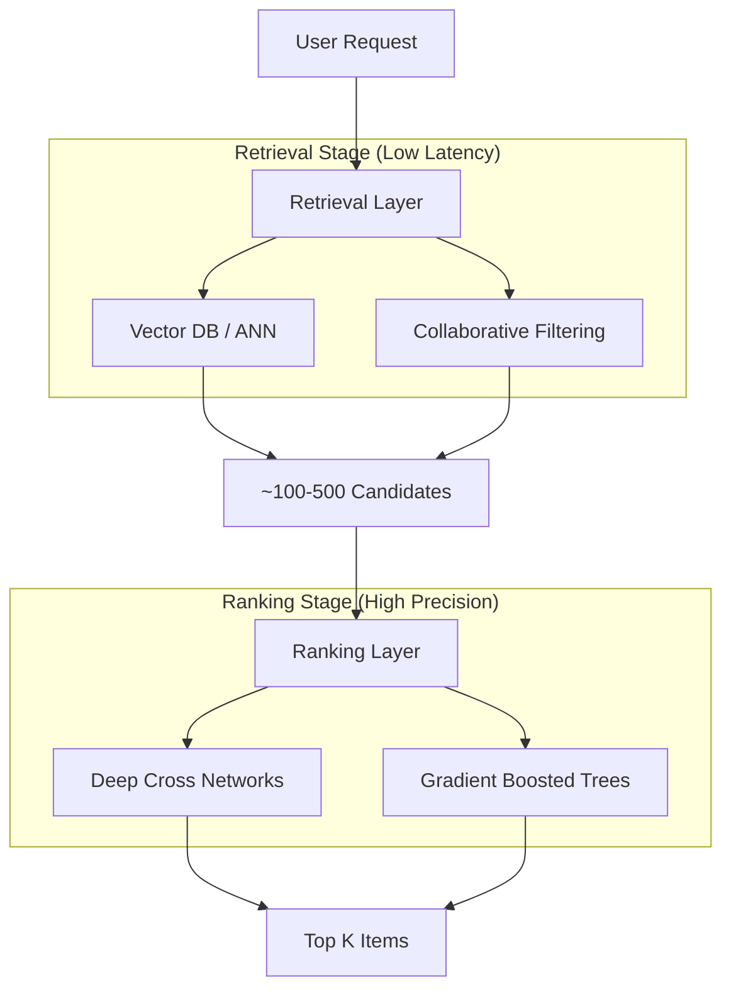

# ML System Design & MLOps

This hub focuses on the architectural patterns, scalability tradeoffs, and operational lifecycle required to move a model from a notebook to production. Senior candidates must design systems that are not just "accurate," but also scalable, monitorable, and robust.

---

# 1. 🔹 The Two-Stage Architecture

## Q1: Why do large-scale systems (Search/Recs) use Retrieval + Ranking?

### 🔹 Direct Answer
Searching through millions of items with a complex model is computationally impossible in real-time. We use a **two-stage architecture**:
1. **Retrieval (Candidate Generation):** A fast, lightweight model (e.g., Two-tower networks, ANN search) that narrows down millions of items to ~100-500 candidates.
2. **Ranking:** A heavy, complex model (e.g., DCN, XGBoost, Large Transformer) that scores these few hundred candidates for precise ordering.

### 🔹 Visual Representation

---

# 2. 🔹 Training-Serving Skew & MLOps

## Q2: What is Online/Offline Skew, and how do Feature Stores help?

### 🔹 Direct Answer
**Online/Offline Skew** occurs when the features used during training are different from the features available during real-time inference. This usually happens due to different code implementations (Python in training vs. Java/C++ in serving) or "time-travel" leakage.
- **Solution:** A **Feature Store** (e.g., Feast, Tecton) provides a unified interface for feature definitions. It ensures that the exact same feature logic is used to generate training batches (offline) and fetch real-time values (online).

---

# 3. 🔹 Model Monitoring & Drift

## Q3: Explain Data Drift vs. Concept Drift.

### 🔹 Comparison Table

| Type | Definition | Example |
| :--- | :--- | :--- |
| **Data Drift** | Distribution of inputs $P(X)$ changes. | A fashion model trained on winter clothes seeing summer trends. |
| **Concept Drift** | Relationship between $X$ and $Y$ changes ($P(Y|X)$). | A fraud model failing because attackers found a new way to bypass rules. |

### 🔹 Action Plan
- **Detection:** Track KS-test or PSI (Population Stability Index) of input features.
- **Remediation:** Automated retraining on the most recent data slice or model recalibration.

---

# 4. 🔹 Inference Optimization

## Q4: How do you reduce latency during model serving?

### 🔹 Direct Answer
I apply three primary techniques depending on the hardware constraints:
1. **Quantization:** Converting weights from FP32 to INT8, reducing model size and increasing speed (at a tiny cost to accuracy).
2. **Pruning:** Removing "unimportant" neurons or weights with small magnitudes to create a sparser, faster network.
3. **Knowledge Distillation:** Training a small "Student" model to mimic the outputs of a large "Teacher" model.

---

# 5. 🔹 Deployment Strategies

## Q5: A/B Testing vs. Canary Deployment vs. Shadow Deployment.

### 🔹 Comparison Table

| Strategy | Definition | Use Case |
| :--- | :--- | :--- |
| **A/B Testing** | Routing traffic to Model A and Model B to compare business metrics. | Comparing model effectiveness. |
| **Canary** | Gradually rolling out the new model to a small % of users first. | High-risk updates; early bug detection. |
| **Shadow** | Running the new model in parallel with the old one, but not using its output. | Validating performance/latency under real-world load safely. |

---

# 6. 🔹 Practical Perspective: Logging & Reproducibility

### **The "Golden Rule" of MLOps**
Every prediction made in production must be loggable and reproducible. This requires:
1. **Model Versioning:** Knowing exactly which weights were used ($Hash + PID$).
2. **Feature Versioning:** Knowing what the input features looked like at the *exact moment* of inference.
3. **Environment Versioning:** Docker containers to ensure identical software stacks.

---

## 🔹 Difficulty Tag: 🔴 Hard
